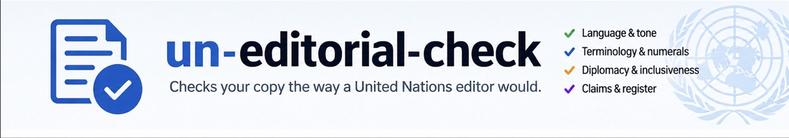
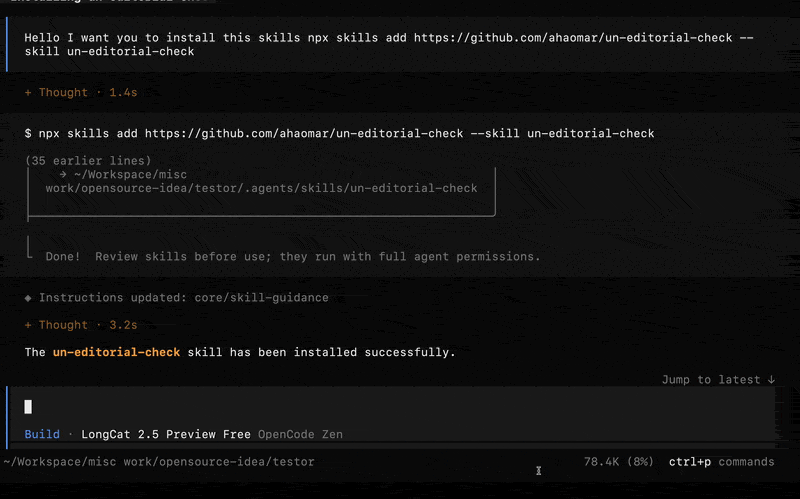

# un-editorial-check



[](https://skills.sh/ahaomar/un-editorial-check/un-editorial-check)

A portable, zero-dependency Node.js CLI and Agent Skill that reads user-visible copy the way a United Nations editor would — language, wording, tone, spelling, terminology, dates, numbers, claims and register — and reports what fails.

It is not a code-quality, accessibility, security or SEO linter. Copy is extracted first (HTML text nodes and copy-bearing attributes, Markdown paragraphs, plain-text blocks, JavaScript strings that demonstrably render) and only then checked, so CSS properties, comments, identifiers, URLs and cited titles never reach a rule; block quotations and quoted material are classified with their context and reported separately where the review applies, never blended into authored copy. Those other concerns exist in this package solely as opt-in audits.

The product boundary is **report first**: a finding identifies a review requirement; it does not establish the truth of a claim. Deterministic rules prove the defect; where judgement is required the finding is labelled heuristic and moves to `AGENT REVIEW REQUIRED`.

> **For researchers, students and United Nations staff:** the plain-language **[User Guide](USER-GUIDE.md)** explains, step by step and without technical words, how to check a document with your AI assistant — including a prompt you can copy and paste.

## Quickstart

Node.js 18 or newer is the only requirement. `npx` fetches the package on first use, so nothing needs installing up front.

```sh
# 1. Check a file and write a PDF report beside it.
npx -y un-editorial-check statement.md --report un-editorial-review.pdf

# 2. Preview the automatic corrections as a diff. This writes nothing.
npx -y un-editorial-check statement.md --fix

# 3. Apply the corrections you approved in the preview, then run step 1 again.
npx -y un-editorial-check statement.md --fix --apply
```

The exit code is `0` when no error-severity editorial findings are present, `1` when there are, and `2` for a usage, configuration, scan or write failure. [Exit codes](#exit-codes) states what a clean run means. CI should treat `1` as a requested policy failure and `2` as a tool failure, and should not merge the two.

### What a scan actually outputs

Two summary lines, then findings grouped under one heading per lane.

```text
un-editorial-check <version> — scanned <n> file(s) — editorial: <e> errors, <w> warnings, <n> notes
lanes: deterministic <n> · heuristic-review <n> · harmful-discriminatory <n> · diplomacy <n> · audit <n> · quoted <n>

EDITORIAL ERRORS (<n>)          ← deterministic lane, by severity
EDITORIAL WARNINGS (<n>)
EDITORIAL NOTES (<n>)
AGENT REVIEW REQUIRED (<n>)     ← heuristic lane
HARMFUL-DISCRIMINATORY REVIEW (<n>)
DIPLOMATIC SENSITIVITY (<n>)
OPTIONAL AUDIT — <name> (<n>)   ← one per requested audit profile
```

Each finding occupies one line and carries its lane, its rule identifier, its position in the file and the action a human should take:

```text
  <file>:<line>:<col>  <ruleId>  [<lane>]  <what is wrong>.  → <recommended human action>.
```

Captured output is not reproduced here, because a scan of flawed copy prints the copy that triggered each rule. [docs/demo/README.md](docs/demo/README.md) runs the five lanes over a real statement, a real page and a real clean file, and gives the exact commands to regenerate every line of it.

### The five lanes in one glance

| Lane | What it holds | Default effect on the exit code |
|---|---|---|
| Deterministic violations | Rules that prove their own defect inside a documented boundary | Error severity fails the run with `1`; warnings do not |
| Heuristic editorial review | Judgement calls routed to `AGENT REVIEW REQUIRED` | Review severity by default; never fails unless configured to `error` |
| Harmful or discriminatory review | High-severity human review queue; never rewritten automatically | Error severity fails the run with `1` |
| Diplomatic sensitivity | Contested-status claims requiring diplomatic review | Warning by default; set `severities` to gate on it |
| Optional audits | Publishing, accessibility and security findings, requested with `--profile` | Never changes the exit code |

Quoted material is a context rather than a lane: a finding inside a quotation keeps its own lane and is reported separately, never blended into authored copy.

### More documentation

- [USER-GUIDE.md](USER-GUIDE.md) — the plain-language walkthrough with a copy-and-paste prompt
- [CHANGELOG.md](CHANGELOG.md) — every release from 0.2.0 to 1.1.0
- [docs/LAUNCH.md](docs/LAUNCH.md) — the 1.1.0 release announcement
- [docs/demo/README.md](docs/demo/README.md) — the five-lane demo and its reproduction commands
- [docs/MIGRATION.md](docs/MIGRATION.md) — what changed behaviour when, and the upgrade action for it
- [docs/GLOSSARY-AND-WATCH.md](docs/GLOSSARY-AND-WATCH.md) — your own house terminology with `--glossary`, and the `--watch` editing loop
- [docs/CLAIM-EVIDENCE-AUDIT.md](docs/CLAIM-EVIDENCE-AUDIT.md) — each claim, its limitations and the suite that locks it
- [rules/catalogue.json](rules/catalogue.json) — the rule index with severity, confidence and guard notes

## What it checks

Editorial rules (42, always on):

- British English spelling, mixed variants within a passage, and opt-in `-ize` review. The `-ize`/`-ise` conflict family is resolved by the selected profile: a profile-selection warning by default, silent under `un-secretariat-document`, an error only under a profile that prefers `-ise`.
- United Nations terminology: the `maternal mortality rate` versus ratio distinction (review-only, gated to the printed per-100 000-live-births statistic), `percent` written as `per cent`, the country name `US` written in full, and the current United Nations country designations (`Burma → Myanmar`, `Turkey → Türkiye`, `Swaziland → Eswatini` and their peers, matched case-sensitively so the lowercase bird never fires).
- Inclusive phrasing: `handicapped → persons with disabilities`, `illegal immigrants → migrants in an irregular situation`, `Third World → developing countries`, and their peers — every pair backed by a recorded source.
- Day–month–year dates, en-dash ranges, hedged and sourced figures, counts that say what was counted, comparisons that align reference years.
- Neutral register and tone: promotional phrasing, rhetorical questions, exclamation marks, unsourced superlatives, direct insults and name-calling, threat or intimidation posture, and all-caps shouting.
- Contested territorial and sovereignty claims stated as fact: flagged for attribution or neutral United Nations wording, symmetrically for every party to the claim, with a cited source per claim, and reported as requiring diplomatic review rather than as a finding of fact.
- Hate speech: dehumanising frames, collective blame and calls for exclusion or violence against a group of people. Detection is composed over bounded pattern groups with a cited source each, is symmetric across groups, and exempts attributed statements; quoted material is reported separately as quoted context rather than silently skipped.
- Discriminatory or demeaning language beyond those frames — protected characteristics including gender, sex, disability, nationality, ethnicity, religion, sexual orientation, gender identity and age — routed to high-severity human review and never auto-rewritten. Quoted or reported material is classified and reported separately instead of being skipped.
- High-precision grammar: unintentionally doubled words (including a pair padded with extra spaces), a space between a word and its following punctuation, a missing space between two sentences, and — under the configuration-gated `spacingReview` — a run of doubled spaces. All deterministic, all repairable with `--fix`.
- Heuristic editorial review: sentence fragments, malformed wording, duplicated unrelated insertions, incoherent headings and broken quotations — review severity only, with no claim of full grammar checking.
- Document review: an acronym of three to five letters never expanded anywhere in the file; a long paragraph that does not appear to be English (one honesty note — the rules are written for English copy); and, under the configuration-gated `consistencyReview`, mixed quotation styles and mixed thousands separators in one document.
- Supplied organisation vocabulary through data-only profiles, including the profile's own bounded pattern checks (`customRules`), which run in the deterministic lane under the `organisation` category and are never rewritten by `--fix`.

Audit rules (11, only with `--profile publishing`, `--profile accessibility` or `--profile security`): page title, meta description, canonical link, heading structure and card metadata; image and form-control labelling; four bounded source-code policies. Audits are reported in their own section and never change the exit code.

The stable rule identifiers are indexed in [rules/catalogue.json](rules/catalogue.json); each entry names its severity, confidence and guard notes. Their institutional sources are recorded with URL, retrieval date, scope, evidence and rationale in [rules/sources.json](rules/sources.json). Re-check current United Nations guidance before treating a release as institutional advice.

## What the CLI proves, and what it does not

**Deterministic rules** test a pattern with a documented boundary — a spelling map, a terminology pair, an exclamation mark, a doubled word. The rule, its exemption and its position are explicit, so results are suitable for local review and CI. A clean run is not a certificate of quality: when nothing is found, the tool says exactly one thing — `No findings under the enabled, documented local rules.` — and nothing more.

**Heuristic rules and `AGENT REVIEW REQUIRED`** ask for judgement: whether a claim matches its evidence, figures are sourced and dated, citations are complete, comparisons use aligned years, register is proportionate, and labels describe what was counted. By default they are reported as warnings and never fail a run; only an organisation that configures a heuristic to `error` severity makes it fail. What a clean run means is exactly this: `No findings under the enabled, documented local rules.`

The skill requires the agent to work through those findings after running the CLI, and to keep deterministic findings, agent-review findings and its own editorial judgement separate in the report.

## Requirements and installation

### Runtime

- Node.js 18 or later.
- No runtime npm dependencies.
- A supported Agent Skills host, or direct use of the CLI.

### Universal installation with the skills CLI

The canonical published skill is available through skills.sh and GitHub. The CLI installs the complete package, including `bin/`, `lib/`, `rules/` and `config/`:

```sh
npx skills add https://github.com/ahaomar/un-editorial-check \
  --skill un-editorial-check \
  --list
```

To install for a specific agent, use the corresponding command below. Run these commands from the project where you want the skill installed, unless you add `--global` for a user-level installation.

```sh
# OpenCode 1.x and 2.x
npx skills add https://github.com/ahaomar/un-editorial-check \
  --skill un-editorial-check --agent opencode --yes

# Claude Code
npx skills add https://github.com/ahaomar/un-editorial-check \
  --skill un-editorial-check --agent claude-code --yes

# Codex
npx skills add https://github.com/ahaomar/un-editorial-check \
  --skill un-editorial-check --agent codex --yes

# Kimi Code CLI
npx skills add https://github.com/ahaomar/un-editorial-check \
  --skill un-editorial-check --agent kimi-code-cli --yes

# Other supported skills hosts
npx skills add https://github.com/ahaomar/un-editorial-check --skill un-editorial-check --agent cursor --yes
npx skills add https://github.com/ahaomar/un-editorial-check --skill un-editorial-check --agent gemini-cli --yes
npx skills add https://github.com/ahaomar/un-editorial-check --skill un-editorial-check --agent windsurf --yes
npx skills add https://github.com/ahaomar/un-editorial-check --skill un-editorial-check --agent cline --yes
npx skills add https://github.com/ahaomar/un-editorial-check --skill un-editorial-check --agent github-copilot --yes
```

Use `--global` for a user-level installation. Use `--copy` instead of the CLI's default symbolic-link installation when the agent or filesystem does not support links. Review the target path shown by the CLI.

In non-interactive shells — an agent, a CI job, a script — always pass `--yes` (`-y`). Without a confirmation flag, `skills add` waits for a prompt that never comes and exits `0` having installed nothing; an installer that checks only the exit code would record a success that never happened.

### OpenCode 1.x and 2.x

The portable `SKILL.md` format is designed for both OpenCode generations. The installer path is the recommended approach because it copies or links the complete package:

```sh
npx skills add https://github.com/ahaomar/un-editorial-check \
  --skill un-editorial-check --agent opencode --yes
```

Expected project locations are:

```text
.opencode/skills/un-editorial-check/SKILL.md
.agents/skills/un-editorial-check/SKILL.md
.claude/skills/un-editorial-check/SKILL.md
```

OpenCode 2.x documents all three project locations. OpenCode 1.x support can vary by exact release; if native discovery is unavailable, use the CLI installation, or manually copy the complete package to `.opencode/skills/un-editorial-check/`. Restart OpenCode after installation. The skill is loaded on demand; ask:

```text
Use the un-editorial-check skill to audit this content.
```

For a global installation, add `--global`. The global location for OpenCode 2.x is `~/.config/opencode/skills/un-editorial-check/`. Older 1.x releases may use a different global location, so use the CLI's reported path as the source of truth.

### Claude Code

```sh
npx skills add https://github.com/ahaomar/un-editorial-check \
  --skill un-editorial-check --agent claude-code --yes
```

Project installation:

```text
.claude/skills/un-editorial-check/SKILL.md
```

Global installation:

```text
~/.claude/skills/un-editorial-check/SKILL.md
```

Restart Claude Code and ask it to use `un-editorial-check`, or select the skill from the host's skill interface.

### Codex

```sh
npx skills add https://github.com/ahaomar/un-editorial-check \
  --skill un-editorial-check --agent codex --yes
```

The standard project path is:

```text
.agents/skills/un-editorial-check/SKILL.md
```

The optional `agents/openai.yaml` file provides Codex display metadata; it is not required for the portable skill. Restart Codex after installation.

### Kimi Code CLI

```sh
npx skills add https://github.com/ahaomar/un-editorial-check \
  --skill un-editorial-check --agent kimi-code-cli --yes
```

The standard project path is:

```text
.agents/skills/un-editorial-check/SKILL.md
```

Kimi Code may also expose version-specific `.kimi` or `.kimi-code` locations. Prefer the skills CLI installation and use the path it reports. Restart Kimi Code and invoke `/skill:un-editorial-check` or ask the agent to use the skill.

### Other agents and editors

The same canonical skill can be installed through the skills CLI for supported agents:

| Host | Project installation | Boundary |
|---|---|---|
| Cursor | `.agents/skills/un-editorial-check/SKILL.md` via CLI | Confirm native discovery in the installed Cursor version. |
| Gemini CLI | `.agents/skills/un-editorial-check/SKILL.md` | Gemini surfaces can have separate stores. |
| Windsurf | `.windsurf/skills/un-editorial-check/SKILL.md` via CLI | Use a rules adapter if the installed version does not load Agent Skills. |
| Cline | `.agents/skills/un-editorial-check/SKILL.md` via CLI | Use a rules adapter if the installed version does not load Agent Skills. |
| GitHub Copilot | `.agents/skills/un-editorial-check/SKILL.md` | IDE, chat and CLI surfaces may differ. |

For a host that supports the shared Agent Skills format but is not listed above, use:

```sh
npx skills add https://github.com/ahaomar/un-editorial-check \
  --skill un-editorial-check --agent universal --yes
```

See [COMPATIBILITY.md](COMPATIBILITY.md) for the verified matrix, global paths, source links and version-specific boundaries.

### Direct npm installation

```sh
npm install --global un-editorial-check
un-editorial-check --version
un-editorial-check content --format text
```

For a project-local dependency:

```sh
npm install --save-dev un-editorial-check
npx un-editorial-check content --format json
```

### The `/un-diplomatic-agent` command

The `/un-diplomatic-agent` command drives the whole flow as one approval-gated procedure: it runs the check, writes the PDF report, and summarises the findings with severity counts and current-to-should-be wording, then stops at an approval gate where nothing is written. Only after the user explicitly approves does the agent apply the mechanical `--fix --apply` corrections, rewrite the remaining findings from the report's `SHOULD-BE` wording, re-run the scan and report what honestly remains; it never claims the copy is clean unless the exit code is `0`.

The canonical source is `commands/un-diplomatic-agent.md` in this repository — a single Markdown prompt, so any host that reads Markdown command files can load it. Copy the file into the command directory your host documents:

**OpenCode**

Project installation:

```text
.opencode/commands/un-diplomatic-agent.md
```

Global installation:

```text
~/.config/opencode/commands/un-diplomatic-agent.md
```

OpenCode documents both locations and still discovers the legacy singular `command/` directory. OpenCode reloads command files automatically; invoke `/un-diplomatic-agent`.

**Claude Code**

Project installation:

```text
.claude/commands/un-diplomatic-agent.md
```

User installation:

```text
~/.claude/commands/un-diplomatic-agent.md
```

Claude Code still loads `.claude/commands/` files although it now prefers skills for new work, so confirm the command directory for the installed version and restart after copying. Invoke `/un-diplomatic-agent`.

**Codex**

```text
~/.codex/prompts/un-diplomatic-agent.md
```

Codex documents custom prompts as user-level only — they live under the Codex home directory rather than the repository — and marks them deprecated in favour of skills, so confirm the directory in the installed version. Codex invokes the file as `/prompts:un-diplomatic-agent`.

**Other hosts covered above — Kimi Code CLI, Cursor, Gemini CLI, Windsurf, Cline, GitHub Copilot**

No command directory is verified for these hosts in this repository. Copy `commands/un-diplomatic-agent.md` into the custom-command directory your installed version documents, or hand the agent the path to the file and ask it to follow the flow. Command discovery is version-specific, so use the path the host reports.

## Compatibility at a glance

| Host | Status | Installer name | Portable project path |
|---|---|---|---|
| OpenCode 1.x | Version-dependent; verify the exact 1.x release | `opencode` | `.opencode/skills/` or `.agents/skills/` |
| OpenCode 2.x | Native support | `opencode` | `.opencode/skills/`, `.agents/skills/` or `.claude/skills/` |
| Claude Code | Native support | `claude-code` | `.claude/skills/` |
| Codex | Native support | `codex` | `.agents/skills/` |
| Kimi Code CLI | Native support; other Kimi surfaces may differ | `kimi-code-cli` | `.agents/skills/` |
| Cursor | CLI installation verified; confirm the installed version | `cursor` | `.agents/skills/` |
| Gemini CLI | Native support | `gemini-cli` | `.agents/skills/` |
| Windsurf | CLI installation verified; confirm the installed version | `windsurf` | `.windsurf/skills/` |
| Cline | CLI installation verified; confirm the installed version | `cline` | `.agents/skills/` |
| GitHub Copilot | Supported surfaces vary | `github-copilot` | `.agents/skills/` |
| Generic Agent Skills | Host must implement discovery | `universal` | `.agents/skills/` |

See [COMPATIBILITY.md](COMPATIBILITY.md) for verified global paths, source links, host-specific differences and manual installation. “CLI installation verified” is deliberately narrower than a claim that every current or future version has native discovery.

## How an agent uses the skill

Install the complete skill, then ask the agent to use `un-editorial-check` or select it through the host's skill command. The agent resolves `<skill-base>` from the directory containing `SKILL.md` and runs the bundled checker:

```sh
node <skill-base>/bin/check.mjs <paths> --format text
```

For example, if the installed skill is under `.agents/skills/un-editorial-check/`:

```sh
node .agents/skills/un-editorial-check/bin/check.mjs content --format text
```

The agent must:

1. run the Node CLI on the requested files;
2. address error-severity findings and review warnings, without suppressing them just to reach exit `0`;
3. read the applicable bundled rule files relative to the skill base, not from memory;
4. work through `AGENT REVIEW REQUIRED` findings against the available evidence;
5. keep deterministic findings, agent-review findings and its own editorial judgement separate in the report, following its five lanes — deterministic violations, heuristic review, harmful or discriminatory review, diplomatic sensitivity, audits; and
6. request audits with `--profile publishing`, `--profile accessibility` or `--profile security` only when that audit was asked for — a default run is editorial only.

## CLI use

```sh
node bin/check.mjs README.md
node bin/check.mjs content dashboards --format text
node bin/check.mjs content --format json > results.json
node bin/check.mjs content --format sarif > results.sarif
node bin/check.mjs content --config .un-editorial.json
node bin/check.mjs content --profile editorial-org.json
node bin/check.mjs content --profile publishing --profile accessibility --profile security
node bin/check.mjs content --quiet
node bin/check.mjs --self-scan --quiet
node bin/check.mjs content --init
node bin/check.mjs content --self-test
node bin/check.mjs content --baseline .ue-baseline.json
node bin/check.mjs content --report review.html
node bin/check.mjs content --glossary house-glossary.json
node bin/check.mjs content --watch
node bin/check.mjs --url https://www.example.org/field-office-update
cat statement.md | node bin/check.mjs --stdin
node bin/check.mjs statement.md --claims-out claims.json
node bin/check.mjs report.pdf --emit-corrected report-text.md
```

`--format text` is the default. JSON and SARIF results go to standard output; tool and configuration failures go to standard error. Paths may be files or directories. Directory scans do not follow symbolic links, and hidden directories, `node_modules`, build output and fixtures are skipped unless you name them explicitly.

The supported file formats are `.md`, `.markdown`, `.txt`, `.html`, `.htm`, `.js`, `.mjs`, `.cjs`, `.jsx`, `.ts`, `.tsx`, `.pdf`, `.docx` or `.odt`. Naming a file of any other type is a refusal, and so is a scan that ends up with no supported file to read. A scan whose target is the skill root itself — the bare `.` inside the installation, or the package directory named as a path — is the one exception: it reads nothing and exits `0`. Pass `--self-scan` to read the root, or name a file or a sub-directory inside it, which is scanned like any other input.

### PDF documents

A PDF is a *rendered page*, not a source, and that shapes everything below. The tool recovers the text and reports findings in it, but it **cannot tell a quotation from a paragraph, so every piece of copy in a PDF is treated as authored copy.** **Context is always `authored` for a PDF**, because a rendered page carries no field that would let the tool record anything else. A quoted title in a PDF is screened the same way as the paragraph around it; in a `.md` or `.txt` file it would be classified as quoted and left alone. A PDF will therefore report some findings an identical text file will not, and that difference is the format, not a defect in the copy.

`file:line:column` in a PDF result addresses a **visual line** — a line reconstructed from where the text sits on the page — counted continuously through the document in reading order, page by page. It is not a line of a source file, because a PDF has no source lines. The JSON and SARIF outputs carry an additional `pdfPage` field with the 1-based page number, so a finding can be traced back to the page; the text output keeps the standard `file:line:column` shape so a parser of the text report does not have to change.

**Three kinds of PDF still refuse with exit code `2`, and a refusal is not a pass:**

- **Scanned and image-only documents.** A page that is a picture of text carries no text to recover. The tool does not perform optical character recognition and never claims to; it refuses. Extract the text by other means — exporting the document as text, or an OCR tool of your own — and run the check on that, or paste it into a `.txt` file.
- **Encrypted documents.** A password-protected PDF is refused. Remove the protection or save an unprotected copy and run the check on that.
- **Fonts with no recoverable encoding.** When a document's fonts carry no way to recover the characters they draw, the tool will not guess at them, because a confidently wrong character is worse than a refusal. If the same text is available elsewhere, paste it into a `.txt` file.

The refusal is a refusal in the strict sense: the run exits `2`, names the file and the reason on standard error, writes nothing to standard output, and never prints the clean-run sentence for a document it did not read. This is a narrowing of what a PDF can be checked for, not a completion of it.

`--fix` refuses a PDF, a DOCX and an ODT, like every other non-prose format. A PDF is a rendered page, and rewriting one in place is not a text edit. Take the corrections from the report, or run `--emit-corrected <file>` to write the recovered copy of one PDF — with the deterministic corrections applied — as a new working text file, headed by a notice that says exactly what it is. `--emit-corrected` is refused beside `--fix`, and a scan must contain exactly one PDF for it to run.

`--profile` is repeatable: a value that names a bundled audit (`publishing`, `accessibility`, `security`) runs that audit; a value that names a bundled organisation profile (`un-secretariat-document`, `un-v1`, `un-geneva-web`, `generic-british-english`) resolves to that bundled profile; any other value is an organisation profile file merged over the bundled United Nations baseline (an existing file of that name wins over the bundled name). A missing or invalid profile is a usage failure (exit `2`), not a silent fallback, and an unknown bare name is refused while listing the bundled profile names.

### Word and OpenDocument documents

A `.docx` (Word) or `.odt` (OpenDocument) file is a ZIP container of XML. The tool recovers the body text — every paragraph, with its heading level — and checks it with the same rules as any prose file, under the same extraction boundary: text boxes, headers, footers, footnotes, endnotes and comments are out of scope for this release and are never read, and a tracked deletion is excluded because struck copy is not user-visible. `line` addresses the recovered paragraph, counted in document order; it is not a source line, because a document container has none.

Three kinds of container refuse with exit code `2`, and a refusal is not a pass: a file that is not a document container at all, an encrypted document (remove the protection or save an unprotected copy), and a container with no recoverable body text — never reported as clean, never partially read. `--fix` refuses a container: take corrections from the report, or export the text.

### Retrieving a page with --url

`--url <url>` retrieves one http(s) page and checks its visible copy, under the URL as the name, with the same rules and the same extraction boundary as a saved file: script bodies, styles, comments and markup never reach a rule. The flag is repeatable, and it can be combined with file paths. Nothing is uploaded, no cookies or credentials are sent, and the User-Agent names this tool; the retrieval is the one asynchronous step in the CLI.

Four kinds of failure refuse with exit code `2`, naming the URL and the reason, and none of them prints the clean sentence: an error status, a response that is neither HTML nor plain text, a body over 4 MiB, and a URL whose scheme is not http or https. Audits stay local — they inspect source files, so a retrieved page carries no audit findings — and `--fix` is refused beside `--url`, because a page is not a file on disk.

### Exit codes

| Code | Meaning |
|---:|---|
| `0` | No error-severity editorial findings; warnings, notes and every audit may remain |
| `1` | One or more error-severity editorial findings |
| `2` | Invalid options, path, JSON, profile or configuration; an unsupported file named explicitly, no supported files found in the scan (a scan whose target is the skill root itself exits `0` instead), no readable file found, or a scan or write failure |

CI should treat exit code `1` as a requested policy failure and exit code `2` as a tool failure. It should not silently merge the two. Audit findings never move the exit code, so `--profile security` cannot fail a build that the editorial rules passed.

A file whose bytes are not readable UTF-8 text — a misnamed binary, or a UTF-16 export saved with a `.txt` extension — is skipped rather than scanned, and the run header says so: `scanned 1 of 3 files — 2 skipped (not valid UTF-8)`. The scanned count includes only files that were decoded, and the JSON and SARIF output carry the skipped files with their reason. A scan in which every candidate file was skipped is a refusal with exit code `2`, because nothing was read. A file that decodes cleanly but contains no copy is counted as scanned, and cannot be told apart from a file that was read.

### Output formats

The report separates five lanes: deterministic rule violations, heuristic editorial review, harmful or discriminatory language review, diplomatic sensitivity, and — only when requested — optional audits. Every finding carries its rule source, the profile it ran under, its confidence, the limitation that bounds it and the recommended human action.

- **Text:** a sectioned report in that order — deterministic violations by severity, the heuristic review queue, the harmful and discriminatory review queue, the diplomatic sensitivity queue, then `OPTIONAL AUDIT — <name>` for each audit that was requested. Each finding shows its source, confidence and recommended action beside the file position, and carries its category marker and the category's text label between the rule id and the confidence (`UE-GR002  GR grammar`). The run then states a legend of all twelve categories with this scan's count against each, after the `lanes:` line and never on a clean run.
- **JSON:** the same findings as records carrying `file`, `line`, `column`, `ruleId`, `category`, `severity`, `confidence`, `scope`, `message`, `suggestion`, `current` and `proposed`, extended with the finding's lane, rule source, profile, limitation and recommended action; audit findings are tagged with their `audit`. Internal fields are stripped from every format.
- **SARIF:** SARIF 2.1.0 for code-scanning tools that accept static-analysis output, with the same lane and provenance information.

`--report <path.pdf>` writes the same review as a PDF, and `--report <path.html>` writes it as a single self-contained HTML file, whatever `--format` says on stdout. Both open with a two-row document header — `un-editorial-check <version>` beside `EDITORIAL REVIEW`, and the document symbol with the report date beside `Distribution: General` — and a three-column footer carrying the page position, the copyright and the repository address, so neither can be read as anything other than an editorial review. Both carry a document symbol of the form `UE/<year>/<4 digits>`, which the tool assigns as a stable reference for that one scan and registers nowhere.

Both formats read a single section plan, so the two cannot order the sections differently. `Summary` states the scan's scope and counts; `Categories` carries a legend of all twelve category markers with their text labels and this scan's count against each; then come the findings — `Harmful / Discriminatory Content`, `Diplomatic Sensitivity`, `Editorial Errors`, `Editorial Warnings`, `Agent Review Required`, `Audit Findings`, then `Quoted material`; then `Priority Recommendations`, derived only from counts this scan produced; then `Sources`. `--report-detail full` puts the body under one `Findings by file` heading instead. A section title carries no number: the title, the lane it holds and the count sit together, which is what the count is for. A lane that found nothing keeps its heading and states that it was checked, so a reader can tell a clean lane from a lane that never ran. `full` is presentation only — severity counts, lane counts and the exit code are identical either way, and neither `--format json` nor `--format sarif` takes the flag.

Under the default `grouped` layout, identical issues — same rule, lane, severity, confidence, category, matched text, advice and explanation — are drawn once as a single issue, with an occurrence table giving each finding's own file, line and column and a count shown when there is more than one, under what is currently written under `Current`, what should replace it under `Should be`, with a marker for findings that are `--fix-able` and findings that need a manual or agent rewrite. Every finding row carries the same fields in either layout: a drawn severity mark, then the category's own drawn mark beside its short code, the position, the rule, the advice and the six provenance fields. The marks are hand-drawn vector paths — path operators in the PDF, inline SVG in the HTML — never an icon font and never an image, so nothing outside the file is fetched to draw them and no glyph can fall through to `?` in the embedded Roboto Condensed. Each mark is drawn from the row's own severity and its own category, and the two-letter code and the category's own name are printed beside it, so colour and shape are never the only signal.

Warnings are capped at twenty per section under `grouped`. `Editorial Errors`, `Harmful / Discriminatory Content`, `Diplomatic Sensitivity` and `Audit Findings` are never capped, groups are never split at the boundary, and a capped section states how many findings it withheld and prints the exact command that lists them. `full` is never capped. Whenever a scan has findings, `Summary` states the scan root once — the common ancestor of the targets the scan was pointed at — and every path printed in the report is relative to that root, so a path in a forwarded report resolves against a root the report itself names rather than against the machine that happens to open it.

The file is written before `--fix --apply`, so it records the pre-fix state of the copy, and each page carries a footer giving its page position, the copyright with the year read from the scan, and the repository address. `--quiet` still writes it; an unwritable path is a refusal with exit code `2`. The PDF embeds Roboto Condensed with WinAnsi encoding: typographic quotation marks and the ellipsis are converted to their plain forms, the en dash and the em dash keep their WinAnsi byte positions (0x96 and 0x97), and a character outside that encoding is replaced with `?`. When that replacement actually happens, the report says so in a note, because a `?` on the page may then be a character the font cannot draw rather than punctuation in the copy. The HTML report is a self-contained file with no external stylesheet, script or font: the same lanes, the same six fields on every finding, the same framing disclaimer, and byte-identical output for identical input so it can be diffed. A report extension the tool does not render is a refusal with exit code `2`, never a silent fall-back to PDF.

A suppression belongs to the copy span that contains it — one paragraph in HTML or Markdown, one line in JavaScript. Keep it narrow and record the reason in version control:

```html
<p>The organization reports quarterly. <!-- ue:ignore UE-SP001 --></p>
```

```js
const note = { inlineNote: `${count} organization` }; // ue:ignore UE-SP001  (name of a body)
```

`ue:ignore UE-SP001,UE-TE003` accepts a list, `ue:ignore UE-SP*` a rule family, and `ue:ignore all` everything in that span. A suppression in one paragraph never reaches the next, and configuration (`allowlist`, `severities`, `rules`) is the right tool when a whole project needs the same exception.

## Phase 5A adoption pack

Marked additions for the documentation merge: the baseline snapshot (`--baseline`), the starter configuration (`--init`), the installation self-test (`--self-test`), the character-budget preview (`--preview`), the GitHub Action (`action.yml`) and the templates under `templates/`. The npm package ships the CLI itself; `action.yml` and `templates/` are read from this repository.

### `--baseline <file>` — a snapshot of accepted findings

The first run writes a snapshot of every finding to the named file and exits `0`. Commit that file: later runs fail only on new error-severity findings the snapshot does not already contain. A finding's key is its working-directory-relative file, rule identifier and excerpt — no line or column — so reflow or an edit above a finding cannot make it look new, while a changed excerpt or a different rule does, and the check fails closed. Snapshot entries the scan no longer produces are reported as stale and never fail the run. An unreadable, corrupt or future-version snapshot is a refusal with exit code `2`, never a silent fall-back. The status line goes to standard error, so `--format json` and `--format sarif` output stays a single valid document.

### `--init` — a starter configuration and the paste snippet

`--init` writes `.un-editorial.json` in the working directory with the bundled defaults, so it changes no behaviour until you edit it, and refuses to replace an existing file unless `--init-overwrite` is given. It then prints how to scan with the new file, the CI or git host detected in that directory — GitHub Actions, GitLab CI, CircleCI, Jenkins, pre-commit or git, in that priority order, inspecting the directory itself and walking no parent directories — and the snippet for that host. Detection finds nothing outside the directory you run it in.

### `--self-test` — verify the installation in one command

`--self-test` runs the bundled corpus on the bundled defaults: one clean file that must produce no findings at all, and one file carrying a planted violation per line across five rules, each asserted at its exact line and column. The success line is `ok — self-test: 2 corpus cases, 5 findings asserted exactly` with exit code `0`; a finding that appears, moves or disappears fails with a readable diff on standard error and exit code `1`, and an unreadable corpus is exit code `2`. The run reads no working-directory configuration and no network, so it works from an `npm pack` tarball.

### `--preview <platform>` — a character-budget preview

`--preview` counts one file against a platform character budget and prints where the cut lands: `x` at 280 characters with every link counted as 23, `linkedin` at 3000, `bluesky` at 300 and `mastodon` at 500, with links counted as written on those three. These numbers are stated assumptions for planning, not guarantees from the platforms. The preview is a counting tool rather than a scan: exit code `0` means the preview was produced, whether or not the file fits, and the output states the truth when it is over budget.

### GitHub Action and templates

`action.yml` runs the CLI on `node20` through `action/main.mjs`, taking `path`, `config` and `baseline` inputs and installing nothing at run time. In this repository, `templates/pre-commit` is a shell script that passes staged files of an extractable type to the checker, and `templates/agent-commands/` holds paste-ready command prompts for Claude Code, Codex, OpenCode and Cursor, each carrying the approval law, the scan, the baseline ratchet and the rule that the copy is never called clean unless the exit code is `0`.

## The claim-evidence register

The checker never judges whether a claim is true. What it can do is turn "review this figure" from a one-off prompt into a tracked checklist:

```sh
# 1. Write the register: every figure, count, comparison and ranking the scan
#    detects becomes an entry with empty source and reference-date fields.
npx -y un-editorial-check statement.md --claims-out claims.json

# 2. The author fills in each entry: source, asOf, verified.

# 3. Later runs verify the bookkeeping.
npx -y un-editorial-check statement.md --claims claims.json
```

`--claims-out` is an extraction aid: it writes the register and exits `0` whatever the copy looks like, and refuses to replace an existing register without `--claims-overwrite`. `--claims` verifies a committed register against a fresh scan: an entry with no recorded source is a finding (`UE-CL002`), an entry with a source but no reference date is a finding, a detected claim that is not in the register is a finding (`UE-CL003`), and an entry whose claim text no longer appears in the copy is reported as stale on the status line without failing anything. The findings are warnings by default and escalatable through `config.severities`; none is ever rewritten by `--fix`. The register is validated fail-closed — a wrong version, an unknown field or a corrupt file is a refusal with exit `2`.

The check verifies that the bookkeeping happened. It never verifies the claim.

## Your own house terminology, and the watch loop

[docs/GLOSSARY-AND-WATCH.md](docs/GLOSSARY-AND-WATCH.md) has the full reference. Both features are opt-in, and a run without either flag behaves exactly as before.

### `--glossary <file>` — your terminology, not a United Nations rule

A glossary is a JSON file of terms your own organisation insists on. It reports two things: a term on your `forbiddenTerms` list that appears in the copy, and a term on your `requiredTerms` list that appears nowhere in a scanned file.

```json
{
  "glossaryVersion": 1,
  "name": "house terminology",
  "requiredTerms": ["persons receiving assistance"],
  "forbiddenTerms": ["beneficiaries"]
}
```

Four things about it are deliberate, and all four are the reason it cannot mislead:

- **It is labelled user-supplied everywhere.** The catalogue source names the mechanism rather than a file, the profile reads `glossary`, the text report gives it its own `OPTIONAL AUDIT — glossary` section, and every message ends by saying this is the reader's house terminology and not a United Nations rule. It is never recorded in `rules/sources.json`, which holds sourced institutional rules, because a personal file has no URL and no retrieval date.
- **It never changes the exit code.** It sits in the audit lane, whose contract is that declared checks never decide a run — so escalating `UE-GL001` to `error` in your configuration still exits `0`. A team that wants its house terminology to fail a build must assert on `--format json`; the docs give that recipe.
- **`--fix` never rewrites it.** A glossary term is terminology, and terminology is never auto-changed. Even a `replacements` entry in the glossary is printed as guidance, not applied.
- **It fails closed.** A wrong `glossaryVersion`, an unknown key, a wrong type, an empty term, a term that can never match, a duplicate term, a replacement key that is not forbidden, a missing file and a directory all exit `2` with a message naming the problem.

Matching is literal, case-insensitive and whole-word over extracted copy, so cited titles, code, URLs and comments cannot fire. Quoted material is the one exception: a term inside a block quotation in HTML **is** reported, with its `quoted` context kept, on the principle that a term used in quotation still needs someone to look at it. The flag wins over a `glossary` key in `.un-editorial.json`.

### `--watch` — re-scan while you edit

`--watch` prints the report, then re-scans whenever a scanned file changes, until you stop it with Ctrl+C. It is a local editing loop for one writer and one editor. It **never resolves an exit code**, so a CI job must not use it; Ctrl+C exits `130`, never `0`. Directories are watched rather than files, because an editor that saves by rename replaces the file; a deleted file, a renamed replacement and a removed directory are all survived and reported rather than crashing. Every flag whose contract is an exit code or a single output document is refused up front rather than quietly ignored.

## The safe `--fix` boundary

Report-only operation is the default. `--fix` is opt-in and deliberately narrower than a general editor:

- `--fix` prints a diff labelled `(proposed)` and writes nothing; `--fix --apply` performs the same writes and labels them `(applied)`.
- It accepts only regular prose files with `.txt`, `.md` or `.markdown` extensions. Anything else — HTML, JavaScript, JSON, configuration — is refused with exit code `2`.
- It applies only deterministic replacements: British spelling outside the profile-dependent conflict family (`UE-SP001`), en-dash ranges (`UE-NU002`), a doubled word (`UE-GR001`), a space before punctuation (`UE-GR002`) and a missing space between sentences (`UE-GR003`), honouring spelling allowlists. Terminology, claims, dates, political wording, quotations, harmful wording and sources are never rewritten by `--fix`.
- It masks comments, script and style blocks, fenced code, block quotations, inline code, cited titles, `<cite>`, `<q>` and `<blockquote>`, URLs and paths. An unrelated occurrence elsewhere in the same file can remain fixable.
- A fix is skipped, never guessed: if the matched copy is not present exactly where the offset map says it is, the finding is left alone and reported.
- It refuses symbolic links, non-regular files and regular files with multiple hard links, and re-checks type, descriptor identity and link count before writing. This reduces path-replacement races but is not a race-proof sandbox.

Exit codes after `--apply`: `0` when every error-severity finding was written, `1` when an error-severity finding could not be written (for example `UE-RE005`, which needs a human to rewrite the sentence), `2` on a refusal or write failure.

The skill instructs agents to show the target files and the proposed diff before invoking `--fix`. Run it only on a controlled working tree and review the result. It does not rewrite dates, terminology or claims.

## Configuration

Defaults live in [config/default.json](config/default.json). Override them with `.un-editorial.json` in the working directory (discovered automatically) or with `--config path`. A copyable starting point is [config/example.un-editorial.json](config/example.un-editorial.json):

```json
{
  "ignoredPaths": ["vendor/**", "legacy/**"],
  "allowlist": {
    "spellings": ["UN Women", "Drupal"],
    "terminology": ["project-defined term"],
    "register": ["approved house phrase"]
  },
  "severities": { "UE-RE003": "error" },
  "rules": { "UE-SE004": { "enabled": false } },
  "spellingReview": false,
  "baseOrigin": "https://www.example.org",
  "renderTargets": ["inlineNote", "statusMessage", "tooltipContent"]
}
```

- `allowlist.spellings` names words the spelling rules leave alone. `allowlist.terminology` must repeat the unapproved term exactly as the profile writes it, and `allowlist.register` names phrases that are fine in this project. `allowlist.claims` names contested-claim knowledge-base entries (for example `DP-KASHMIR`) whose detection is switched off for this project.
- `severities` promotes or downgrades one rule; `rules` carries `{"enabled": false}` to switch one off. Both are validated against the catalogue, so a mistyped rule ID fails with exit code `2` instead of quietly doing nothing.
- `spellingReview` enables the `-ize` review (`UE-SP003`).
- `renderTargets` adds project-specific identifiers to the JavaScript keys and calls treated as rendering copy.
- `baseOrigin` must be an absolute HTTP(S) origin. With it configured, canonical URLs are checked by scheme, hostname and effective port. Without it, the checker can reject missing or non-absolute canonical URLs but does not claim origin or self-reference.

Where a configuration file and a profile both set a rule's severity or state, the configuration file wins. Local configuration files named `.un-editorial.json` are ignored during scans.

## Organisation profile v1

A profile adds organisation-specific data without forking the skill:

```json
{
  "profileVersion": 1,
  "name": "Example organisation profile",
  "source": "https://www.example.org/editorial-standards",
  "pageUrl": "https://www.example.org/editorial-standards",
  "spelling": {
    "organization": "organisation"
  },
  "terminology": {
    "forbidden": [["program", "programme"]]
  },
  "register": {
    "forbidden": ["project house phrase"],
    "approved": []
  },
  "severities": {
    "UE-RE003": "warning"
  },
  "rules": {
    "UE-RE003": { "enabled": false }
  }
}
```

Profile v1 requires `profileVersion`, `name` and `source`. Optional sections are `spelling` (a word-to-word map; each key must already exist in the baseline vocabulary so a typo cannot disable a rule), `spellingConflicts` (the `-ize`-`ise` conflict-family keys the profile accepts; each entry must exist in the baseline vocabulary, and a profile that states the list replaces the baseline family rather than extending it), `terminology.forbidden` (a list of pairs, or `{ "rule", "from", "to" }` objects to target one rule), `register` (an object with `forbidden` and `approved` lists), `diplomacy` (an object whose `claims` array adds or replaces contested-claim knowledge-base entries, merged by `id`), `severities`, `rules` and `pageUrl`. Unknown keys, unknown rule IDs, malformed mappings, empty or self-equivalent terminology pairs, incomplete claim entries and non-HTTP(S) page URLs fail closed with exit code `2`. Profiles contain data only and cannot execute JavaScript.

### Custom rules in an organisation profile

A profile may carry its own bounded pattern checks, data only:

```json
{
  "profileVersion": 1,
  "name": "House profile",
  "source": "House drafting guide, checked 1 October 2026",
  "customRules": [
    {
      "id": "ORG-001",
      "pattern": "memorandum",
      "message": "House style prefers note verbale for diplomatic correspondence.",
      "severity": "warning",
      "suggestion": "Consider note verbale.",
      "source": "House drafting guide, section 4"
    }
  ]
}
```

Each rule requires an `id` (uppercase prefix, dash, three to six characters; the `UE-` prefix is reserved and a collision with a catalogue rule is refused), a `pattern` (a regular expression of at most 500 characters that must compile), and a `message` (at most 300 characters); `severity` (default `warning`), `suggestion` and `source` are optional. Validation fails closed with exit code `2`. Findings carry the `organisation` category and their own source wording, run in the deterministic lane at the severity the rule declares — so a rule graded `error` fails the run, which is the organisation's deliberate choice — honour `ue:ignore` suppressions like any other rule, and never carry a replacement, so `--fix` cannot reach them by construction. Patterns are data, not code: a profile still cannot execute JavaScript.

A profile's `severities` and `rules` are applied to the run; where a configuration file sets the same key, the configuration file wins.

Whether the `-ize`-`ise` conflict family (`organization`, `organizations`, `organize`, `organized`, `organizes`, `organizing`) stands is a profile choice, not a rule verdict: with no `--profile` each occurrence is a warning that names the choice and is never rewritten; `--profile un-secretariat-document` (alias `un-v1`) and `--profile un-geneva-web` accept the `-ize` form silently; `--profile generic-british-english` enforces the `-ise` spelling as a fixable error. Words outside the family are ordinary fixable errors in every stance.

The packaged baseline is [config/profiles/un-v1.json](config/profiles/un-v1.json). A discoverable project configuration example is [config/example.un-editorial.json](config/example.un-editorial.json).

### Spelling across profiles

Where British `-ise` and dictionary `-ize` forms conflict, the bundled baseline records the contested keys in `spellingConflicts` (every element must be a key of the profile's own spelling map; a value that is not fails with exit `2`, and `generic-british-english` sets an empty list). The default run reports that family as a profile-selection warning — it names the profile choice instead of calling any form wrong, is never auto-fixed, and does not fail the run. `--profile un-secretariat-document` (alias `un-v1`) stays silent on the family because the United Nations spelling list itself prints the `-ize` forms; `--profile un-geneva-web` behaves the same way, because the Geneva guide defers to the Editorial Manual; `--profile generic-british-english` reports the family as errors because that profile chooses `-ise`, and its message cites a retrievable source recorded in [rules/sources.json](rules/sources.json) or says plainly that the preference is configurable rather than a United Nations rule. Catalogue entries carry their registry sources in a `sources` key, so every spelling message can be traced to the document it came from.

### Extending an organisation profile

1. Record an authoritative, reviewable source and its verification date outside the executable schema or in the profile name/source metadata.
2. Add only bounded terminology, spelling, register, claim, severity or rule-state differences.
3. Add positive and negative fixtures for each accepted and rejected case.
4. Run `npm test` and the portability validator.
5. Submit changes through the contribution and security review process; do not copy `SKILL.md` into an organisation-specific fork.

## Rule catalogue and security limits

The maintained index is [rules/catalogue.json](rules/catalogue.json). Detailed guidance is under [rules/](rules/). Rule IDs are stable for CI allowlists and inline suppressions. Every claim this tool makes — whether it is supported, what limits it, and the test that locks it — is recorded in [docs/CLAIM-EVIDENCE-AUDIT.md](docs/CLAIM-EVIDENCE-AUDIT.md).

Important limitations:

- Rules run on extracted copy, never on raw source lines: HTML text nodes and copy-bearing attributes, Markdown paragraphs, plain-text blocks, and JavaScript strings with evidence of rendering. Extraction is deliberately conservative and regex-based — not a standards-compliant HTML or JavaScript parser — and no rule performs scope or data-flow analysis.
- `UE-SE001` flags `.innerHTML =` and `.outerHTML =` assignments in script files; `UE-SE004` flags `eval()` and `new Function()`. Neither is a taint analysis. Comments are masked first, so commented-out code is not reported.
- `UE-SE002` asks only whether an external script or stylesheet *declares* an `integrity` attribute. It never fetches an asset, never validates digest syntax and never proves a digest matches content. `UE-SE003` looks for `rel="noopener"` or `rel="noreferrer"` on `target="_blank"` links.
- The date rule detects slash dates in prose; it cannot infer the intended locale of an ambiguous numeric date.
- Allowlists and suppressions are blunt: they silence a rule over a span without proving the copy is correct.
- Promotional vocabulary and superlatives come from bounded lists in the profile and in `lib/rules.mjs`; an unlisted superlative is not reported. Extend them with a fixture, not by loosening the pattern.
- Contested-claim detection (`UE-DP001`) is a bounded knowledge base: listed regions, literal status phrases and a cited source per entry. A paraphrase outside the listed patterns is not reported, and the rule never decides which party's claim is correct — it asks for attribution or neutral wording.
- Grammar beyond the high-precision patterns — agreement, tense, articles — requires human review, as do source accuracy, neutrality, claim support and year alignment. The document review heuristics (acronyms, language, consistency) state their own windows and exemptions in `rules/catalogue.json` and are bounded by them.
- A skill can direct an agent to read files or run tools. Audit skills and scripts as software, grant only necessary permissions and do not install a skill into a sensitive environment without review.

## Upgrade and maintenance

Review the release notes and diff before upgrading. An upgrade that changes defaults, severities, the fix set or the report shape is written up with per-change instructions in [docs/MIGRATION.md](docs/MIGRATION.md); read the matching section before re-running a pipeline that consumes the report. Then inspect and update the installed skill:

```sh
npx skills list
npx skills update un-editorial-check
npm run check:portability
```

Use `npx skills list` to verify installation and this package's portability validator to validate the source. The validator is intentionally a strict parser for the restricted portable frontmatter subset published by this package, not a general YAML parser. Review the CLI output rather than assuming that an update is complete.

If an update cannot be applied cleanly:

```sh
npx skills remove un-editorial-check
npx skills add https://github.com/ahaomar/un-editorial-check --skill un-editorial-check --yes
npx skills list
```

For a manual installation, replace the complete skill directory, retain the same directory identity and rerun the bundled checker. Re-run project CI after every upgrade. Do not assume that an update changed only instructions: review scripts, profiles, permissions and release notes.

## Demo



## Development and tests

```sh
npm test
npm run check:portability
npm run check:syntax
node bin/check.mjs --self-scan --quiet
npm pack --dry-run
```

The suite covers positive and negative fixtures for every catalogue rule, offset-accuracy assertions, suppressions, protected and applied fixes, configuration and profile rejection, audit opt-in, output formats, exit codes, package contents, a packed installation and an executable smoke test. Three audit suites run alongside it: `tests/audit-registry.mjs` validates the source registry's schema, URLs, retrieval dates, identifier uniqueness and catalogue references; `tests/audit-mutation.mjs` proves, by mutated variants, that representative rules fire on their defect, fall silent when the defect is removed and obey configuration changes; `tests/audit-docs.mjs` locks the user-facing documents — house style in this guide's plain-language sibling, the banned-claim phrases, the clean-run wording on every surface, and zero npm dependencies. The portability validator uses Node.js built-ins only and checks the canonical frontmatter, identity, relative resources, package allowlist, host documentation, stale-version markers and all maintained JSON files. GitHub Actions runs all of it across supported Node.js versions, plus explicit source-registry validation, and fails if a suite writes anything into the working tree.

The repository is a fixture for itself: `node bin/check.mjs . --self-scan --quiet` must exit `0`. Documentation and fixtures may still *mention* rule IDs, but they may not contain copy that breaks the rules.

## Releases and discovery

Stable releases are published to [npm](https://www.npmjs.com/package/un-editorial-check) and [GitHub Releases](https://github.com/ahaomar/un-editorial-check/releases). `package.json`, `VERSION` and the newest `CHANGELOG.md` heading must agree. A release requires syntax checks, the full test suite, portability validation, JSON parsing, `npm pack --dry-run`, direct CLI smoke tests, an installed tarball smoke test and a clean `git diff --check`.

The skill is listed through [skills.sh](https://skills.sh/ahaomar/un-editorial-check/un-editorial-check). The repository-root `SKILL.md` remains the canonical public definition.

## Troubleshooting

- **The skill is absent:** run `npx skills list`, confirm the target project or global scope, and compare the installed directory with [COMPATIBILITY.md](COMPATIBILITY.md).
- **The host does not load it:** verify the exact path for the installed host version and restart the host. Remove duplicate skill IDs with different precedence.
- **A relative file is missing:** reinstall the complete package; `SKILL.md` alone is not a runnable installation.
- **Node is unavailable:** install Node.js 18 or later and confirm `node --version`.
- **A finding differs from the expected result:** inspect the applicable rule and any suppression, then review the source line. Do not weaken a rule without a sourced fixture and release decision.
- **An upgrade changed behaviour:** read the npm/GitHub release notes, compare versions, rerun `npm test` or the installed CLI and review the working-tree diff.
- **A host only supports rules:** create a small adapter that instructs the agent to read the canonical `SKILL.md`; document and test that adapter separately. Do not claim native skill support.

## Contributing and security

Read [CONTRIBUTING.md](CONTRIBUTING.md) and [MAINTAINING.md](MAINTAINING.md) before changing behaviour or compatibility. Add a failing fixture or portability test first.

Report vulnerabilities privately through the process in [SECURITY.md](SECURITY.md). Do not include credentials, private content or sensitive command output in an issue. Participation is governed by the [Code of Conduct](CODE_OF_CONDUCT.md).

## Licence

MIT. See [LICENSE](LICENSE).
