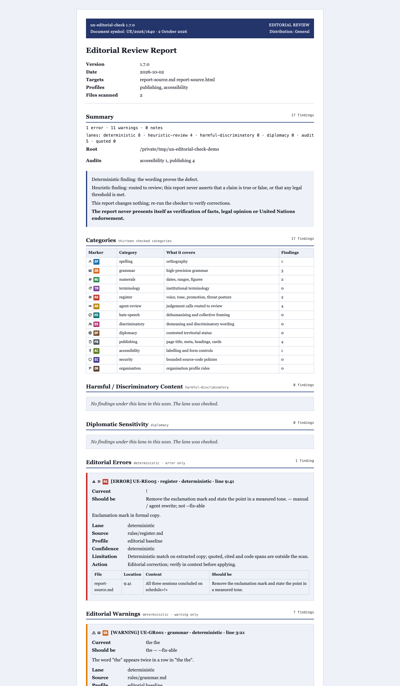

# Demo — the five lanes on real copy

This demo proves that the five output lanes are separate routes, not one flat list. Three small files carry copy written on purpose: two of them break documented rules, one of them is clean. The commands below regenerate every result in a few seconds.

The deliberately-flawed copy lives under `tests/fixtures/demo/` rather than under `docs/`. Everything outside `tests/fixtures/` is swept by this repository's own self-scan (`node bin/check.mjs --self-scan --quiet`), which must exit `0`, so copy that breaks the rules may not sit where the sweep can see it. This directory holds clean prose only: what the demo is, how to reproduce it, and what each run shows.

That is why the flawed files are fixtures and not examples. A directory scan skips `fixtures`, so the repository's own copy can contain material that breaks its rules without the self-scan reporting it.

## The three files

| File | Role |
|---|---|
| `tests/fixtures/demo/statement.md` | Flawed statement: findings in the deterministic, heuristic, harmful or discriminatory and diplomatic lanes in one run |
| `tests/fixtures/demo/page.html` | Minimal web page: editorially clean copy, so only the opt-in audit lane reports |
| `tests/fixtures/demo/clean-note.txt` | Clean copy: the run that states what a clean result means |

## Reproduce it

Run these from a repository checkout. The `tests/` directory is not part of the npm package, so the demo is a checkout workflow.

`--self-scan` is required, and dropping it is a trap worth naming. The scanner shields the skill's own directory by default, so naming a fixture path from inside the checkout without the flag reports `scanned 0 files` and prints the clean-run sentence at exit `0`. A reader who omits the flag sees a clean report for a file that has eleven findings. The flag is what lifts the shield for the command in hand.

```sh
# Run 1 — four lanes in one pass over one file.
node bin/check.mjs --self-scan tests/fixtures/demo/statement.md

# Run 2 — the fifth lane, opt-in through audit profiles.
node bin/check.mjs --self-scan tests/fixtures/demo/page.html \
  --profile publishing --profile accessibility --profile security

# Run 3 — a clean file, and the sentence that states what a clean run means.
node bin/check.mjs --self-scan tests/fixtures/demo/clean-note.txt
```

The exit codes are part of the demonstration:

| Run | Exit code | Why |
|---|---:|---|
| 1 | `1` | Error-severity editorial findings are present |
| 2 | `0` | Audit findings are reported and never move the exit code |
| 3 | `0` | No findings under the enabled, documented local rules. |

Add `--report demo-review.pdf` to any run to write the same review as a PDF, and `--format json` to read the same records a pipeline would consume. Both keep the lane, source, profile, confidence, limitation and recommended human action on every finding.

## What each run shows

**Run 1 — `statement.md`, four lanes in one report.**

- *Deterministic rule violations*: a doubled word (`UE-GR001`), a space before punctuation (`UE-GR002`), a full stop running into the next word (`UE-GR003`), an exclamation mark (`UE-RE005`), a bare `US` country name (`UE-TE004`), a hyphenated year range (`UE-NU002`) and a slash date (`UE-NU001`). These prove their own defect and can carry a replacement.
- *Heuristic editorial review*: malformed wording (`UE-HR002`) and a verbless sentence fragment (`UE-HR001`). Both are routed to `AGENT REVIEW REQUIRED` and are review severity by default, so they do not fail the run on their own.
- *Harmful or discriminatory review*: pity framing around a disability term (`UE-DM001`) sits in its own lane, labelled for high-severity human review and never rewritten automatically.
- *Diplomatic sensitivity*: a contested territorial-status statement (`UE-DP001`) is reported as requiring diplomatic review, symmetrically for every party to the claim, never as a finding of fact.

**Run 2 — `page.html`, the audit lane.** The page copy is clean, so the editorial lanes stay empty. With `--profile publishing`, `--profile accessibility` and `--profile security` the run reports page metadata, labelling and bounded source-code findings in `OPTIONAL AUDIT` sections, and the exit code stays `0`.

**Run 3 — `clean-note.txt`, a clean run.** The CLI prints exactly one sentence: `No findings under the enabled, documented local rules.` Nothing stronger follows from it.

## Why no captured output is committed

Runs 1 and 2 quote the flawed copy by design, so their captured output would carry rule-violating text inside a tracked file. The output is therefore not committed. The commands above regenerate it in a few seconds, and the repository's self-scan stays clean at `node bin/check.mjs --self-scan --quiet` → exit `0` with these files in place.

The fence is not a loophole, and this page does not use one. The scanner exempts fenced blocks from extraction, so a fenced copy of the flawed text would pass the self-scan. Verified by probing the scanner directly with a file whose only defect sits inside a fence: the fenced probe exits `0`, the same sentence unfenced exits `1`, and the same sentence in a `.txt` file exits `1`. Holding rule-breaking copy in a documentation page on the strength of that exemption would make the self-scan a weaker guarantee than it appears to be, so the copy stays in the fixture. `tests/audit-docs.mjs` sweeps the banned claim phrases over `docs/*.md`, and this page would be swept with them.

## The demo copy

The three files are short enough to read in full. Open them in the checkout:

- `tests/fixtures/demo/statement.md` — a briefing note carrying eleven findings across four lanes
- `tests/fixtures/demo/page.html` — a nine-line page whose only findings are audit findings
- `tests/fixtures/demo/clean-note.txt` — a single clean paragraph

Their contents are not reproduced here. Copy that breaks the rules belongs in the fixture and nowhere else, so a reader who wants the flawed text has to open the file the scanner checks. Run 1 prints the offending line and column for every finding, which locates each one precisely without this page holding a copy of it.

## A finished report

The output is committed, so a reader can see the design before running anything. The scan is built from two short files written for the purpose, `tests/fixtures/demo/report-source.md` and `tests/fixtures/demo/report-source.html`. They carry typographical and stylistic defects only: a doubled word, a space before punctuation, a full stop running into the next word, a numeric date, a hyphenated year range, an all-caps word, malformed wording, a verbless fragment, an unsourced figure, a missing page title and an image without alt text. The copy names no country, no group, no person and no animal, and it makes no claim about any government, so nothing in the sample can be read as a position.



| File | What it is |
|---|---|
| `tests/fixtures/demo/sample-report.html` | The full self-contained HTML report |
| `tests/fixtures/demo/sample-report.pdf` | The same review as a PDF |
| `sample-report.png` | The rendered page shown above |

The HTML and the PDF sit under `tests/fixtures/` rather than here for the reason given above: a report quotes the copy it reviewed, and a directory scan skips `fixtures`, so the deliberate defects in the sample stay outside the self-scan that this page describes. The screenshot carries the same content as an image, which no text sweep reads.

The run reports one error, eleven warnings and five audit findings, routed as eight deterministic, four agent-review and five audit, with the harmful or discriminatory, the diplomatic and the quoted lanes present and stated to be checked with nothing found in them.

Regenerate all three from a neutral directory, so the report states a path of its own rather than a contributor's working tree:

```sh
mkdir -p /tmp/un-editorial-check-demo
cp tests/fixtures/demo/report-source.md tests/fixtures/demo/report-source.html /tmp/un-editorial-check-demo/
cd /tmp/un-editorial-check-demo
node /path/to/checkout/bin/check.mjs --profile publishing --profile accessibility \
  --report /path/to/checkout/tests/fixtures/demo/sample-report.html \
  report-source.md report-source.html
```

## Further reading

- [USER-GUIDE.md](../../USER-GUIDE.md) — the plain-language walkthrough
- [README.md](../../README.md) — CLI reference, lanes, exit codes and limits
- [CHANGELOG.md](../../CHANGELOG.md) — what each release changed
- [../LAUNCH.md](../LAUNCH.md) — the 1.1.0 release announcement
