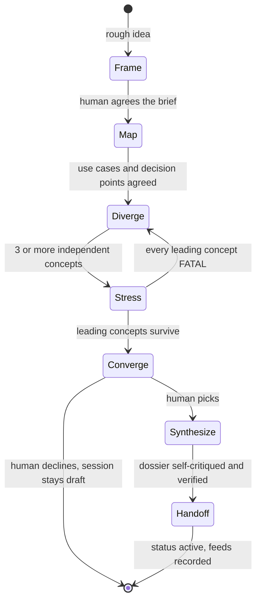

# Executor — Brainstorm

The design skill. Every other skill converges — specs fix requirements,
plans fix tasks, verdicts fix judgments. This one explores first: it turns
a rough idea into a small set of genuinely different, complete designs,
attacks the strongest ones, and lets the human choose with the tradeoffs
in front of them. The output is a design dossier the spec and the plans
are built from.

**Brainstorming is required, not optional.** `exec-initiative` refuses
`specification entered` until a decided session feeding specification
exists, and `planning entered` until one feeding planning exists. A spec
written without a design session encodes the first idea anyone had; a
plan set without a decomposition session encodes the first split.

## When to Use

| Situation | Mode | Feeds |
|---|---|---|
| A new feature, use case, or capability from a rough idea | `design` | `specification` (and often `planning`) |
| Before planning: how the spec splits into plans and tasks | `decision` | `planning` |
| One open question with competing approaches — a state shape, a sync boundary, a storage family | `decision` | the phase that raised it |
| "Let's brainstorm X", inside or outside an initiative | `design` for a feature, `decision` for a question | as recorded |

Not for: gathering requirements the human already knows (discovery's
question loop), yes/no questions (ask directly), or anything the existing
documents already answer.

## Where a session lives

| Situation | Session directory |
|---|---|
| Inside an initiative | `docs/executor/<INIT>-<slug>/brainstorm/sessions/<UTC>-<topic>/` |
| Before any initiative exists | `docs/executor/brainstorm/sessions/<UTC>-<topic>/` |

```bash
date -u +%Y%m%dT%H%M%SZ                      # the directory's timestamp prefix
../executor/scripts/exec-id INIT-0004 BRN    # inside an initiative: the session ID
```

A pre-initiative session carries `id: null` and `initiative: null`. When
the idea becomes an initiative, intake adopts it: `git mv` it into the new
initiative's `brainstorm/sessions/`, allocate its `BRN` ID, set
`initiative:`, add its Documents-table row, and derive the charter from
its Brief. See [layout.md](../executor/references/layout.md) for the
directory contents and who writes each file.

## Design mode — seven stages



Each stage ends with something the human agrees to before the next begins
— that is where the questions go, asked on the spot through the harness's
question tool.

### 1. Frame — the brief

Write `## Brief` in `session.md` with the human, before any concept
exists:

- **Problem** — who hurts today, and how you know.
- **Actors** — every person and system that touches the feature.
- **Outcome** — what is true when it works, in the actor's terms.
- **Success criteria** — measurable: a number, a threshold, an observable
  event.
- **Constraints** — hard limits: compliance, platform, budget, deadlines,
  things that must not change.
- **Non-goals** — what this feature will not do, so no concept drifts into
  it.
- **Evaluation criteria, weighted** — how the concepts will be judged
  (e.g. time to ship 3, operational burden 2, user effort 3, reversibility
  1). Agree the weights now: weights chosen after the concepts exist are
  chosen to favor one.

### 2. Map — the use-case inventory

Write `## Map`:

- **Use cases** — each with its primary flow, alternate flows, failure
  flows (what happens when a dependency is down, input is wrong, a step
  times out), and abuse flows (what a malicious or careless actor does).
- **Domain** — the entities involved and their lifecycle states.
- **Touchpoints** — where the feature meets existing systems.
- **Decision points** — every design choice the concepts must answer,
  each tagged `one-way door` (costly to reverse) or `reversible`.

Dispatch the **prior-art scout** once the brief is agreed —
[prior-art-scout-prompt.md](prior-art-scout-prompt.md) — and fold its
touchpoints and gaps into the Map.

### 3. Diverge — independent concepts

Pick 3–4 lenses that pull in different directions for this brief, and
dispatch one **concept explorer** per lens, all in one batch, none seeing
another's work — [concept-explorer-prompt.md](concept-explorer-prompt.md)
holds the lens catalog. Always include a **status-quo baseline** in the
Concepts section: what happens if nothing is built. A concept that does
not beat the baseline on the weighted criteria is not worth building.

Summarize each returned concept as `### <LETTER> — <name>` under
`## Concepts`: shape, lens, and the one tradeoff that decides it.

### 4. Stress — the adversarial pass

Dispatch the **design critic** on the leading 1–2 concepts —
[design-critic-prompt.md](design-critic-prompt.md). Record every finding
under `## Stress test` with its disposition: accepted as a known risk,
mitigated (and how), or disqualifying. If every leading concept carries a
FATAL, return to Diverge with a lens the critique points to.

### 5. Converge — the human picks

Present a decision matrix: concepts as rows, weighted criteria as
columns, each cell a score with a one-line justification, plus the
critic's FATAL and MAJOR findings. Ask the human to pick. Record the pick
in `decided:` and the reasoning under `## Decision log`, including what
the human traded away. If they decline to pick, the session stays
`draft` with the open question named — an undecided session is a real
outcome.

### 6. Synthesize — the design dossier

Write `## Design` for the chosen concept, merged with the accepted
mitigations: shape, the answer to every decision point, the walk of every
use case, a `mermaid` diagram of the primary flow, domain and data,
integration changes, and the MVP slice with its increments. Then
`## Risks and open questions`: the critic's accepted risks, the
assumptions that must hold, and every question the human deferred.

### 7. Handoff — what spec and planning receive

Write `## Handoff`:

| For | What |
|---|---|
| Specification | requirement candidates — one per use-case flow and success criterion, each tagged with the use case it came from; constraints and non-goals carried verbatim |
| Planning | the MVP slice and increments as candidate plan boundaries; the touchpoints each would change |
| Architecture | every one-way-door decision point with its chosen answer — each is an ADR candidate |

Set `status: active` and `feeds:`. The spec cites the session and
derives its requirements from the Handoff; nobody re-litigates a decided
session downstream — a changed mind supersedes it with a new session.

## Decision mode — one open question

For one question — including the planning decomposition session:

1. **Generate at least three options** before evaluating any. Two options
   is a false binary; the second-best option exists to make the best one
   argue for itself — write it honestly.
2. **Known-ancestor pass.** For each option, name the closest known
   approach and what it borrows or rejects. Options with no ancestor are
   usually reinvention — flag them.
3. **Adversarial pass.** Attack the favorite: what makes it wrong, what it
   costs at 10×, how it rolls back.
4. **Ask the human to pick**, record `decided:`, set `status: active` and
   `feeds:`.

A decision session runs inline — no subagents — unless the question is
large enough to deserve a critic, in which case dispatch one as in design
mode.

## The session record

```markdown
---
kind: brainstorm
id: INIT-0004-BRN-01
initiative: INIT-0004
mode: design
question: How should tenants onboard themselves without an operator?
feeds: [specification, planning]
status: draft
decided: null
created_at: <UTC from an executed command>
updated_at: <same>
---

# <question>

## Brief
## Map
## Concepts
### A — <name>
### B — <name>
### C — <name>
## Stress test
## Decision log
## Design
## Risks and open questions
## Handoff
```

A decision session carries `## Options` (≥3 `###` entries),
`## Adversarial pass`, and `## Outcome` instead. `exec-store-check` B2
enforces both shapes: a draft needs its opening section, an active
session the whole method and a `decided:` pick.

Dispatched agents write their own files beside the record —
`prior-art.md`, `concepts/<LETTER>-<lens>.md`, `critique-R<nn>.md` — and
every dispatch is a row in the session's `dispatches.md`, with the
identity the [dispatch registry](../executor/references/layout.md#dispatch-registry)
assigns. Inside an initiative, the session gets a Documents-table row in
`INDEX.md` (`INIT-0004-BRN-01`, kind `brainstorm`) — B3 checks it.

**A skip is auditable, never silent.** Declining ideation at discovery
entry is a line in `INDEX.md` containing "brainstorm". It satisfies
discovery's B1 check; it does not satisfy the specification or planning
entry gates, which need a decided session.

## Visual mode

Same method, rendered: `executor-discovery`'s
[visual-companion.md](../executor-discovery/visual-companion.md) owns the
server. Offer it explicitly when a screen, a layout, or a flow is clearer
shown than described. Synthetic data only. The text record is the
deliverable either way — a visual session with no `session.md` produced
nothing reviewable.

## Self-Critique

Run this against the session record before setting `status: active`, and
fix what it catches:

1. **Were the evaluation criteria and weights agreed before any concept
   existed?** If they were set or changed after, the pick was rationalized
   — re-agree them and re-score.
2. **Are the concepts genuinely different?** Name the decision point on
   which each pair of concepts disagrees. Two concepts that agree on every
   one-way door are one concept — replace one with a new lens.
3. **Does every one-way-door decision point have an answer in the chosen
   design?** An unanswered one becomes a guess in the spec.
4. **Does every use case — failure and abuse flows included — have a
   walk in `## Design`?** A flow with no walk becomes a requirement nobody
   wrote.
5. **Does the chosen concept beat the status-quo baseline** on the
   weighted criteria? If not, the honest outcome is "do not build".
6. **Does every critic finding have a disposition?** A FATAL or MAJOR with
   none was ignored, not accepted.
7. **Is every requirement candidate in `## Handoff` traceable** to a use
   case or a success criterion? One that is not is scope the human never
   agreed to.
8. **Did the human make the pick** — recorded in their words in the
   Decision log — or did the controller decide for them?

## Verification

Before claiming the session is decided:

1. `../executor/scripts/exec-store-check` — no B2 or B3 finding for this
   session.
2. Every concept file named in `## Concepts` exists under `concepts/`,
   every critique round under `## Stress test` exists as
   `critique-R<nn>.md`, and every dispatched agent has a `dispatches.md`
   row — compare the counts.
3. `feeds:` names the phase about to be entered; `status: active`;
   `decided:` set.
4. `../executor/scripts/exec-scan-secrets <session dir>` — exit 0; the
   store is public.
5. Every `mermaid` block in the record renders — quoted labels, a colon
   after every sequence-diagram arrow.

Cite each result in the Decision log. A session is decided only after
these ran in this session.

## Common Rationalizations

| Excuse | Reality |
|---|---|
| "I already know the answer" | Then the design session is fast — but it still runs, because the spec gate needs the brief, the use cases, and the alternatives you rejected |
| "Three explorers is expensive" | A spec and plan set built on the wrong concept costs every task in them |
| "The explorers can see each other's work, it saves time" | Then you get one design with four names — independence is the only reason to dispatch more than one |
| "Two options is enough" | A binary is the most common way to be wrong — generate the third |
| "The human will pick anyway" | The critic's attack is what makes the pick informed; skipping it presents a menu cooked to lose |
| "A skip note is enough" | It satisfies discovery's record; the spec and planning gates need a decided session |
