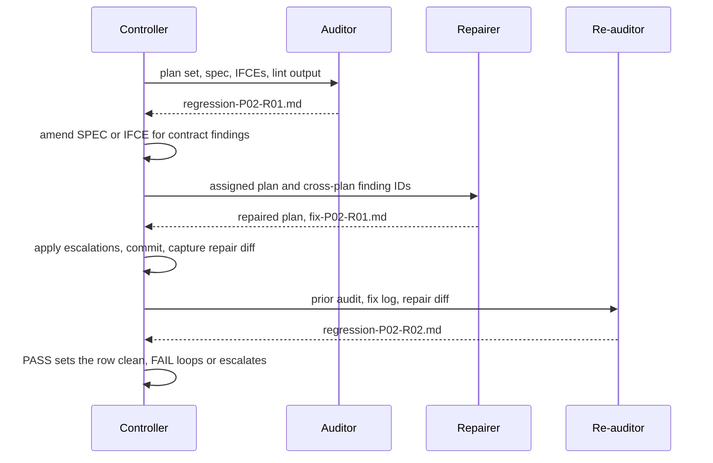

# Executor — Plan Regression

The phase between planning and execution that the plan set earns by
surviving one adversarial read as a *set*. Every per-plan check that
already exists — `exec-plan-lint`, the planning self-review — reads ONE
plan. This phase reads all of them against each other and against the
contracts they claim to satisfy, because the defects that actually ship
are seams: an `Assumes` section promising a signature the predecessor plan
never produces, a spec requirement no plan's `Covers:` claims, two plans
both provisioning the same queue with different shapes.

This skill runs after planning has drafted every plan and **before** the
human picks an execution mode — defects found here repair cheaply; the
same defect found during execution costs a fix loop per dependent task.

## When to Use

- `executor-planning` has finished drafting the plan set (one or more
  plans) and the `planning` phase has been marked entered.
- Before every `executor-execution` run start — `exec-run PLAN start`
  refuses while this phase is entered-but-not-passed.
- When a plan set changes mid-initiative — a plan rewritten, a new plan
  added, a spec amended after plans were locked — the audit re-runs for
  the changed plans.

## Ownership Boundary

You audit and repair **plan documents**. Findings that live in the spec
or an interface contract get a ruling and a targeted amendment to THAT
document — never a plan edit that papers over a contract defect. You
never write implementation code; you never modify `.executor/<INIT>/Pnn/`
workspaces (those belong to execution).

## Inputs

| Need | From |
|---|---|
| The plan set | `plans/*.md` in the initiative folder — on disk, not the INDEX |
| The requirements | the spec each plan's `spec:` frontmatter names |
| The contracts | every `INIT-…-IFCE-*` the plans cite |
| Global constraints | the spec's constraint block, plus each plan's `## Global constraints` if present |
| The run store home | `../executor/scripts/exec-plan-regression PLAN_FILE dir` |

Resolve the artifact root first:

```bash
../executor/scripts/exec-plan-regression "$PLAN" init
# → .executor/INIT-0004/plan-regression/summary.md, plus dispatches.md
```

`init` also seeds `.executor/INIT-0004/rulings.md` — the initiative-level
log where every ruling this phase produces lands (`exec-ruling "$PLAN"
initiative "<decision>" "<why>" "<cost>"`).

## The Round Loop

Three roles, each with a dedicated prompt, each a separate dispatch —
never one agent grading its own work:

| Role | Identity | Prompt | Writes |
|---|---|---|---|
| Auditor, round 1 | `AUDIT-P02-R01` | [plan-auditor-prompt.md](plan-auditor-prompt.md) | `regression-P02-R01.md` |
| Repairer | `REPAIR-P02-R01` | [plan-repairer-prompt.md](plan-repairer-prompt.md) | edits to the plan file, `fix-P02-R01.md` |
| Re-auditor, rounds 2–3 | `AUDIT-P02-R02` | [plan-reauditor-prompt.md](plan-reauditor-prompt.md) | `regression-P02-R02.md` |



- **Every dispatch is logged** in `plan-regression/dispatches.md` with its
  identity and model, and every prompt placeholder is filled — a
  dispatch briefed from memory is not an audit.
- **One auditor per plan, all receiving the whole set** — checks 2, 4, 6,
  and 7 are cross-plan by definition. Audits of different plans run in
  parallel; a repair and the re-audit that grades it never do.
- **Rounds never overwrite.** `exec-plan-regression PLAN audit 02` names
  the next file beside the first; the re-auditor verdicts the prior
  round's findings from it.
- **Round cap: three audits per plan.** When `R03` still fails, stop
  repairing: take the open findings to the human for a ruling, a spec
  change, or a recorded waiver.

## The Audit — per plan per round, one `regression-P<nn>-R<nn>.md`

The auditor writes its findings to the path from
`exec-plan-regression PLAN audit <ROUND>`. Frontmatter `kind: regression`,
`round: R<nn>`, `verdict: PASS | FAIL`, and the `high`/`medium`/`low`
counts — `exec-plan-regression check` reads `verdict:` from the latest
round. `PASS` means zero HIGH and zero MEDIUM.

Walk these checks **in this order** — each class cheap to verify, and the
order surfaces contract-breaking defects before polish ones:

1. **Spec coverage.** Union every plan's `Covers:` lines and `implements:`
   pointers; diff against the spec's `R<nn>` requirement set. A
   requirement with no claiming plan is a HIGH. A `Covers:` entry naming
   a requirement that does not exist is a HIGH (the author split by
   memory, not by the spec).
2. **Cross-plan Assumes/Produces closure.** Every signature, type, file
   path, topic name, or env var a later plan's `## Assumes` (or its
   tasks' `Consumes:`) names must resolve to a `Produces:` in an earlier
   plan or to an IFCE that already exists. Unresolved → HIGH.
3. **Interface fidelity.** Every IFCE a plan cites must exist, and every
   literal the plan quotes from it (field names, signatures, enum values,
   topic literals) must match the contract byte-for-byte in the parts
   that matter. Drifted literals → HIGH; paraphrase where exactness was
   required → MEDIUM.
4. **Ordering & dependency map.** The `Execution order:` statement must
   be acyclic and consistent with `Assumes` direction (a plan that
   assumes P03's output cannot precede it). Task-level `Depends on:`
   inside one plan must not reference another plan's tasks. Broken
   order → HIGH; a cycle → HIGH.
5. **Constraint propagation.** Every global constraint the spec declares
   (`C<nn>`) must either be restated in each plan's binding block or be
   provably scoped out by the constraint's own wording. A constraint
   binding tasks that never see it → MEDIUM (the run's C20-amendment
   defect was exactly this).
6. **File-map collisions.** Two tasks in different plans writing the same
   file is legal only when the dependency map makes the ordering
   explicit; silent collision → MEDIUM.
7. **Vocabulary consistency.** Same concept, two names across plans
   (queue `x.dlq` vs `x-dead-letter`) → MEDIUM: naming drift is how two
   plans provision incompatible halves of one seam.
8. **Plan lint.** `exec-plan-lint` must pass for every plan — mechanical
   contract, zero tolerance. Task-depth violations (a task missing
   Implements, Depends on, Files, Interfaces, Requirements, three steps,
   or a Run/Expected pair) are HIGH: a fresh implementer cannot finish a
   task its brief does not describe.
9. **Skipped-phase honesty.** If the initiative skipped architecture or
   spec, verify the plan does not cite contracts that were never written.

A single-plan set still gets the audit: coverage against its spec, the
seams to its IFCEs, and lint all apply.

## Repair — per plan per round, one `fix-P<nn>-R<nn>.md`

For every plan with findings, the controller sorts the findings before
any repairer starts:

- **`contract` findings are the controller's.** Amend the SPEC or IFCE
  (targeted edit, `updated_at` bump), log the amendment with
  `exec-ruling "$PLAN" initiative …`, and pass it to the repairers as
  `[CONTRACT_AMENDMENTS]`. Never adapt a plan around a broken contract.
- **`cross-plan` findings go to the side that is wrong.** Decide which
  plan owns the fix before dispatch; one finding, one repairer.
- **`plan` findings go to that plan's repairer.**

The repairer edits only its own plan file, writes the log to
`exec-plan-regression PLAN fix <ROUND>`, and ends every finding FIXED,
ESCALATED (the fix belongs in another document — the controller applies
it), or DISPUTED (the re-auditor adjudicates). Then the controller applies
the escalations, commits the repair, captures the repair diff, and
dispatches a fresh re-auditor. A finding that needs human input goes to
the initiative rulings log, and the summary row stays `audited` until it
is answered — or the human waives it (below).

## The summary — `summary.md`

`exec-plan-regression PLAN init` seeds it; you fill the table. One row
per plan:

| Plan | Status | Audit | Repairs | Notes |
|---|---|---|---|---|
| INIT-0004-P01 | clean | regression-P01-R02.md | fix-P01-R01.md | 56 defects → 0 |
| INIT-0004-P02 | waived | regression-P02-R03.md | fix-P02-R02.md | human waived low-severity DTO naming |

`Status` vocabulary: `clean` (the latest audit round has `verdict: PASS`
— `check` refuses a clean row whose latest audit says otherwise),
`audited` (report exists, findings open), `waived` (human explicitly
accepted the open findings — record the waiver as an initiative ruling
too). `draft`/`audited` rows block the gate.

## The gate

`../executor/scripts/exec-plan-regression "$PLAN" check` exits non-zero
unless every plan on disk is `clean` or `waived` with its audit file
present. When it passes:

```bash
../executor/scripts/exec-initiative phase INIT-0004 plan-regression passed "N plans, M defects repaired"
```

Then — and only then — executor-planning's gate fires (the human picks an
execution mode) and `exec-run PLAN start` will accept the run. The gate is
enforced twice: the phase-order machine refuses `execution entered` without
it, and `exec-run start` refuses once planning has passed. A finding
the human waives is recorded twice: `waived` in the summary AND an
initiative ruling via `exec-ruling … initiative …` naming what was
waived and why — a waived defect with no ruling is an undocumented skip.

**Re-entry.** Execution discovering a plan defect that predates the run
(a wrong `Assumes`, a spec drift) re-enters this phase for the affected
plans: amend, re-audit, re-clear — before the dependent task dispatches.

## Hard rules

- Never hand-build artifact paths — `exec-plan-regression` resolves them.
- Never write audit output under `docs/executor/` (thinking store) or
  inside a `Pnn/` workspace (one plan's ledger). The initiative-level
  `plan-regression/` dir is the only legal home.
- Never mark a plan `clean` from a fix log alone — `check` requires the
  latest audit round to say `verdict: PASS`; a fresh re-audit after repair
  is what makes the row honest.
- Never let a repairer re-audit its own repair, and never dispatch any
  role without its prompt template filled.
- Contract amendments (IFCE/SPEC edits) are rulings: `exec-ruling "$PLAN"
  initiative …` the moment the amendment is made.
- Human waivers are the only path to `waived` — you may recommend, never
  self-grant.

## Self-Critique

Before claiming the gate, run this against the summary and every latest
audit, and fix what it catches:

1. **Does every plan on disk have a row**, and does every row name the
   latest audit round on disk? A row naming `R01` when `R02` exists is
   stale.
2. **Was every repair graded by a fresh auditor?** Check `dispatches.md`:
   a `REPAIR-P02-R01` row with no later `AUDIT-P02-R02` row means a clean
   claim with no re-audit.
3. **Did any repair weaken the plan to pass** — a deleted requirement, a
   dropped `Covers:` line, a loosened value? Grep the repair diffs; each
   one is a new HIGH, whatever the re-audit said.
4. **Was every `contract` finding applied to the contract** and logged as
   an initiative ruling — not repaired inside a plan?
5. **Is every `waived` row backed by the human's words** in an initiative
   ruling? A waiver you recommended but they did not state is not one.
6. **Did any plan exceed three rounds?** Then the human decided, and the
   ruling says what.
7. **Did the set change after its audit** — a plan edited, added, or its
   spec amended — without a re-audit of the affected plans?

## Verification

Run these in this session and cite their output when claiming the gate:

1. `../executor/scripts/exec-plan-regression "$PLAN" check` — exit 0,
   "plan-regression clean".
2. `../executor/scripts/exec-plan-lint <plan>` for every plan — exit 0.
3. `../executor/scripts/exec-plan-regression <plan> latest` for every plan
   — names the file the summary row cites.
4. `../executor/scripts/exec-scan-secrets .executor/<INIT>/plan-regression`
   — exit 0; the execution store may be committed.
5. `../executor/scripts/exec-initiative phase <INIT> plan-regression passed "…"`
   — accepted; the phase gate re-runs `check` itself and refuses on any gap.

## Common Rationalizations

| Excuse | Reality |
|---|---|
| "P01 executed fine already, skip its audit" | Plans are audited against the SET — a clean P01 run does not prove P02's assumptions about it |
| "The defect is small, I'll note it in the plan" | A defect noted but unrepaired is a `audited` row — the gate stays closed until it's repaired or the human waives it |
| "Re-running the audit is expensive" | Re-audit only the repaired plan's changed checks — but run them; the previous report does not expire by wishing |
| "Planning already reviewed each plan" | Per-plan review reads one file; the defects this phase exists for live between files |
