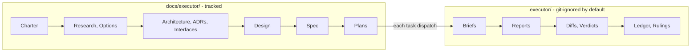
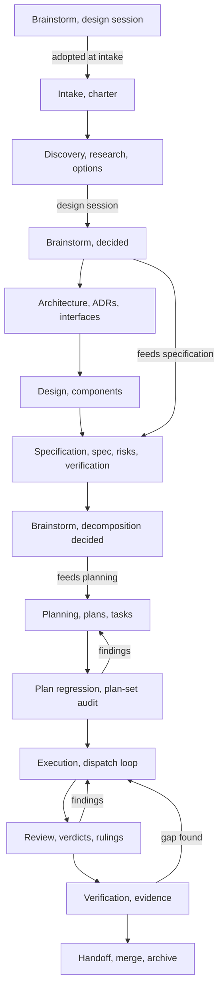

# The Executor

A body of work gets one **Initiative**. The initiative owns a folder, an ID
namespace, and every document produced about it — charter, research,
architecture, decisions, interfaces, design, spec, risks, verification,
plans. Execution artifacts for those plans live in a separate store, keyed
by the same IDs.

Nothing floats. Every document, every task, every review, every ruling
carries an ID that names the initiative it belongs to, and no document
cites an ID from a different initiative.

## When to Use

Route here when work is substantial enough to survive a session: a new
subsystem, a migration, a feature spanning multiple components, a
rearchitecture. The Executor scales down (a small initiative has a charter,
a spec, one plan) but it does not scale to zero.

**Do NOT use for:** a typo, a one-line fix, a question, a spike whose output
is an answer rather than code. Those need no initiative. Creating one for
trivial work is the primary failure mode of this system — the ceremony
becomes the work.

**The gate:** if you cannot name a deliverable that outlives this session,
there is no initiative. Answer the question and stop.

## Session Opening Ritual — run before ANY work, every session

Before your first substantive action in any session touching an Executor
initiative, execute this ritual. It is not optional and it is not skippable
because you "already know" the state — session memory is not state.

```bash
git branch --show-current && git rev-parse HEAD && git status --short
```

Then read, in this order:

1. `docs/executor/INDEX.md` — which initiatives exist, their status and phase.
2. The active initiative's `INDEX.md` — its phase log: where work actually
   stopped, and which phases are skipped versus never done.
3. Any `.executor/INDEX.md` — which plans ran and where their workspaces are.

Only then state, in one line: which initiative you are in, which phase it is
in, and what the last recorded event was. If you cannot state all three, you
are not ready to work. **Precedence, absolute:** current repository state
beats stored records — if the phase log says `planning passed` and there is
no plan file, the code wins; write a correction, do not proceed on the
stale record.

## Hard Rules — these bind regardless of which phase skill is loaded

**1. You never write implementation code outside `executor-execution`'s task
dispatch, and you never write it inline.** In discovery, architecture, spec,
and planning you write documents — no project scaffolding, no source files,
no `mkdir` for code, no "quick fix while I'm here". A probe whose output is a
measurement is evidence; label it throwaway in the document that cites it.
The only phases that touch production code are `executor-execution` (through
dispatched implementers) and `executor-verification` (through running checks).
If you catch yourself opening a source file to edit it in any other phase —
stop. That is the primary failure mode of weaker models running this system.

**2. A gate means END YOUR TURN.** "Present and stop" means: your message
ends after presenting the artifact. No follow-up work, no "while you review
that, I'll…", no next-phase preparation. The next message after a gate
presentation is the human's answer, not your continued work. Silence is not
approval — nothing acquires consent by aging.

**3. Never guess when you can read, never read when a script answers.**
Store paths, IDs, and phases come from the scripts (`exec-initiative`,
`exec-id`, `exec-workspace`). Hand-built paths and invented IDs are defects
even when they look right.

**4. One phase at a time, declared.** Every message you send names which
phase you are working in. If your work has silently drifted into a different
phase's territory (discovery producing architecture, planning writing
requirements), stop and either re-route or record the phase transition
properly.

**5. During execution, you are a pump, not a planner.** `exec-step` decides
what is legal next; you carry it out. You do not read artifacts to work out
what should happen, you do not choose the order, and you do not hold state
between turns. If you find yourself reasoning about what the run "should"
do next, that reasoning belongs to the script or to a dispatched agent —
see The Pump Contract below.

## The Pump Contract

Execution has one loop, and it is mechanical:

1. Run `exec` (bare — the resume digest) or `exec step PLAN_FILE`.
2. Read the single action word it prints.
3. Do exactly that thing.
4. Go back to 1.

That is the whole of your job during a run. The controller is the least
reliable worker in this system — it dies, compacts, drifts, and is under
pressure at exactly the moment a judgment call matters — so the design
assumes it will try to be clever and takes away the opportunity.

The same loop runs on the phase axis, and it is the same shape:

1. `exec` emits `PHASE-ENTER <phase>`.
2. `exec dispatch --role author` mints the AUTHOR, renders its prompt, and
   logs the dispatch — then spawn it. You do not write the artifact.
3. The author writes the artifact and returns. You do not.
4. The phase's own critique stage runs (`AUDIT` → `REPAIR` → `AUDIT`).
5. `exec` emits `PHASE-GATE`. Present it with `exec present INIT PHASE`
   (the gate card — paths and states, never artifact bytes); the human
   gates it, or `exec-gate --auto` does, and `exec-initiative` refuses
   unless both the artifact gate and the critique are clear.

Every arrow in that list is a dispatch or a script. There is no step where
you do the work, and that is the property the whole design is buying.

### The decision table

> Generated from `skills/executor/scripts/_exec-lib.sh` `exec_verbs` —
> the machine-readable table the scripts and `exec-graph check` both
> consume. Print it with `exec verbs`; do not hand-edit this table —
> a table and a script that disagree is how stale rows get followed.

| `exec-step` emits | You do |
|---|---|
| `REPAIR-STATE <run-dir>` | Run the named repair (usually `exec-workspace PLAN`) |
| `RUN-START <plan-id>` | `exec-run PLAN start` — the plan-regression gate rides it |
| `DISPATCH <task-id> <n>` | `exec-dispatch PLAN --task N --role impl`; spawn AGENT on PROMPT |
| `REVIEW <task-id> R<nn>` | `exec-dispatch PLAN --role review --task Tnn`; spawn the reviewer on PROMPT |
| `FIX <task-id> R<nn>` | `exec-dispatch PLAN --role fix --task Tnn`; spawn the fix implementer |
| `REVIVE <task-id>` | `exec-ladder PLAN TID revive`; spawn AGENT on PROMPT |
| `REDISPATCH <task-id>` | `exec-ladder PLAN TID redispatch`; spawn AGENT on PROMPT |
| `ADJUDICATE <task-id>` | `exec-adjudicate PLAN TID`; spawn SUPERVISOR on PROMPT |
| `REPORT <report-file>` | `exec-report PLAN REPORT_FILE` — it gates, and either commits or refuses. Never write the ledger line yourself |
| `GATE-STAGE <plan-id>` | `exec-run PLAN complete` — it runs the full audit and refuses on failure |
| `PHASE-ENTER <init> <phase>` | `exec-initiative phase <init> <phase> entered`, then **dispatch the phase's `AUTHOR` subagent** — authoring the artifact yourself is the one thing this table exists to stop |
| `PHASE-GATE <init> <phase>` | `exec-present <init> <phase>` to the human; or `exec-gate <init> <phase> --auto` where autonomous mode is declared — a refusal is the answer, not an obstacle |
| `CRITIQUE <init> <component>` | `exec-critique <init> <component> init`, then dispatch AUDIT per the phase skill |
| `ASK <topic>` | Relay to the human, or spawn a `DECIDE`/`SUPERVISOR` for a `decision`-class question |
| `WAIT` | Idle one turn — the emit carries the wake condition |
| `DONE` | The run is finished. Report and stop |


**What "subagent-driven" means here, precisely.** Every step is either a
dispatch or a script call — never you doing the work. The two look similar
from the outside and are not:

- A **dispatch** is intellectual work: authoring, auditing, implementing,
  reviewing, adjudicating. It goes to a named role with a registered
  prompt, and its output is an artifact someone else will read.
- A **script call** is a transition: `exec-initiative phase … entered`,
  `exec-workspace`, `exec-branch merge`. You invoke it, it writes state,
  and there is no judgment anywhere in the path.

`REPAIR-STATE` is the second kind. The controller is the thing that drifted
 the store, so the controller is the thing that repairs it — and the repair
is a script call, not a decision. Giving it a subagent prompt would add a
layer that can only be less informed than the thing it replaced.

The test: *would a subagent reading only its prompt know more than you do
right now?* If yes, dispatch. If the prompt would just be a transcript of
the command you are about to type, run the command.

### What the pump never does

- **Never authors.** Charter, spec, architecture, plan, report, verdict —
  every one is a dispatch. An artifact the controller wrote is an artifact
  nobody reviewed.
- **Never judges.** Clean or dirty, pass or fail: that is `exec-report`,
  `exec-run complete`, or a `SUPERVISOR`'s ruling.
- **Never improvises a transition.** If the emitted word has no row in the
  table above, you have found a gap in the engine. Record it as a concern
  and stop; do not approximate the missing behaviour.
- **Never absorbs a dead worker's work.** A worker that stopped is revived
  or redispatched with its report in context. Taking over the task yourself
  deletes the audit trail and is the single most damaging thing a pump can
  do.
- **Never passes a phase gate yourself.** Not with
  `exec-initiative phase … passed`, and not by editing the phase log. Every
  authoring phase is gated twice over: by the component's artifact gate, and
  by an independent critique of that component —
  `exec-critique INIT_ID COMPONENT check`, which `exec-initiative` runs on
  your behalf. When either refuses, the correct next move is to dispatch the
  audit or present the artifact to the human — never to find another route
  to the same state.

  A gate the human did not clear goes through `exec-gate --auto`, which
  refuses unless the initiative's `autonomous.md` permits it. You may
  recommend a human waiver of an open finding; you may never grant one, and
  a waiver the human did not state is not a waiver.

### Autonomous mode

An initiative may run unattended for the phases its `autonomous.md` names.
The file lives at the initiative's root and is a table, one row per phase:

```markdown
| Phase | Mode | Why |
|---|---|---|
| intake | deny | the charter is the human's to approve |
| execution | allow | every stage is gated; workers are dispatched, not self-approved |
```

`deny` never clears unattended. `gate` clears when the phase's own
structural gate passes. `allow` is the same for a gate a script can verify,
and additionally permitted for a pick-class phase **only** when a scored
verdict is already on disk — a script can count files, it cannot choose
between designs.

The policy fails closed. A missing file, `enabled: false`, an unlisted
phase, or a mode spelled anything else all read as `deny`. If you find
yourself wanting to widen it mid-run, that is a change for the human to
make, not you.

An auto-pass is recorded as `**auto-passed**`, never as a bare date. Keep
it that way: the difference between "a person looked at this" and "the
policy cleared this" is the difference a reader needs six weeks later. A
human who disagrees overturns it with
`exec-initiative phase <init> superseded <phase> "<why>"`, which reopens
the phase.

### When the human interrupts

If the human says something mid-run, do not interpret it and carry on. Two
cases:

- They answer a question you asked — record it with
  `exec-ruling … --answered "<the question>"`.
- They say something you did not ask about — record it with
  `exec-ruling … --unsolicited "<their words, verbatim>"`. If they are
  halting, add `--stop`; the script blocks the run and prints a `STOP`
  line. Relaying a stop is mechanical, and you do not get to talk the human
  out of it.

Their words go in verbatim. A paraphrase in a ruling is a ruling nobody can
check against what was actually said.

## Drift Recovery — when you notice you violated a rule

Violations compound: an inline edit becomes an unrecorded decision, becomes
an unreviewed change, becomes a spec that argues from nothing. The recovery
procedure is fixed:

1. **Stop the violating action immediately.** Do not finish the edit, the
   scaffold, or the batch you were mid-way through.
2. **Assess exposure.** Did the violation produce files, commits, or
   side effects? List them.
3. **Repair to the record, not to silence.** Anything created gets either
   reverted (`git checkout -- <paths>` for uncommitted edits, or explicitly
   marked throwaway) or properly recorded (a ruling, an ADR, a phase-log
   note). An unrecorded violation discovered later by a reviewer costs a
   full round; recorded, it costs one line.
4. **Re-run the Session Opening Ritual** before continuing — your model of
   the state was wrong when you drifted; re-ground before acting on it.
5. **Continue the correct phase.** Do not restart the whole initiative; the
   record exists precisely so a detour does not become a rewrite.

## Invocation

The root router is available as the `executor` skill:

```text
/skill:executor
```

Use the phase-specific skill when the initiative already has a gate-passing
artifact:

```text
/skill:executor-initiative
/skill:executor-discovery
/skill:executor-architecture
/skill:executor-spec
/skill:executor-planning
/skill:executor-plan-regression
/skill:executor-execution
/skill:executor-review
/skill:executor-verification
/skill:executor-handoff
/skill:executor-brainstorm
```

An explicit `/skill:<name>` call loads the skill immediately in runtimes
that support it. Normal requests also route by the frontmatter description;
say "start an initiative" for intake or "execute plan INIT-0004-P01" for a
plan already approved.

## The Two Stores



**`docs/executor/` — the thinking record.** Git-tracked. Survives clones and
CI. Holds what the work IS and why: charter, research, architecture,
decisions, interfaces, design, spec, risks, verification strategy, plans,
and brainstorming sessions. A reader who clones the repo gets the complete
reasoning.

**`.executor/` — the execution record.** Git-ignored by default via a
self-writing `.gitignore`, and **safe to commit** if the user chooses:
task briefs, implementer reports, review diffs, review verdicts, the
progress ledger, rulings, dispatch log. Holds what HAPPENED during
execution. Never deleted when a plan completes — the reasoning inside it is
the point.

The split is durability-of-audience, not durability-of-value. Thinking
artifacts are for anyone who ever touches the code. Execution artifacts are
for whoever needs to know how this specific run went. Both are kept.

## The ID Namespace

One initiative, one namespace. IDs are structural, not decorative.

```text
INIT-0004                      the initiative
INIT-0004-CHTR-01              its charter
INIT-0004-RSCH-02              a research note
INIT-0004-OPTS-01              an options comparison
INIT-0004-ARCH-01              an architecture document
INIT-0004-ADR-03               a decision record
INIT-0004-IFCE-01              an interface/contract document
INIT-0004-DSGN-02              a component design
INIT-0004-SPEC-01              a specification
INIT-0004-SPEC-01-R07          requirement 7 inside that spec
INIT-0004-SPEC-01-C03          global constraint 3 inside that spec
INIT-0004-RISK-01              a risk register / pre-mortem
INIT-0004-VRFY-01              a verification strategy
INIT-0004-P01                  a plan
INIT-0004-P01-T03              task 3 of that plan
INIT-0004-P01-T03-R02          review round 2 of that task
```

**Grammar:** `INIT-<4-digit>` then `-<TYPE>-<2-digit>`, plans as
`-P<2-digit>`, tasks as `-T<2-digit>`, review rounds as `-R<2-digit>`.
Sequence within a type is per-initiative and starts at `01`.

Items *inside* a document are addressable too: a spec's requirements as
`-R<2-digit>` and its global constraints as `-C<2-digit>`, hanging off the
spec's own ID. A requirement token and a review-round token never collide,
because a round always carries a `-T<2-digit>` segment before its `-R`
(`…-P01-T03-R02`) while a requirement hangs directly off `…-SPEC-01-`.

Addressable requirements are what let a review finding name the exact
contract it violates instead of gesturing at the spec, and what lets a plan
task declare precisely which requirements it discharges.

### The citation rule (hard)

**A document MUST NOT cite an ID belonging to a different initiative.**

Inside `INIT-0004`, every reference — `spec: INIT-0004-SPEC-01`,
`implements: INIT-0004-ARCH-02` — names an ID from `INIT-0004`. This is
what makes an initiative readable on its own: open the folder, and every
pointer resolves inside it.

Cross-initiative relationships exist only at the initiative level, declared
in the **charter's** frontmatter. Every Executor document carries
frontmatter; the charter is the only one permitted to carry these four
relationship fields. The initiative `INDEX.md` — which has no frontmatter —
mirrors them in its Dependencies section as prose:

```yaml
depends_on: [INIT-0002]            # this initiative needs that one first
supersedes_initiative: null        # this replaces that one wholesale
superseded_by_initiative: null     # set on the replaced initiative's charter
related: [INIT-0007]               # informational only
```

These four fields are the entire cross-initiative vocabulary. Supersession
is recorded on both sides: the replacement names its predecessor in
`supersedes_initiative`, the predecessor names its replacement in
`superseded_by_initiative`. A one-sided link leaves a reader who finds the
old initiative first with no way forward.

A task, spec, or ADR that needs something from another initiative does not
cite it. It states the requirement in its own words and, if the dependency
is real, the initiative declares it. Chasing an ID across initiative
boundaries is how a document registry turns into a graph nobody can read.

**Why it matters:** an initiative must be archivable. When `INIT-0002`
finishes and is filed away, nothing inside `INIT-0004` breaks, because
nothing inside `INIT-0004` ever pointed at `INIT-0002`'s internals.

### Allocation

Allocate an ID by listing the target directory immediately before writing.
Never invent a number, never reuse one.

Two agents allocating at once can collide. On collision, do not overwrite:
take the next free number, write your file, and note the race in the
initiative's `INDEX.md`. Preserve both documents — this is the same rule
`.local/` uses, for the same reason.

## Phases

An initiative moves through phases. Each phase has an owning sub-skill, an
output, and a gate that must pass before the next phase starts.

| Phase | Skill | Output | Gate |
|---|---|---|---|
| Intake | `executor-initiative` | Initiative folder, charter | Human approves the charter's problem statement and success criteria |
| Discovery | `executor-discovery` | Research, options comparison, the feature's design session | Human picks an approach |
| Architecture | `executor-architecture` | Architecture, ADRs, interfaces | Human approves the structure |
| Design | `executor-architecture` | Component designs | Human approves, or waives for simple initiatives |
| Specification | `executor-spec` | Spec, risks, verification strategy | Entry: a decided brainstorm session feeding specification. Exit: human reviews the written spec |
| Planning | `executor-planning` | One or more plans with in-depth tasks | Entry: a decided decomposition session feeding planning. Exit: plan set drafted and linted |
| Plan regression | `executor-plan-regression` | Plan-set audit reports, repairs, gate summary | Every plan clean or human-waived; human then picks an execution mode |
| Execution | `executor-execution` | Commits, reports, ledger | Every task reviewed and complete |
| Review | `executor-review` | Verdicts, findings, rulings | Final whole-branch review clean |
| Verification | `executor-verification` | Evidence of working software | Every claim backed by observed output |
| Handoff | `executor-handoff` | Merged branch, updated indexes | Initiative marked complete |

**Phases compress, they never vanish.** A small initiative can produce a
charter and a spec in one exchange and skip discovery entirely — but
skipping is a stated decision recorded in the charter, not an omission. The
`skipped_phases` field exists so a reader knows the difference between "we
considered alternatives and picked one" and "nobody looked."

## The Approval Gate

**Do NOT write code, scaffold a project, or take any implementation action
until the human has approved the intent for the current phase.**

The artifact scales with the work — a small initiative's architecture
section is three sentences. The approval never scales. Every phase gate in
the table above is a real stop.

**A real stop means your turn ends.** The gate presentation is the last
thing in your message. If you find yourself continuing to work after writing
"please review" — planning the next phase, pre-reading documents, drafting
the next artifact — you have not stopped. A gate crossed without approval
invalidates everything downstream of it: a spec written against unapproved
architecture gets rewritten, a plan built on an unapproved spec argues from
nothing.

Executing a plan is different: once the human approves the plan set — after
plan regression has cleared it — and picks an execution mode,
`executor-execution` runs to completion without check-ins. Approval happens
at phase boundaries, not inside them.

**Recovery when a gate was crossed without approval:** name it plainly to
the human ("I crossed the discovery gate without your pick — here is what I
did meanwhile, and here is the decision you still own"), and treat nothing
produced past the gate as approved. Do not quietly pretend the approval
happened.



**Every phase critiques and verifies its own output before its gate.**
Each phase skill carries a `## Self-Critique` section — an adversarial
pass over the artifacts it just wrote — and a `## Verification` section —
the commands that prove them, run in this session with their output
cited. A gate claimed before both ran is not claimed. Every subagent a
phase dispatches is briefed from its dedicated prompt template in the
[dispatch registry](references/layout.md#dispatch-registry), and each
template carries the same two sections for the agent's own output.

## Routing

| You need to… | Skill |
|---|---|
| Start a body of work, allocate an initiative | `executor-initiative` |
| Design a new feature or use case from a rough idea | `executor-brainstorm` (before any initiative exists, or at discovery) |
| Decide one open design question, or how a spec splits into plans | `executor-brainstorm` (decision mode) |
| Understand the problem, compare approaches | `executor-discovery` |
| Decide structure, record a decision, define interfaces | `executor-architecture` |
| Write the requirements contract | `executor-spec` |
| Turn a spec into tasks | `executor-planning` |
| Audit the plan set before executing it | `executor-plan-regression` |
| Run the plan with subagents | `executor-execution` |
| Review a task, a fix round, or a branch | `executor-review` |
| Prove the work actually works | `executor-verification` |
| Merge, archive, and close out | `executor-handoff` |

Read the contract references before writing anything into either store:

- [references/layout.md](references/layout.md) — exact directory structure
- [references/branches.md](references/branches.md) — the branch model: naming, fork rules, merge gates, edge cases
- [references/frontmatter.md](references/frontmatter.md) — required fields per document type
- [references/indexes.md](references/indexes.md) — index formats and maintenance
- [references/safety.md](references/safety.md) — secret hygiene, required because `.executor/` may be committed

## Decisions: rule, ask, or stop

Inside a phase, a running Executor does not wait on a human — but it does
not silently decide everything either. Every decision class has exactly one
handling; picking the wrong tier is how rulings go unlogged and questions
go unasked.

| Decision class | Handling |
|---|---|
| Mechanical, contract-derived, or reversible | Decide, `exec-ruling`, keep going. The ruling is written the moment it is made — the plan's log for plan-scoped calls, `.executor/<INIT>/rulings.md` (`exec-ruling "$PLAN" initiative …`) when it binds other plans. |
| Decision-class | **Ask on the spot, block only the affected lane.** Use your harness's interactive ask affordance (structured question tool if one exists, else a message that ends your turn). The question, its answer, and the resulting ruling all land in the rulings log via `exec-ruling "$PLAN" <scope> "<decision>" "<why>" "<cost>" --answered "<question>"`. Other tasks keep moving. |
| The four stops | End the phase/run for human intervention. |

**Decision-class means the answer is not yours to derive:** a conflict
between two contracts that each have authority (IFCE vs SPEC, plan vs
spec); a scope cut — dropping a requirement, shrinking a plan, deferring
non-polish work; an irreversible choice the contracts leave open; product
or UX judgment the spec does not settle. Everything else — including
"which of two legal shapes to build" — is a ruling, not a question. When
unsure whether a decision is a ruling or a question, ask once; a question
that turns out to be a ruling costs one message, a ruling that should
have been a question costs a rework loop.

**The four stops** (unchanged): an irreversible or destructive operation;
a security-sensitive action; a side effect outside this worktree that
norms say you ask about first (a merge, a push to a shared branch, a
publish); a defect so deep that every path forward is a guess.

Between phases, every gate is a human-approval stop — the gates and the
decision-class lane are the only places the workflow waits on the human,
and both write their answers into the record.

## Secret Hygiene

`.executor/` is git-ignored by default, but the user may commit it. Write
every file in both stores as though it will be public.

Never write credentials, API keys, tokens, cookies, private keys, connection
strings, or personal data into any Executor artifact. Diffs and reports are
the live risk: an implementer pasting a `.env` into a report, or a review
package capturing a secret a task added. Record a redacted existence
statement and a safe path instead.

See [references/safety.md](references/safety.md) for the required scan
before any handoff, and what to do when a secret has already landed.

## A Session That Follows the Rules — worked example

The right shape of a session, condensed. Every rule above appears here in
its natural place; if your session does not look like this, find the rule
you skipped.

```text
[Session opens on "continue the cells initiative"]

$ git branch --show-current; git rev-parse HEAD; git status --short
feature/cell-router  a91e502  clean

[Read docs/executor/INDEX.md → INIT-0004, phase: planning]
[Read INIT-0004/INDEX.md → planning entered, gate not passed,
 one plan INIT-0004-P01 exists, execution_mode: null]

Me: "INIT-0004 is in planning: plan P01 (7 tasks) is drafted, but you have
not picked an execution mode. Two options: 1) subagent-driven — a fresh
implementer per task with independent review per diff; 2) inline — faster,
no independent review. Which?"

[TURN ENDS. No pre-dispatching, no reading ahead into executor-execution,
 no work in this message beyond the question.]

Human: "Subagent."

Me: [records execution_mode: subagent, status: active, bumps updated_at]
$ scripts/exec-initiative phase INIT-0004 planning passed "subagent mode"
$ scripts/exec-initiative phase INIT-0004 execution entered
[Routes to executor-execution and follows ITS skill from here.]
```

Note what did **not** happen: no inline implementation during planning, no
gate crossed in the same message that presented it, no invented state when
the indexes disagreed with memory, no phase transition without the script.
The whole discipline is: ground first, work one phase, end turns at gates,
record through scripts.

## Self-Critique

Before routing, and again before claiming any gate, run this against what
you are about to do:

1. **Is this the right phase?** Name the phase from the initiative's
   `INDEX.md` phase log, not from memory. A plan written while the log says
   specification is work past a gate nobody passed.
2. **Is the next entry gated?** Specification and planning need a decided
   brainstorm session feeding them. If none exists, the route is
   `executor-brainstorm`, not the phase skill.
3. **Did the phase skill's own Self-Critique and Verification run** — and
   is their output in this session, not recalled from an earlier one?
4. **Is every subagent about to be dispatched briefed from its registered
   prompt template**, every placeholder filled, and its model named?
5. **Is anything in the message past the gate?** A gate presentation ends
   the turn; work after it is unapproved.

## Verification

Run these at the start of every session and before every gate:

1. `git branch --show-current; git rev-parse HEAD; git status --short` —
   the repository state the session starts from.
2. Read `docs/executor/INDEX.md` and the initiative's `INDEX.md` — the
   phase and gate state come from disk.
3. `scripts/exec-store-check` — the thinking store is consistent; a
   finding is repaired before new work, not after.
4. In a run: `scripts/exec-run PLAN check` — the registry row agrees with
   the ledger.
5. Before any handoff: `scripts/exec-scan-secrets` — exit 0.

## Common Rationalizations

| Excuse | Reality |
|---|---|
| "This is small, skip the initiative" | Correct — if it produces no lasting deliverable. If it does, it gets an initiative with three short documents. |
| "I'll cite the other initiative's ADR, it's right there" | That coupling is what makes registries unreadable. State the requirement in your own words; declare the dependency at initiative level. |
| "The workspace is scratch, I'll delete it when done" | The execution record is the point. Nothing deletes it. |
| "I'll allocate the ID later" | IDs allocated retroactively collide and get invented. List, then write. |
| "The ledger has the ruling, that's enough" | The ledger dies with the plan's relevance. Rulings go to `.local/decisions/` the moment they are made. |
| "No secrets in this one, skipping the scan" | The scan is cheap and the failure is unrecoverable once pushed. Run it. |
| "Phases are overhead, I'll write the plan directly" | A plan with no spec argues from nothing. If discovery and architecture are genuinely unnecessary, record them as skipped and say why. |
| "I already read the indexes earlier this session" | Session memory is not state. The ritual runs every session; compaction and interruptions make stale confidence expensive. |
| "The next step is obvious, I'll start it while they review" | A gate ends your turn. Work produced past an unpassed gate is work the approval cannot cover. |
| "It's just a small inline edit to unblock the document" | Inline execution in a document phase is the primary drift failure. Record what blocks you instead, or rule on it if a plan is running. |
| "I drifted, but the work is good, I'll keep it quietly" | An unrecorded violation is a defect discovered by a reviewer later. Run Drift Recovery: stop, assess, repair to the record, re-ground. |
