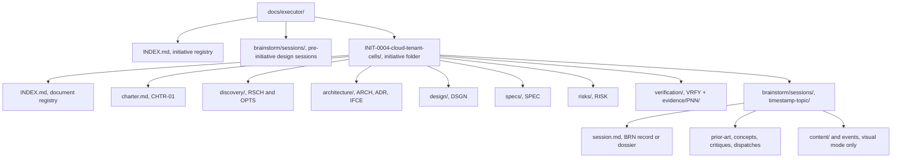
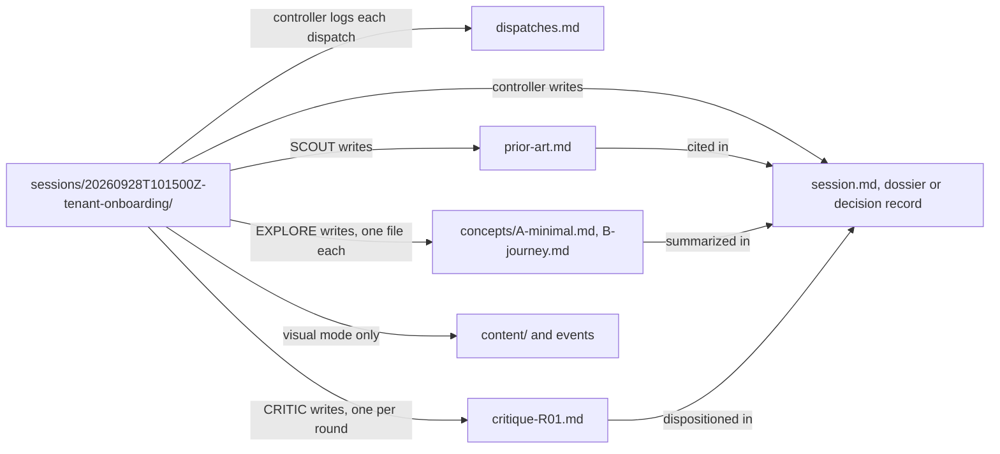
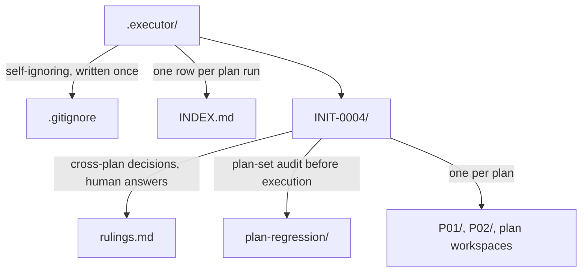
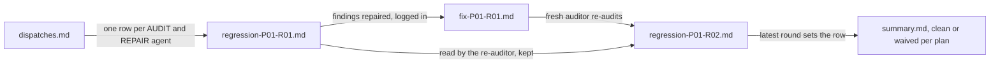
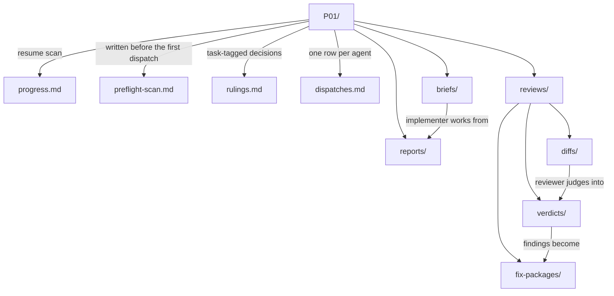
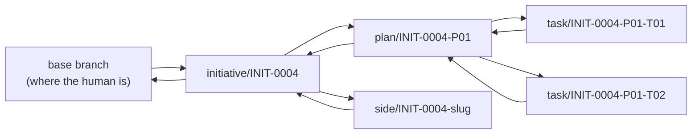

# Directory Layout

The exact structure of both Executor stores. Scripts and skills resolve
paths from this document; nothing invents a location.

## Thinking store — `docs/executor/` (git-tracked)

**Folder name:** `INIT-<NNNN>-<topic-slug>`. The slug is human-readable and
never load-bearing — every resolution goes through the ID.

**Brainstorm sessions live here, not in the execution store.** A session is
thinking — the options generated, the concepts explored, the attack on the
favorite, the human's pick — and it belongs beside the research it
produced. Each session is one directory named `<UTC-timestamp>-<topic>`;
every file in it has one writer, and every artifact feeds the record:

`session.md` is the deliverable; everything else is its evidence. Inside an
initiative a session carries an allocated ID — `exec-id INIT-0004 BRN` →
`INIT-0004-BRN-01` — and a Documents-table row in the initiative
`INDEX.md`.

**Pre-initiative sessions live at the store root.** A design session may
start before any initiative exists, under
`docs/executor/brainstorm/sessions/<UTC>-<topic>/`, with `id: null` and
`initiative: null`. When the idea becomes an initiative, intake adopts the
session: `git mv` it into the new initiative's `brainstorm/sessions/`,
allocate its `BRN` ID, set `initiative:`, and derive the charter from the
session's brief. A root-level session that was never adopted is an idea
that was explored and parked — legal, and checked by `exec-store-check`
like any other session.

**A declined brainstorm is recorded in the initiative `INDEX.md` — nowhere
else.** When ideation is considered at discovery entry and not needed, the
skip is a line in `INIT-NNNN-<slug>/INDEX.md` containing the word
"brainstorm" (the store check matches it case-insensitively), e.g.
`*Brainstorming considered at discovery entry: not needed — <reason>.*`
An empty `brainstorm/sessions/` with no such line is a contract violation,
not a neutral state — `exec-store-check` reports it, because nobody can
later tell a deliberate skip from one that was never considered.

The visual companion's operational state — `server-info`, the log, the pid,
and the persisted session key — is written to a runtime directory outside
the repository, never into a session directory. This store is public (see
[safety](safety.md)) and the session key is an access token.

**Document types and their directories:**

| Type | ID segment | Directory | Purpose |
|---|---|---|---|
| Charter | `CHTR` | initiative root (`charter.md`) | Problem, goals, non-goals, success criteria, scope |
| Research | `RSCH` | `discovery/` | Prior art, measurements, external sources |
| Options | `OPTS` | `discovery/` | Approaches compared, with a recommendation |
| Architecture | `ARCH` | `architecture/` | System structure, components, boundaries, data flow |
| Decision | `ADR` | `architecture/` | One decision: context, options, choice, consequences |
| Interface | `IFCE` | `architecture/` | Contracts between components — signatures, schemas, protocols |
| Design | `DSGN` | `design/` | One component's internals |
| Spec | `SPEC` | `specs/` | The requirements contract a plan argues from |
| Risk | `RISK` | `risks/` | Risk register, pre-mortem output |
| Verification | `VRFY` | `verification/` | Acceptance criteria and how they get proven |
| Plan | `P` | `plans/` | Tasks with steps, files, interfaces |
| Brainstorm | `BRN` | `brainstorm/sessions/<stamp>-<topic>/session.md` | A design dossier for a feature or use case, or a decision record for one open question |

## Execution store — `.executor/` (git-ignored by default, committable)

### Where each store's root resolves

The two stores anchor to different roots, and the difference matters the
moment a worktree is involved:

| Store | Root | Why |
|---|---|---|
| `docs/executor/` | **working-tree root** (`git rev-parse --show-toplevel`) | Tracked. Specs and plans must commit on the branch that produced them. |
| `.executor/` | **main repository root** (parent of `git rev-parse --git-common-dir`) | Untracked. Removing a worktree deletes everything inside it — anchoring the execution store to the worktree would let branch cleanup destroy the reports, verdicts, and rulings the Executor exists to keep. |

Outside a worktree the two roots are identical, so this is invisible in the
common case. Inside one, every worktree of the same repository shares a
single execution store. That is intended: plan IDs are unique repository-wide,
so two worktrees cannot collide, and a run started in a worktree stays
readable after that worktree is gone.

`exec-workspace` resolves this for you. Never build the path yourself.

The store root holds one directory per initiative; each initiative holds
its cross-plan artifacts beside its per-plan workspaces:

Plan regression runs in rounds, and no round overwrites another:

Each plan workspace separates the ledger files from the per-task artifacts
the dispatched agents read and write:

Every file name carries the ID of what it is about, so no two rounds or
tasks can collide:

| Location | Name pattern | Example |
|---|---|---|
| `plan-regression/` | `regression-P<nn>-R<nn>.md`, `fix-P<nn>-R<nn>.md` | `regression-P01-R02.md` |
| `briefs/` | `<TASK-ID>-brief.md`, `<TASK-ID>-context.md` | `INIT-0004-P01-T03-brief.md` |
| `reports/` | `<TASK-ID>-report.md` (fix rounds append) | `INIT-0004-P01-T03-report.md` |
| `reviews/diffs/` | `<TASK-ID>-R<nn>-<base>..<head>.diff`, `<PLAN-ID>-final-<base>..<head>.diff` | `INIT-0004-P01-T03-R02-d4e5f6a..b7c8d9e.diff` |
| `reviews/fix-packages/` | `<TASK-ID>-R<nn>-fix-package.md` | `INIT-0004-P01-T03-R02-fix-package.md` |
| `reviews/verdicts/` | `<TASK-ID>-R<nn>-verdict.md`, `<PLAN-ID>-final-verdict.md` | `INIT-0004-P01-final-verdict.md` |

**The initiative-level directory exists because plan-set artifacts need a
home.** Audits of *plans* (not code), repair passes applied to plan files,
rulings that bind later plans, and the gate summary all sit beside — never
inside — the per-plan workspaces. A `regression-P02-R01.md` inside
`P01/reviews/` is a misfiled artifact: it attributes a cross-plan judgment
to one plan's code review and becomes unfindable by every tool that walks
workspaces. `exec-plan-regression` resolves these paths; `exec-run check`
flags strays.

**Audit and repair files are round-suffixed, like verdicts.** A re-audit
verdicts every finding of the round before it, so it must be able to read
that round — `regression-P01-R02.md` is written beside `regression-P01-R01.md`,
never over it. A legacy unsuffixed `regression-P01.md` reads as round 1.

### Why each file exists

**`progress.md`** — the resume scan. It opens with YAML frontmatter
(`kind: ledger`, plan, plan_file, spec, created_at, updated_at), followed
by a **Task status table** — one row per task, state
(`pending | dispatched | in-fix | complete | parked`), commits, review,
notes — and a `## State changes` section holding one line per state change.
The resume scan reads the table first: a task with no row has never been
dispatched. A ledger whose `plan:` line names a different plan is not
yours. State-change lines append under `## State changes`, never between
table rows.

**`preflight-scan.md`** — the cross-task conflict table produced before Task
1 dispatches, with a ruling recorded beside every finding. The seed carries
a `## Scan` table (Tasks, Shared surface, Produced vs consumed, Finding,
Severity, Ruling) and a `## Method` block stating what was walked, so the
scan's scope is visible. A finding with no ruling is unresolved — do not
dispatch until every finding is ruled. Separated from the ledger because it
is written once and read whenever a task surprises you.

**`rulings.md`** — append-only, every decision made on the human's behalf,
with what it costs if wrong. Mirrored into `.local/decisions/` as each one
is written. This is the file that answers "why is it like this" a year
later.

**`dispatches.md`** — one line per subagent dispatch: task ID, role, model,
agent identity, start time, outcome, and the **Context** column naming the
brief and context files each agent received. Makes model-selection
decisions reviewable, lets a resumed controller find a live agent it can
resume rather than replacing, and answers "bad context or bad model?" with
one line when a run goes sideways.

**Agent identities are conventional.** The `Agent` column carries a
role-and-position name — never a generated handle. A resumed agent keeps
its identity; a fresh dispatch for a new round takes that round's suffix.
An `Agent` cell that drifts from the grammar is a defect the run check
reports. Every role, its identity grammar, and its prompt template are
listed in the [dispatch registry](#dispatch-registry).

**`briefs/`** — extracted task text, the single source of requirements for
one implementer. Never pasted through the controller's context.

**`reports/`** — implementer narrative. One file per task, appended to on
each fix round, so the file is the task's complete implementation history.

**`reviews/diffs/`** — the code artifact a reviewer reads. Named per review
round and commit range so a re-review never overwrites the diff its
predecessor saw.

**`verification/evidence/PNN/`** — raw observed output backing each VRFY
document's criteria rounds. This is the ONE deliberate exception to the
untracked rule, and it lives in the **tracked thinking store**:
`docs/executor/<initiative>/verification/evidence/PNN/` (one directory per
plan: `P01`, `P02`, ...). Written by `exec-evidence`:

- **`state-R<nn>.txt`** — the state under test for that round: branch,
  HEAD commit, tree dirtiness, timestamp. Stamped once per round per plan
  directory; a later round gets its own state file and never overwrites
  an earlier round's.
- **`<VRFY-id>-V<nn>-R<nn>-<method>.txt`** — one file per criterion per
  round: the command and its full observed output. Flat names, no
  per-round subdirectories; the round lives in the filename. A re-capture
  of the same criterion, method, and round writes a `-attempt2`,
  `-attempt3`, ... sibling — earlier proofs are never overwritten.

The VRFY outcomes table's **Evidence** column names these files, so a
reader can go from verdict → table → raw output. Evidence is tracked
because it is the *proof* a claim was proven — it commits on the branch
that produced it and survives worktree teardown (it lives in the thinking
store anchored to the working tree, and the main-root execution store never
holds it). Re-runs never overwrite: a new round writes a new `-R<nn>-`
file, and a repeat inside one round writes a new `-attemptN` sibling. The
newest capture is the truth; the VRFY outcomes table records the round it
cites.

**Every other artifact a run produces lives under `.executor/`.** Briefs,
context files, reports, diffs, verdicts, ledger, rulings, preflight,
dispatches — all of it. **Nothing else a run produces is ever written under
`docs/executor/`** except the thinking documents themselves (charter,
research, architecture, spec, plan, VRFY) and the evidence directory above.

The two stores are not interchangeable, and the reason is the worktree
survival contract: `docs/executor/` is tracked and commits on the branch
that produced it; `.executor/` is untracked and anchored to the main
repository root so removing a worktree cannot destroy the execution record.

A verdict, report, or brief that lands in `docs/executor/` is a
**contract violation**, not a style choice — it pollutes the tracked
thinking record with execution noise. Evidence is the named exception, not
a leak: it is thinking-grade proof, written by `exec-evidence` into
`verification/evidence/PNN/` — never hand-placed anywhere else.

The outcomes ledger itself is likewise thinking-grade: the VRFY document's
outcomes table records what was proven, and it is appended in
`docs/executor/` by executor-verification — verdicts together with their
cited evidence files, for anyone who clones the repo.

## Dispatch registry

Every subagent the workflow dispatches has exactly one row here: its role,
its identity grammar, the **dedicated prompt template** the controller
fills, and the log its dispatch row lands in. A dispatch whose role has no
row is not part of the workflow — add the row and its prompt template
first, then dispatch. `scripts/validate-skills.sh` enforces the table: every
template named here must exist and carry the dispatch contract (the
`Subagent` block with `agent_identity:` and `model:`, an `## Identity`
section, a `## What You Return` section, and a placeholders table), and
every `*-prompt.md` file must be named here.

| Role | Dispatched by | Identity | Prompt template | Logged in |
|---|---|---|---|---|
| `IMPL` — implementer | executor-execution | `IMPL-P01-T03` (a resumed fix round keeps it) | `executor-execution/implementer-prompt.md` | `<workspace>/dispatches.md` |
| `REVIEW` — task reviewer | executor-review | `REVIEW-P01-T03-R01` | `executor-review/task-reviewer-prompt.md` | `<workspace>/dispatches.md` |
| `REVIEW` — scoped re-reviewer | executor-review | `REVIEW-P01-T03-R02` (same round as the verdict it writes) | `executor-review/re-review-prompt.md` | `<workspace>/dispatches.md` |
| `REVIEW` — final whole-branch reviewer | executor-review | `REVIEW-P01-final` | `executor-review/final-reviewer-prompt.md` | `<workspace>/dispatches.md` |
| `VERIFY` — evidence runner | executor-verification | `VERIFY-P01-V03`; a re-run appends the round: `VERIFY-P01-V03-R02` | `executor-verification/evidence-runner-prompt.md` | `<workspace>/dispatches.md` |
| `AUDIT` — component auditor | executor-critique | `AUDIT-<component>-R01` | `executor-critique/component-auditor-prompt.md` | `.executor/<INIT>/critique/<component>/dispatches.md` |
| `REPAIR` — component repairer | executor-critique | `REPAIR-<component>-R01` (round = the audit it repairs) | `executor-critique/component-repairer-prompt.md` | `.executor/<INIT>/critique/<component>/dispatches.md` |
| `AUDIT` — component re-auditor | executor-critique | `AUDIT-<component>-R02` (round = the audit it writes) | `executor-critique/component-reauditor-prompt.md` | `.executor/<INIT>/critique/<component>/dispatches.md` |
| `AUDIT` — plan auditor | executor-plan-regression | `AUDIT-P02-R01` | `executor-plan-regression/plan-auditor-prompt.md` | `.executor/<INIT>/plan-regression/dispatches.md` |
| `REPAIR` — plan repairer | executor-plan-regression | `REPAIR-P02-R01` (round = the audit it repairs) | `executor-plan-regression/plan-repairer-prompt.md` | `.executor/<INIT>/plan-regression/dispatches.md` |
| `AUDIT` — plan re-auditor | executor-plan-regression | `AUDIT-P02-R02` (round = the audit it writes) | `executor-plan-regression/plan-reauditor-prompt.md` | `.executor/<INIT>/plan-regression/dispatches.md` |
| `SCOUT` — prior-art scout | executor-brainstorm | `SCOUT-BRN01` | `executor-brainstorm/prior-art-scout-prompt.md` | `<session>/dispatches.md` |
| `EXPLORE` — concept explorer | executor-brainstorm | `EXPLORE-BRN01-A` (one letter per concept) | `executor-brainstorm/concept-explorer-prompt.md` | `<session>/dispatches.md` |
| `CRITIC` — design critic | executor-brainstorm | `CRITIC-BRN01-R01` | `executor-brainstorm/design-critic-prompt.md` | `<session>/dispatches.md` |
| `AUTHOR` — phase artifact author | executor (controller dispatches; never writes the artifact itself) | `AUTHOR-<phase>` | `executor/author-prompt.md` | `<initiative dir>/dispatches.md` |
| `DECIDE` — decision answerer | executor | `DECIDE-<scope>` | `executor/decide-prompt.md` | `<workspace>/rulings.md` |
| `SUPERVISOR` — per-event adjudicator | executor | `SUPERVISOR-<scope>` | `executor/supervisor-prompt.md` | `<workspace>/rulings.md` |
| *(preamble, not a role)* — revive/redispatch instructions | executor, prepended to a re-dispatched worker | worker keeps its own identity | `executor/revive-preamble.md` | `<workspace>/dispatches.md` (ladder rung only) |

The grammar: `<ROLE>-<scope>[-<qualifier>][-R<nn>]`. The scope is the plan
segment (`P01`) for execution, review, verification, and plan regression;
the session's `BRN<nn>` for brainstorm — or the session's topic slug for a
pre-initiative session, which has no ID yet (`EXPLORE-tenant-onboarding-A`).

## Path resolution

Never hand-build a path. Use the scripts:

| Need | Script |
|---|---|
| Initiative folder from an ID | `../scripts/exec-initiative resolve INIT-0004` |
| Next free ID of a type | `../scripts/exec-id INIT-0004 ADR` |
| Plan's execution workspace | `../scripts/exec-workspace PLAN_FILE` |
| Task brief file | `../scripts/exec-brief PLAN_FILE N` |
| Task context file | `../scripts/exec-context PLAN_FILE N` |
| Run lifecycle in the registry | `../scripts/exec-run PLAN_FILE start\|task\|complete\|check\|pause\|blocked` |
| Plan gate lint | `../scripts/exec-plan-lint PLAN_FILE` |
| Branch lifecycle | `../scripts/exec-branch PLAN_FILE start\|status\|merge\|audit\|abandon` |
| Task branch lifecycle | `../scripts/exec-branch PLAN_FILE task start\|merge\|abandon TASK_ID [--worktree\|-f]` |
| Side / spike branches | `../scripts/exec-branch PLAN_FILE side\|spike start\|merge\|abandon SLUG [-f]` |
| Evidence file for a criterion | `../scripts/exec-evidence PLAN_FILE ROUND CRITERION METHOD` (reads observed output from stdin; writes the initiative's tracked `verification/evidence/PNN/`) |
| Review diff for a task or the branch | `../scripts/exec-review-package PLAN_FILE TASK BASE HEAD [ROUND]` (TASK = task number, or the literal `final`; ROUND defaults to `01`) |
| Secret scan before handoff | `../scripts/exec-scan-secrets [PATH]` |
| Plan-set regression artifacts | `../scripts/exec-plan-regression PLAN_FILE dir\|audit\|fix\|check\|init` |
| **The pump loop — one action per turn** | `../scripts/exec-step PLAN_FILE` (or `../scripts/exec-step INIT-NNNN`, or bare to scan every in-flight run) |
| Worker liveness and the revive ladder | `../scripts/exec-supervise PLAN_FILE [--all]` |
| Commit a worker's result through its gate | `../scripts/exec-report PLAN_FILE REPORT_FILE [BASE_SHA] [HEAD_SHA]` |
| Record a ruling, an unsolicited correction, or a stop | `../scripts/exec-ruling PLAN_FILE TASK_ID "<decision>" "<why>" "<cost>" [--answered "<q>" \| --unsolicited "<verbatim>" [--stop]]` |
| Decide whether a phase gate may clear without a human | `../scripts/exec-gate INIT_ID PHASE [--auto\|--policy]` |
| Audit a component's set, or check whether it may gate its phase | `../scripts/exec-critique INIT_ID COMPONENT dir\|catalog\|init\|audit [ROUND]\|repair [ROUND]\|latest\|check` |

Scripts resolve the plan's `id:` frontmatter field, not its filename, so
renaming a plan never orphans its workspace. A plan with no `id:` field is
pre-Executor: the workspace falls back to the file's basename.

## Markdown rendering rules

Every seeded and generated markdown file must render correctly in any
common renderer. Four rules keep that true:

1. **Generated markdown contains no HTML comments.** A comment between a
   table's header and its rows, or between two rows, splits the table in
   most renderers once rows are appended — and an unfilled comment is
   invisible evidence of an unfinished document. Guidance is written as
   visible italic lines; an unfilled one is a defect a reader can see.
2. **Appends never land inside a table.** Log-style lines (ledger state
   changes, dispatch entries) append either as table rows directly under
   the last row, or as list lines in their own section — never after a
   trailing note or a blank section end.
3. **Generated files open with YAML frontmatter** (see the frontmatter
   contract's execution-artifact section), so an agent reading one file
   cold can identify it without opening anything else.
4. **Every diagram is Mermaid; ASCII art is never a diagram.** Box-drawing
   trees (`├──`, `└──`, `│`) and hand-aligned arrow charts carry no
   structure a renderer or a reader can check — edges are implied by
   whitespace, relationships silently drop out, and nothing fails when
   they drift. Use a `mermaid` block (`flowchart` for hierarchy and
   process, `sequenceDiagram` for message exchange, `stateDiagram-v2` for
   lifecycle) with labeled edges, and a table when the content is a list
   of names. `scripts/validate-skills.sh` fails any box-drawing character in
   markdown — fenced blocks included — outside an inline code span.

## Branch model

One branch per artifact level, named after the artifact's ID, merged on
the gate its level requires. `references/branches.md` is normative;
`git branch --list` is the registry, and fork points are recorded in the
ledger and the initiative's `INDEX.md`.

| Script | Branch | Gate |
|---|---|---|
| `exec-initiative branch INIT-0004 [BASE]` | `initiative/INIT-0004`, forked from BASE (default: current HEAD); fork point recorded in `INDEX.md` | none — creating it is cheap and reversible |
| `exec-branch PLAN start` | `plan/INIT-0004-P01`, forked from the initiative branch | initiative branch must exist |
| `exec-branch PLAN task start TASK_ID [--worktree]` | `task/INIT-0004-P01-T03`, forked from the **plan branch tip**; branch and fork commit recorded in the ledger | plan branch must exist; clean tree |
| `exec-branch PLAN task merge TASK_ID` | task branch → plan branch, `--no-ff` | the task's latest R-verdict is clean (`spec_verdict: PASS` or `null`, `quality: APPROVED`) |
| `exec-branch PLAN task abandon TASK_ID [-f]` | delete the task branch | refuses when it carries unmerged commits unless `-f` |
| `exec-branch PLAN merge` | plan branch → initiative branch, `--no-ff` (per-task merges preserved) | full audit: registry consistent, a verdict per completed task, final verdict present |
| `exec-branch PLAN abandon` | delete the plan branch | refuses when the branch carries unmerged commits unless `-f` |
| `exec-branch PLAN side start\|merge\|abandon SLUG` | `side/INIT-0004-<slug>`, forked from the initiative branch | merge requires an initiative ruling naming the slug |
| `exec-branch PLAN spike start\|abandon SLUG` | `spike/INIT-0004-<slug>`, forked from the initiative branch | never merges |

A plan declaring `sequential: true` skips task branches: its tasks commit
directly to the plan branch, and `exec-plan-lint` requires the dependency
chain to justify the flag.

Plan and task branches never fork from `main` and never merge to `main` —
the initiative branch is the only integration line, and merging it onward
is the human's decision at handoff. `hotfix/<slug>` is the one branch
outside the hierarchy: it forks from the base branch and merges back to it,
because an urgent fix must not wait for an initiative.

## What is never deleted

Nothing in either store is deleted by a skill. When a plan finishes, its
workspace is marked complete in `.executor/INDEX.md` and left in place. When
an initiative finishes, its folder is marked complete in
`docs/executor/INDEX.md` and left in place.

Pruning is a human decision, taken deliberately, never a cleanup step.
