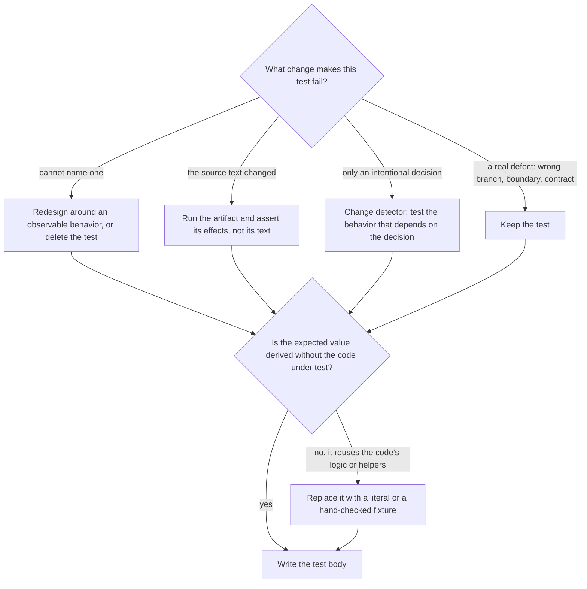

# Test Quality Doctrine

**Load this reference when:** writing any test, reviewing any diff that
contains tests, writing or changing mocks, or adding test helpers and
fixtures. This is the doctrine the implementer follows and the reviewer
grades against.

## Overview

A test exists to catch a specific break. Two principles govern everything
here:

```text
1. Every test names the break it catches.
2. Every test exercises the real thing.
```

Strict TDD produces both naturally: a test written first and watched
failing against real code has already proven it can fail, and only earns a
mock when the real dependency proves slow or external.

**A test that cannot fail, or that can only fail by accident, is not a
test — it is a restatement of the implementation wearing test syntax.**

**Violating the letter of the TDD rules is violating the spirit of them.**
The rule covers exact phrases, paraphrases, and any workflow that leaves
production code without a watched failing test.

## Principle 1: Name the Break

Before writing the test body, answer out loud (in the plan or the report):

**What production change should make this test fail — and is that change a
bug or a decision?**

A test earns its place by catching a wrong branch, a missing side effect,
a wrong argument, a boundary case, or a broken contract. If the only thing
that can fail it is a deliberate design change, it is a **change detector**
— it fires on redesign and sleeps through real bugs.

### The Break-Naming Gate

Before writing the test body, name the production change that would make
this test fail — then route on the answer:



A change detector in practice: not `expect(MAX_RETRIES).toBe(5)`, but a
failing call is retried five times and the sixth attempt never happens.

### Derive expectations independently

An expectation computed by the code under test — or its helpers — passes
no matter what that code does:

```typescript
// WRONG - mirror assertion: the same builder computes both sides.
// This always passes and catches nothing.
const expected = buildSearchQuery({ tag: 'urgent' });
expect(buildSearchQuery({ tag: 'urgent' })).toBe(expected);

// RIGHT - hand-derived literal
expect(buildSearchQuery({ tag: 'urgent' })).toBe('tag:"urgent"');
```

Table-driven tests with literal `want` values are the preferred shape. A
fixture with hand-checked values is second best. If you cannot derive the
expected value by hand, you do not understand the behavior well enough to
test it — that understanding is the deliverable, not the test.

### Behavior, not text

Asserting that a script, config, or document contains an exact line proves
only that the source is the source. Run scripts against controlled inputs
and assert outputs, side effects, or exit codes. Assert the rendered
behavior of a template, not the template's text.

### Your code, not the framework

Test the contract **your** code makes at its boundaries — the route you
register, the query you emit, the payload you produce. Do not test the
mechanics of the framework underneath: asserting that the router invokes a
registered handler is the router's test, not yours. When upstream behavior
genuinely surprised you, write one narrow characterization test naming the
assumption — and say in a comment what upstream change would break it.

The same boundary applies inside your code: constructors, getters,
constants, and trivial forwarding earn tests only when they validate,
normalize, default, derive, enforce, or cause side effects. Otherwise
assert the first consumer-visible result that depends on them.

## Principle 2: Exercise the Real Thing

**The mock earns no assertions.** A mock assertion passes when the mock is
present and fails when it is absent — it says nothing about your
component. Assert the real component's behavior; if the mock is what you
are checking, unmock it or delete the assertion.

```typescript
// WRONG - testing the existence of a mock
expect(screen.getByTestId('sidebar-mock')).toBeInTheDocument();

// RIGHT - testing real rendered behavior
expect(screen.getByRole('navigation')).toBeInTheDocument();
```

### The Mock Gate

```text
BEFORE adding a mock or a test helper:
  1. List the real method's side effects.
  2. Keep every side effect the test depends on REAL.
  3. Mock only the slow or external operation one level below them.
  4. Give each branch (success, error, malformed) its own fixture or spy,
     so the wrong branch cannot satisfy the expectation.
  5. Mirror the real data structure COMPLETELY - every documented field,
     not only the ones this test reads. Partial mocks fail silently when
     downstream code reads an omitted field: the test passes while the
     integration breaks.
  6. If mock setup outgrows the test logic, or the mock keeps missing
     methods the real component has, switch to an integration test with
     real components.

  The mock earns no assertions. Assert the real component.
```

Before replacing a real method, learn its side effects by running the test
against the real implementation once. When unsure what needs mocking, the
answer is: run it real first, observe what actually happens, then mock the
smallest external thing.

### Production classes carry production methods only

Cleanup that only tests need lives in test utilities, never as a method on
the production class. Ask of every method you add: is this called only
from tests? Does this class own this resource's lifecycle? Wrong answers →
test utility.

### Prefer real components over complex mocks

When mock setup outgrows the test logic, mocks miss methods the real
components have, or tests break when the mock changes, switch to an
integration test with real components. A good integration test beats an
elaborate mock cathedral every time.

## Reading Tests as Design Signals

| Signal | Meaning | Fix |
|---|---|---|
| You don't know how to test it | You don't know the wished-for API | Write the assertion first, in the API you wish existed |
| The test is too complicated | The design is too complicated | Simplify the interface, not the test |
| You must mock everything | The code is too coupled | Use dependency injection; inject the clock, the store, the transport |
| Test setup is huge | Too many collaborators | Extract fixtures/helpers; still huge → the design is telling you something |
| Every change breaks unrelated tests | Tests assert implementation, not behavior | Rewrite against observable behavior |

## The TDD Cycle

```text
RED       Write ONE minimal test for ONE behavior. Real code, no mocks
          unless unavoidable. Clear name describing the behavior.
VERIFY RED  Run it. It MUST fail - and fail the EXPECTED way
          (feature missing, not a typo, not an import error).
          Passes immediately? You are testing existing behavior -
          rewrite the test. Errors? Fix the error until it FAILS correctly.
GREEN     Write the MINIMAL code that passes. No features, no "while
          I'm here", no abstraction the test did not demand.
VERIFY GREEN  Run it again. Passes, all other tests still pass, output
          pristine (no warnings, no noise). Other tests fail? Fix now.
REFACTOR  Only after green: remove duplication, improve names, extract
          helpers. Keep the tests green. Add no behavior.
REPEAT    Next failing test for the next behavior.
```

### RED evidence is the deliverable

The failing output is not an inconvenience on the way to green — it is
the proof that the test can fail, which is the only thing that makes green
meaningful later. Every task report carries RED evidence: the command, the
failing output, and why that failure was the expected one. A report with
GREEN-only evidence has not proven its tests can catch anything.

## Rationalizations — and what each one costs

| Excuse | Reality |
|---|---|
| "Too simple to test" | Simple code breaks. The test takes 30 seconds; the bug it would have caught takes an afternoon. |
| "I'll test after" | Tests written after pass immediately, which proves nothing — they verify the cases you remembered, biased by the code you already wrote. You never watched it fail, so you never proved it can catch the bug. |
| "Tests after achieve the same goals" | Tests-after answer "what does this do?"; tests-first answer "what should this do?" Coverage without proof the tests work is not the same goal. |
| "Already manually tested" | Manual testing is ad-hoc: no record, no re-run, forgotten cases under pressure. "Worked when I tried it" is not coverage. |
| "Deleting X hours is wasteful" | Sunk cost. The time is spent either way. The real choice: rewrite with TDD (high confidence) vs. keep untrusted code and bolt tests on (low confidence). |
| "Keep it as reference while writing tests first" | You will adapt it. That is testing after. Delete means delete. |
| "Need to explore first" | Fine — explore, keep nothing, then start with TDD. Exploration output is an answer, not production code. |
| "TDD will slow me down" | TDD is the fast path: bugs caught before commit, regressions caught forever, refactoring without fear. The slow path is debugging in production. |
| "The test is too hard to write" | Listen to the test: hard-to-test means hard-to-use. Fix the design. |
| "Just this once" | The exception is the failure mode. No exceptions without the human's explicit approval, recorded. |

## Red Flags — STOP and go back to RED

- Code exists before the test
- The test passed immediately and you kept it
- You cannot say why the test failed before it passed
- Tests are being added "later" or "as a follow-up"
- "This is different because…"
- You are negotiating with the cycle instead of running it

**All of these mean: delete the code, start over from RED.** At the
Executor's review gate this surfaces as a spec-compliance finding — the
cheapest possible place to learn it.
