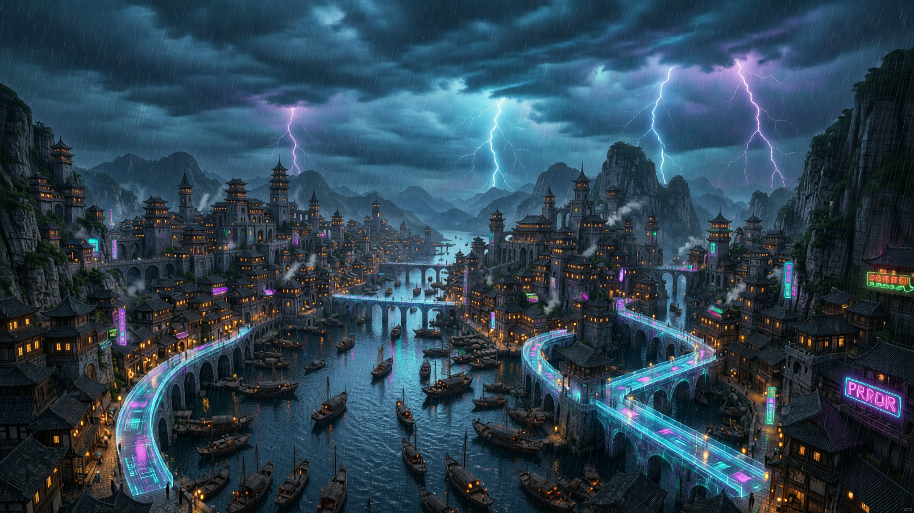

<!--
╔══════════════════════════════════════════════════════════════════════╗
║  DreamSeed 种梦计划 — AI创造者大赛  官方 README 模板                ║
║                                                                      ║
║  使用说明：                                                          ║
║  1. 将本模板放在参赛仓库根目录 README.md 的顶部                       ║
║  2. 头图使用 DreamField 官方公开活动图片地址                         ║
║  3. 请保留 DREAMFIELD_README_HEADER_START / END 标识                 ║
║  4. 分割线以下供创作者自由编写项目内容                               ║
╚══════════════════════════════════════════════════════════════════════╝
-->

<!-- DREAMFIELD_README_HEADER_START -->

<p align="center">
  <a href="https://www.dreamfield.top">
    
  </a>
</p>

<!-- DREAMFIELD_README_HEADER_END -->


<div align="center">


# VisionCraft

**A Claude Code skill for generating images & cinematic videos via Agnes AI APIs.**

通过 Agnes AI 接口生成图像与电影级视频的 Claude Code 技能。

[](LICENSE)
[](#)
[](#)
[](#)

**English** · [中文](#visioncraft-中文文档)

</div>

---

VisionCraft is a [Claude Code](https://claude.com/claude-code) skill that turns natural-language requests into production-ready images and videos. Ask Claude to *"make a poster for my coffee shop"*, *"animate this photo"*, or *"create a smooth transition between these two scenes"* — and VisionCraft drives the Agnes AI APIs for you.

It ships with battle-tested PowerShell scripts that handle every workflow: text-to-image, image-to-image, text-to-video, image-to-video, multi-image video, and **keyframe animation** (smooth morphing between two reference frames).

## ✨ Highlights

- 🎨 **Image generation** — text-to-image & image-to-image (style transfer, scene reshaping, local edits) up to **4096×4096**
- 🎬 **Video generation** — text-to-video, image-to-video, multi-image, and **keyframe animation** up to **1080p / 60fps**
- 🪄 **Keyframe animation** — the headline feature: give it two images and it generates the smooth transition between them
- ⚡ **Zero-config defaults tuned for quality** — 1080p / 60fps / ultra-smooth video out of the box
- 🧱 **Robust by design** — friendly error messages, automatic polling, timeout recovery, JSON-validated requests
- 🔒 **Key-safe** — your API key stays in an environment variable, never in code or git
- 🪟 **Windows-first** — idiomatic PowerShell 7+ scripts

## 📦 What's inside

```
visioncraft-skill/
├── SKILL.md                  # Skill instructions Claude reads (triggers + workflow)
├── scripts/
│   ├── gen_image.ps1         # Image generation (text-to-image / image-to-image)
│   └── gen_video.ps1         # Video generation (4 modes) + async polling
├── references/
│   ├── api_docs.md           # Full Agnes API reference (image + video)
│   ├── prompt-guide.md       # Prompt structure & best practices
│   └── parameters.md         # Every script parameter, with examples
├── examples/                 # Copy-paste ready example commands
├── docs/images/              # Logo & sample outputs
├── CHANGELOG.md
├── CONTRIBUTING.md
├── LICENSE
└── README.md                 # You are here
```

## 🚀 Quick Start

### 1. Get an Agnes API key

Obtain a key from the Agnes AI platform, then set it as an environment variable (one-time, permanent):

```powershell
[System.Environment]::SetEnvironmentVariable("AGNES_API_KEY", "sk-your-key-here", "User")
```

Or for the current session only:

```powershell
$env:AGNES_API_KEY = "sk-your-key-here"
```

> 🔑 **Never** hardcode your key in a script or commit it to git. VisionCraft reads it exclusively from `$env:AGNES_API_KEY`.

### 2. Install the skill

Copy this folder into your Claude Code skills directory:

```
<claude-skills-dir>/visioncraft/
```

Then restart Claude Code (or run `/skills`) so it picks up the new skill.

### 3. Generate your first image

In Claude Code, just describe what you want:

> *"Generate a poster of a futuristic city marketplace with flying vehicles and neon lighting."*

Claude will invoke VisionCraft and return the image URL. That's it — you're generating.

## 🎨 Usage

VisionCraft is designed to be driven by natural language, but every action maps to a PowerShell script you can also run directly.

### Generate an image

```powershell
.\scripts\gen_image.ps1 -Prompt "A luminous floating city above a misty canyon at sunrise, cinematic realism"
```

### Transform an existing image (image-to-image)

```powershell
.\scripts\gen_image.ps1 -Prompt "Transform into a rain-soaked cyberpunk night with neon reflections, preserve original composition" `
    -ImageUrl "https://example.com/input.png"
```

### Generate a video (text-to-video)

```powershell
.\scripts\gen_video.ps1 -Prompt "A cinematic shot of a cat walking on the beach at sunset, warm golden lighting"
```

### Animate a photo (image-to-video)

```powershell
.\scripts\gen_video.ps1 -Prompt "The woman slowly turns around and looks back at the camera" -Image "https://example.com/photo.jpg"
```

### 🔥 Keyframe animation (the headline feature)

Give it two keyframes and it generates the smooth cinematic transition between them:

```powershell
.\scripts\gen_video.ps1 -Prompt "Smooth cinematic transition between the two keyframes, consistent character identity" `
    -Image "https://example.com/a.png","https://example.com/b.png" -Mode keyframes
```

> Multiple image URLs are comma-separated. **Keyframe animation requires `-Mode keyframes`** — otherwise multi-image input is treated as regular multi-image video.

<div align="center">

<table>
  <tr>
    <td align="center" width="50%">
      <b>① Text-to-Image</b><br>
      
    </td>
    <td align="center" width="50%">
      <b>② Image-to-Image</b><br>
      
    </td>
  </tr>
</table>

<em>Left: a text-to-image concept. Right: the same scene re-imagined via image-to-image (cyberpunk night) — one prompt, two workflows.</em>

</div>

## ⚙️ Parameters

### Image — `gen_image.ps1`

| Parameter | Description | Default |
|-----------|-------------|---------|
| `-Prompt` | Image description **(required)** | — |
| `-Ratio` | Aspect ratio shortcut: `1:1` `16:9` `9:16` `4:3` `3:4` `3:2` `2:3` `21:9` | *(none — use `-Size` or `-Ratio`)* |
| `-Size` | Output dimensions, e.g. `2048x2048`, `2048x1152` | `2048x2048` |
| `-ImageUrl` | Input image URL (enables image-to-image) | none |
| `-ReturnBase64` | Return Base64 instead of a URL | off |

> 💡 `-Ratio` overrides `-Size` with a sensible 2K resolution. Prefer `-Ratio` over hand-typing `-Size`.

### Video — `gen_video.ps1`

| Parameter | Description | Default |
|-----------|-------------|---------|
| `-Prompt` | Video description **(required)** | — |
| `-Image` | Input image URL(s): 1 = image-to-video, 2+ = multi-image/keyframes | none |
| `-Mode` | `multi-image` (default) \| `keyframes` | `multi-image` |
| `-Ratio` | Aspect ratio shortcut: `16:9` `9:16` `1:1` `4:3` `3:4` | *(none — uses `-Width`/`-Height`)* |
| `-Seconds` | Duration in seconds — auto-computes a valid `NumFrames` | *(none — uses `-NumFrames`)* |
| `-Width` / `-Height` | Resolution (ignored when `-Ratio` is set) | `1920` / `1080` |
| `-NumFrames` | Frame count (must be `8n+1`, ≤ 441; ignored when `-Seconds` is set) | `241` |
| `-FrameRate` | FPS, 1–60 | `60` |
| `-Seed` | Random seed for reproducible results | none |
| `-NegativePrompt` | What to avoid | none |

#### Duration cheat-sheet

The easiest way: use `-Seconds`. It auto-computes a valid frame count for you.

```powershell
# 8-second vertical short-form video
.\scripts\gen_video.ps1 -Prompt "..." -Ratio 9:16 -Seconds 8
```

| Target | Recommended flags |
|--------|-------------------|
| ~4s, 60fps ultra-smooth *(default)* | *(no flags needed)* |
| ~8s, 30fps | `-Seconds 8 -FrameRate 30` |
| ~10s, 24fps cinematic | `-Seconds 10 -FrameRate 24` |
| ~7s, 60fps maximum length | `-Seconds 7` (auto-caps at 441 frames) |

> Or use raw flags: `-NumFrames 241 -FrameRate 60` for ~4s, `-NumFrames 441 -FrameRate 24` for ~18s max.

## 🧠 Prompt Tips

**Images:** `[Subject] + [Scene] + [Style] + [Lighting] + [Composition] + [Quality]`

> *"A luminous floating city above a misty canyon at sunrise, cinematic realism, wide-angle composition, rich architectural details, soft golden light, high visual density"*

**Videos:** `[Subject] + [Action] + [Scene] + [Camera Movement] + [Lighting] + [Style]`

> *"A young astronaut walking across a red desert planet, dust blowing in the wind, slow cinematic tracking shot, dramatic sunset lighting, realistic sci-fi style"*

For image-to-image, always state both **what to change** and **what to preserve**.

## 🔧 Troubleshooting

| Error | Likely cause | Fix |
|-------|-------------|-----|
| `400 Bad Request` | Missing/invalid params, bad size format | Check prompt, `-Size`, `num_frames` rule (`8n+1`) |
| `401 Unauthorized` | Invalid or expired API key | Re-verify `$env:AGNES_API_KEY` |
| `404 Not Found` | Wrong endpoint or `video_id` | Check URL / video_id format |
| `500 / 503` | Server-side / rate-limited | Wait 30s and retry |
| Video "still processing after 15 min" | High-res render is slow | The script prints the `video_id` — re-query it later |

## 💰 Pricing

| Resource | Standard | Current |
|----------|----------|---------|
| Image | $0.003 / image | $0.003 / image |
| Video | $0.005 / second | **$0 / second (promo)** |

## 📋 Requirements

- Windows + [PowerShell 7+](https://github.com/PowerShell/PowerShell)
- A valid Agnes AI API key
- [Claude Code](https://claude.com/claude-code) (the skill host)

## 📄 License

[MIT](LICENSE) © BAI-32

---

# 🇨🇳 VisionCraft 中文文档

[English](#visioncraft) · **中文**

<div align="center">


**通过 Agnes AI 接口生成图像与电影级视频的 Claude Code 技能。**

</div>

VisionCraft 是一个 [Claude Code](https://claude.com/claude-code) 技能,把自然语言请求变成可用的图像和视频。你只需对 Claude 说 *"给我的咖啡店做张海报"*、*"让这张照片动起来"* 或 *"在这两个场景之间做个平滑过渡"* —— VisionCraft 就会替你驱动 Agnes AI 接口。

它附带经过实战打磨的 PowerShell 脚本,覆盖全部工作流:文生图、图生图、文生视频、图生视频、多图视频,以及**关键帧动画**(两张参考帧之间的平滑变形)。

## ✨ 特性

- 🎨 **图像生成** —— 文生图与图生图(风格迁移、场景重塑、局部编辑),最高 **4096×4096**
- 🎬 **视频生成** —— 文生视频、图生视频、多图视频、**关键帧动画**,最高 **1080p / 60fps**
- 🪄 **关键帧动画** —— 招牌功能:给两张图,生成它们之间的平滑过渡
- ⚡ **开箱即用的高质量默认值** —— 默认就是 1080p / 60fps 极致丝滑视频
- 🧱 **稳健设计** —— 友好错误提示、自动轮询、超时恢复、JSON 校验请求
- 🔒 **密钥安全** —— API Key 只存在环境变量里,绝不进代码或 git
- 🪟 **Windows 优先** —— 地道的 PowerShell 7+ 脚本

## 🚀 快速开始

### 1. 获取 Agnes API Key

从 Agnes AI 平台获取密钥,然后设为环境变量(一次性,永久生效):

```powershell
[System.Environment]::SetEnvironmentVariable("AGNES_API_KEY", "sk-your-key-here", "User")
```

或仅当前会话:

```powershell
$env:AGNES_API_KEY = "sk-your-key-here"
```

> 🔑 **绝不要**把密钥写进脚本或提交到 git。VisionCraft 只从 `$env:AGNES_API_KEY` 读取。

### 2. 安装技能

把本文件夹复制到 Claude Code 的技能目录:

```
<claude-skills-dir>/visioncraft/
```

然后重启 Claude Code(或运行 `/skills`)加载新技能。

### 3. 生成第一张图

在 Claude Code 里直接描述需求:

> *"生成一张赛博朋克未来城市集市的海报,有飞行器和霓虹灯。"*

Claude 会调用 VisionCraft 并返回图片 URL。就这样,你已经开始创作了。

## 🎨 用法

VisionCraft 设计为用自然语言驱动,但每个操作也对应一个可直接运行的 PowerShell 脚本。

### 生成图片(文生图)

```powershell
.\scripts\gen_image.ps1 -Prompt "日出时分悬浮在雾霭峡谷上方的发光城市,电影级写实"
```

### 改造图片(图生图)

```powershell
.\scripts\gen_image.ps1 -Prompt "转换成霓虹灯雨夜赛博朋克风,保留原构图" `
    -ImageUrl "https://example.com/input.png"
```

### 生成视频(文生视频)

```powershell
.\scripts\gen_video.ps1 -Prompt "电影级镜头:一只猫在日落海滩漫步,暖金色光线"
```

### 让照片动起来(图生视频)

```powershell
.\scripts\gen_video.ps1 -Prompt "女子缓缓转身回望镜头" -Image "https://example.com/photo.jpg"
```

### 🔥 关键帧动画(招牌功能)

给两张关键帧,生成它们之间的平滑电影级过渡:

```powershell
.\scripts\gen_video.ps1 -Prompt "两个关键帧之间的平滑电影级过渡,人物身份一致" `
    -Image "https://example.com/a.png","https://example.com/b.png" -Mode keyframes
```

> 多个图片 URL 用逗号分隔。**关键帧动画必须加 `-Mode keyframes`**,否则多图输入会被当作普通多图视频处理。

## ⚙️ 参数

### 图像 —— `gen_image.ps1`

| 参数 | 作用 | 默认 |
|------|------|------|
| `-Prompt` | 图片描述 **(必填)** | — |
| `-Ratio` | 比例快捷:`1:1` `16:9` `9:16` `4:3` `3:4` `3:2` `2:3` `21:9` | *(不填则用 `-Size`)* |
| `-Size` | 输出尺寸,如 `2048x2048`、`2048x1152` | `2048x2048` |
| `-ImageUrl` | 输入图 URL(启用图生图) | 无 |
| `-ReturnBase64` | 返回 Base64 而非 URL | 关 |

> 💡 `-Ratio` 覆盖 `-Size`,自动选 2K 分辨率。推荐用 `-Ratio` 代替手写 `-Size`。

### 视频 —— `gen_video.ps1`

| 参数 | 作用 | 默认 |
|------|------|------|
| `-Prompt` | 视频描述 **(必填)** | — |
| `-Image` | 输入图 URL:1 个=图生视频,多个=多图/关键帧 | 无 |
| `-Mode` | `multi-image`(默认)\| `keyframes` | `multi-image` |
| `-Ratio` | 比例快捷:`16:9` `9:16` `1:1` `4:3` `3:4` | *(不填则用 `-Width`/`-Height`)* |
| `-Seconds` | 时长(秒)——自动算合法 `NumFrames` | *(不填则用 `-NumFrames`)* |
| `-Width` / `-Height` | 分辨率(设了 `-Ratio` 则忽略) | `1920` / `1080` |
| `-NumFrames` | 帧数(必须 `8n+1`,≤ 441;设了 `-Seconds` 则忽略) | `241` |
| `-FrameRate` | 帧率 1–60 | `60` |
| `-Seed` | 随机种子,可复现结果 | 无 |
| `-NegativePrompt` | 要避免的内容 | 无 |

#### 时长速查表

最简单的方式:用 `-Seconds`。它会自动计算合法帧数。

```powershell
# 8 秒竖屏短视频
.\scripts\gen_video.ps1 -Prompt "..." -Ratio 9:16 -Seconds 8
```

| 目标 | 推荐参数 |
|------|----------|
| ~4 秒 / 60fps 极致丝滑 *(默认)* | *(不需要额外参数)* |
| ~8 秒 / 30fps | `-Seconds 8 -FrameRate 30` |
| ~10 秒 / 24fps 电影感 | `-Seconds 10 -FrameRate 24` |
| ~7 秒 / 60fps 最长 | `-Seconds 7`(自动上限 441 帧) |

> 也可以直接写原始参数: `-NumFrames 241 -FrameRate 60` 约 4 秒,`-NumFrames 441 -FrameRate 24` 约 18 秒最长。

## 🧠 提示词技巧

**图片:** `[主体] + [场景] + [风格] + [光照] + [构图] + [质量]`

**视频:** `[主体] + [动作] + [场景] + [镜头运动] + [光照] + [风格]`

图生图时,务必同时写明**要改什么**和**要保留什么**。

## 🔧 常见问题

| 错误 | 可能原因 | 解决 |
|------|---------|------|
| `400 Bad Request` | 参数缺失/格式错 | 检查 prompt、`-Size`、`num_frames` 规则(`8n+1`) |
| `401 Unauthorized` | API Key 失效 | 重新确认 `$env:AGNES_API_KEY` |
| `404 Not Found` | 端点或 `video_id` 错 | 检查 URL / video_id 格式 |
| `500 / 503` | 服务端 / 限流 | 等 30 秒重试 |
| 视频"15 分钟仍在处理" | 高分辨率渲染慢 | 脚本会打印 `video_id`,之后手动重查 |

## 💰 价格

| 资源 | 标准价 | 当前价 |
|------|--------|--------|
| 图像 | $0.003 / 张 | $0.003 / 张 |
| 视频 | $0.005 / 秒 | **$0 / 秒(促销)** |

## 📋 环境要求

- Windows + [PowerShell 7+](https://github.com/PowerShell/PowerShell)
- 有效的 Agnes AI API Key
- [Claude Code](https://claude.com/claude-code)(技能宿主)

## 📄 许可证

[MIT](LICENSE) © BAI-32
