# Mermaid Diagramming in Obsidian

Obsidian has built-in Mermaid support. Use fenced code blocks with `mermaid` language identifier.

For common syntax (styling, comments, themes), see [reference.md](reference.md).

## ⚠️ Obsidian-Specific Constraints

**Rendering Differences**: Obsidian's Mermaid version may lag behind mermaid.js releases. Some cutting-edge features may not work.

**Theme Interaction**: Diagram colors adapt to Obsidian theme. Use explicit styles for consistent appearance across themes.

**Performance**: Very large diagrams (50+ nodes) may slow down rendering. Split into multiple diagrams if needed.

**Export**: PDF export converts diagrams to images. For external sharing, capture as PNG/SVG.

**No JavaScript**: Click events and JavaScript callbacks are disabled for security.

---

## Diagram Selection Guide

| Use Case | Diagram Type | Keyword |
|----------|--------------|---------|
| Process flow, decision trees | Flowchart | `flowchart` |
| API calls, message passing | Sequence | `sequenceDiagram` |
| OOP design, relationships | Class | `classDiagram` |
| Project timeline, scheduling | Gantt | `gantt` |
| State machine, lifecycle | State | `stateDiagram-v2` |
| Git branching strategy | Gitgraph | `gitGraph` |
| Brainstorming, hierarchies | Mindmap | `mindmap` |
| Proportions, percentages | Pie Chart | `pie` |
| Database schema, entities | ER Diagram | `erDiagram` |
| User experience steps, satisfaction | User Journey | `journey` |
| Historical events, milestones | Timeline | `timeline` |
| Priority matrix, 2D positioning | Quadrant Chart | `quadrantChart` |
| Flow visualization, proportional bands | Sankey Diagram | `sankey-beta` |
| Numerical data visualization | XY Chart | `xychart-beta` |
| Precise element positioning, layouts | Block Diagram | `block-beta` |
| Cloud services, service relationships | Architecture | `architecture-beta` |

---

## Quick Start Examples

### Flowchart

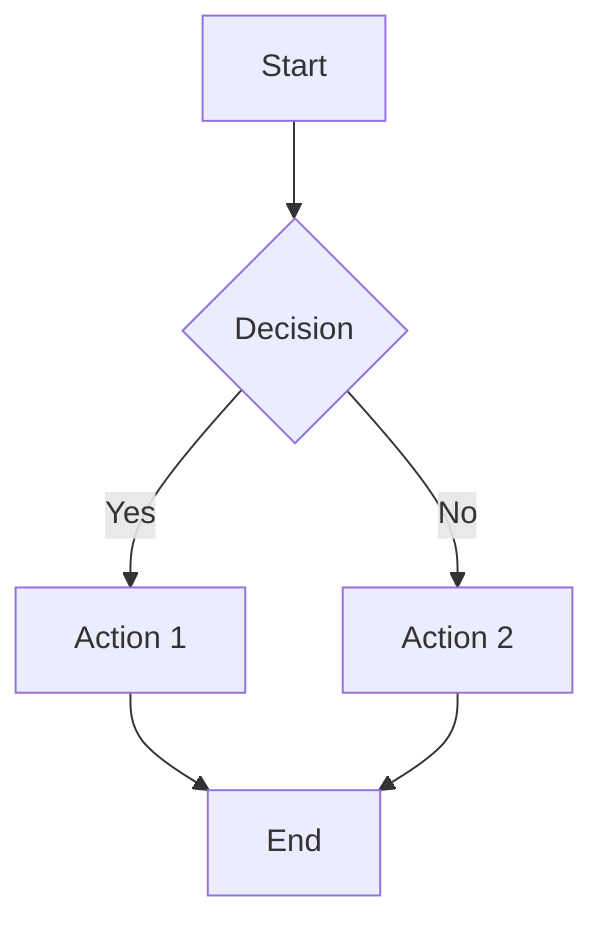

**Key syntax:**
- Direction: `TD` (top-down), `LR` (left-right), `BT`, `RL`
- Shapes: `[rect]`, `(rounded)`, `{diamond}`, `[(cylinder)]`, `((circle))`
- Arrows: `-->`, `-.->` (dotted), `==>` (thick)
- Labels: `-->|text|` or `-- text -->`

For details: [flowchart.md](flowchart.md)

---

### Sequence Diagram

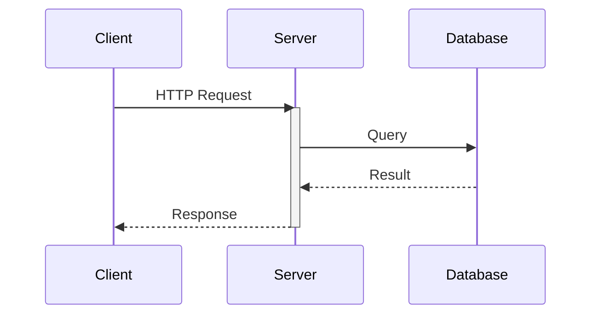

**Key syntax:**
- Arrows: `->>` (sync), `-->>` (response), `-)` (async)
- Activation: `activate`/`deactivate` or `+`/`-` suffix
- Control: `loop`, `alt`/`else`, `opt`, `par`/`and`, `critical`
- Notes: `Note right of A: text`, `Note over A,B: text`

For details: [sequence.md](sequence.md)

---

### Class Diagram

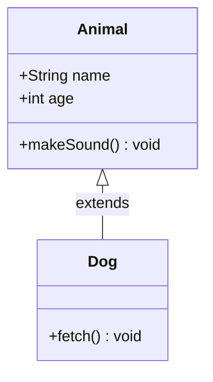

**Key syntax:**
- Visibility: `+` public, `-` private, `#` protected, `~` package
- Relations: `<|--` inheritance, `*--` composition, `o--` aggregation, `-->` association
- Methods: `+method(args) returnType`

For details: [class-diagram.md](class-diagram.md)

---

### Gantt Chart

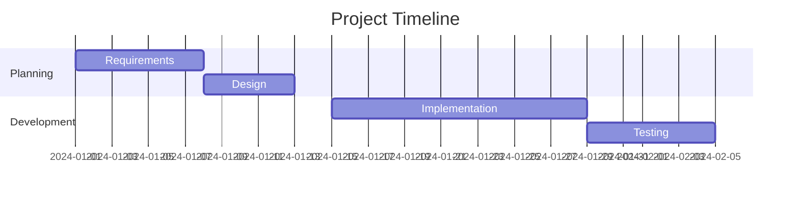

**Key syntax:**
- `dateFormat`: Date format (YYYY-MM-DD, etc.)
- Tasks: `name :id, start, duration` or `name :after id, duration`
- Modifiers: `done`, `active`, `crit`, `milestone`

For details: [gantt.md](gantt.md)

---

### State Diagram

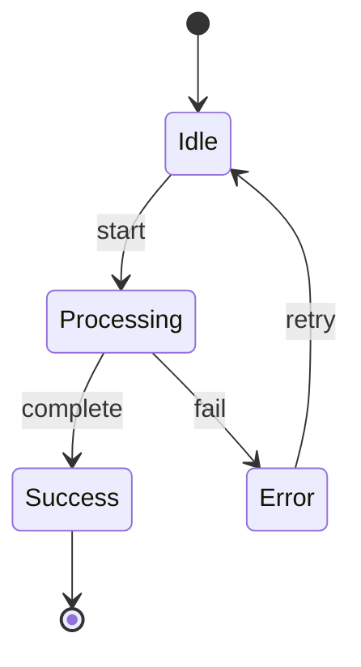

**Key syntax:**
- Start/End: `[*]`
- Transition: `State1 --> State2 : event`
- Composite: `state Name { ... }`
- Fork/Join: `state fork_name <<fork>>`, `<<join>>`

For details: [state.md](state.md)

---

### Gitgraph

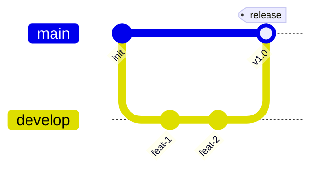

**Key syntax:**
- `commit`: Add commit, optional `id:`, `tag:`, `type:`
- `branch name`: Create branch
- `checkout name`: Switch branch
- `merge name`: Merge branch

For details: [gitgraph.md](gitgraph.md)

---

### Mindmap

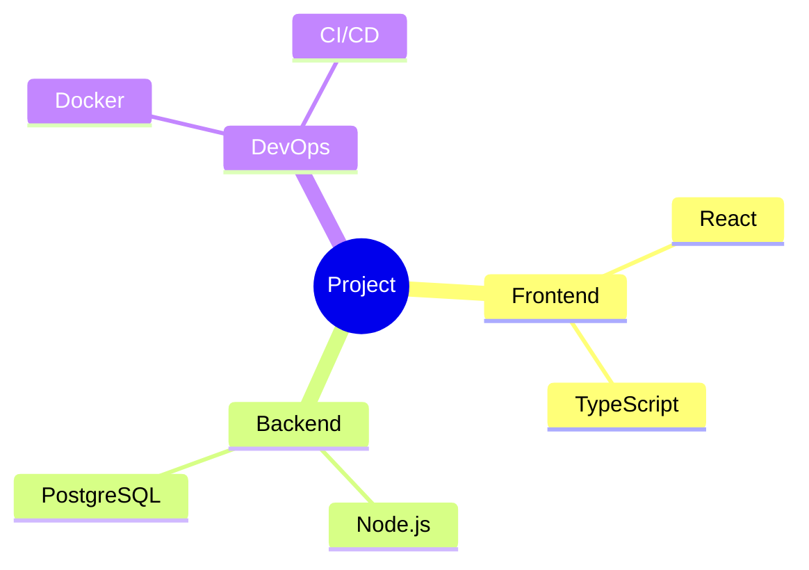

**Key syntax:**
- Indentation defines hierarchy
- Shapes: `root((circle))`, `(rounded)`, `[square]`, `))cloud((`
- Use 4-space or tab indentation

For details: [mindmap.md](mindmap.md)

---

### Pie Chart

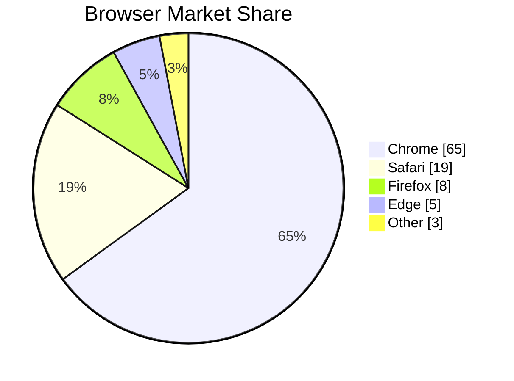

**Key syntax:**
- `title`: Optional chart title
- `showData`: Display values on segments
- Format: `"Label" : value`

For details: [pie.md](pie.md)

---

### ER Diagram

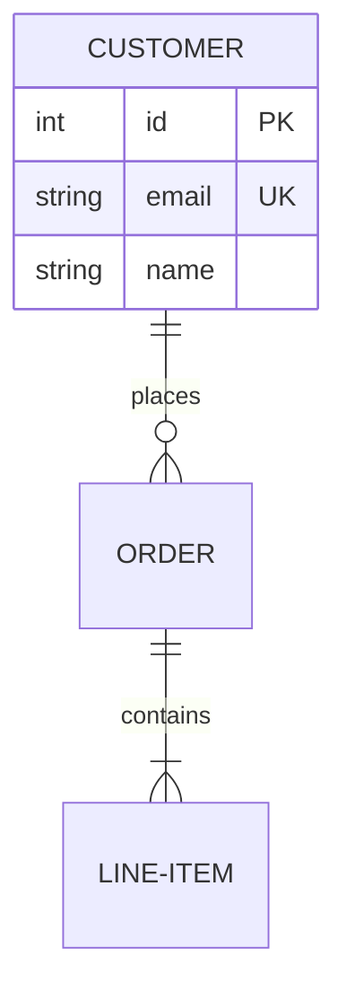

**Key syntax:**
- Entities: `ENTITY_NAME`
- Attributes: `type name [PK/FK/UK]`
- Cardinality: `||--o{` (one to many), `||--||` (one to one)
- Relationship: `ENTITY1 REL ENTITY2 : label`

For details: [er-diagram.md](er-diagram.md)

---

### User Journey

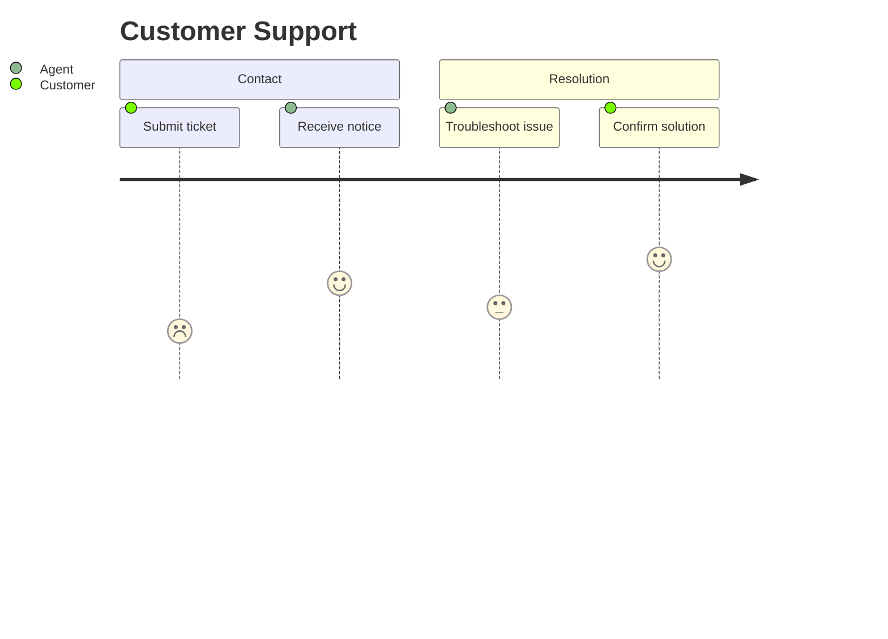

**Key syntax:**
- Sections: `section name`
- Tasks: `Task name: score: actor`
- Score: 1-5 (1 = unsatisfied, 5 = satisfied)
- Actors: User roles involved

For details: [journey.md](journey.md)

---

### Timeline

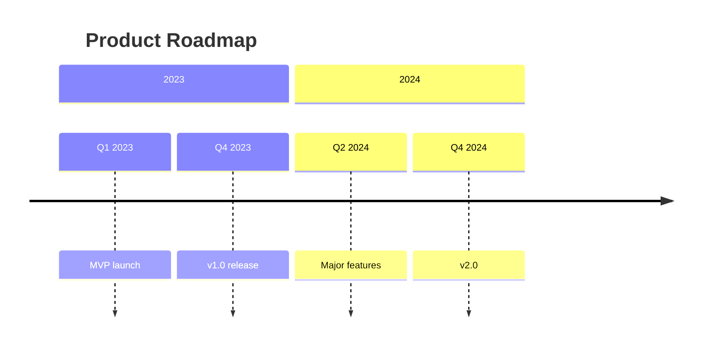

**Key syntax:**
- Time periods: `period : event`
- Sections: Group related periods
- Multiple events: `period : event1 : event2`
- Flexible format: Years, months, quarters, or custom text

For details: [timeline.md](timeline.md)

---

### Quadrant Chart

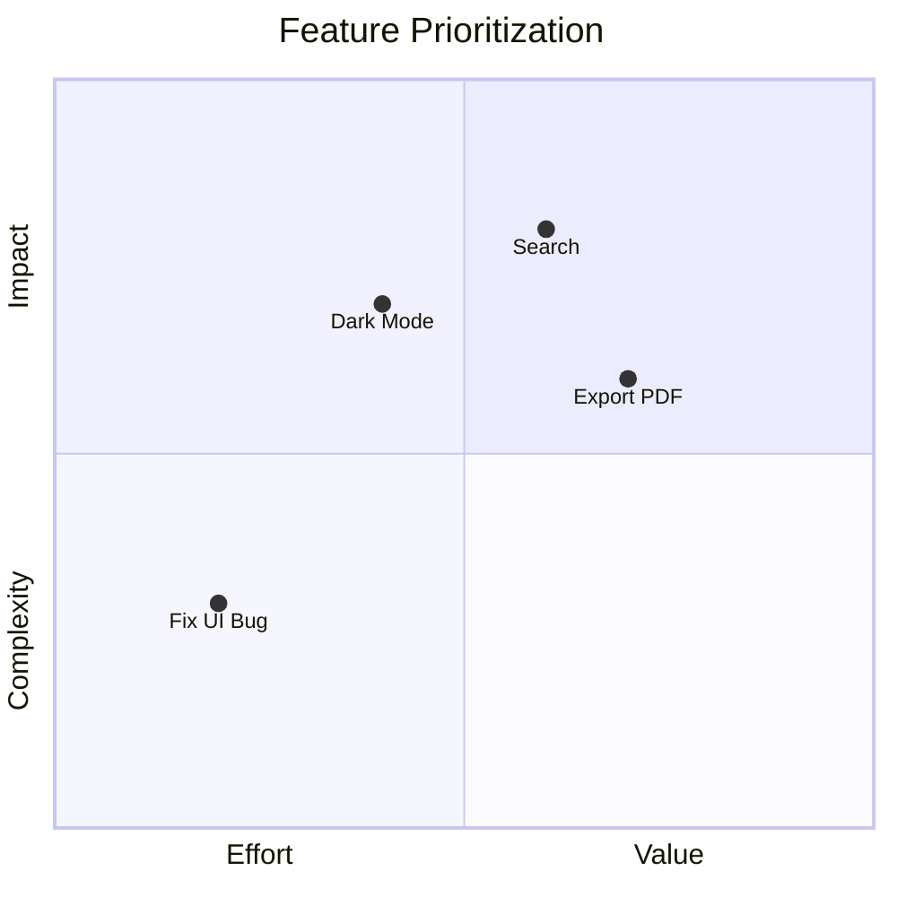

**Key syntax:**
- Axes: `x-axis label --> label` and `y-axis label --> label`
- Points: `Name: [x, y]` (coordinates 0.0-1.0)
- Quadrants: Auto-divided at 0.5 on both axes

For details: [quadrant-chart.md](quadrant-chart.md)

---

### Sankey Diagram

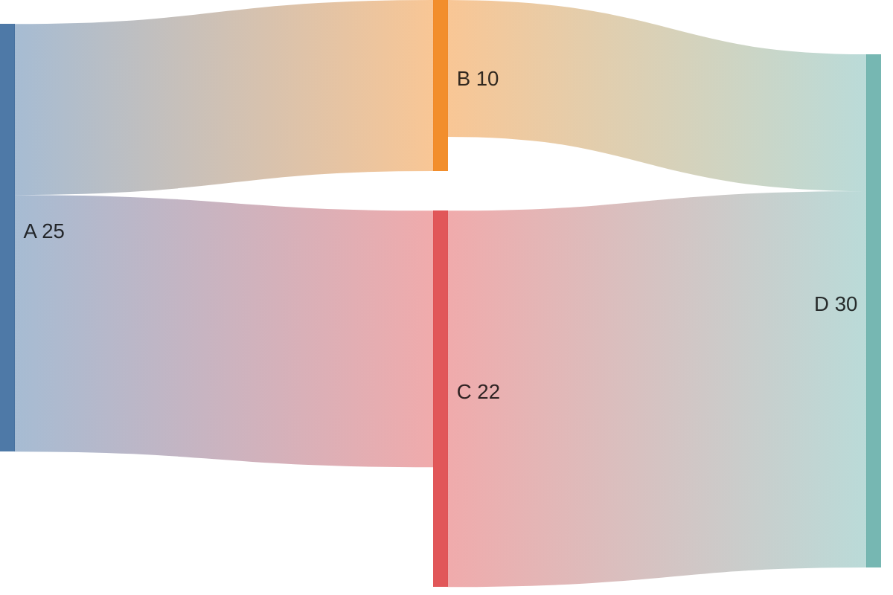

**Key syntax:**
- CSV format: `source, target, value`
- Three columns required
- Values are numeric (flow magnitude)
- Nodes auto-created from sources/targets

For details: [sankey.md](sankey.md)

---

### XY Chart

```mermaid
xychart-beta
    title "Sales Data"
    x-axis [Jan, Feb, Mar, Apr, May]
    y-axis "Revenue" 0 --> 100
    line [30, 45, 55, 70, 85]
```

**Key syntax:**
- Chart type: `xychart-beta` or `xychart-beta horizontal`
- X-axis: `[categories]` or `min --> max`
- Y-axis: `"label" min --> max`
- Series: `line [values]` or `bar [values]`

For details: [xychart.md](xychart.md)

---

### Block Diagram

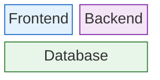

**Key syntax:**
- Blocks: `ID["Label"]:SPAN` - Each block on new line
- Columns: `columns N` - Define layout width
- Styling: `style ID fill:#hex,stroke:#hex,color:#hex`
- Spans: `:N` suffix - How many columns block occupies

For details: [block.md](block.md)

---

### Architecture Diagram

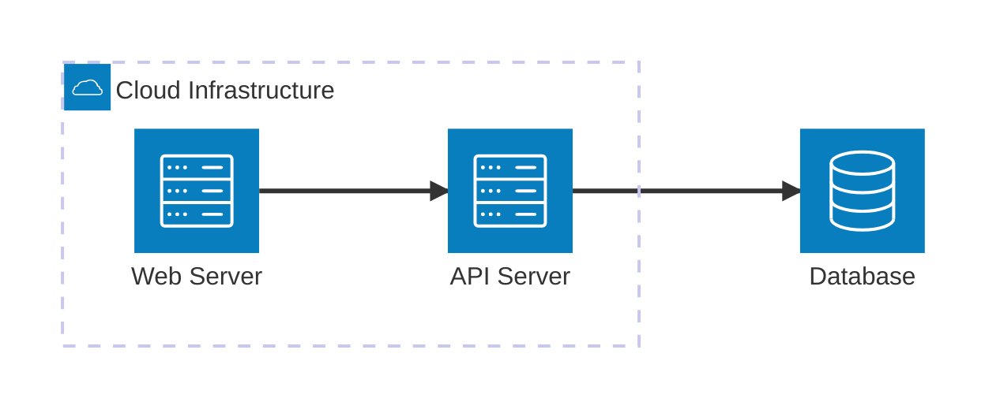

**Key syntax:**
- Groups: `group {id}({icon})[{label}]` - Organize services
- Services: `service {id}({icon})[{label}] (in {parent})?` - Available icons: server, database, cloud, disk, internet
- Nesting: `in {parent_id}` - Place service/group inside parent group
- Connections: `{id1}:{pos} {arrow} {pos}:{id2}` - Position: L(eft), R(ight), T(op), B(ottom)
- Arrows: `-->` (right), `<--` (left), `--` (both)

For details: [architecture.md](architecture.md)

---


## Common Patterns

### Adding Styles

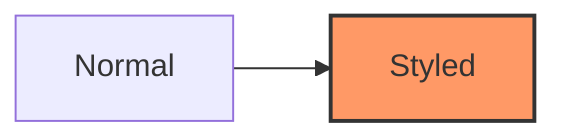

### Using Classes

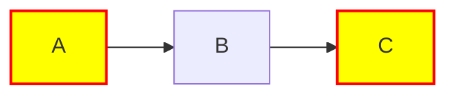

### Comments

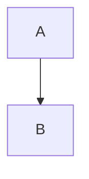

---

## Reference

For complete documentation on common features:
- [reference.md](reference.md) - Styling, themes, comments, directives

For diagram-specific guides:
- [flowchart.md](flowchart.md) - Node shapes, links, subgraphs
- [sequence.md](sequence.md) - Messages, activation, control flow
- [class-diagram.md](class-diagram.md) - Classes, relationships
- [gantt.md](gantt.md) - Tasks, dependencies, milestones
- [state.md](state.md) - States, transitions, composite states
- [gitgraph.md](gitgraph.md) - Commits, branches, merges
- [mindmap.md](mindmap.md) - Hierarchies, node shapes
- [pie.md](pie.md) - Proportional data
- [er-diagram.md](er-diagram.md) - Entities, attributes, relationships (Session 1)
- [journey.md](journey.md) - User journeys, satisfaction scores (Session 1)
- [timeline.md](timeline.md) - Events, milestones, time periods (Session 1)
- [quadrant-chart.md](quadrant-chart.md) - Priority matrix, 2D positioning (Session 2)
- [sankey.md](sankey.md) - Flow visualization, proportional bands (Session 2)
- [xychart.md](xychart.md) - Numerical data visualization (Session 2)
- [block.md](block.md) - Element positioning, multi-column layouts (Session 3)
- [architecture.md](architecture.md) - Cloud services, service relationships (Session 3)
