# Architecture Diagram Reference

Complete guide for Mermaid architecture diagrams in Obsidian. Architecture diagrams visualize relationships between services and resources commonly found in cloud deployments and distributed systems.

---

## Overview

Architecture diagrams (architecture-beta) show how services connect and interact within logical groups. They excel at depicting cloud infrastructure, microservices systems, and CI/CD pipelines with visual clarity.

**Best for:**
- Cloud architecture and infrastructure
- Microservices and service relationships
- CI/CD pipeline visualization
- Distributed system design

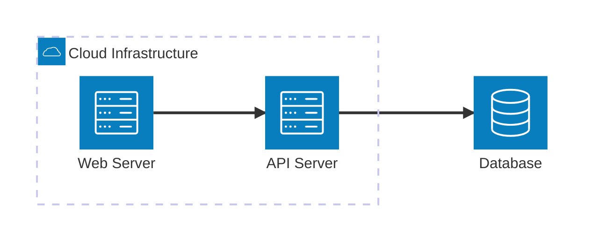

---

## Basic Syntax

### Structure

```
architecture-beta
    group {id}({icon})[{label}]
    service {id}({icon})[{label}] (in {parent})?

    {service1}:{position} {arrow} {position}:{service2}
```

### Groups

Organize related services together using the `in` keyword:


### Services

Individual components, either standalone or within groups:

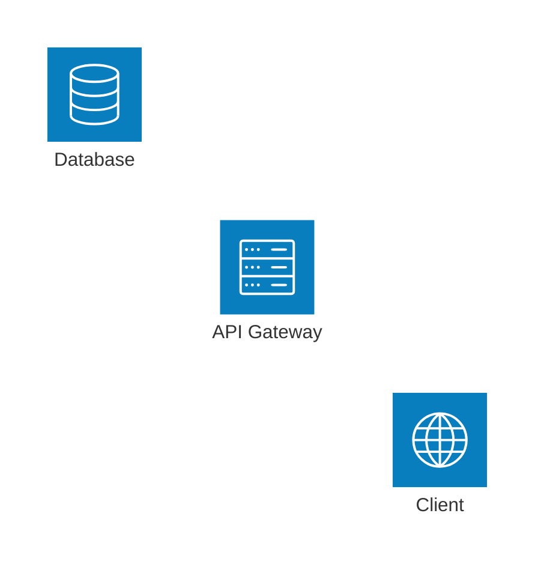

---

## Available Icons

| Icon | Syntax | Use Case |
|------|--------|----------|
| Server | `server` | General compute |
| Database | `database` | Data storage |
| Cloud | `cloud` | Cloud service |
| Disk | `disk` | Storage volume |
| Internet | `internet` | External/public |

---

## Connections & Edges

### Edge Syntax

```
{serviceId}:{position} {arrow} {position}:{serviceId}
```

### Position Codes

- `L` - Left side
- `R` - Right side
- `T` - Top side
- `B` - Bottom side

### Arrow Types

| Arrow | Description |
|-------|-------------|
| `--` | Bidirectional connection (no arrows) |
| `<-->` | Bidirectional connection with arrows |
| `-->` | Right-pointing arrow |
| `<--` | Left-pointing arrow |

### Edge Labels

Add labels to edges using bracket syntax:

```
{service1}:{position} -[Label]- {position}:{service2}
```

Example:
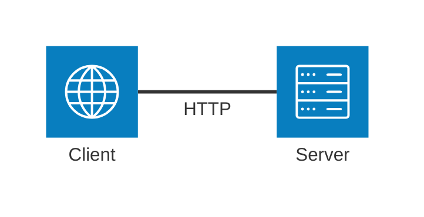

### Connection Examples

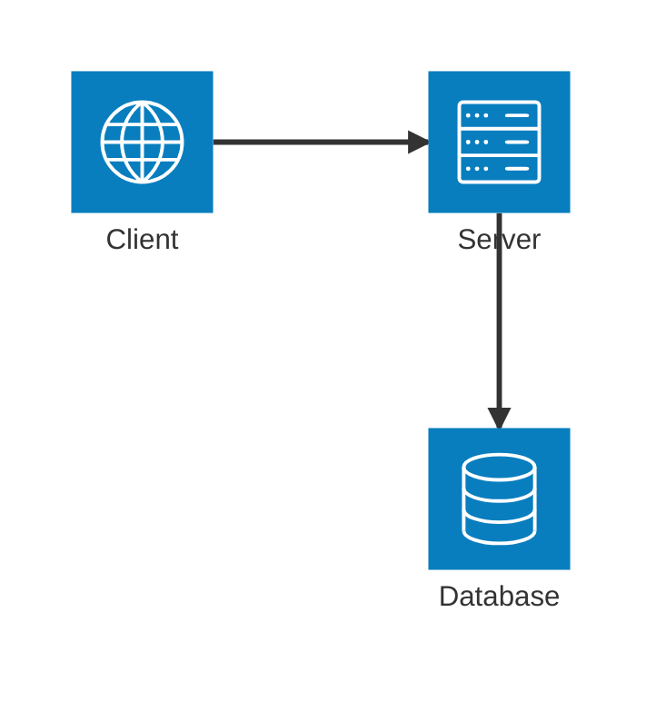

---

## Practical Examples

### Example 1: Three-Tier Architecture

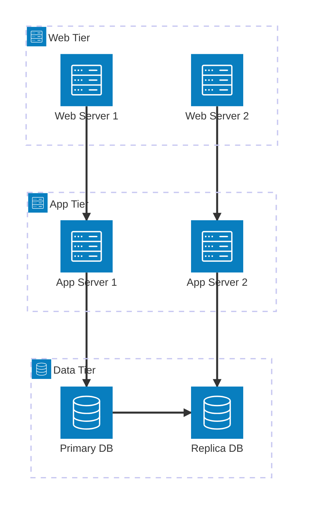

### Example 2: Microservices Architecture

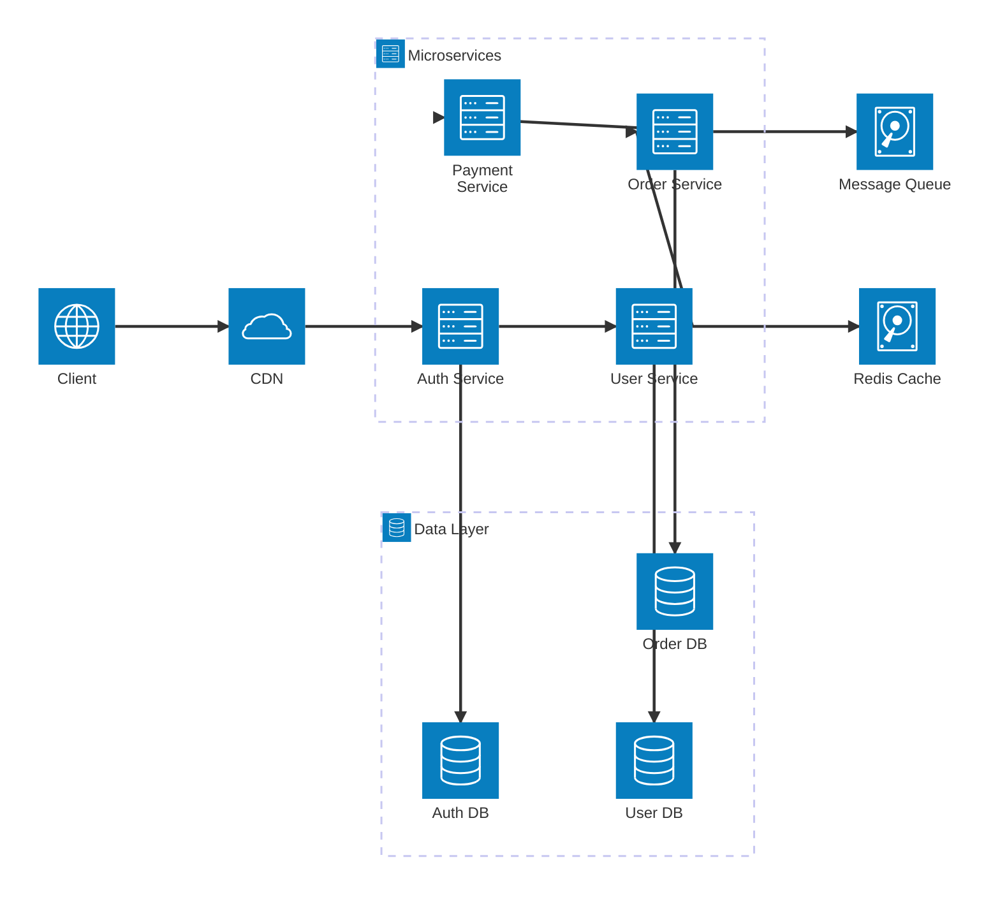

### Example 3: Multi-Environment Deployment

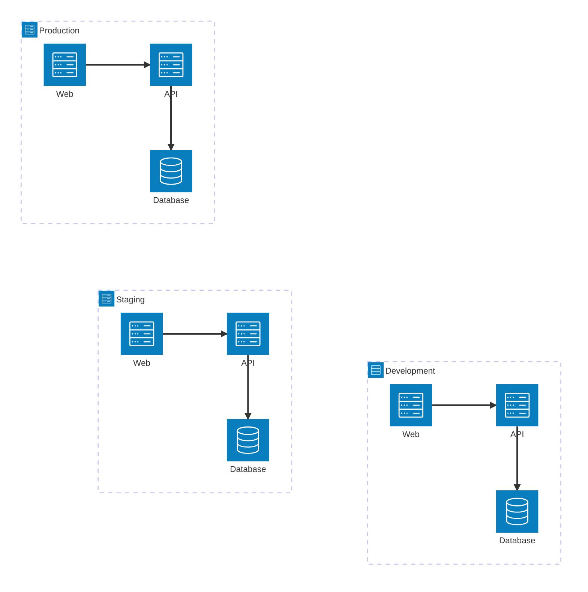

### Example 4: Event-Driven System

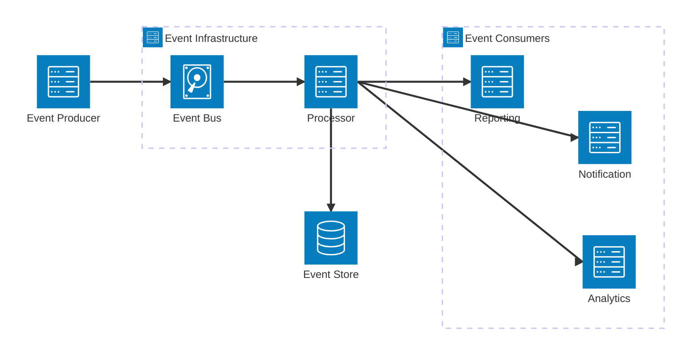

### Example 5: API Gateway Pattern

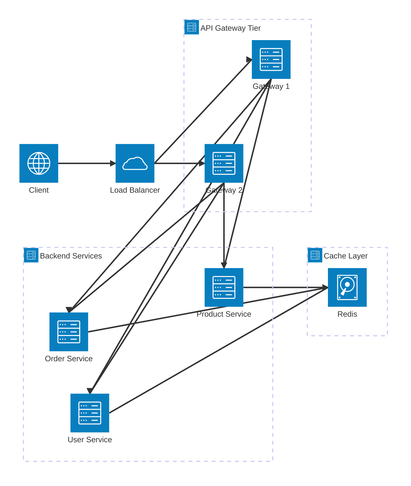

---

## Advanced Features

### Nested Groups

Create hierarchical organization using the `in` keyword:

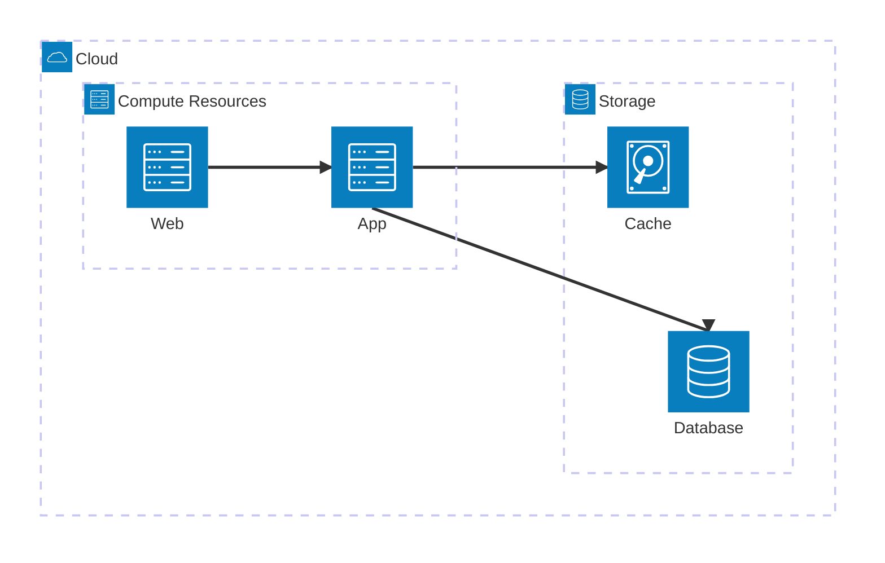

### Group-Level Edges

Connect edges to groups themselves using the `{group}` modifier:

```mermaid
architecture-beta
    group frontend(server)[Frontend]
    service web(server)[Web Server] in frontend

    group backend(server)[Backend]
    service api(server)[API Server] in backend

    frontend{group}:R --> L:backend{group}
```

This creates connections between the group boundaries rather than individual services.

### Direction Flow

Vertical and horizontal arrangement:

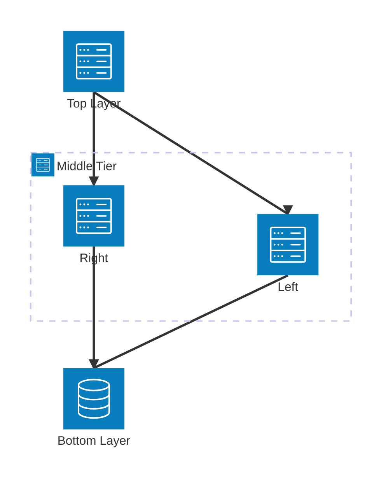

---

## Obsidian Notes

**Syntax Form**: Uses `architecture-beta` keyword (not `architecture`). This is the version supported in Obsidian's embedded Mermaid library.

**Format Requirements:**
- Groups: `group {id}({icon})[{label}]`
- Services: `service {id}({icon})[{label}]`
- Nesting: Use `in {parent_id}` to place services/groups inside parent groups
- Connections: `{id1}:{position} {arrow} {position}:{id2}`
- Positions: T (top), B (bottom), L (left), R (right)

**Icons**: Choose from: `server`, `database`, `cloud`, `disk`, `internet`

**Layout**: Services flow based on connection definitions. Parent groups organize visually related components. Order of definition affects layout.

**Theme Compatibility**: Colors adapt to Obsidian theme. Services show with consistent styling.

**Code Block Format**:
````
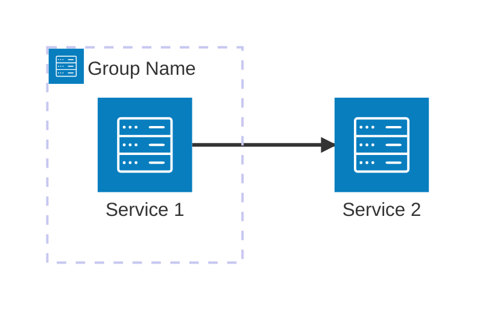
````

---

## Quick Reference Table

| Concept | Syntax | Example |
|---------|--------|---------|
| Diagram start | `architecture-beta` | `architecture-beta` |
| Group definition | `group {id}({icon})[{label}]` | `group api(server)[API]` |
| Service definition | `service {id}({icon})[{label}]` | `service web(server)[Web]` |
| Nesting | `in {parent_id}` | `service svc(server)[S] in api` |
| Connection | `{id1}:{pos} {arrow} {pos}:{id2}` | `web:R --> L:api` |
| Left position | `L` | Left side |
| Right position | `R` | Right side |
| Top position | `T` | Top side |
| Bottom position | `B` | Bottom side |
| Arrow right | `-->` | Right-pointing |
| Arrow left | `<--` | Left-pointing |
| Bidirectional (no arrows) | `--` | Connection without arrows |
| Bidirectional (with arrows) | `<-->` | Connection with arrows |
| Edge label | `-[Label]-` | `web:R -[HTTP]- L:api` |
| Group edge modifier | `{group}` | `api{group}:R --> L:db{group}` |
| Server icon | `server` | Compute resource |
| Database icon | `database` | Data storage |
| Cloud icon | `cloud` | Cloud service |
| Disk icon | `disk` | Storage |
| Internet icon | `internet` | External/public |
