# Block Diagram Reference

Complete guide for Mermaid block diagrams in Obsidian. Block diagrams enable precise control over element positioning for visualizing complex systems, architectures, and networks.

---

## Overview

Block diagrams in Obsidian provide a way to create visual diagrams with labeled blocks arranged in columns and rows. Unlike flowcharts with automatic layout, block diagrams let you specify exact positioning.

**Best for:**
- System architecture with layered components
- Security frameworks and control hierarchies
- Network topology and hardware designs
- System hierarchies with multiple levels
- Multi-column layouts and grids

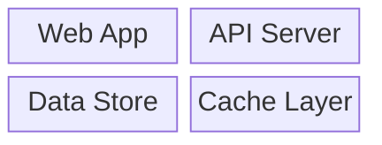

---

## Basic Syntax

### Structure

Blocks can be defined in several ways:
```
ID                    Simple block with ID as label
ID["Label"]           Block with custom label
ID:N                  Block spanning N columns
ID["Label"]:N         Block with label spanning N columns
```

### Column Span

The `:N` suffix specifies how many columns the block spans:

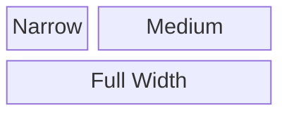

### Simple Example

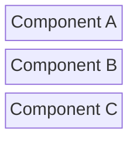

---

## Block Shapes

Block diagrams support various shapes using different bracket notations:

| Shape | Syntax | Example |
|-------|--------|---------|
| Rectangle | `["text"]` | `A["Server"]` |
| Rounded | `("text")` | `A("Process")` |
| Circle | `(("text"))` | `A(("DB"))` |
| Diamond | `{"text"}` | `A{"Decision"}` |
| Hexagon | `{{"text"}}` | `A{{"Worker"}}` |
| Stadium | `(["text"])` | `A(["Queue"])` |
| Subroutine | `[["text"]]` | `A[["Module"]]` |
| Cylinder | `[("text")]` | `A[("Storage")]` |
| Asymmetric | `>"text"]` | `A>"Flag"]` |

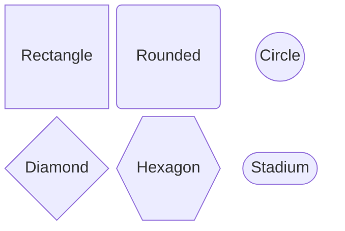

---

## Block Styling

### Color & Appearance

Use `style` declarations to customize blocks:

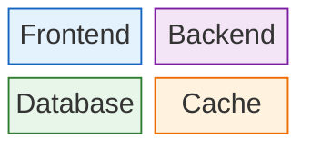

### Style Properties

| Property | Example | Description |
|----------|---------|-------------|
| `fill` | `fill:#e3f2fd` | Background color (hex) |
| `stroke` | `stroke:#1565c0` | Border color |
| `color` | `color:#0d47a1` | Text color |
| `stroke-width` | `stroke-width:2px` | Border thickness |

---

## Practical Examples

### Example 1: Security Framework

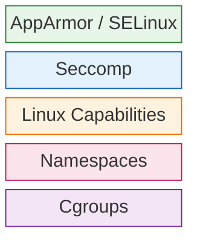

### Example 2: Three-Tier Architecture

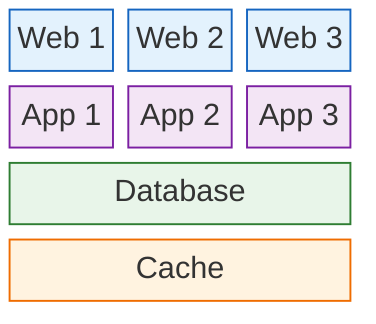

### Example 3: Microservices Ecosystem

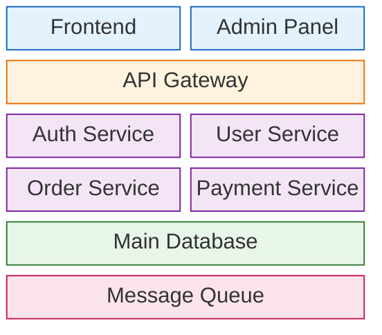

### Example 4: Cloud Infrastructure

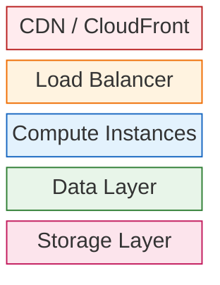

### Example 5: Multi-Column Layout

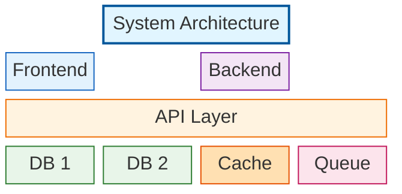

---

## Advanced Features

### Spanning Multiple Columns

Use larger column values to emphasize important components:

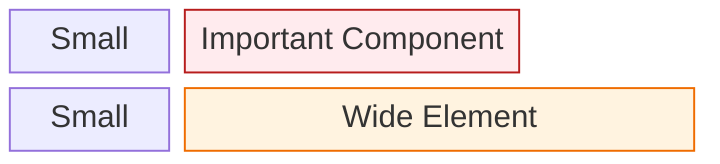

### Color Usage

Apply distinct colors to different component types for visual clarity:

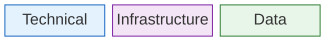

Use `fill` for background and `stroke` for border. Choose contrasting colors for different layers or categories to improve diagram readability.

---

## Arrows and Connections

Block diagrams support connections between blocks using arrow syntax:

### Basic Arrows

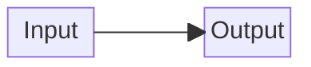

### Arrow Types

| Arrow | Syntax | Description |
|-------|--------|-------------|
| Directed | `-->` | Arrow with head |
| Undirected | `---` | Line without head |
| Labeled | `-- "text" -->` | Arrow with label |

### Labeled Connections

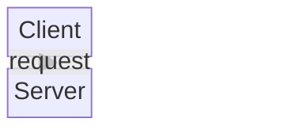

### Multiple Connections

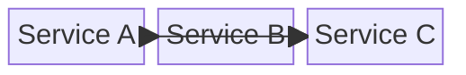

---

## Nested Blocks

Create hierarchical structures using nested block groups:

### Basic Nesting

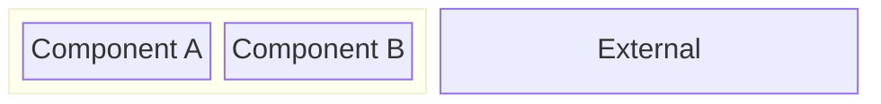

### Nested Block with Span

Use `block:ID:SPAN` to create a nested group spanning multiple columns:

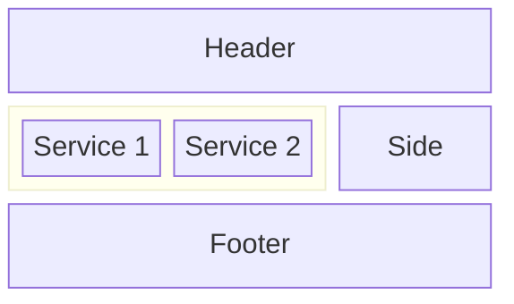

### Complex Hierarchy

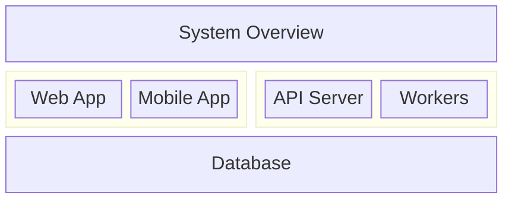

---

## Obsidian Notes

**Syntax Form**: Uses the `block-beta` keyword to start the diagram.

**Block Format**: Blocks can be defined in multiple ways:
- `ID` - Simple block using ID as label
- `ID["Label"]` - Block with custom label
- `ID:N` - Block spanning N columns
- `ID["Label"]:N` - Block with label and column span

**Shapes**: Use bracket notation for different shapes (see Block Shapes section).

**Styling**: Use `style ID` declarations with CSS-like properties separated by commas.

**Columns**: Define overall layout width with `columns N` at the start.

**Layout**: Blocks flow left-to-right, wrapping based on column count and spans.

**Connections**: Use `-->` for arrows and `---` for lines between blocks.

**Nesting**: Use `block:ID:SPAN ... end` for nested groups.

**Theme Compatibility**: Colors may vary with Obsidian themes. Use explicit hex values for consistent appearance.

**Code Block Format**:
````
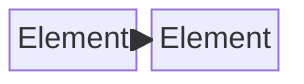
````

---

## Quick Reference Table

| Concept | Syntax | Example |
|---------|--------|---------|
| Diagram start | `block-beta` | `block-beta` |
| Columns | `columns N` | `columns 3` |
| Simple block | `ID` | `A` |
| Block with label | `ID["Label"]` | `A["Component"]` |
| Column span | `:N` suffix | `A:2` or `A["Big"]:2` |
| Arrow | `-->` | `A --> B` |
| Line | `---` | `A --- B` |
| Labeled arrow | `-- "text" -->` | `A -- "data" --> B` |
| Nested block | `block:ID:N ... end` | `block:group:2 ... end` |
| Space block | `space:N` | `space:1` |
| Style fill | `fill:#hex` | `fill:#e3f2fd` |
| Style stroke | `stroke:#hex` | `stroke:#1565c0` |
| Style text | `color:#hex` | `color:#0d47a1` |
| Apply style | `style ID prop:val` | `style A fill:#e3f2fd,stroke:#1565c0` |
