# Class Diagram Reference

Complete guide for Mermaid class diagrams in Obsidian.

---

## Class Definition

### Basic Syntax

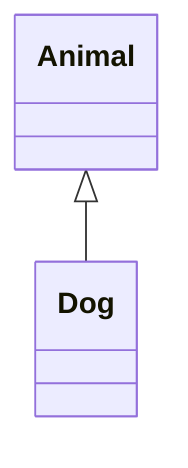

### Class with Label

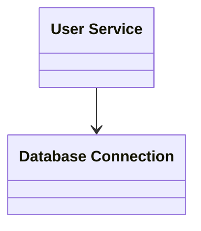

---

## Members

### Attributes and Methods

- **Without `()`**: Attribute
- **With `()`**: Method

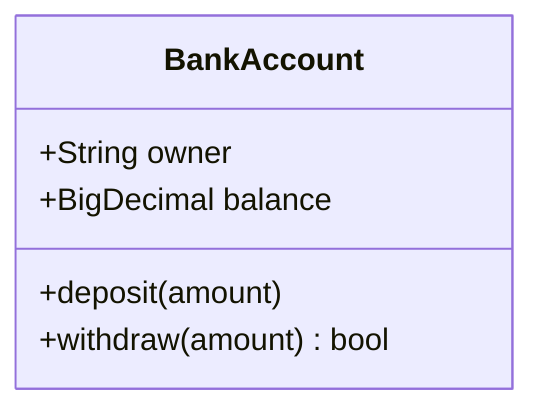

### Visibility Modifiers

| Symbol | Meaning | Description |
|--------|---------|-------------|
| `+` | Public | Accessible from anywhere |
| `-` | Private | Class internal only |
| `#` | Protected | Subclasses can access |
| `~` | Package | Same package only |

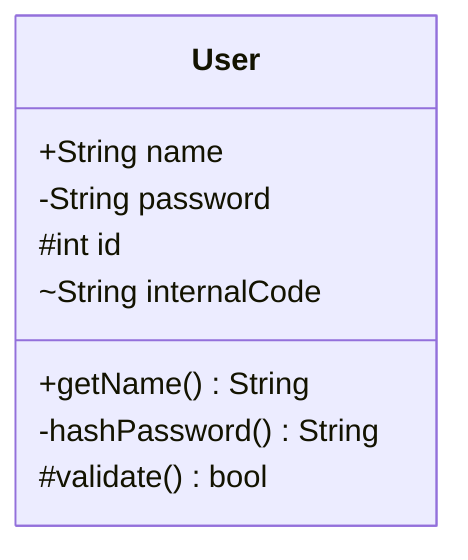

### Method Classifiers

| Symbol | Meaning | Position |
|--------|---------|----------|
| `*` | Abstract | After `()` or return type |
| `$` | Static | After `()` or return type |

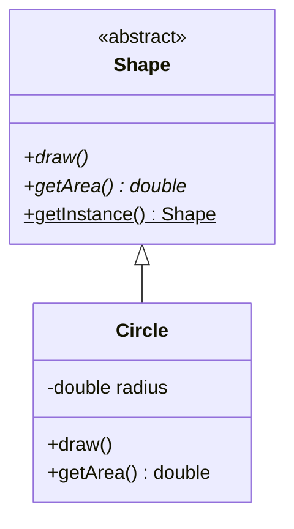

---

## Relationships

### Relationship Types

| Relation | Syntax | Meaning |
|----------|--------|---------|
| Inheritance | `<\|--` | Parent-child (extends) |
| Realization | `<\|..` | Interface implementation |
| Composition | `*--` | Strong containment (lifecycle bound) |
| Aggregation | `o--` | Weak containment (independent lifecycle) |
| Association | `-->` | Reference relationship |
| Dependency | `..>` | Uses relationship |
| Link (solid) | `--` | Simple connection |
| Link (dotted) | `..` | Weak connection |

### Inheritance

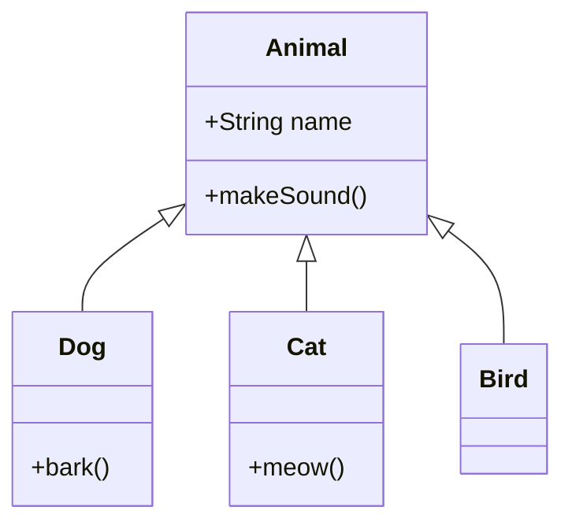

### Interface Implementation

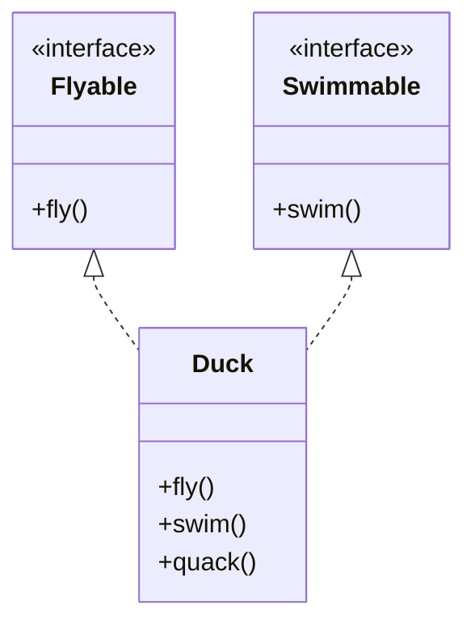

### Composition vs Aggregation

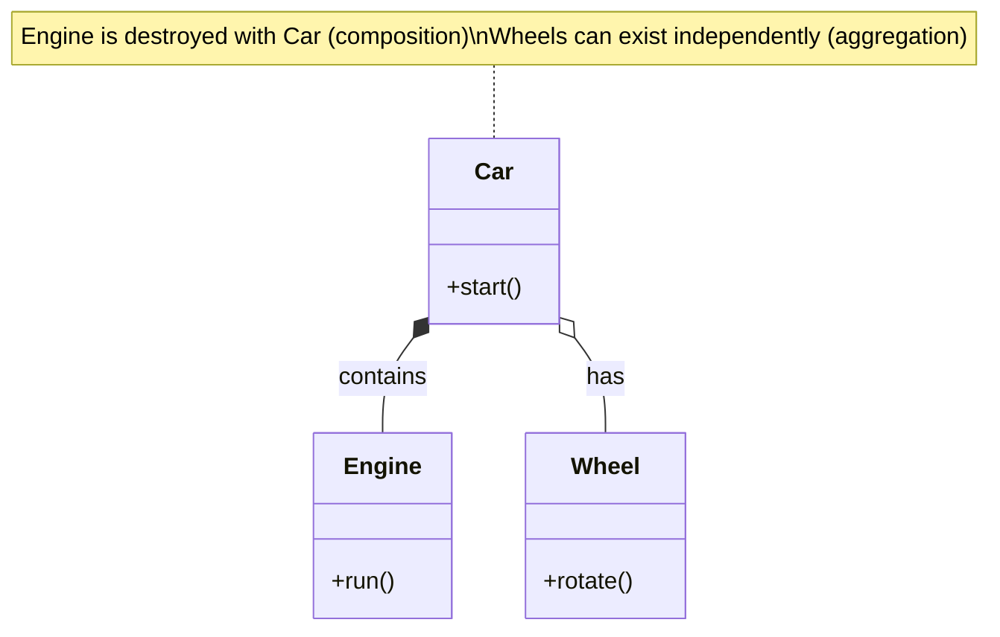

### Association and Dependency

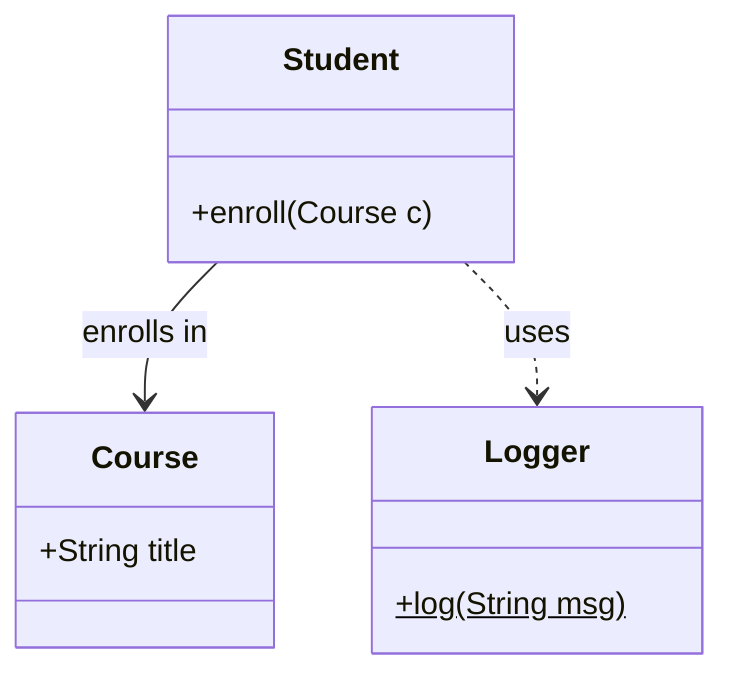

### With Labels

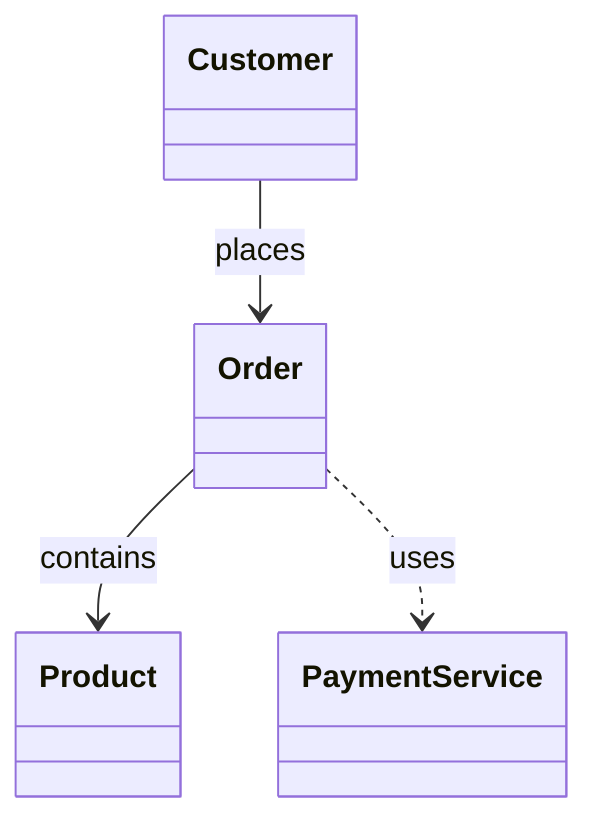

---

## Multiplicity (Cardinality)

| Notation | Meaning |
|----------|---------|
| `1` | Exactly one |
| `0..1` | Zero or one |
| `1..*` | One or more |
| `*` | Zero or more |
| `n` | Exactly n |
| `0..n` | Zero to n |

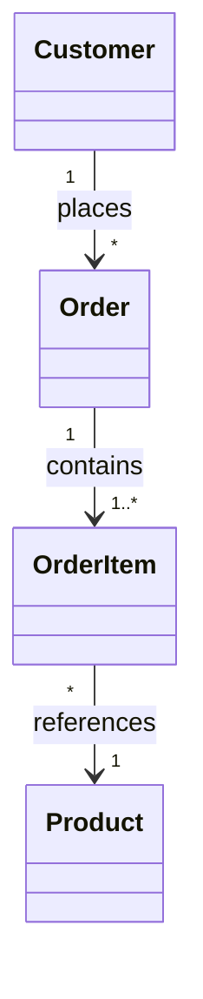

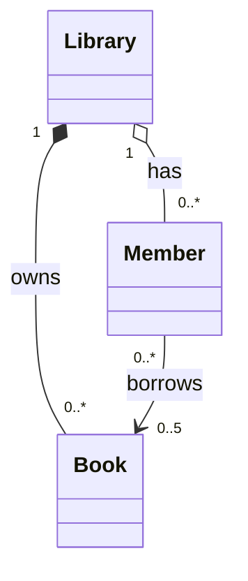

---

## Generics

Use tilde `~` for generic types:

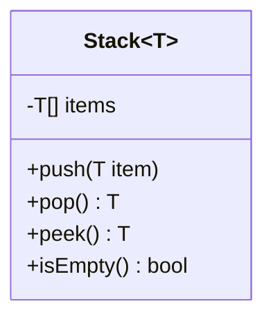

### Complex Generics

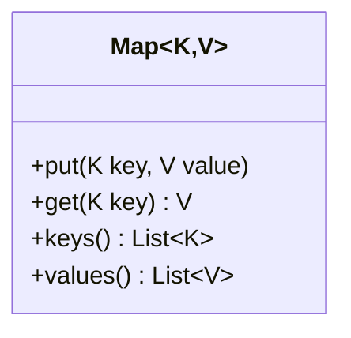

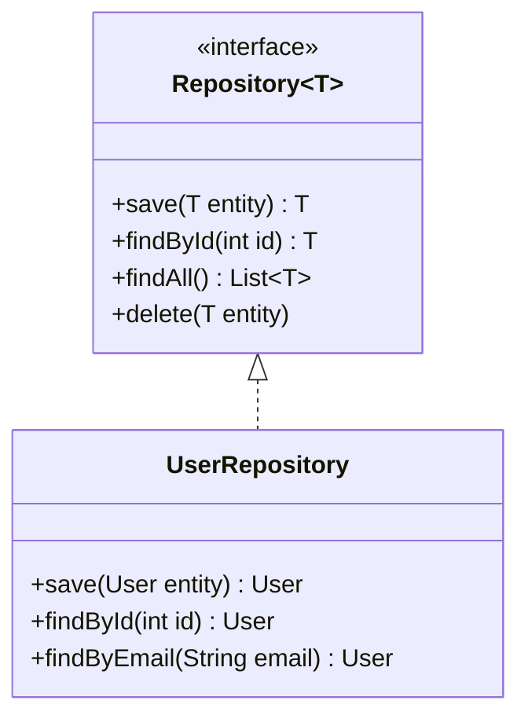

---

## Annotations

| Annotation | Use Case |
|------------|----------|
| `<<interface>>` | Interface |
| `<<abstract>>` | Abstract class |
| `<<enumeration>>` | Enum type |
| `<<service>>` | Service class |
| `<<entity>>` | Domain entity |
| `<<repository>>` | Data access |
| `<<controller>>` | Request handler |

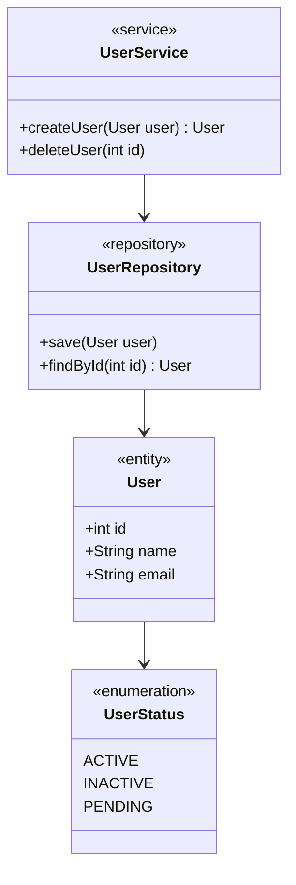

---

## Namespaces

Group related classes:

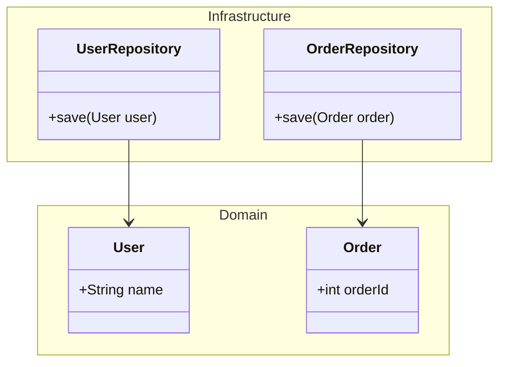

---

## Direction

| Value | Direction |
|-------|-----------|
| `TB` | Top to Bottom |
| `BT` | Bottom to Top |
| `LR` | Left to Right |
| `RL` | Right to Left |

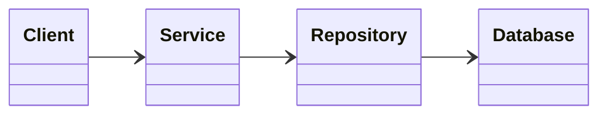

---

## Notes

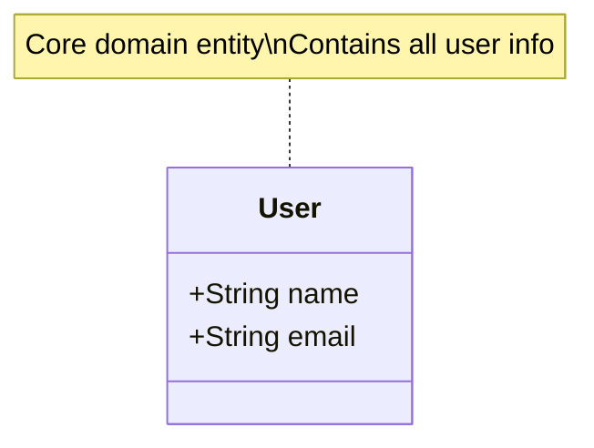

---

## Styling

### Class Definition (classDef)

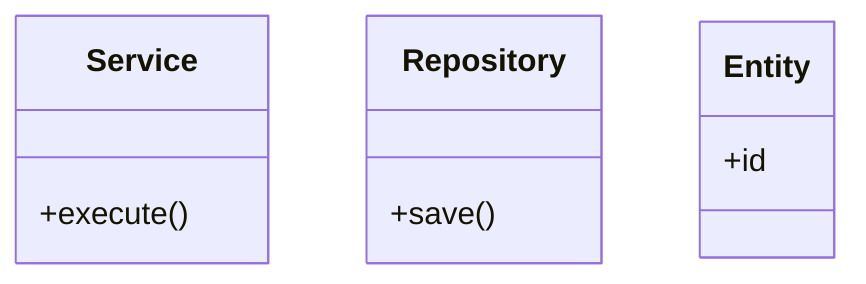

### Inline Style

```mermaid
classDiagram
    class Important {
        +criticalMethod()
    }

    style Important fill:#ff6b6b,stroke:#c92a2a,stroke-width:2px,color:#fff
```

---

## Practical Examples

### Example 1: Strategy Pattern

```mermaid
classDiagram
    direction LR

    class PaymentContext {
        -PaymentStrategy strategy
        +setStrategy(PaymentStrategy s)
        +executePayment(amount) bool
    }

    class PaymentStrategy {
        <<interface>>
        +pay(amount) bool
    }

    class CreditCardPayment {
        -String cardNumber
        -String expiry
        +pay(amount) bool
    }

    class PayPalPayment {
        -String email
        +pay(amount) bool
    }

    class BankTransfer {
        -String accountNumber
        +pay(amount) bool
    }

    PaymentContext o-- PaymentStrategy
    PaymentStrategy <|.. CreditCardPayment
    PaymentStrategy <|.. PayPalPayment
    PaymentStrategy <|.. BankTransfer

    note for PaymentStrategy "Strategy pattern allows\nruntime algorithm selection"
```

### Example 2: Repository Pattern with Generics

```mermaid
classDiagram
    class IRepository~T~ {
        <<interface>>
        +save(T entity) T
        +findById(int id) T
        +findAll() List~T~
        +delete(T entity)
    }

    class AbstractRepository~T~ {
        <<abstract>>
        #EntityManager em
        +save(T entity) T
        +findById(int id) T
        +findAll() List~T~
    }

    class UserRepository {
        +save(User) User
        +findById(int id) User
        +findByEmail(String email) User
    }

    class ProductRepository {
        +save(Product) Product
        +findById(int id) Product
        +findByCategory(String cat) List~Product~
    }

    IRepository~T~ <|.. AbstractRepository~T~
    AbstractRepository~T~ <|-- UserRepository
    AbstractRepository~T~ <|-- ProductRepository
```

### Example 3: E-Commerce Domain Model

```mermaid
classDiagram
    class User {
        <<entity>>
        -int id
        -String username
        -String email
        +register()
        +login()
    }

    class Order {
        <<entity>>
        -int orderId
        -Date orderDate
        -OrderStatus status
        +calculateTotal() BigDecimal
        +updateStatus(OrderStatus s)
    }

    class OrderItem {
        <<entity>>
        -int quantity
        -BigDecimal unitPrice
        +getSubtotal() BigDecimal
    }

    class Product {
        <<entity>>
        -int productId
        -String name
        -BigDecimal price
        -int stock
        +updateStock(int qty)
    }

    class OrderStatus {
        <<enumeration>>
        PENDING
        CONFIRMED
        SHIPPED
        DELIVERED
        CANCELLED
    }

    User "1" --> "*" Order : places
    Order "1" *-- "1..*" OrderItem : contains
    OrderItem "*" --> "1" Product : references
    Order --> OrderStatus : has

    classDef entity fill:#e3f2fd,stroke:#1565c0
    class User,Order,OrderItem,Product entity
```

### Example 4: Layered Architecture

```mermaid
classDiagram
    direction TB

    namespace Presentation {
        class UserController {
            <<controller>>
            -UserService userService
            +getUser(int id) Response
            +createUser(UserDTO dto) Response
        }
    }

    namespace Application {
        class UserService {
            <<service>>
            -UserRepository userRepo
            -PasswordEncoder encoder
            +getUser(int id) User
            +createUser(UserDTO dto) User
        }
    }

    namespace Domain {
        class User {
            <<entity>>
            -int id
            -String name
            -String email
        }
    }

    namespace Infrastructure {
        class UserRepositoryImpl {
            <<repository>>
            -EntityManager em
            +save(User user) User
            +findById(int id) User
        }
    }

    UserController --> UserService : uses
    UserService --> UserRepositoryImpl : uses
    UserRepositoryImpl --> User : manages
```

### Example 5: State Pattern

```mermaid
classDiagram
    class Document {
        -DocumentState state
        +publish()
        +archive()
        +restore()
    }

    class DocumentState {
        <<abstract>>
        +publish(Document doc)*
        +archive(Document doc)*
        +restore(Document doc)*
    }

    class DraftState {
        +publish(Document doc)
        +archive(Document doc)
        +restore(Document doc)
    }

    class PublishedState {
        +publish(Document doc)
        +archive(Document doc)
        +restore(Document doc)
    }

    class ArchivedState {
        +publish(Document doc)
        +archive(Document doc)
        +restore(Document doc)
    }

    Document o-- DocumentState
    DocumentState <|-- DraftState
    DocumentState <|-- PublishedState
    DocumentState <|-- ArchivedState

    note for Document "State pattern for\ndocument lifecycle"
```

---

## Obsidian Notes

**Theme Compatibility**: Colors adapt to Obsidian theme. Use explicit `classDef` for consistent appearance.

**Performance**: Large diagrams (30+ classes) may slow rendering. Split into multiple diagrams.

**Export**: PDF export renders as images. Capture as PNG/SVG for external sharing.

**Generics**: Use tilde `~T~`, not angle brackets `<T>`. Generic part is not part of class name when referencing.

**Special Characters**: Wrap labels with special characters in quotes.

**Code Block Format**:
````
```mermaid
classDiagram
    class Animal {
        +name: String
    }
```
````

---

## Quick Reference Table

| Category | Syntax | Example |
|----------|--------|---------|
| Class | `class Name` | `class User` |
| Label | `class Id["Label"]` | `class U["User Service"]` |
| Attribute | `+Type name` | `+String name` |
| Method | `+method() ReturnType` | `+getName() String` |
| Public | `+` | `+name` |
| Private | `-` | `-password` |
| Protected | `#` | `#id` |
| Package | `~` | `~internal` |
| Abstract | `*` | `+draw()*` |
| Static | `$` | `+getInstance()$` |
| Inheritance | `<\|--` | `Animal <\|-- Dog` |
| Implementation | `<\|..` | `Interface <\|.. Class` |
| Composition | `*--` | `Car *-- Engine` |
| Aggregation | `o--` | `Dept o-- Employee` |
| Association | `-->` | `Student --> Course` |
| Dependency | `..>` | `Client ..> Service` |
| Multiplicity | `"1" --> "*"` | `User "1" --> "*" Order` |
| Generic | `~T~` | `class Stack~T~` |
| Interface | `<<interface>>` | `<<interface>>` |
| Abstract class | `<<abstract>>` | `<<abstract>>` |
| Direction | `direction DIR` | `direction LR` |
| Note | `note for Class` | `note for User "text"` |
| Style | `classDef name` | `classDef red fill:#f00` |
| Apply style | `:::class` | `User:::red` |
