# Gantt Chart Reference

Complete guide for Mermaid Gantt charts in Obsidian.

---

## Basic Structure

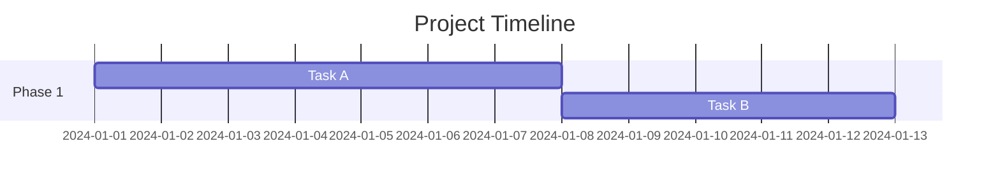

### Required Elements

| Element | Description | Example |
|---------|-------------|---------|
| `gantt` | Chart declaration | `gantt` |
| `title` | Chart title | `title Project Plan` |
| `dateFormat` | Input date format | `dateFormat YYYY-MM-DD` |

---

## Date Formats

### dateFormat (Input)

Format for task date definitions:

| Token | Description | Example |
|-------|-------------|---------|
| `YYYY` | 4-digit year | 2024 |
| `YY` | 2-digit year | 24 |
| `MM` | 2-digit month | 01-12 |
| `DD` | 2-digit day | 01-31 |
| `HH` | Hour (24h) | 00-23 |
| `mm` | Minute | 00-59 |

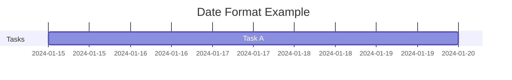

### axisFormat (Display)

Format for X-axis labels (D3 time format):

| Token | Description | Example |
|-------|-------------|---------|
| `%Y` | 4-digit year | 2024 |
| `%m` | Month (01-12) | 01 |
| `%d` | Day (01-31) | 15 |
| `%a` | Weekday abbr | Mon |
| `%A` | Weekday full | Monday |
| `%b` | Month abbr | Jan |
| `%B` | Month full | January |
| `%H` | Hour | 00-23 |
| `%M` | Minute | 00-59 |

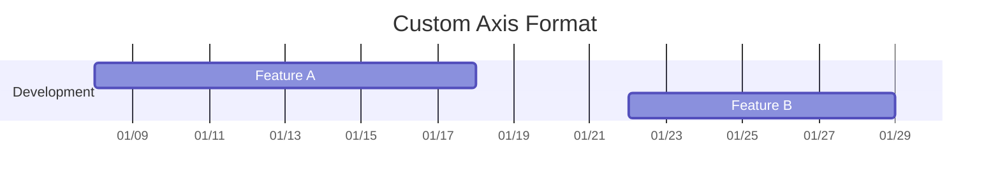

### Practical Axis Formats

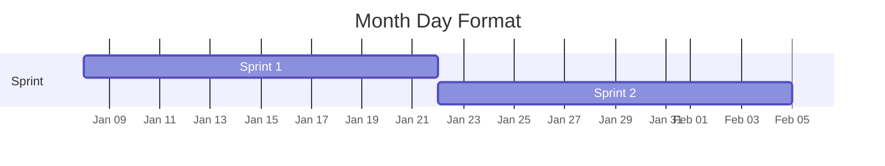

---

## Sections

Group tasks logically with `section`:

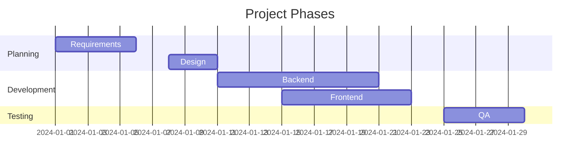

---

## Task Definition

### Basic Syntax

```
Task Name :status, taskId, start, duration/end
```

All parts except Task Name are optional.

### Start Date Options

**1. Explicit date:**

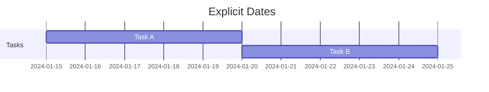

**2. Dependency-based (after):**

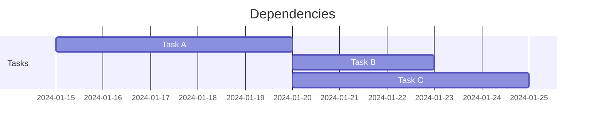

**3. Auto-sequential:**

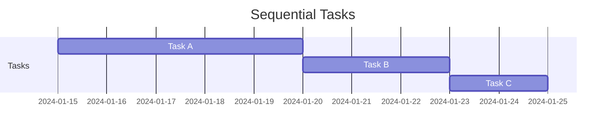

### Duration Units

| Unit | Description | Example |
|------|-------------|---------|
| `d` | Days | `5d` |
| `h` | Hours | `24h` |
| `m` | Minutes | `30m` |
| `w` | Weeks | `2w` |

---

## Task Status

### done (Completed)

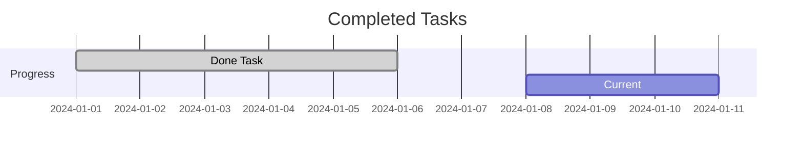

### active (In Progress)

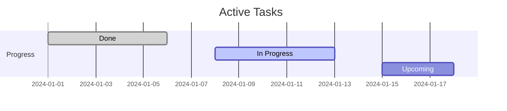

### crit (Critical)

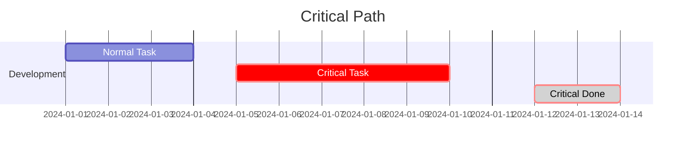

### milestone

Zero-duration event marker:

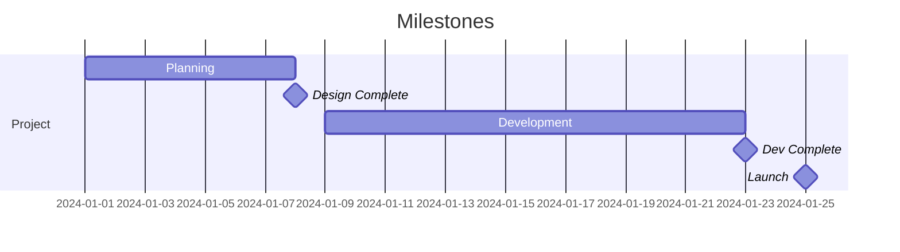

### Status Combinations

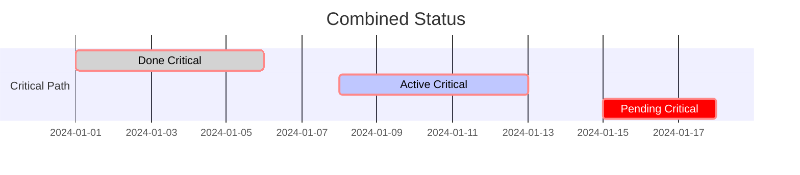

---

## Dependencies

### after Keyword

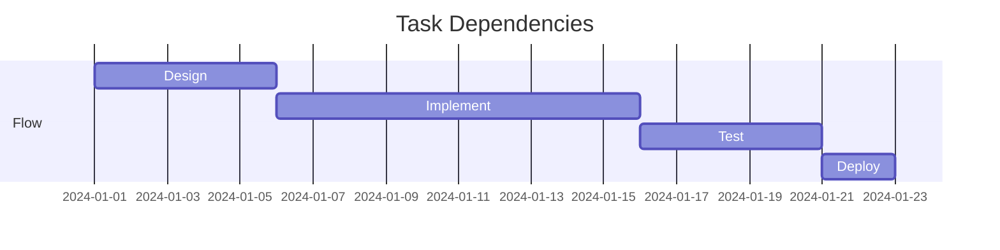

### Multiple Dependencies

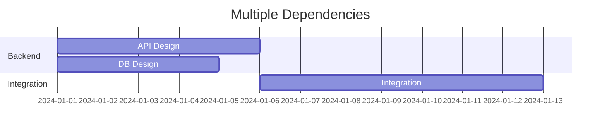

### until Keyword

Auto-calculate duration until a milestone:

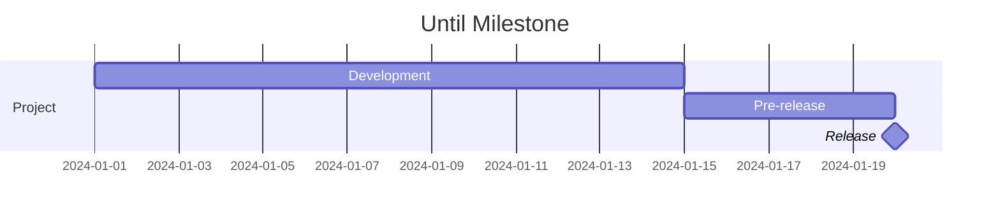

---

## Excludes (Non-Working Days)

### Weekends

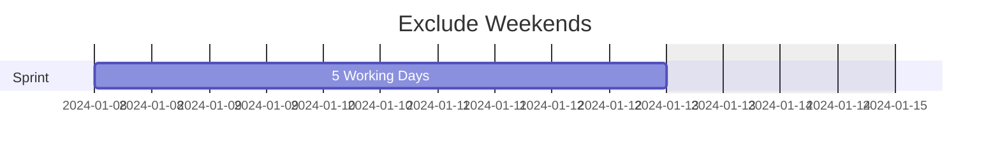

Tasks skip weekends in duration calculation.

### Specific Days

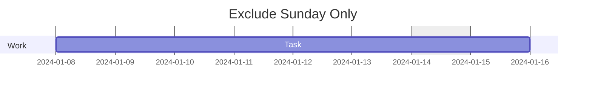

### Specific Dates

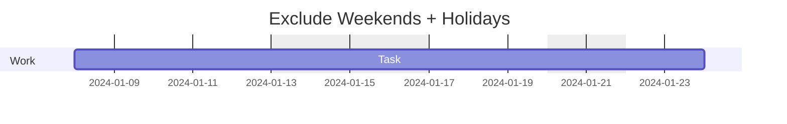

### includes (Override Excludes)

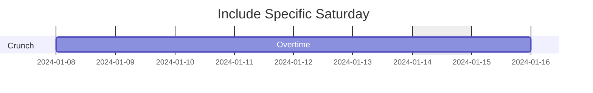

---

## Additional Settings

### todayMarker

**Custom style:**

```mermaid
gantt
    dateFormat YYYY-MM-DD
    todayMarker stroke-width:3px,stroke:#f00,opacity:0.7
    title Custom Today Marker

    section Current
    Active Task :active, 2024-12-28, 7d
```

**Disable:**

```mermaid
gantt
    dateFormat YYYY-MM-DD
    todayMarker off
    title No Today Marker

    section Tasks
    Task A :2024-01-01, 5d
```

### Compact Mode

```mermaid
---
displayMode: compact
---
gantt
    dateFormat HH:mm
    axisFormat %H:%M
    title Compact Hourly Schedule

    section Morning
    Standup :09:00, 15m
    Dev Work :09:30, 2h
    Review :11:30, 30m

    section Afternoon
    Meeting :13:00, 1h
    Dev Work :14:00, 3h
```

### Comments

```mermaid
gantt
    dateFormat YYYY-MM-DD
    title With Comments
    %% This is a comment

    section Tasks
    %% Main development task
    Task A :2024-01-01, 5d
```

---

## Practical Examples

### Example 1: Software Development Sprint

```mermaid
gantt
    dateFormat YYYY-MM-DD
    axisFormat %m/%d
    title Sprint 15 (Jan 8-26)
    excludes weekends

    section User Story 1
    Backend API :done, us1_be, 2024-01-08, 2d
    Frontend UI :done, us1_fe, after us1_be, 2d
    Testing :done, us1_test, after us1_fe, 1d

    section User Story 2
    Design :active, us2_design, 2024-01-08, 1d
    Implementation :us2_impl, after us2_design, 3d
    Testing :us2_test, after us2_impl, 1d

    section User Story 3
    Analysis :us3_analysis, 2024-01-10, 1d
    Implementation :crit, us3_impl, after us3_analysis, 4d
    Testing :us3_test, after us3_impl, 1d

    section Sprint Events
    Sprint Review :milestone, 2024-01-26, 0d
```

### Example 2: Product Launch Roadmap

```mermaid
gantt
    dateFormat YYYY-MM-DD
    axisFormat %b %d
    title Product Launch Q1 2024
    excludes weekends

    section MVP
    Core Features :crit, done, mvp1, 2024-01-02, 3w
    MVP Testing :done, mvp2, after mvp1, 1w
    MVP Release :milestone, mvp_rel, after mvp2, 0d

    section Beta
    Additional Features :crit, active, beta1, after mvp_rel, 2w
    Beta Testing :beta2, after beta1, 2w
    Feedback Integration :beta3, after beta2, 1w
    Beta Release :milestone, beta_rel, after beta3, 0d

    section GA
    Stabilization :ga1, after beta_rel, 1w
    Performance Tuning :crit, ga2, after ga1, 1w
    Documentation :ga3, after beta_rel, 2w
    GA Release :milestone, ga_rel, after ga2, 0d

    section Marketing
    Campaign Prep :mkt1, after beta_rel, 2w
    Launch Event :mkt2, after ga_rel, 3d
```

### Example 3: Daily Schedule

```mermaid
gantt
    dateFormat HH:mm
    axisFormat %H:%M
    title Daily Work Schedule

    section Morning
    Commute :09:00, 30m
    Email & Planning :09:30, 30m
    Team Standup :crit, 10:00, 15m
    Deep Work :active, 10:15, 105m

    section Midday
    Lunch :12:00, 1h

    section Afternoon
    Code Review :13:00, 1h
    Deep Work :active, 14:00, 2h
    Meetings :16:00, 1h
    Wrap-up :17:00, 30m
```

### Example 4: Website Redesign Project

```mermaid
gantt
    dateFormat YYYY-MM-DD
    axisFormat %b %d
    title Website Redesign
    excludes weekends

    section Discovery
    Stakeholder Interviews :done, disc1, 2024-01-08, 3d
    User Research :done, disc2, 2024-01-08, 5d
    Competitive Analysis :done, disc3, after disc1, 2d
    Requirements Doc :done, disc4, after disc2, 2d
    Discovery Complete :milestone, m1, after disc4, 0d

    section Design
    Wireframes :done, des1, after m1, 5d
    UI Design :active, des2, after des1, 7d
    Prototype :des3, after des2, 3d
    Design Review :crit, des4, after des3, 2d
    Design Approval :milestone, m2, after des4, 0d

    section Development
    Frontend Setup :dev1, after m2, 3d
    Component Library :dev2, after dev1, 5d
    Page Implementation :crit, dev3, after dev2, 10d
    CMS Integration :dev4, after dev2, 7d
    Dev Complete :milestone, m3, after dev3, 0d

    section Launch
    QA Testing :qa1, after m3, 5d
    Bug Fixes :qa2, after qa1, 3d
    Staging Deploy :launch1, after qa2, 1d
    Production Deploy :crit, launch2, after launch1, 1d
    Go Live :milestone, m4, after launch2, 0d
```

### Example 5: Release Planning

```mermaid
gantt
    dateFormat YYYY-MM-DD
    axisFormat %Y-%m
    title 2024 Release Plan
    excludes weekends

    section Q1
    v2.0 Development :crit, q1dev, 2024-01-02, 8w
    v2.0 Release :milestone, v20, 2024-02-26, 0d

    section Q2
    v2.1 Development :q2dev, 2024-03-04, 6w
    v2.1 Release :milestone, v21, 2024-04-15, 0d
    v2.2 Development :q2dev2, 2024-04-22, 6w
    v2.2 Release :milestone, v22, 2024-06-03, 0d

    section Q3
    v3.0 Planning :q3plan, 2024-06-10, 3w
    v3.0 Development :crit, q3dev, 2024-07-01, 10w
    v3.0 Beta :milestone, v30b, 2024-09-09, 0d

    section Q4
    v3.0 Stabilization :q4stab, 2024-09-16, 4w
    v3.0 GA :milestone, v30, 2024-10-14, 0d
```

---

## Obsidian Notes

**Theme Compatibility**: Gantt colors adapt to Obsidian theme. Critical tasks are typically red/orange.

**Performance**: Very long timelines or many tasks may slow rendering. Consider splitting by quarter or phase.

**Export**: PDF export renders as images. For project management, export SVG for editing.

**Date Accuracy**: `excludes weekends` affects duration calculation. A 5d task spans Mon-Fri.

**Today Marker**: Shows current date. Disable with `todayMarker off` for historical charts.

**Code Block Format**:
````
```mermaid
gantt
    dateFormat YYYY-MM-DD
    title My Project

    section Tasks
    Task A :2024-01-01, 5d
```
````

---

## Quick Reference Table

| Category | Syntax | Example |
|----------|--------|---------|
| Declaration | `gantt` | `gantt` |
| Title | `title text` | `title Project Plan` |
| Date format | `dateFormat FORMAT` | `dateFormat YYYY-MM-DD` |
| Axis format | `axisFormat FORMAT` | `axisFormat %m/%d` |
| Section | `section name` | `section Development` |
| Task | `name :id, start, duration` | `Task A :a1, 2024-01-01, 5d` |
| After | `after taskId` | `Task B :after a1, 3d` |
| Multiple deps | `after id1 id2` | `Merge :after a1 b1, 2d` |
| Duration: days | `Nd` | `5d` |
| Duration: weeks | `Nw` | `2w` |
| Duration: hours | `Nh` | `24h` |
| Done | `done` | `Task :done, 2024-01-01, 3d` |
| Active | `active` | `Task :active, 2024-01-01, 3d` |
| Critical | `crit` | `Task :crit, 2024-01-01, 3d` |
| Milestone | `milestone, id, date, 0d` | `Release :milestone, m1, 2024-01-15, 0d` |
| Exclude weekends | `excludes weekends` | `excludes weekends` |
| Exclude dates | `excludes date` | `excludes 2024-01-15` |
| Include date | `includes date` | `includes 2024-01-13` |
| Today marker | `todayMarker style` | `todayMarker off` |
| Comment | `%%` | `%% note` |
