# Gitgraph Reference

Visualize Git branching strategies and commit history in Obsidian.

---

## Basic Structure

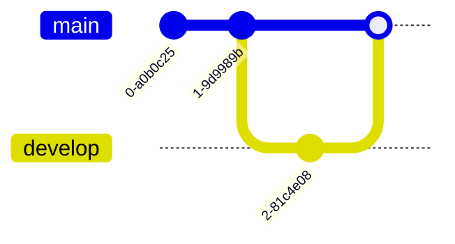

**Keywords:**
- `commit` - Add a commit
- `branch name` - Create branch
- `checkout name` - Switch branch
- `merge name` - Merge branch into current

---

## Direction

| Keyword | Direction |
|---------|-----------|
| (default) | Left to Right |
| `LR:` | Left to Right |
| `TB:` | Top to Bottom |
| `BT:` | Bottom to Top |

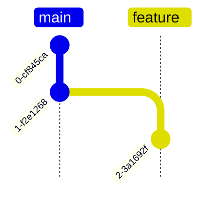

---

## Commits

### Basic Commit

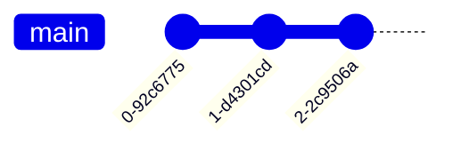

### With ID and Message

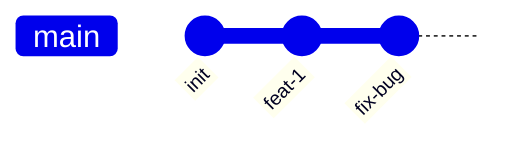

### Commit Types

| Type | Display | Use Case |
|------|---------|----------|
| `NORMAL` | Filled circle | Standard commit |
| `REVERSE` | X-marked circle | Reverted commit |
| `HIGHLIGHT` | Filled square | Important commit |

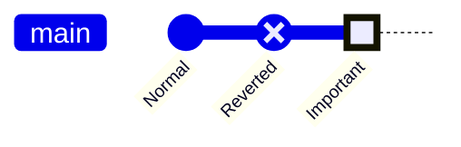

---

## Branches

### Create and Switch

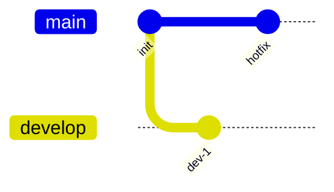

### Multiple Branches

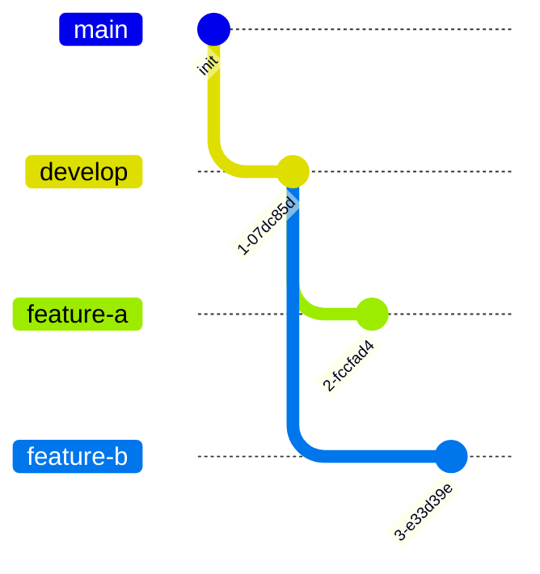

---

## Merge

### Basic Merge

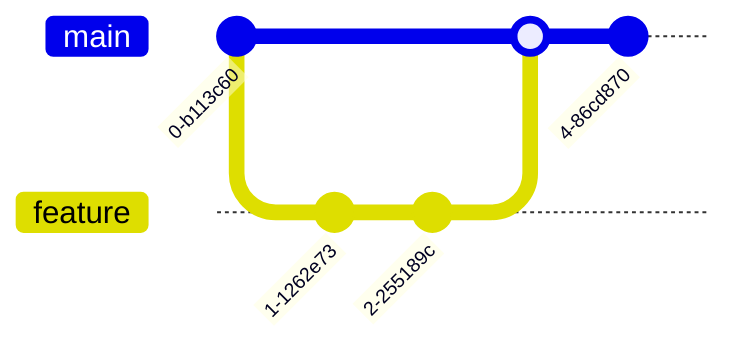

### Merge with Tag

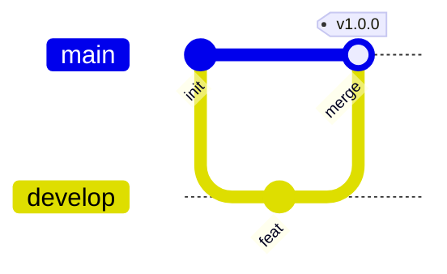

### Merge with Attributes

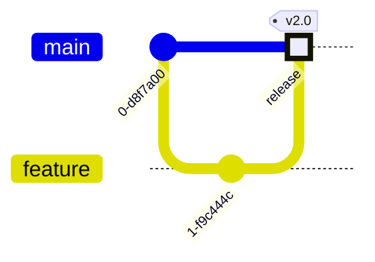

---

## Tags

Add version tags to commits:

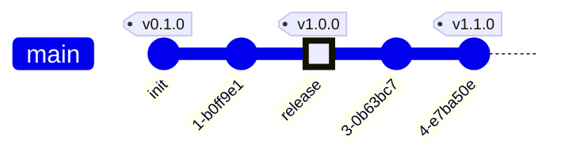

---

## Cherry-pick

Copy specific commits to another branch:

### Basic Cherry-pick

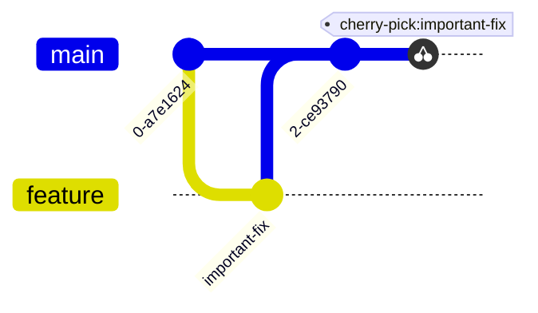

### Cherry-pick from Merge Commit

Use `parent` to specify which parent's changes:

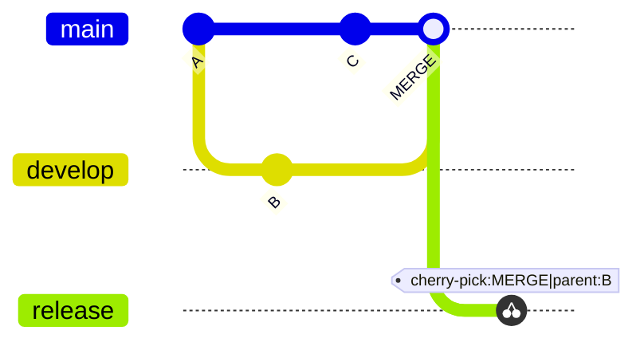

---

## Configuration

### YAML Frontmatter

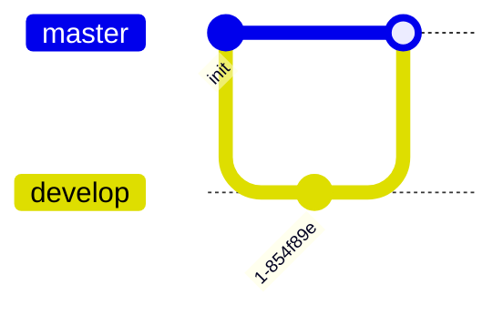

### Configuration Options

| Option | Description | Default |
|--------|-------------|---------|
| `showBranches` | Show branch labels | true |
| `showCommitLabel` | Show commit labels | true |
| `mainBranchName` | Main branch name | "main" |
| `mainBranchOrder` | Main branch position | 0 |
| `rotateCommitLabel` | Rotate labels | true |

### Branch Order

Control branch display order with `order`:

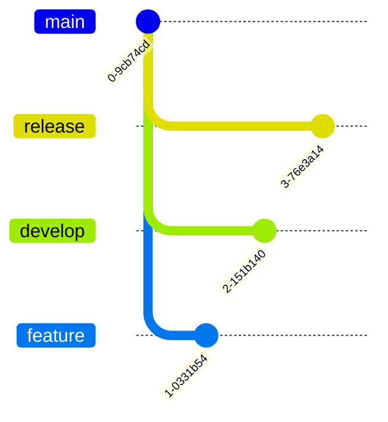

---

## Practical Examples

### Example 1: Git Flow Workflow

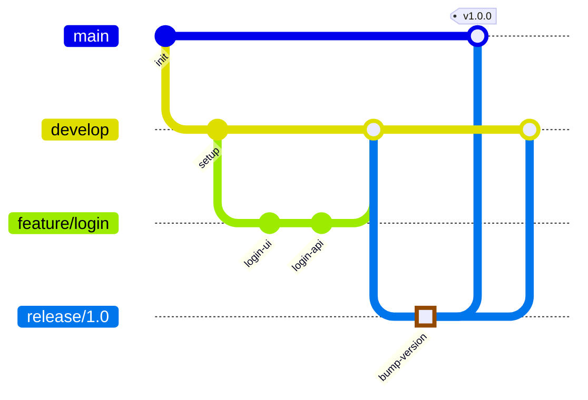

### Example 2: Hotfix Workflow

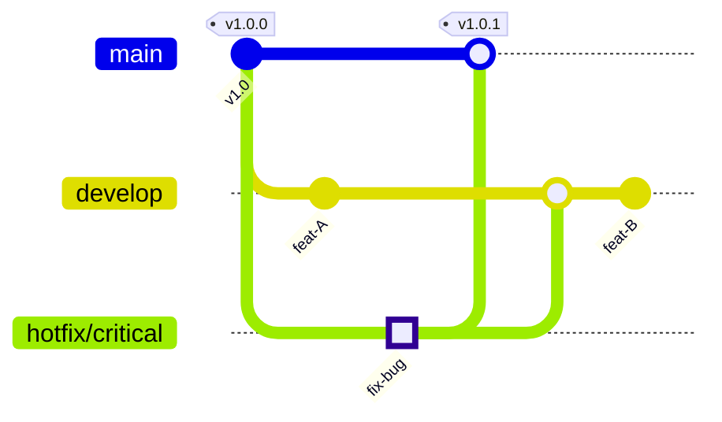

### Example 3: Feature Branch Strategy

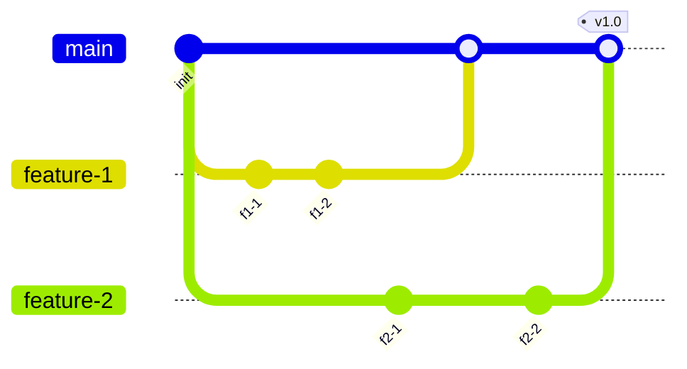

### Example 4: Release Cycle

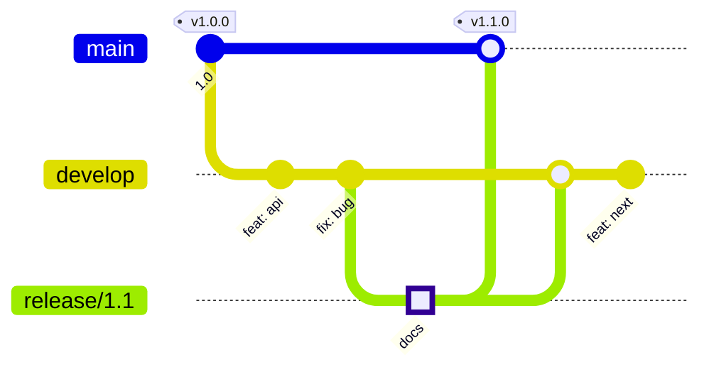

---

## Obsidian Notes

**Branch Names**: Use simple names. Special characters may cause parsing issues.

**Commit IDs**: Must be unique for cherry-pick references.

**Theme Colors**: Branch colors adapt to Obsidian theme. Each branch gets a distinct color automatically.

**Performance**: Complex graphs with many branches may render slowly.

**No Interaction**: Click events are disabled in Obsidian.

---

## Quick Reference

| Action | Syntax | Example |
|--------|--------|---------|
| Commit | `commit` | `commit id: "init"` |
| Commit type | `type: TYPE` | `commit type: HIGHLIGHT` |
| Tag | `tag: "name"` | `commit tag: "v1.0"` |
| Branch | `branch name` | `branch develop` |
| Switch | `checkout name` | `checkout main` |
| Merge | `merge name` | `merge feature` |
| Cherry-pick | `cherry-pick id: "id"` | `cherry-pick id: "fix"` |
| Direction | `gitGraph DIR:` | `gitGraph TB:` |
| Config | `---config:...---` | See examples above |
