# User Journey Diagram Reference

Complete guide for Mermaid user journey diagrams in Obsidian.

---

## Introduction

User journey diagrams visualize the steps a user takes to complete a specific task. They display the emotional experience at each step with satisfaction scores, and identify which actors (personas) are involved in each phase.

---

## Basic Structure

### Simple Journey

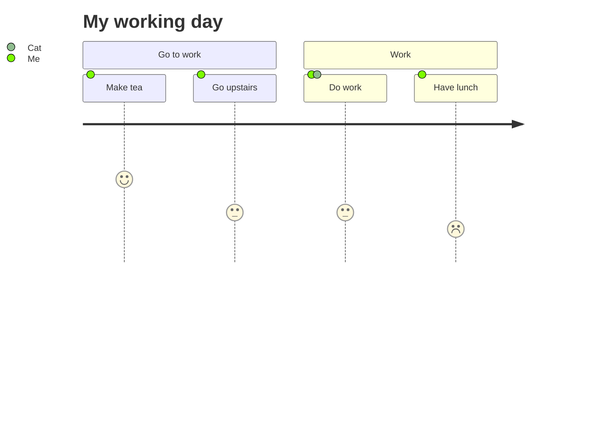

### Components

```
journey
    title [Title of the journey]
    section [Phase name]
      Task name: [score]: [actor(s)]
```

---

## Syntax Reference

### Title

Define the journey title:


### Sections

Group tasks into logical phases:

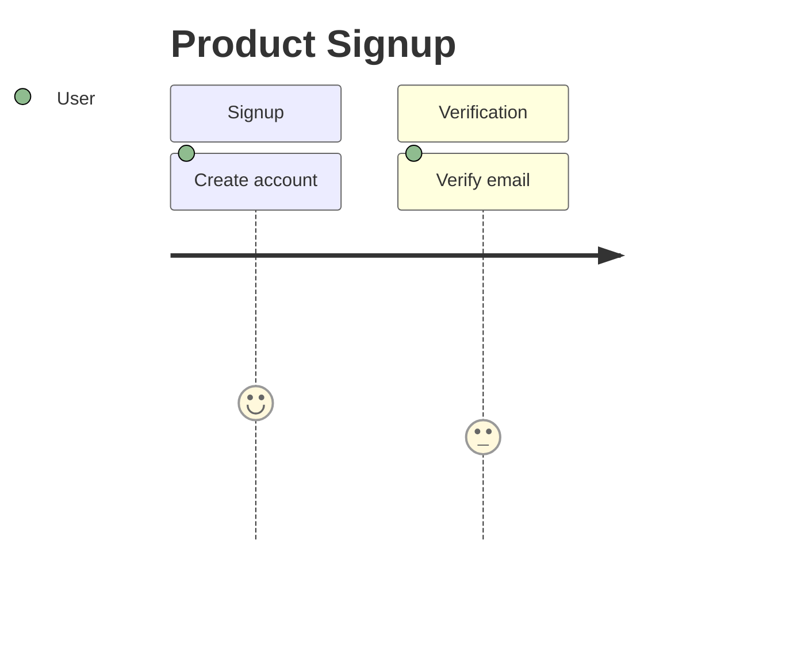

| Element | Purpose |
|---------|---------|
| `section name` | Phase or stage of the journey |
| Task definition | Individual step in the journey |

### Task Syntax

Define tasks with name, score, and actors:

```
Task name: <score>: <actor1>, <actor2>
```

| Component | Details | Example |
|-----------|---------|---------|
| Task name | Action description | `Submit form` |
| Score | 1-5 satisfaction | `4` (satisfied) |
| Actors | Who performs it | `User, Admin` |

### Score Meanings

| Score | Interpretation |
|-------|-----------------|
| `5` | Highly satisfied |
| `4` | Satisfied |
| `3` | Neutral |
| `2` | Unsatisfied |
| `1` | Very unsatisfied |

---

## Actors

### Defining Actors

Actors represent user personas or roles:

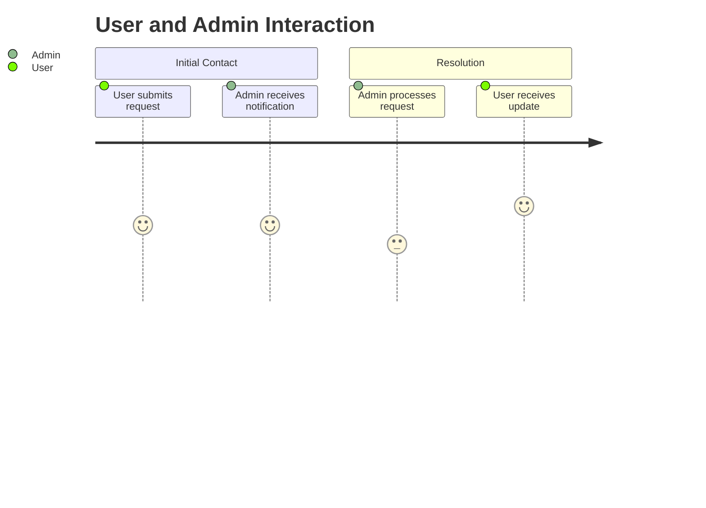

### Multiple Actors

Include actors in parentheses or as comma-separated list:

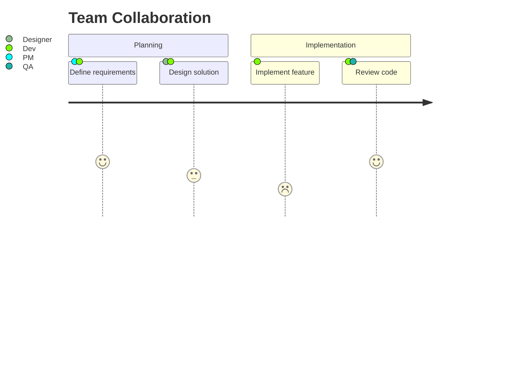

---

## Practical Examples

### Example 1: Customer Support Journey

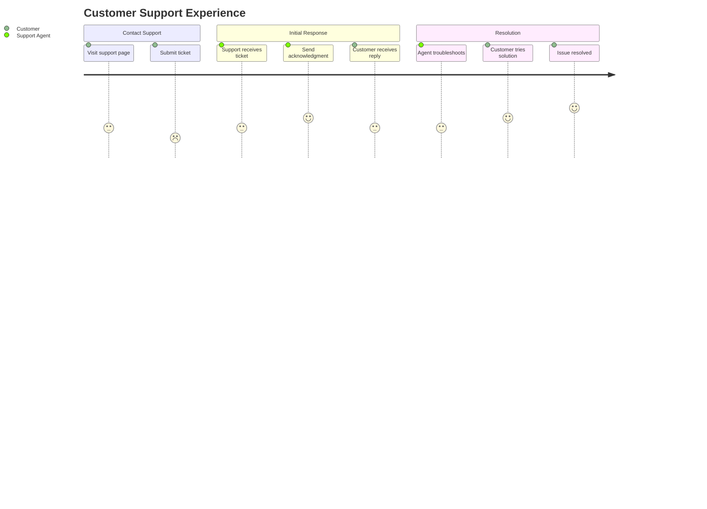

### Example 2: E-Commerce Checkout

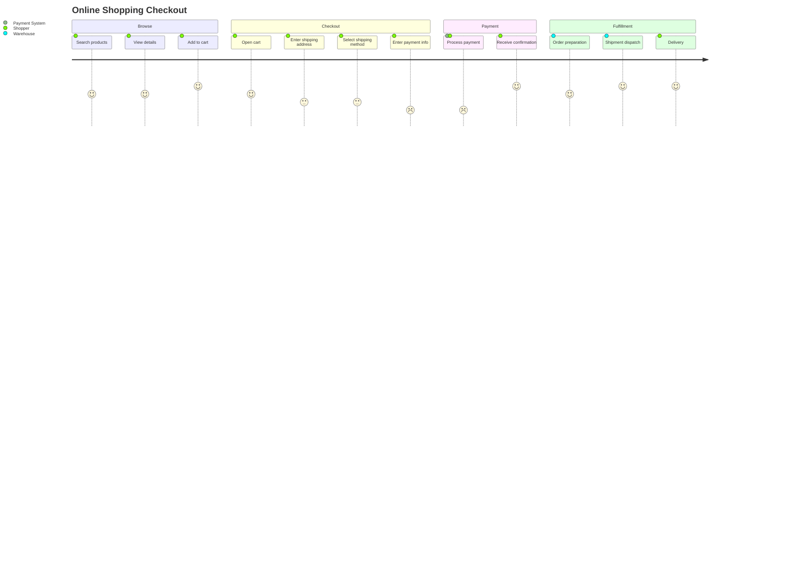

### Example 3: Software Onboarding

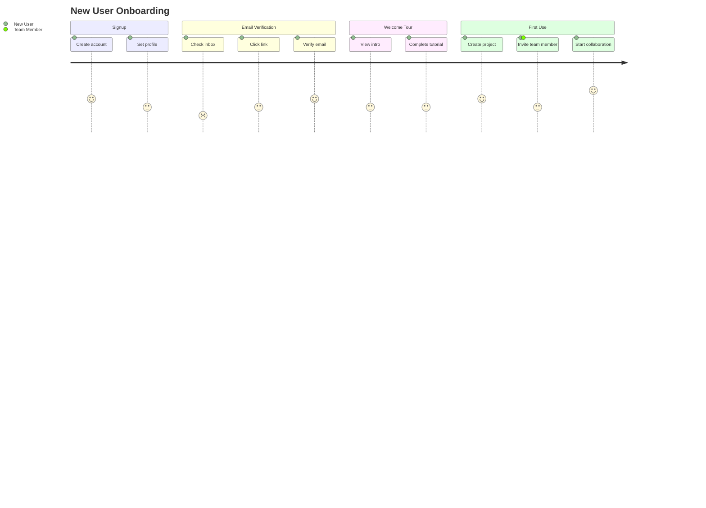

### Example 4: Mobile App User Flow

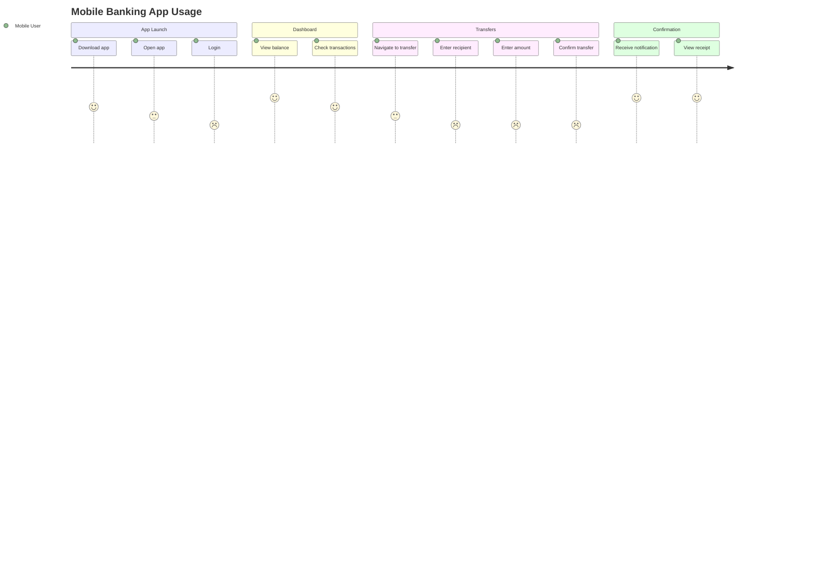

### Example 5: Bug Reporting Workflow

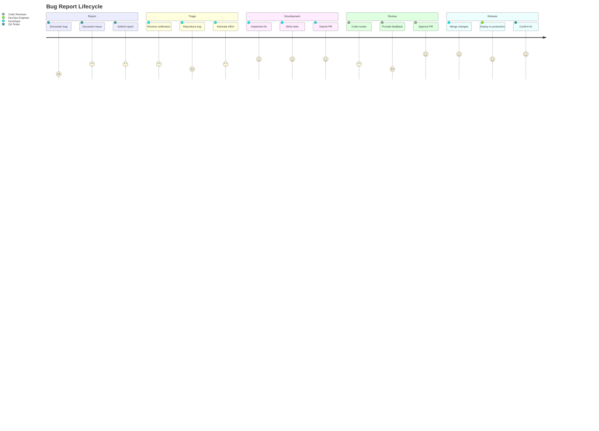

---

## Advanced Features

### Comments

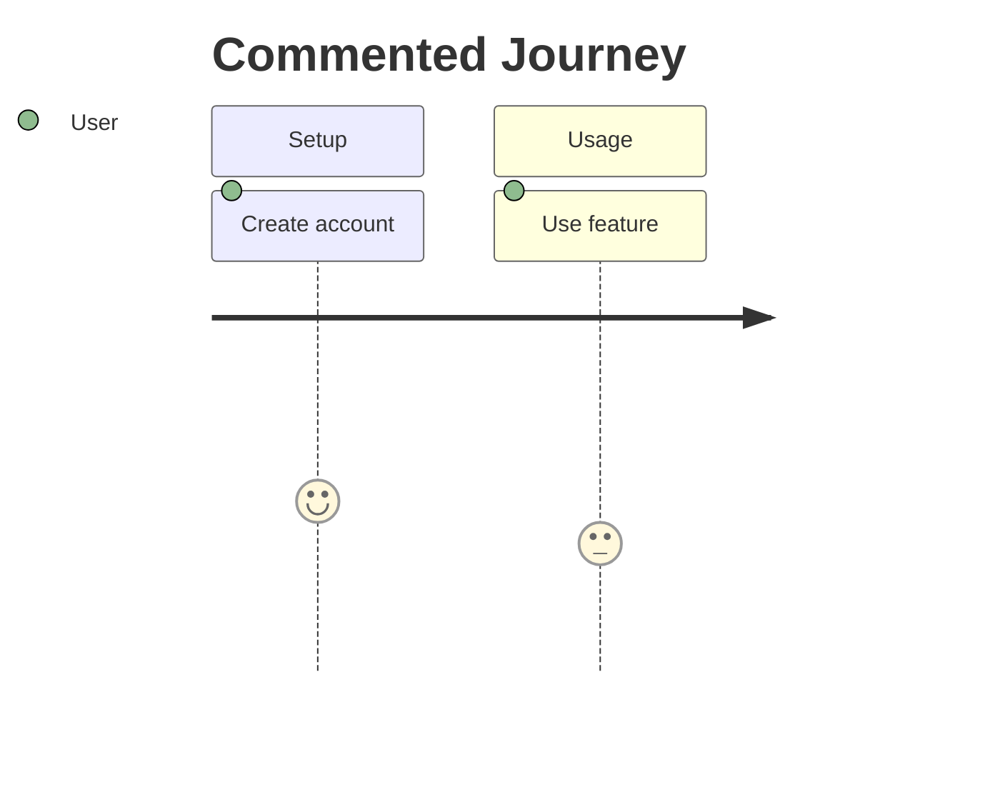

### Long Task Names

Task names wrap automatically or can use line breaks:

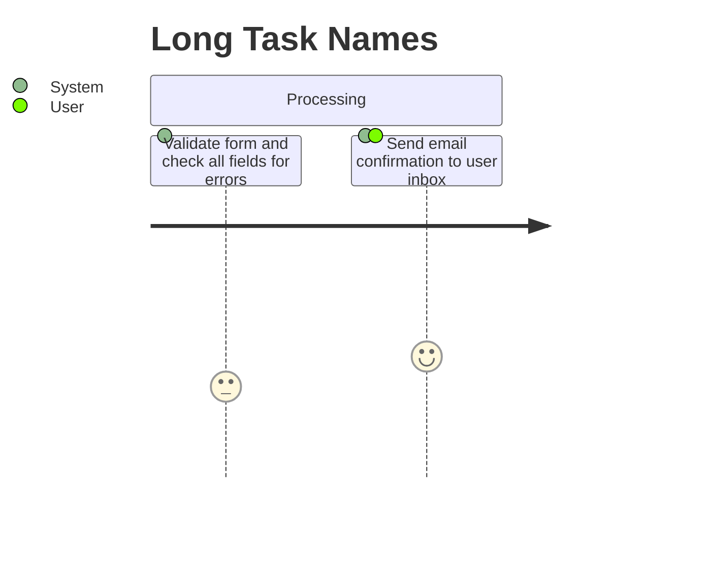

### Section Organization

Organize related tasks within logical sections:

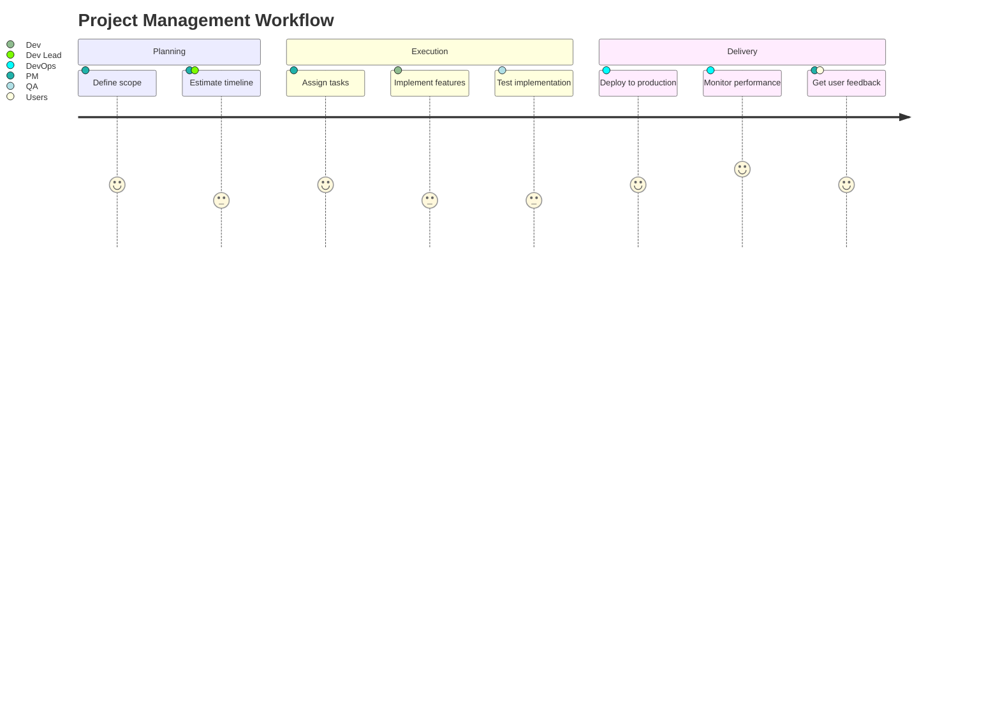

---

## Best Practices

### Organizing Sections

- Use logical workflow phases
- Group related tasks together
- Follow chronological order
- Use 3-5 sections maximum for clarity

### Scoring

- Be consistent with score meanings
- Lower scores indicate pain points to improve
- Higher scores indicate positive experiences
- Use full range (1-5) to show variation

### Actor Naming

- Keep actor names short and clear
- Use consistent naming across diagram
- Represent actual user roles or personas
- Include system actors when relevant (e.g., "Payment System")

---

## Styling with CSS Classes

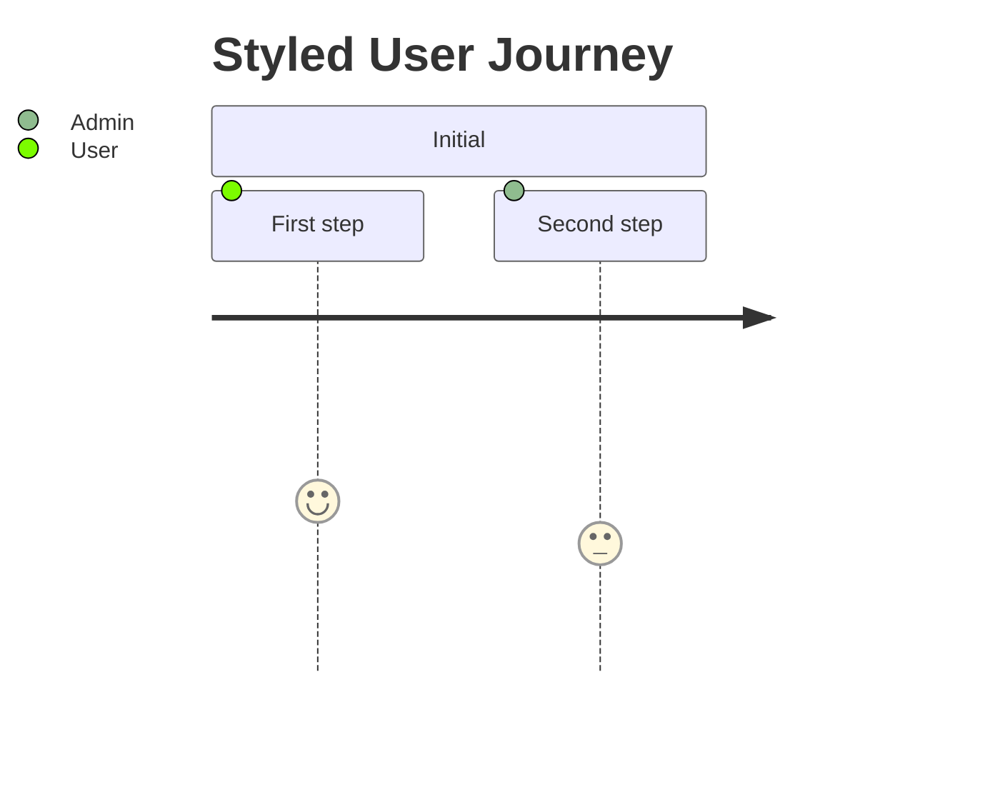

---

## Obsidian Notes

**Viewport**: Very long journeys (20+ tasks) may exceed Obsidian viewport. Consider splitting into multiple diagrams.

**Satisfaction Scoring**: Use consistent scoring methodology. Lower scores highlight improvement opportunities.

**Actor Count**: Limit to 4-5 distinct actors for readability. Too many actors make the diagram cluttered.

**Section Names**: Keep section names short (1-2 words). Long names reduce space for tasks.

**Export**: PDF export renders diagrams as images. For external sharing, capture as PNG/SVG.

**Code Block Format**:
````
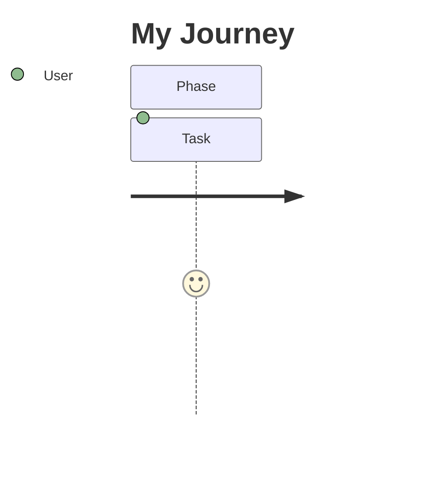
````

---

## Quick Reference Table

| Element | Syntax | Example |
|---------|--------|---------|
| Diagram start | `journey` | `journey` |
| Title | `title text` | `title User Signup` |
| Section | `section name` | `section Verification` |
| Task | `name: score: actors` | `Submit form: 4: User` |
| Score 5 | `5` | Highly satisfied |
| Score 4 | `4` | Satisfied |
| Score 3 | `3` | Neutral |
| Score 2 | `2` | Unsatisfied |
| Score 1 | `1` | Very unsatisfied |
| Single actor | `Actor` | `User` |
| Multiple actors | `Actor1, Actor2` | `User, Admin` |
| Comment | `%% text` | `%% Setup phase` |
