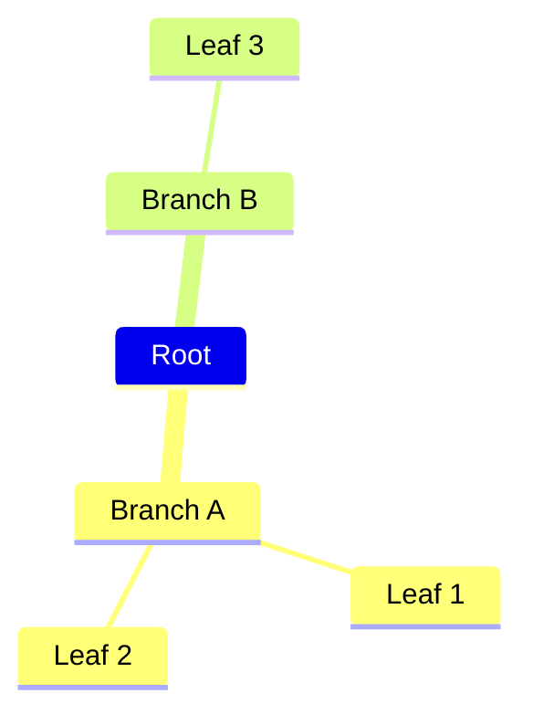
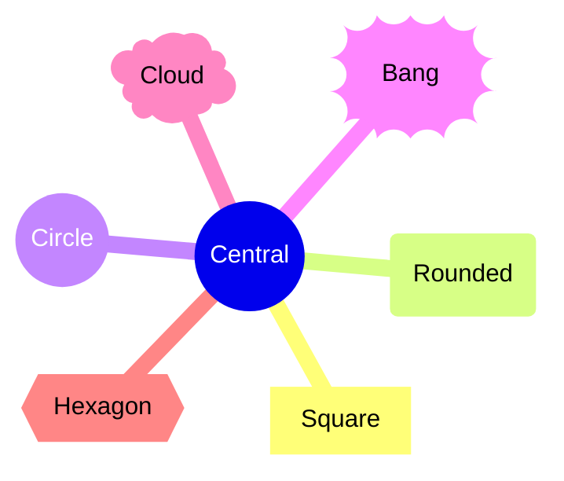
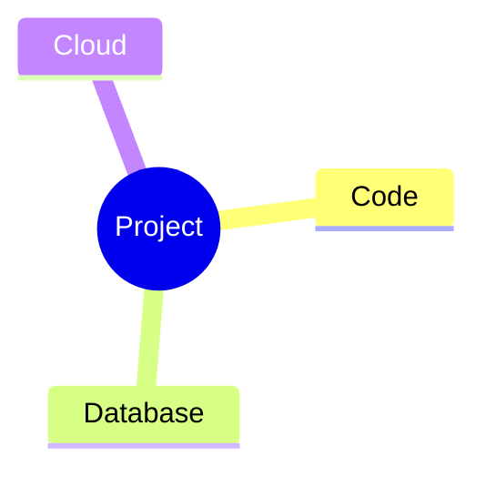
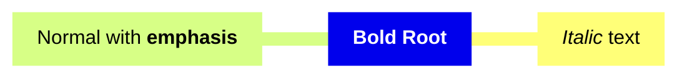
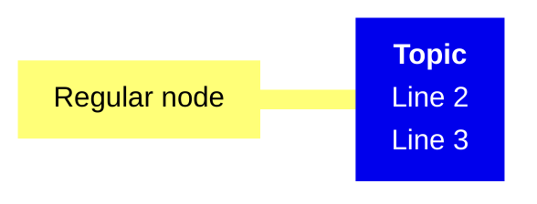
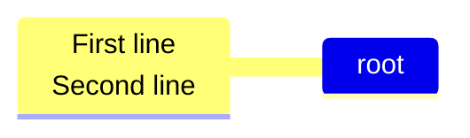
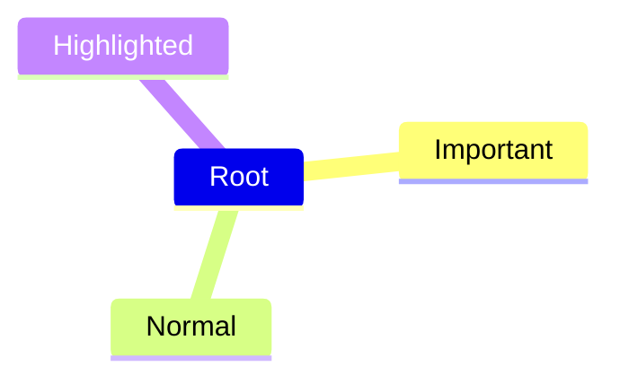
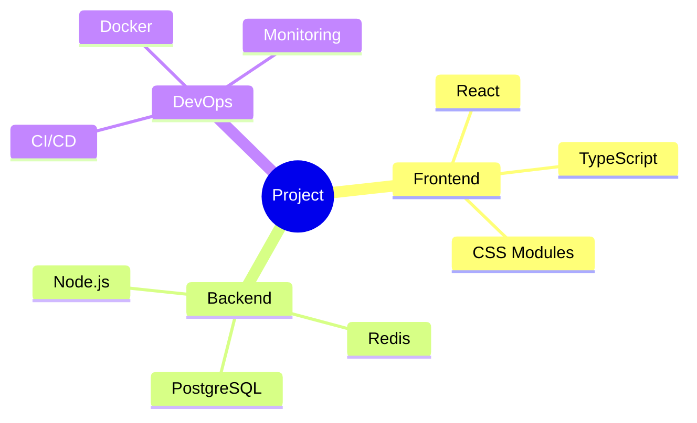
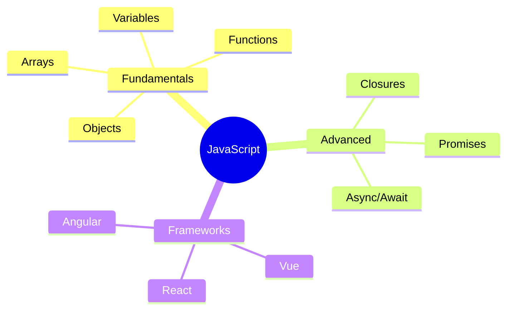
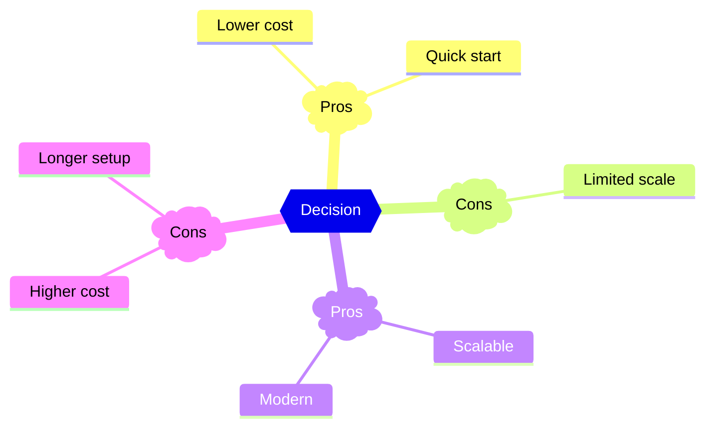

# Mindmap Reference

Visualize hierarchical ideas and brainstorming in Obsidian.

---

## Basic Structure

Indentation defines hierarchy:

**Key points:**
- First node is root
- Use consistent indentation (spaces or tabs, don't mix)
- Deeper indentation = deeper hierarchy

---

## Node Shapes

| Shape | Syntax | Display |
|-------|--------|---------|
| Default | `text` | Plain text |
| Square | `[text]` | Rectangle |
| Rounded | `(text)` | Rounded rectangle |
| Circle | `((text))` | Circle |
| Bang | `))text((` | Explosion shape |
| Cloud | `)text(` | Cloud shape |
| Hexagon | `{{text}}` | Hexagon |

### Shape Examples

---

## Icons

Add icons with `::icon()` on the line after the node:

**Note:** Icon support depends on Obsidian's loaded icon libraries. Font Awesome icons may not display in all setups.

---

## Markdown Text

Use `` "`...`" `` for formatted text:

### Multiline Text

For simple line breaks in regular nodes, use ` `:

---

## CSS Classes

Apply custom styles with `:::`:

**Note:** Define CSS classes in Obsidian's CSS snippets.

---

## Practical Examples

### Example 1: Project Structure

### Example 2: Learning Roadmap

### Example 3: Decision Analysis

---

## Obsidian Notes

**Indentation**: Use consistent spacing. Mix of tabs and spaces causes parsing errors.

**Icons**: Font Awesome/Material Design icons may not render. Test in your setup.

**CSS Classes**: Requires custom CSS snippets in Obsidian settings.

**Special Characters**: Wrap text with special characters in markdown string syntax.

**Performance**: Deep hierarchies (10+ levels) may render slowly.

---

## Quick Reference

| Element | Syntax | Example |
|---------|--------|---------|
| Root | First indented line | `mindmap` + newline + `Root` |
| Square | `[text]` | `[Topic]` |
| Rounded | `(text)` | `(Topic)` |
| Circle | `((text))` | `((Topic))` |
| Cloud | `)text(` | `)Topic(` |
| Bang | `))text((` | `))Topic((` |
| Hexagon | `{{text}}` | `{{Topic}}` |
| Icon | `::icon(class)` | `::icon(fa fa-star)` |
| Markdown | `` ["`text`"] `` | `` ["`**bold**`"] `` |
| CSS class | `:::class` | `:::important` |
