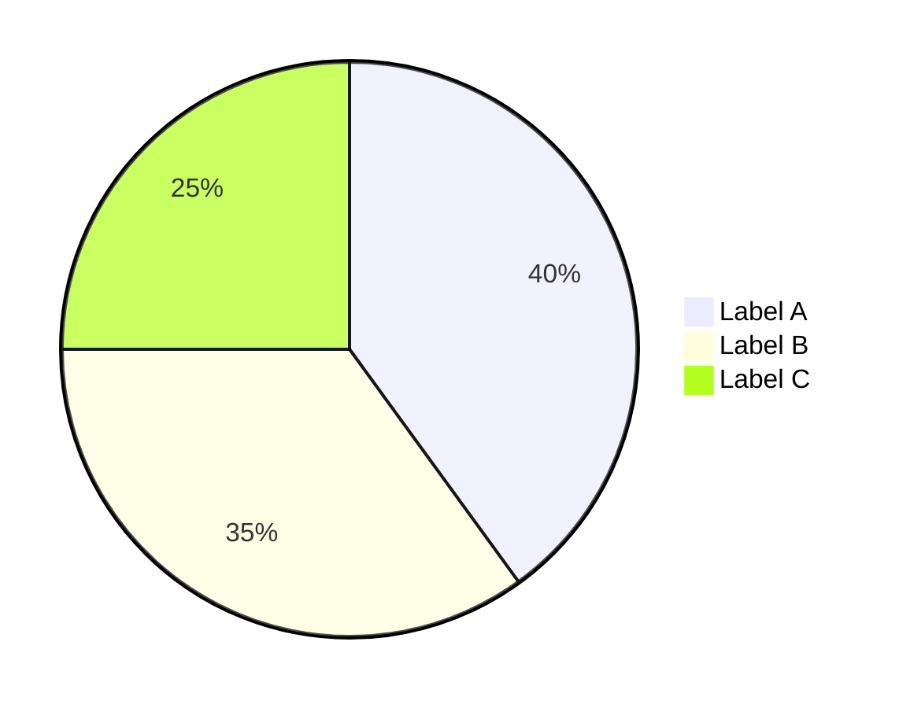
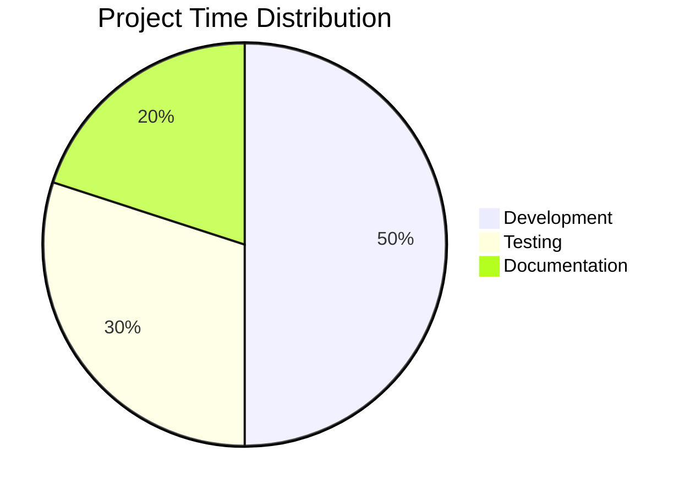
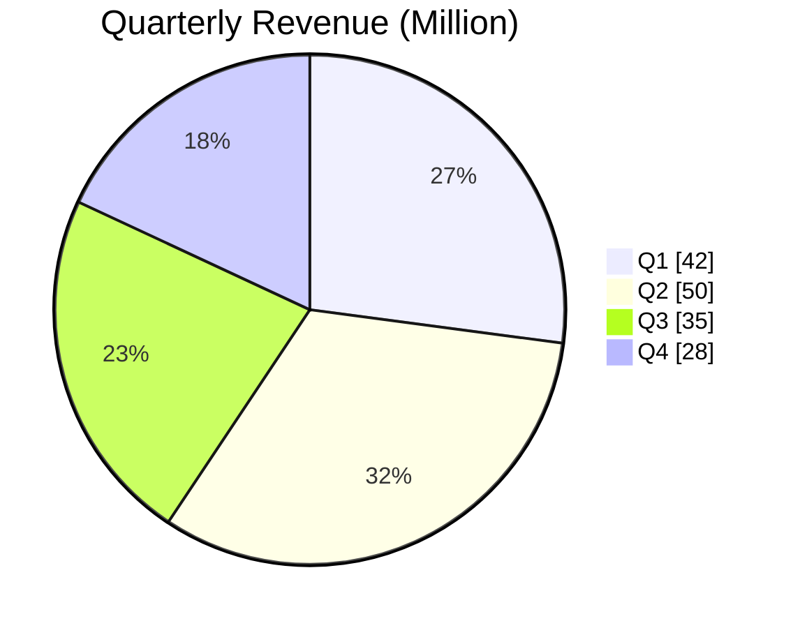
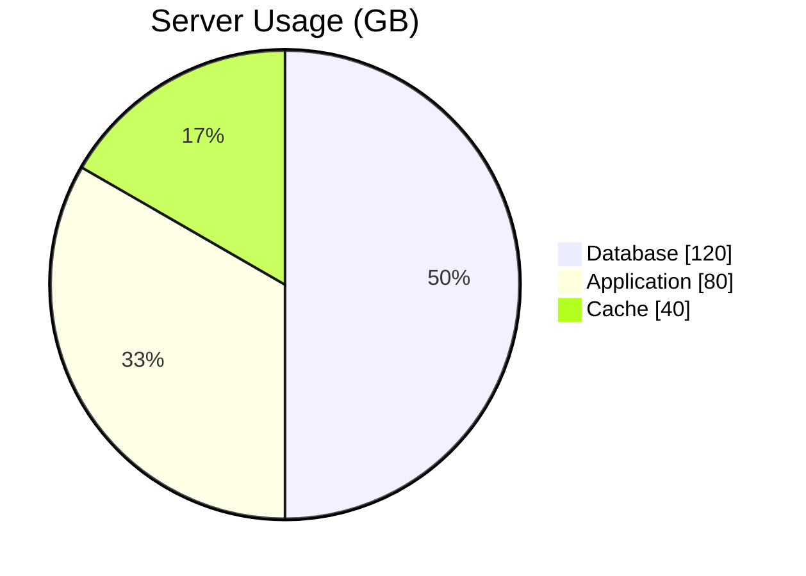
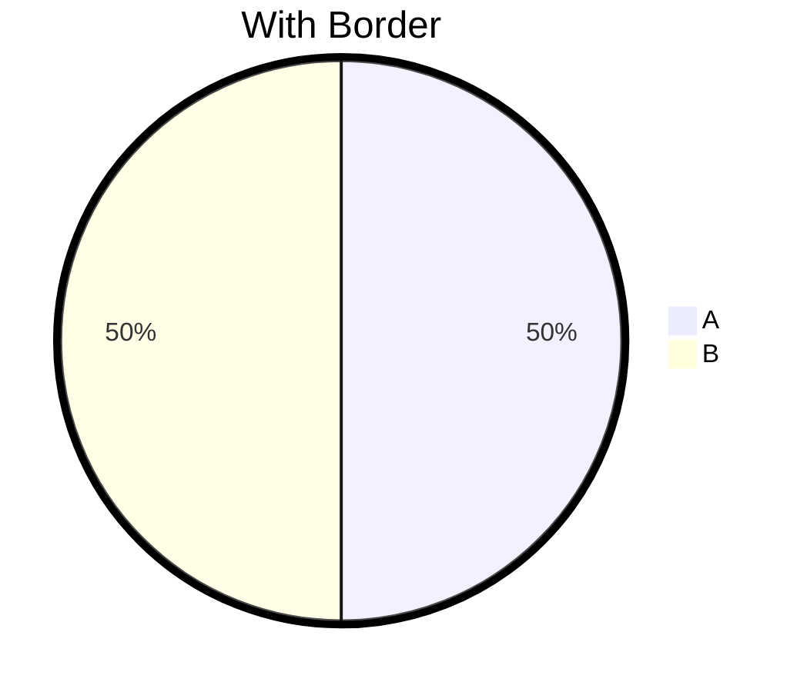
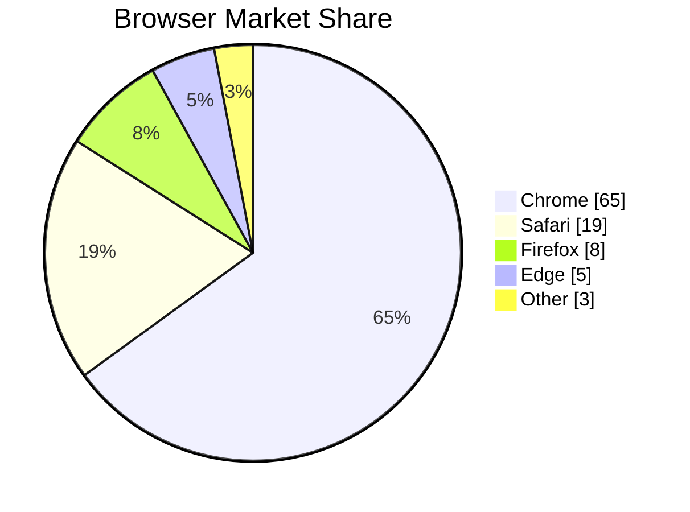
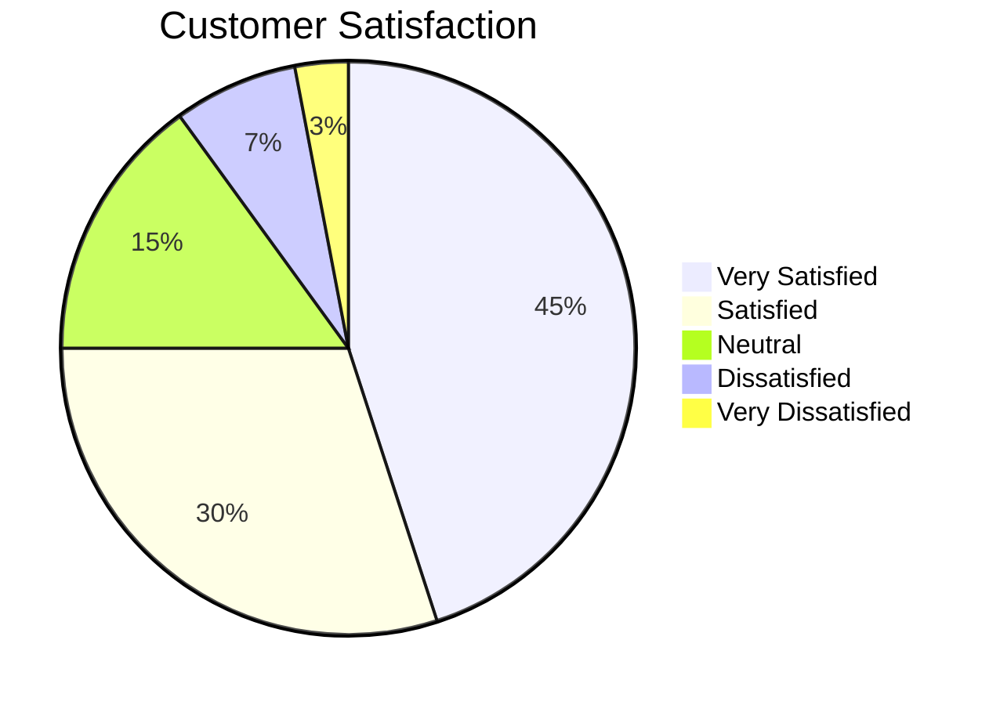
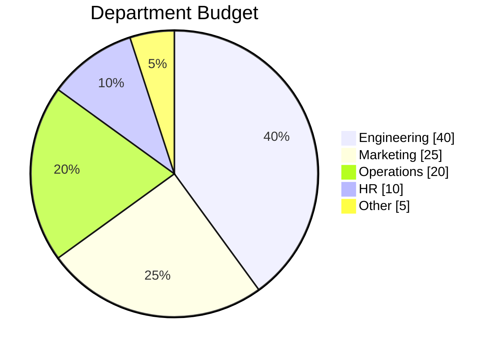

# Pie Chart Reference

Display proportional data in Obsidian.

---

## Basic Syntax

**Format:** `"Label" : value`

- Labels must be in double quotes
- Values are numbers (no units or %)
- Percentages calculated automatically from total

---

## Title

Add a title with `title`:

---

## showData Option

Display actual values alongside percentages:

---

## Configuration

### Text Position

Adjust label position (0 = center, 1 = edge):

### Outer Stroke

Adjust border thickness:

---

## Practical Examples

### Example 1: Market Share

### Example 2: Survey Results

### Example 3: Budget Allocation

---

## Obsidian Notes

**Labels**: Must use double quotes (`"`). Single quotes won't work.

**Values**: Use pure numbers only. No `%`, `$`, or units.

**Item Count**: Keep to 7 or fewer segments for readability.

**Zero Values**: Avoid 0 or negative values (may cause rendering issues).

**Special Characters**: Avoid special characters in labels.

**Auto Calculation**: Values don't need to sum to 100. Percentages are calculated from total.

---

## Quick Reference

| Element | Syntax | Example |
|---------|--------|---------|
| Basic | `pie` | `pie` |
| Title | `title text` | `title Budget` |
| Show values | `showData` | `pie showData` |
| Data item | `"label" : value` | `"Sales" : 45` |
| Text position | `%%{init: {"pie": {"textPosition": 0.5}}}%%` | 0-1 range |
| Border width | `%%{init: {"themeVariables": {"pieOuterStrokeWidth": "3px"}}}%%` | Any CSS size |
