# Sequence Diagram Reference

Complete guide for Mermaid sequence diagrams in Obsidian.

---

## Participants

### participant vs actor

- `participant`: Rectangle box (systems, services)
- `actor`: Stick figure icon (users, people)

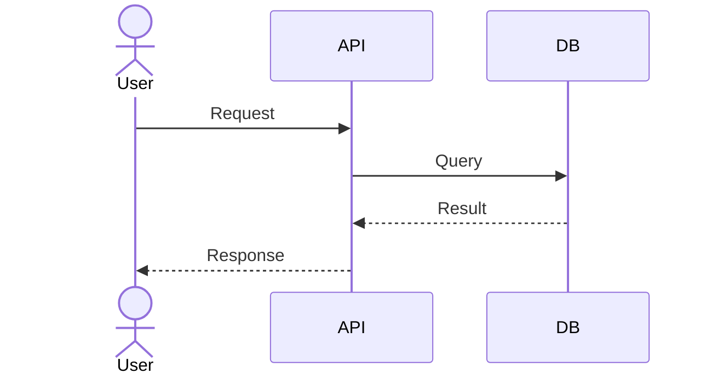
```mermaid
sequenceDiagram
    actor User
    participant API
    participant DB

    User->>API: Request
    API->>DB: Query
    DB-->>API: Result
    API-->>User: Response
```

### Aliases

Use `as` for long names:

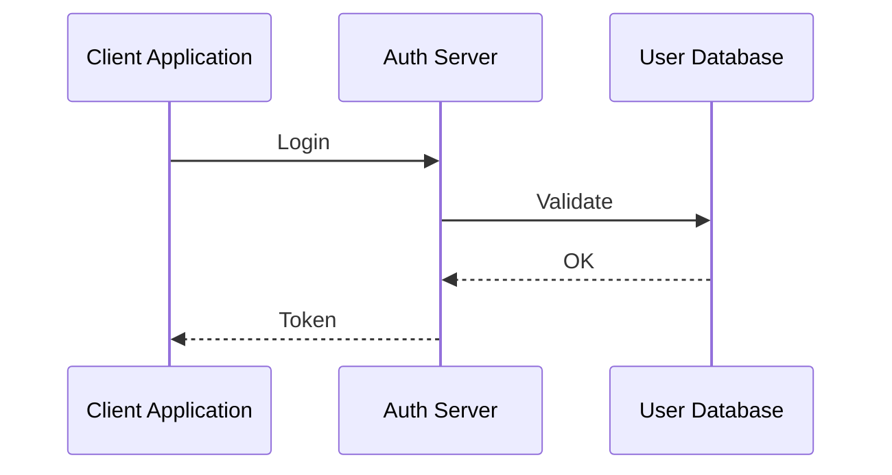
```mermaid
sequenceDiagram
    participant C as Client Application
    participant S as Auth Server
    participant D as User Database

    C->>S: Login
    S->>D: Validate
    D-->>S: OK
    S-->>C: Token
```

### Participant Order

Declare participants first to control order:

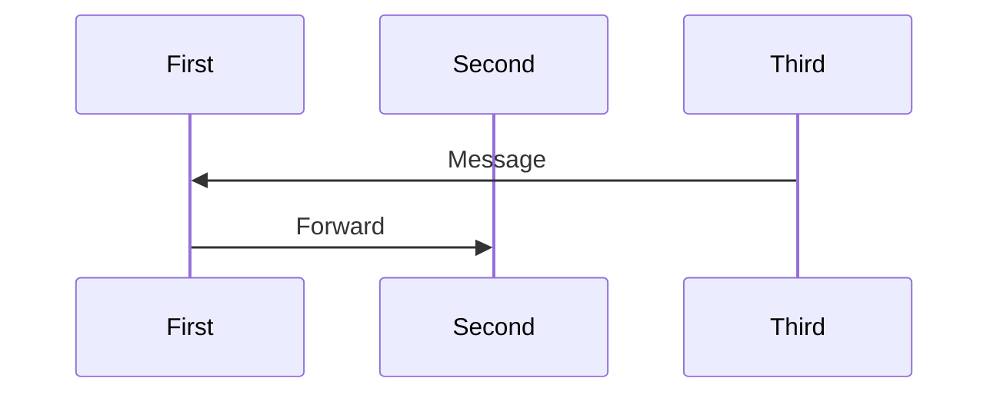
```mermaid
sequenceDiagram
    participant A as First
    participant B as Second
    participant C as Third

    C->>A: Message
    A->>B: Forward
```

---

## Message Types

| Syntax | Style | Use Case |
|--------|-------|----------|
| `->` | Solid, no arrow | Connection |
| `-->` | Dotted, no arrow | Weak connection |
| `->>` | Solid arrow | Sync call |
| `-->>` | Dotted arrow | Response |
| `-x` | Solid with X | Failure/termination |
| `--x` | Dotted with X | Async failure |
| `-)` | Open arrow | Async call |
| `--)` | Dotted open | Async response |

### Message Examples

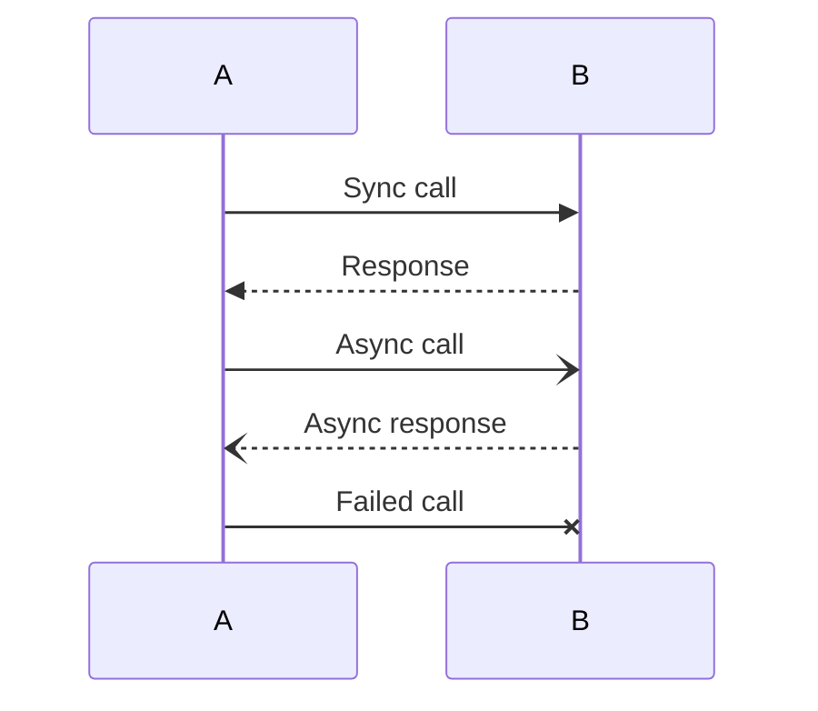
```mermaid
sequenceDiagram
    participant A
    participant B

    A->>B: Sync call
    B-->>A: Response
    A-)B: Async call
    B--)A: Async response
    A-xB: Failed call
```

### Bidirectional

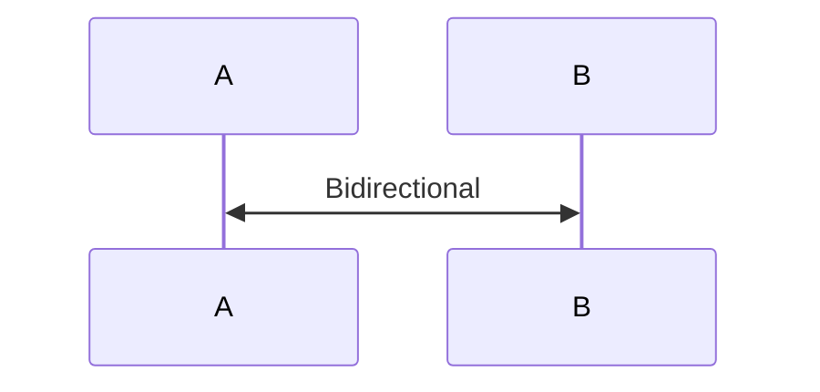
```mermaid
sequenceDiagram
    participant A
    participant B

    A<<->>B: Bidirectional
```

---

## Activation

Show when a participant is processing.

### Explicit Activation

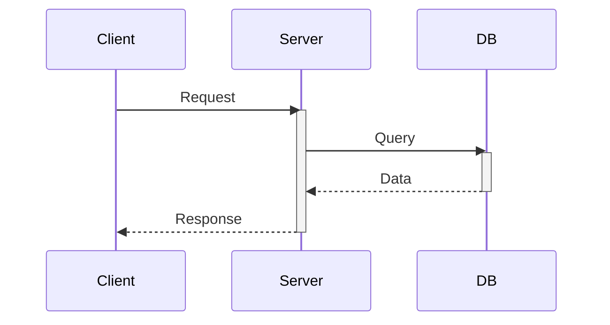
```mermaid
sequenceDiagram
    Client->>Server: Request
    activate Server
    Server->>DB: Query
    activate DB
    DB-->>Server: Data
    deactivate DB
    Server-->>Client: Response
    deactivate Server
```

### Shorthand (+/-)

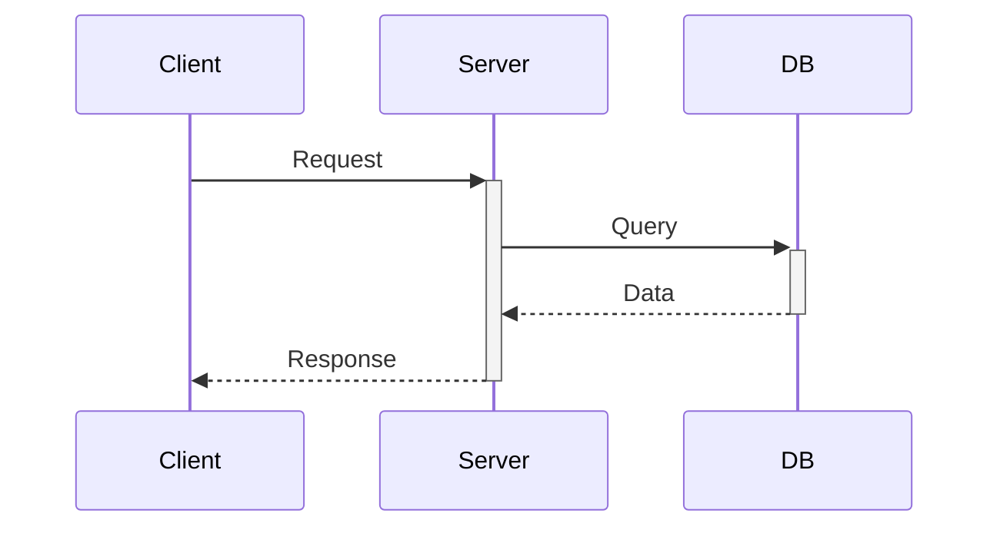
```mermaid
sequenceDiagram
    Client->>+Server: Request
    Server->>+DB: Query
    DB-->>-Server: Data
    Server-->>-Client: Response
```

### Nested Activation

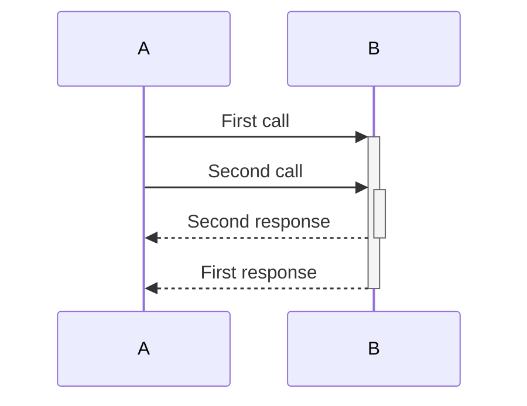
```mermaid
sequenceDiagram
    A->>+B: First call
    A->>+B: Second call
    B-->>-A: Second response
    B-->>-A: First response
```

---

## Notes

### Position Options

| Syntax | Position |
|--------|----------|
| `Note right of A` | Right side |
| `Note left of A` | Left side |
| `Note over A` | Above participant |
| `Note over A,B` | Spanning multiple |

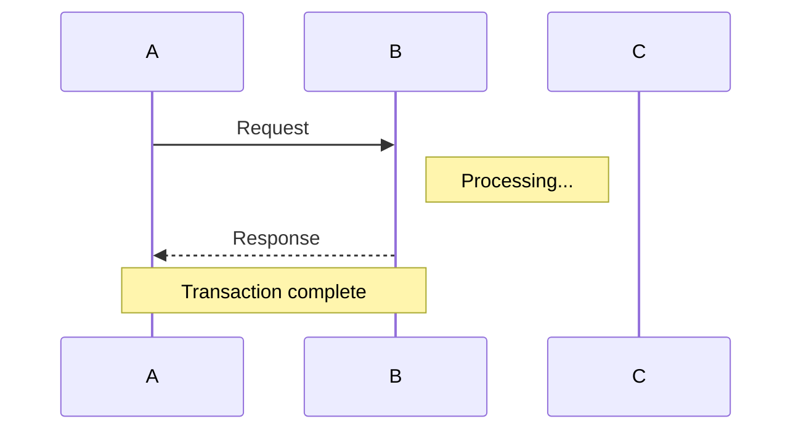
```mermaid
sequenceDiagram
    participant A
    participant B
    participant C

    A->>B: Request
    Note right of B: Processing...
    B-->>A: Response
    Note over A,B: Transaction complete
```

### Multiline Notes

Use `<br/>` for line breaks:

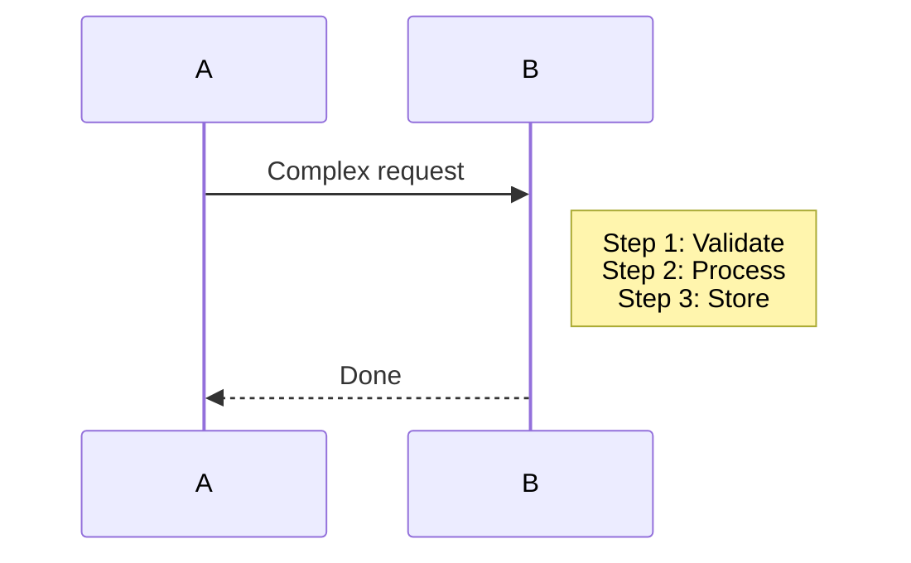
```mermaid
sequenceDiagram
    A->>B: Complex request
    Note right of B: Step 1: Validate<br/>Step 2: Process<br/>Step 3: Store
    B-->>A: Done
```

---

## Control Structures

### loop - Repetition

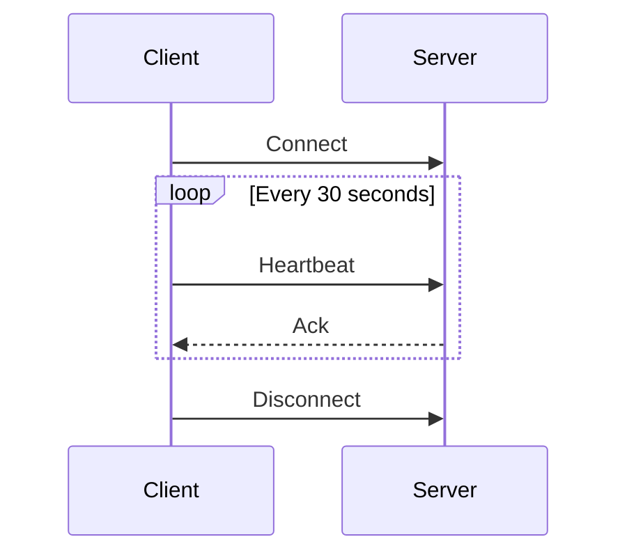
```mermaid
sequenceDiagram
    participant Client
    participant Server

    Client->>Server: Connect
    loop Every 30 seconds
        Client->>Server: Heartbeat
        Server-->>Client: Ack
    end
    Client->>Server: Disconnect
```

### alt/else - Conditional

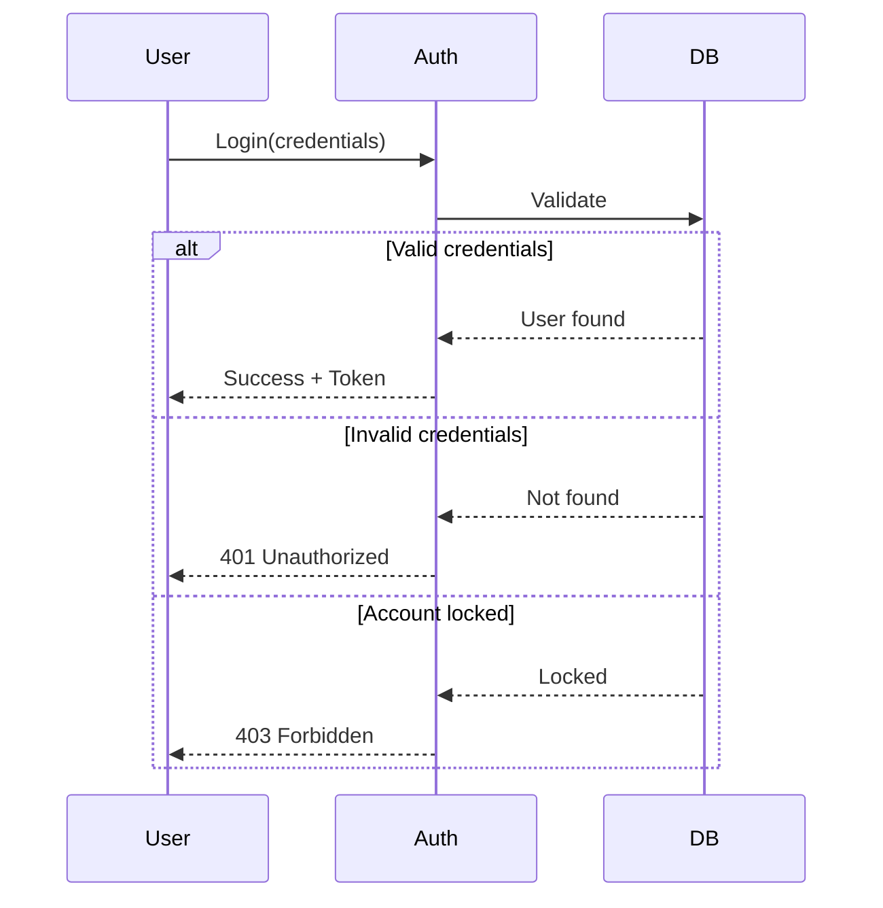
```mermaid
sequenceDiagram
    participant User
    participant Auth
    participant DB

    User->>Auth: Login(credentials)
    Auth->>DB: Validate

    alt Valid credentials
        DB-->>Auth: User found
        Auth-->>User: Success + Token
    else Invalid credentials
        DB-->>Auth: Not found
        Auth-->>User: 401 Unauthorized
    else Account locked
        DB-->>Auth: Locked
        Auth-->>User: 403 Forbidden
    end
```

### opt - Optional

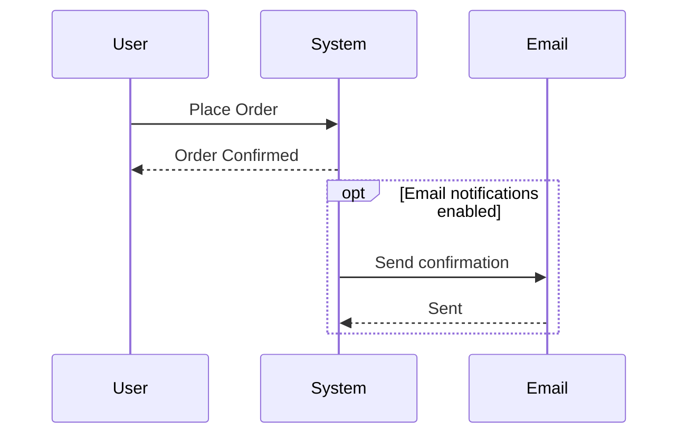
```mermaid
sequenceDiagram
    participant User
    participant System
    participant Email

    User->>System: Place Order
    System-->>User: Order Confirmed

    opt Email notifications enabled
        System->>Email: Send confirmation
        Email-->>System: Sent
    end
```

### par/and - Parallel

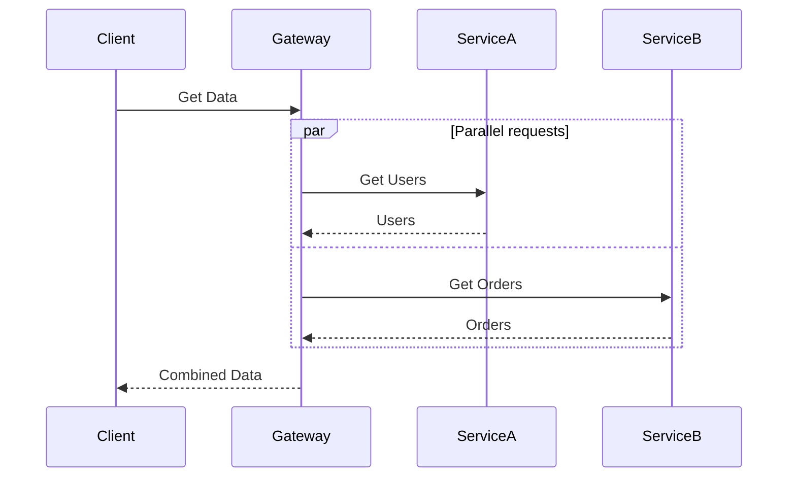
```mermaid
sequenceDiagram
    participant Client
    participant Gateway
    participant ServiceA
    participant ServiceB

    Client->>Gateway: Get Data

    par Parallel requests
        Gateway->>ServiceA: Get Users
        ServiceA-->>Gateway: Users
    and
        Gateway->>ServiceB: Get Orders
        ServiceB-->>Gateway: Orders
    end

    Gateway-->>Client: Combined Data
```

### critical/option - Critical Section

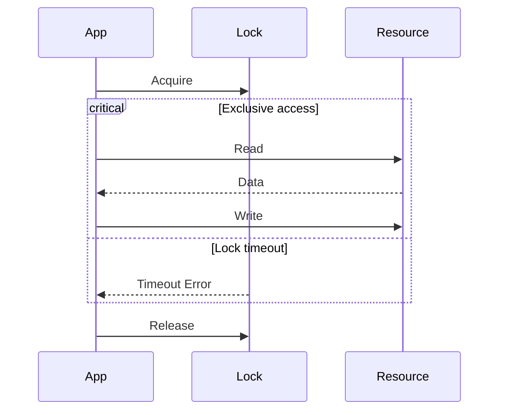
```mermaid
sequenceDiagram
    participant App
    participant Lock
    participant Resource

    App->>Lock: Acquire

    critical Exclusive access
        App->>Resource: Read
        Resource-->>App: Data
        App->>Resource: Write
    option Lock timeout
        Lock-->>App: Timeout Error
    end

    App->>Lock: Release
```

### break - Early Exit

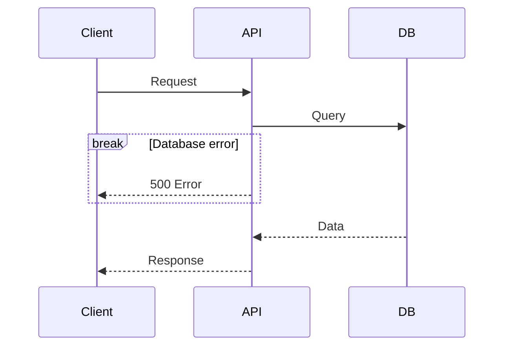
```mermaid
sequenceDiagram
    participant Client
    participant API
    participant DB

    Client->>API: Request
    API->>DB: Query

    break Database error
        API-->>Client: 500 Error
    end

    DB-->>API: Data
    API-->>Client: Response
```

### rect - Highlight Region

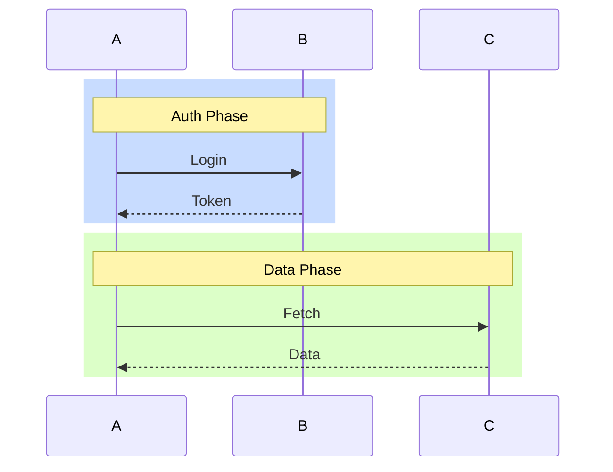
```mermaid
sequenceDiagram
    participant A
    participant B
    participant C

    rect rgb(200, 220, 255)
        Note over A,B: Auth Phase
        A->>B: Login
        B-->>A: Token
    end

    rect rgb(220, 255, 200)
        Note over A,C: Data Phase
        A->>C: Fetch
        C-->>A: Data
    end
```

---

## Autonumber

Auto-number messages:

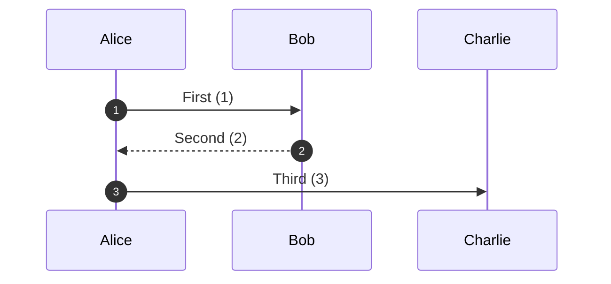
```mermaid
sequenceDiagram
    autonumber

    Alice->>Bob: First (1)
    Bob-->>Alice: Second (2)
    Alice->>Charlie: Third (3)
```

### Custom Start

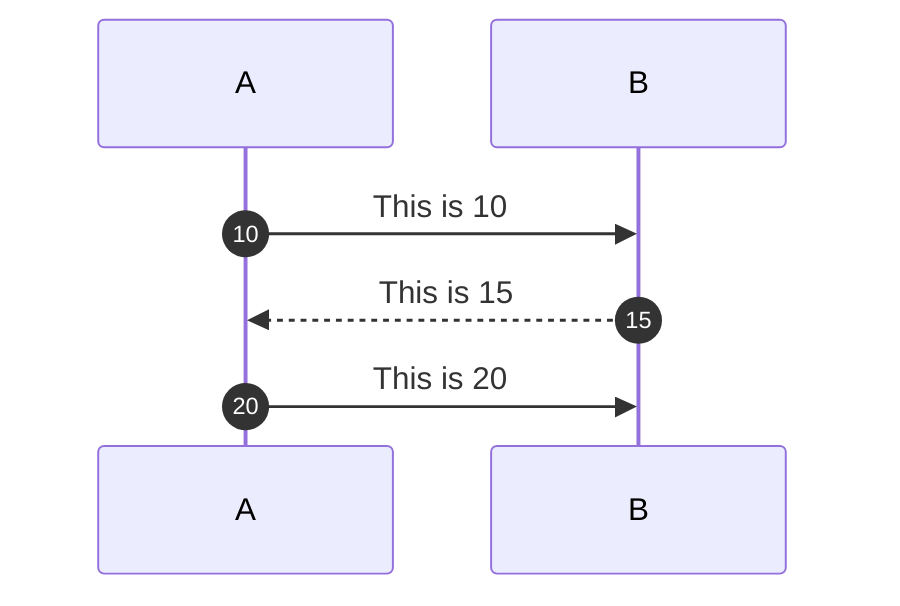
```mermaid
sequenceDiagram
    autonumber 10 5

    A->>B: This is 10
    B-->>A: This is 15
    A->>B: This is 20
```

### Toggle On/Off

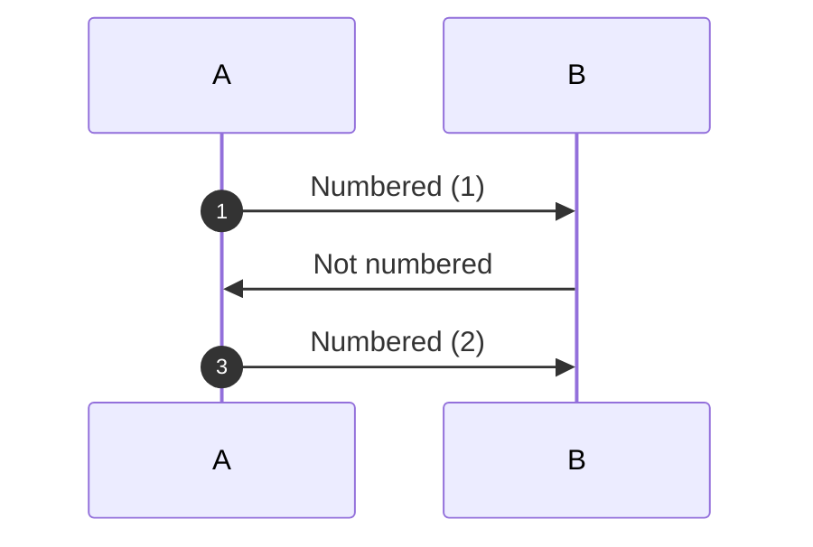
```mermaid
sequenceDiagram
    autonumber
    A->>B: Numbered (1)

    autonumber off
    B->>A: Not numbered

    autonumber
    A->>B: Numbered (2)
```

---

## Participant Boxes

Group participants logically:

```mermaid
sequenceDiagram
    box LightBlue Client
        actor User
        participant App
    end

    box LightGreen Server
        participant API
        participant DB
    end

    User->>App: Click
    App->>API: Request
    API->>DB: Query
    DB-->>API: Data
    API-->>App: Response
    App-->>User: Display
```

### RGB Colors

```mermaid
sequenceDiagram
    box rgb(173, 216, 230) Frontend
        participant Web
        participant Mobile
    end

    box rgba(144, 238, 144, 0.7) Backend
        participant API
    end

    Web->>API: HTTP
    Mobile->>API: HTTP
```

---

## Create/Destroy

Dynamic participant lifecycle (v10.3.0+):

```mermaid
sequenceDiagram
    participant Factory
    participant Client

    Client->>Factory: Create Worker
    create participant Worker
    Factory->>Worker: Initialize
    Worker-->>Factory: Ready

    Client->>Worker: Do Task
    Worker-->>Client: Done

    destroy Worker
    Client-xWorker: Terminate
```

---

## Practical Examples

### Example 1: REST API Authentication

```mermaid
sequenceDiagram
    autonumber

    actor User
    participant Client as Web Client
    participant API as REST API
    participant Auth as Auth Service
    participant DB as Database

    User->>Client: Enter credentials
    Client->>+API: POST /login
    API->>+Auth: Validate
    Auth->>+DB: Find user

    alt User exists
        DB-->>Auth: User record
        Auth->>Auth: Verify password

        alt Password matches
            Auth->>Auth: Generate JWT
            Auth-->>-API: Token
            API-->>-Client: 200 OK + Token
            Client->>Client: Store token
            Client-->>User: Login success
        else Password wrong
            Auth-->>API: Invalid
            API-->>Client: 401 Unauthorized
            Client-->>User: Wrong password
        end
    else User not found
        DB-->>-Auth: Not found
        Auth-->>API: Invalid
        API-->>Client: 401 Unauthorized
        Client-->>User: User not found
    end
```

### Example 2: Microservice Order Flow

```mermaid
sequenceDiagram
    autonumber

    box rgb(173, 216, 230) Client
        actor User
        participant Gateway
    end

    box rgb(144, 238, 144) Services
        participant Order as Order Svc
        participant Inventory as Inventory Svc
        participant Payment as Payment Svc
    end

    box rgb(255, 218, 185) Infrastructure
        participant MQ as Message Queue
        participant DB as Database
    end

    User->>Gateway: Place Order
    Gateway->>+Order: Create Order

    par Check inventory
        Order->>+Inventory: Reserve items
        Inventory->>DB: Check stock
        DB-->>Inventory: Available
        Inventory-->>-Order: Reserved
    and Process payment
        Order->>+Payment: Charge
        Payment-->>-Order: Confirmed
    end

    Order->>DB: Save order
    Order-)MQ: OrderCreated event
    Order-->>-Gateway: Success
    Gateway-->>User: Order confirmed

    Note over MQ: Async processing
    MQ-)Inventory: Update stock
    MQ-)Payment: Record transaction
```

### Example 3: WebSocket Lifecycle

```mermaid
sequenceDiagram
    autonumber

    participant Client
    participant Server
    participant Handler

    Client->>Server: HTTP Upgrade
    Server-->>Client: 101 Switching Protocols

    Note over Client,Server: Connection established

    rect rgb(220, 255, 220)
        loop While connected
            alt Client message
                Client->>Server: WS Message
                Server->>Handler: Process
                Handler-->>Server: Result
                Server-->>Client: WS Response
            else Server push
                Server-)Client: Notification
            else Keep-alive
                Client->>Server: Ping
                Server-->>Client: Pong
            end
        end
    end

    alt Normal close
        Client->>Server: Close frame
        Server-->>Client: Close ack
    else Connection lost
        break Network error
            Server--xClient: Connection dropped
        end
    end

    Note over Client,Server: Connection closed
```

### Example 4: OAuth 2.0 Authorization Code Flow

```mermaid
sequenceDiagram
    autonumber

    actor User
    participant Browser
    participant App as Client App
    participant Auth as Auth Server
    participant Resource as Resource API

    User->>Browser: Click "Login with OAuth"
    Browser->>App: Initiate login
    App->>Browser: Redirect to Auth Server
    Browser->>Auth: Authorization request

    Auth->>User: Show login form
    User->>Auth: Enter credentials
    Auth->>User: Show consent screen
    User->>Auth: Grant permission

    Auth->>Browser: Redirect with auth code
    Browser->>App: Auth code callback

    rect rgb(255, 240, 200)
        Note over App,Auth: Server-to-server (secure)
        App->>Auth: Exchange code for tokens
        Auth-->>App: Access + Refresh tokens
    end

    App->>Browser: Set session
    Browser-->>User: Logged in

    loop API calls
        Browser->>App: Request data
        App->>Resource: API call + Access token

        alt Token valid
            Resource-->>App: Data
            App-->>Browser: Response
        else Token expired
            Resource-->>App: 401
            App->>Auth: Refresh token
            Auth-->>App: New access token
            App->>Resource: Retry
            Resource-->>App: Data
            App-->>Browser: Response
        end
    end
```

---

## Obsidian Notes

**Theme Compatibility**: Diagram colors adapt to Obsidian theme. Use `box` with explicit colors for consistency.

**Performance**: Complex diagrams with many participants may render slowly. Keep to 6-8 participants max.

**Export**: PDF export converts to images. Capture as PNG/SVG for external sharing.

**No JavaScript**: Click callbacks are disabled for security.

**Special Characters**: Wrap messages with special characters in quotes:
```
A->>B: "Message with : colon"
```

**Version Features**: Some features require Mermaid 10.3.0+:
- `create`/`destroy`: Dynamic participants
- `box`: Participant grouping
- `critical`/`break`: Control structures

**Code Block Format**:
````
```mermaid
sequenceDiagram
    A->>B: Hello
    B-->>A: Hi
```
````

---

## Quick Reference Table

| Category | Syntax | Example |
|----------|--------|---------|
| Participant | `participant id as Name` | `participant S as Server` |
| Actor | `actor id as Name` | `actor U as User` |
| Sync call | `->>` | `A->>B: Request` |
| Response | `-->>` | `B-->>A: Response` |
| Async call | `-)` | `A-)B: Event` |
| Failure | `-x` | `A-xB: Error` |
| Activate | `activate id` or `+` | `A->>+B: Call` |
| Deactivate | `deactivate id` or `-` | `B-->>-A: Return` |
| Note | `Note right of id` | `Note right of A: text` |
| Note span | `Note over A,B` | `Note over A,B: text` |
| Loop | `loop label ... end` | `loop Every 5s` |
| Condition | `alt ... else ... end` | `alt success` |
| Optional | `opt label ... end` | `opt cache hit` |
| Parallel | `par ... and ... end` | `par Task A` |
| Critical | `critical ... option ... end` | `critical Lock` |
| Break | `break label ... end` | `break error` |
| Highlight | `rect rgb(r,g,b)` | `rect rgb(200,220,255)` |
| Box | `box Color Name ... end` | `box LightBlue Client` |
| Autonumber | `autonumber` | `autonumber 10 5` |
| Comment | `%%` | `%% note` |
