# State Diagram Reference

Complete guide for Mermaid state diagrams in Obsidian.

---

## Basic Structure

Use `stateDiagram-v2` for latest features:

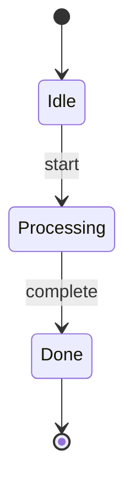

### Start and End States

`[*]` represents both start and end states:
- `[*] --> State`: Start state
- `State --> [*]`: End state

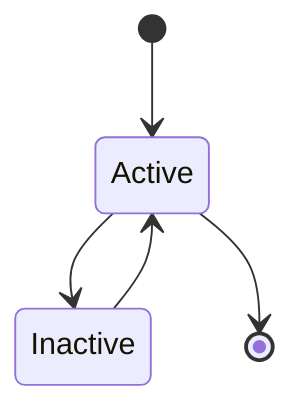

---

## State Definition

### Simple States

States are auto-created from transitions:

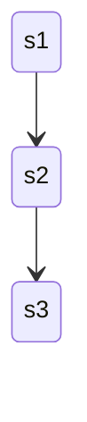

### State with Description

Use colon for description:

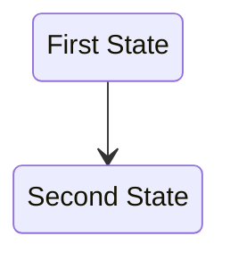

### State with Alias

Use `state` keyword with `as`:

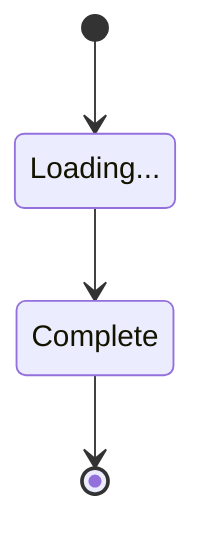

---

## Transitions

### Basic Transition

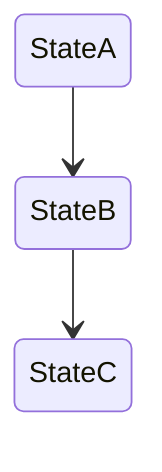

### Transition with Label

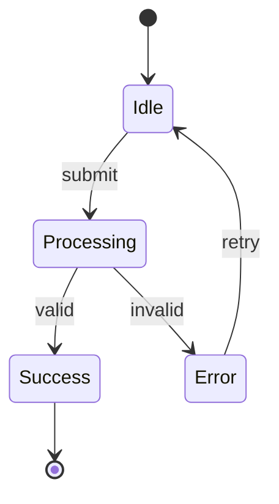

### Self-Transition

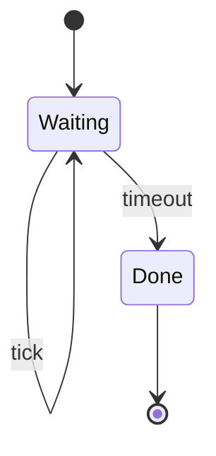

---

## Composite States

Nested states within a parent state:

### Basic Composite

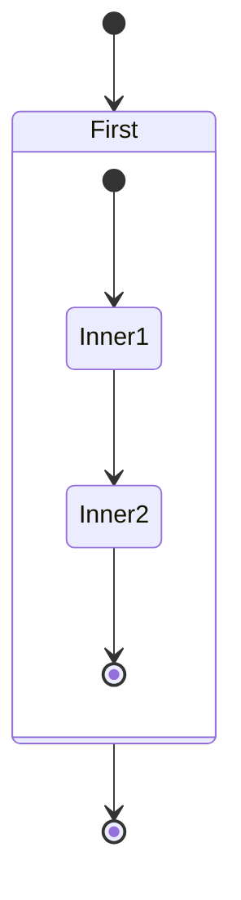

### Named Composite

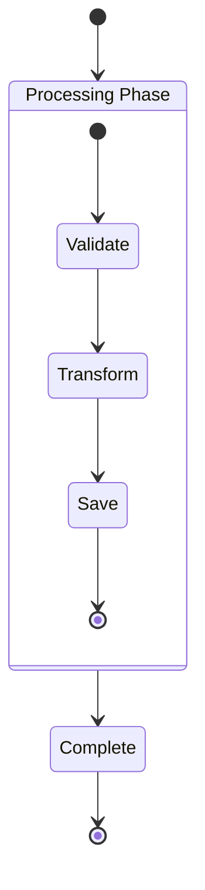

### Nested Composite

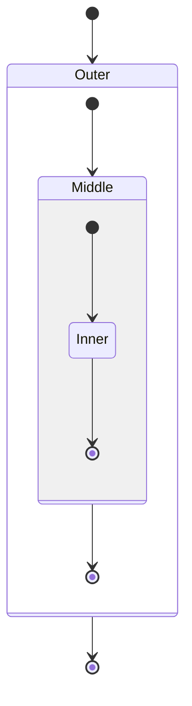

### Composite with Transitions

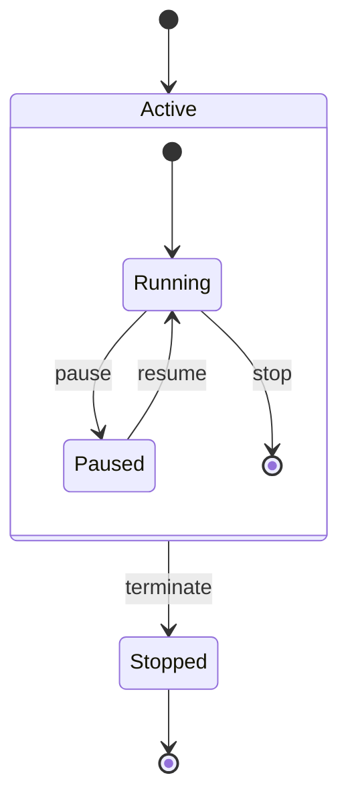

---

## Fork and Join

For parallel execution paths:

### Fork (Split)

`<<fork>>` splits one flow into multiple parallel paths:

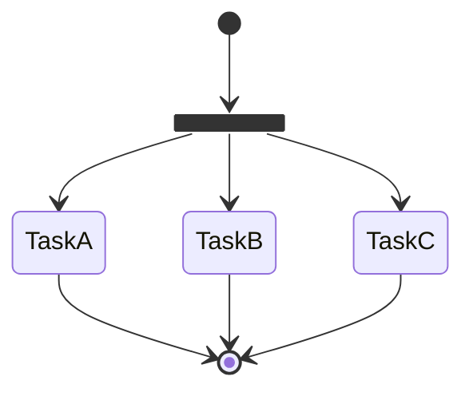

### Join (Merge)

`<<join>>` merges multiple paths into one:

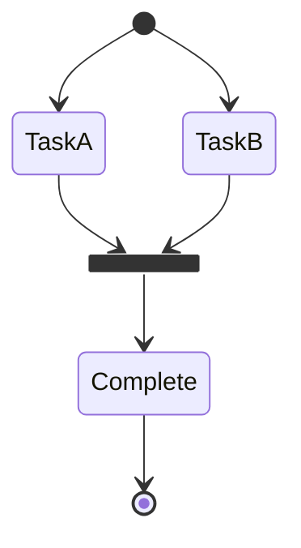

### Fork and Join Combined

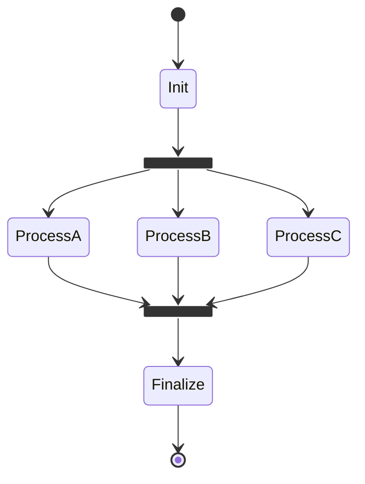

### Practical Fork/Join Example

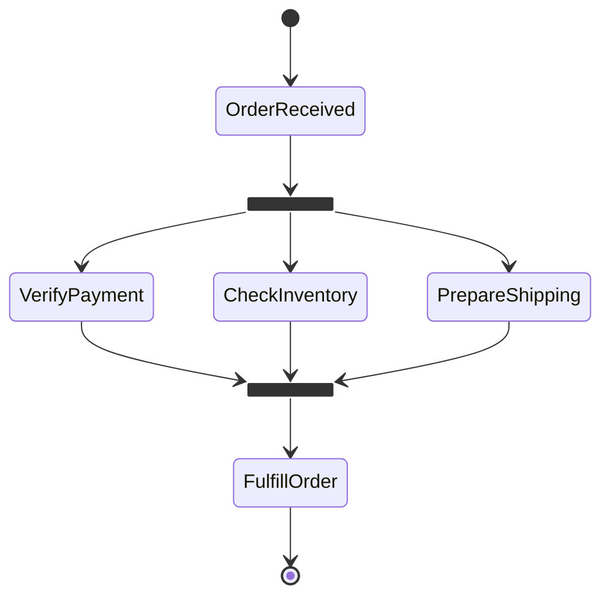

---

## Choice (Conditional)

`<<choice>>` for conditional branching:

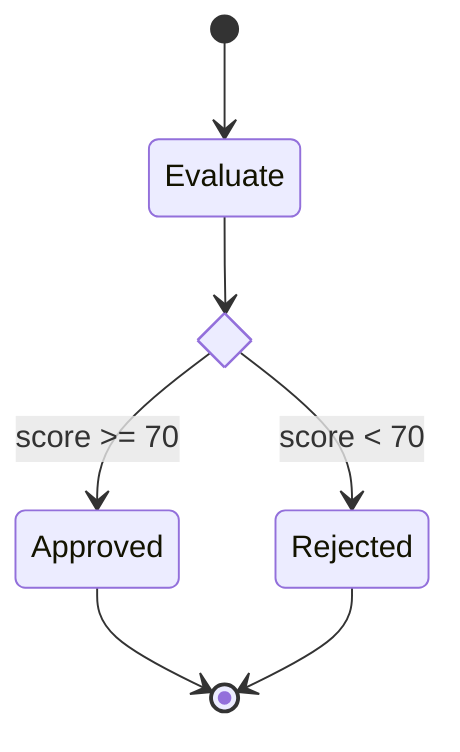

### Multiple Conditions

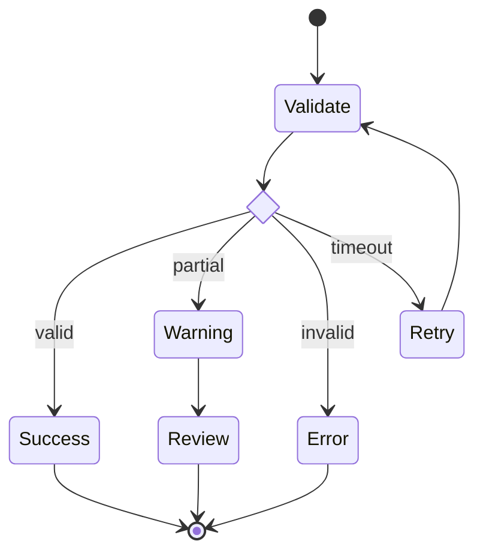

---

## Concurrent States

Use `--` separator for independent parallel regions:

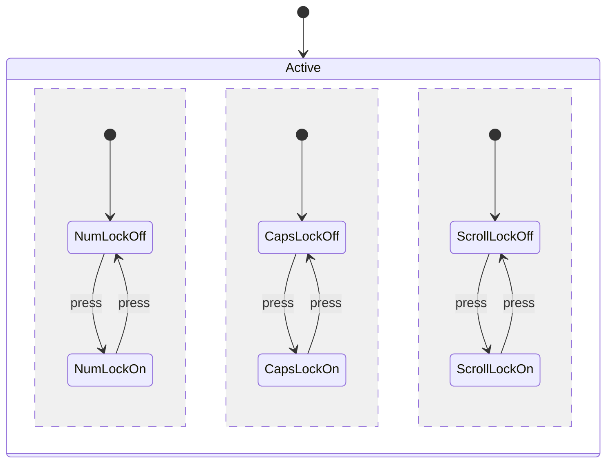

### Practical Concurrent Example

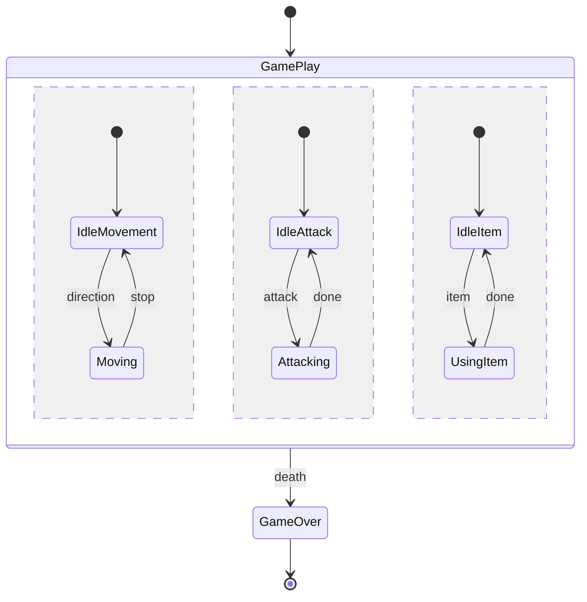

---

## Notes

### Right Note

```mermaid
stateDiagram-v2
    State1: Active State
    note right of State1
        Important information
        Multiple lines supported
    end note
    State1 --> State2
```

### Left Note

```mermaid
stateDiagram-v2
    direction LR
    State1 --> State2
    note left of State2 : Left side note
```

### Single Line Note

```mermaid
stateDiagram-v2
    State1 --> State2
    note right of State1 : Quick note here
    note right of State2 : Another note
```

---

## Direction

| Value | Direction |
|-------|-----------|
| `TB` | Top to Bottom (default) |
| `BT` | Bottom to Top |
| `LR` | Left to Right |
| `RL` | Right to Left |

```mermaid
stateDiagram-v2
    direction LR
    [*] --> A --> B --> C --> [*]
```

```mermaid
stateDiagram-v2
    direction TB
    [*] --> A --> B --> C --> [*]
```

---

## Styling

### Class Definitions

```mermaid
stateDiagram-v2
    direction LR

    classDef success fill:#4CAF50,color:white
    classDef error fill:#F44336,color:white
    classDef pending fill:#FFC107,color:black

    [*] --> Pending
    Pending --> Success
    Pending --> Error
    Success --> [*]
    Error --> Pending

    class Pending pending
    class Success success
    class Error error
```

### Inline Class Application

```mermaid
stateDiagram-v2
    classDef highlight fill:#ff6b6b,color:white,font-weight:bold

    [*] --> Normal
    Normal --> Critical:::highlight
    Critical:::highlight --> Normal
    Normal --> [*]
```

### Multiple Style Properties

```mermaid
stateDiagram-v2
    classDef badState fill:#f00,color:white,font-weight:bold,stroke-width:2px,stroke:yellow

    [*] --> Running
    Running --> Crashed:::badState
    Crashed:::badState --> [*]
```

---

## Practical Examples

### Example 1: Order Processing System

```mermaid
stateDiagram-v2
    [*] --> Cart

    Cart --> Checkout : proceed
    Checkout --> PaymentPending : confirm

    state payment_check <<choice>>
    PaymentPending --> payment_check
    payment_check --> PaymentSuccess : approved
    payment_check --> PaymentFailed : declined

    PaymentFailed --> PaymentPending : retry
    PaymentFailed --> Cart : cancel

    PaymentSuccess --> Processing
    Processing --> Shipped
    Shipped --> Delivered
    Delivered --> [*]

    note right of PaymentPending : PG Integration
    note right of Shipped : Real-time tracking
```

### Example 2: User Authentication Flow

```mermaid
stateDiagram-v2
    direction LR

    [*] --> LoggedOut

    LoggedOut --> Authenticating : login

    state auth_result <<choice>>
    Authenticating --> auth_result

    auth_result --> LoggedIn : success
    auth_result --> LoginFailed : failure

    LoginFailed --> LoggedOut : retry

    LoggedIn --> SessionActive
    SessionActive --> SessionExpired : timeout
    SessionActive --> LoggedOut : logout

    SessionExpired --> LoggedOut
```

### Example 3: File Upload Process

```mermaid
stateDiagram-v2
    [*] --> Idle

    Idle --> FileSelected : select

    state fork_validate <<fork>>
    FileSelected --> fork_validate
    fork_validate --> ValidatingType
    fork_validate --> ValidatingSize
    fork_validate --> GeneratingThumb

    state join_validate <<join>>
    ValidatingType --> join_validate
    ValidatingSize --> join_validate
    GeneratingThumb --> join_validate

    state validation_result <<choice>>
    join_validate --> validation_result

    validation_result --> Uploading : valid
    validation_result --> ValidationError : invalid

    ValidationError --> Idle : retry

    Uploading --> UploadSuccess : complete
    Uploading --> UploadError : fail

    UploadError --> Idle : retry
    UploadSuccess --> [*]
```

### Example 4: Document Lifecycle (State Pattern)

```mermaid
stateDiagram-v2
    [*] --> Draft

    state Draft {
        [*] --> Editing
        Editing --> Saving : save
        Saving --> Editing : saved
    }

    Draft --> InReview : submit

    state InReview {
        [*] --> PendingReview
        PendingReview --> UnderReview : assign
        UnderReview --> ReviewComplete : finish
    }

    state review_decision <<choice>>
    InReview --> review_decision : complete

    review_decision --> Draft : rejected
    review_decision --> Approved : approved

    Approved --> Published : publish
    Published --> Archived : archive
    Archived --> [*]

    Published --> Draft : revise

    note right of Draft "Can edit and save\nmultiple times"
    note right of InReview "Requires reviewer\nassignment"
```

### Example 5: Multiplayer Game Matchmaking

```mermaid
stateDiagram-v2
    [*] --> Lobby

    Lobby --> Queuing : findGame
    Queuing --> Lobby : cancel

    state Matching {
        [*] --> SearchingPlayers
        SearchingPlayers --> FormingTeams : playersFound
        FormingTeams --> MatchReady : teamsFormed
        --
        [*] --> CheckingPing
        CheckingPing --> SelectingServer : pingComplete
        SelectingServer --> ServerReady
    }

    Queuing --> Matching : matched
    Matching --> Loading : ready
    Loading --> InGame
    InGame --> PostGame : gameEnd
    PostGame --> Lobby : exit
    PostGame --> Queuing : playAgain
```

### Example 6: HTTP Request Lifecycle

```mermaid
stateDiagram-v2
    direction LR

    [*] --> Pending

    Pending --> Connecting : send
    Connecting --> Sending : connected

    state response_check <<choice>>
    Sending --> response_check : response

    response_check --> Success : 2xx
    response_check --> Redirect : 3xx
    response_check --> ClientError : 4xx
    response_check --> ServerError : 5xx

    Redirect --> Connecting : follow

    state retry_check <<choice>>
    ServerError --> retry_check
    retry_check --> Connecting : retryable
    retry_check --> Failed : maxRetries

    Success --> [*]
    ClientError --> [*]
    Failed --> [*]

    classDef success fill:#4CAF50,color:white
    classDef error fill:#F44336,color:white
    class Success success
    class ClientError,Failed error
```

---

## Obsidian Notes

**Version**: Use `stateDiagram-v2` for all features. Legacy `stateDiagram` lacks some syntax.

**Theme Compatibility**: Colors adapt to Obsidian theme. Use explicit `classDef` for consistency.

**Performance**: Complex diagrams with many concurrent regions may slow rendering.

**Nested Limits**: Avoid more than 2-3 levels of nesting for readability.

**Start/End Styling**: Cannot apply styles directly to `[*]` states.

**Composite + Style**: `classDef` styles cannot be applied inside composite states.

**Korean Labels**: Korean state names and transition labels work correctly.

**Code Block Format**:
````
```mermaid
stateDiagram-v2
    [*] --> Active
    Active --> [*]
```
````

---

## Quick Reference Table

| Category | Syntax | Example |
|----------|--------|---------|
| Declaration | `stateDiagram-v2` | `stateDiagram-v2` |
| Start/End | `[*]` | `[*] --> State` |
| Transition | `-->` | `A --> B` |
| Label | `A --> B : event` | `Idle --> Run : start` |
| Description | `State: text` | `Idle: Waiting for input` |
| Alias | `state "text" as id` | `state "Loading" as load` |
| Composite | `state Name { }` | `state Parent { ... }` |
| Fork | `<<fork>>` | `state f <<fork>>` |
| Join | `<<join>>` | `state j <<join>>` |
| Choice | `<<choice>>` | `state c <<choice>>` |
| Concurrent | `--` | Separator between regions |
| Note right | `note right of State` | `note right of A : text` |
| Note left | `note left of State` | `note left of A : text` |
| Direction | `direction DIR` | `direction LR` |
| Style class | `classDef name` | `classDef red fill:#f00` |
| Apply style | `class State className` | `class Error red` |
| Inline style | `:::className` | `Error:::red` |
| Comment | `%%` | `%% note` |
