# XY Chart Reference

Complete guide for Mermaid XY charts in Obsidian.

---

## Overview

XY Chart is Mermaid's comprehensive charting module for visualizing numerical data using Cartesian coordinates. It supports **line charts** and **bar charts**, with customizable axes, data series, and styling.

---

## Basic Syntax

### Minimal Example

XY charts require **x-axis**, **y-axis with range**, and **at least 2 data points**:

```mermaid
xychart-beta
    x-axis [A, B]
    y-axis 0 --> 10
    line [3, 7]
```

> **Note**: Charts with only 1 data point will not render. Always provide at least 2 values.

### With Axes

Define chart with labeled axes:

```mermaid
xychart-beta
    title "Sales Data"
    x-axis [Jan, Feb, Mar, Apr, May]
    y-axis "Revenue" 0 --> 100
    line [30, 45, 55, 70, 85]
```

### Syntax Components

| Component | Syntax | Example |
|-----------|--------|---------|
| Chart type | `xychart-beta` or `xychart` | Start diagram |
| Title | `title "Text"` | `title "Monthly Sales"` |
| Orientation | `xychart-beta horizontal` or `xychart horizontal` | Horizontal layout |
| X-axis | `x-axis [values]` or `x-axis "title" [values]` | `x-axis [A, B, C]` |
| Y-axis | `y-axis "label" min --> max` | `y-axis "Count" 0 --> 100` |
| Line data | `line [values]` or `line "name" [values]` | `line [1, 2, 3, 4]` |
| Bar data | `bar [values]` or `bar "name" [values]` | `bar [5, 3, 8, 2]` |

---

## Axis Configuration

### Categorical X-Axis

Use category names:

```mermaid
xychart-beta
    x-axis [Monday, Tuesday, Wednesday, Thursday, Friday]
    y-axis "Tasks" 0 --> 10
    line [3, 7, 5, 8, 6]
```

### Numeric Range Axis

Define min and max values:

```mermaid
xychart-beta
    x-axis 0 --> 100
    y-axis "Performance" 0 --> 10
    line [2, 5, 8, 7, 9]
```

### Labeled Axes

Add descriptive labels:

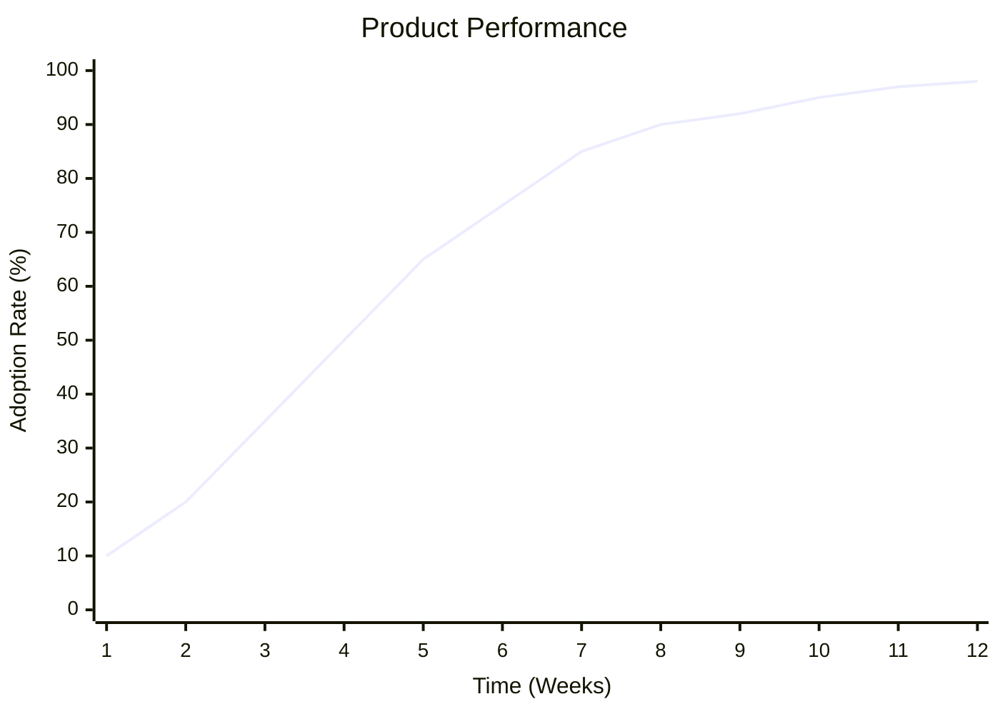

---

## Chart Types

### Line Chart

Connect data points with lines:

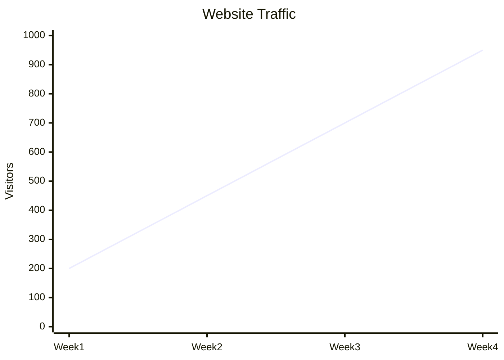

### Bar Chart

Display data as vertical bars:

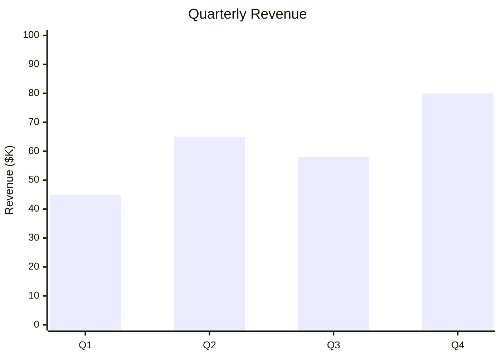

### Multiple Series

Plot multiple data series:

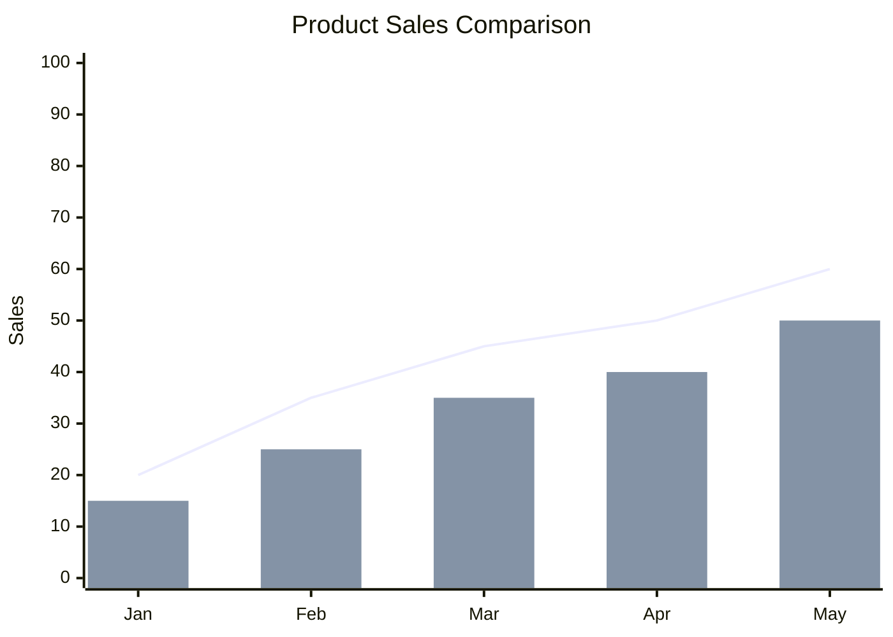

---

## Orientation

### Vertical (Default)

```mermaid
xychart-beta
    title "Vertical Chart"
    x-axis [A, B, C, D]
    y-axis "Value" 0 --> 100
    line [20, 50, 40, 70]
```

### Horizontal

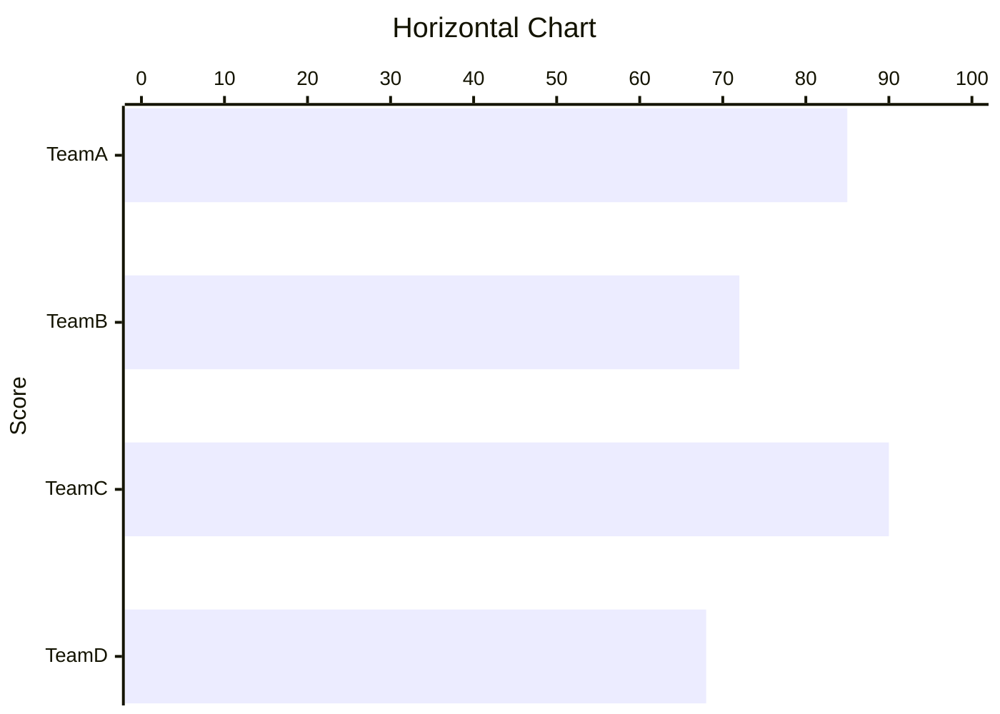

---

## Practical Examples

### Example 1: Monthly Sales Performance

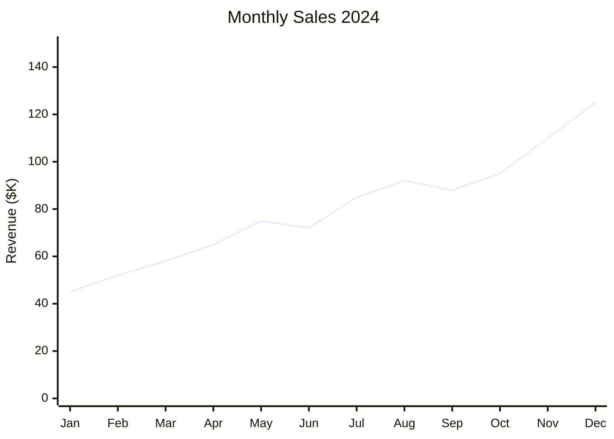

### Example 2: Website Analytics

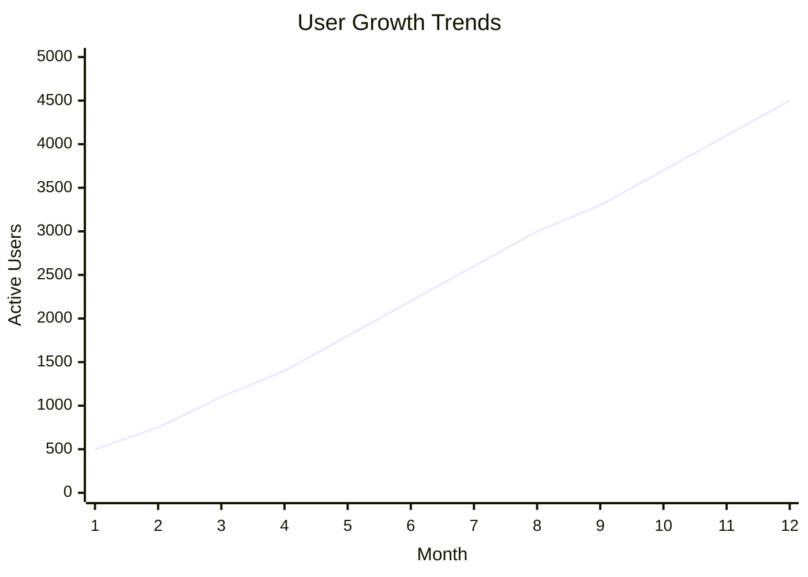

### Example 3: Product Comparison

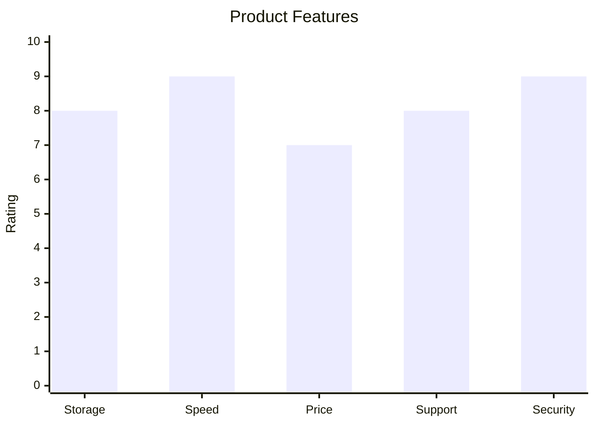

### Example 4: Temperature Over Time

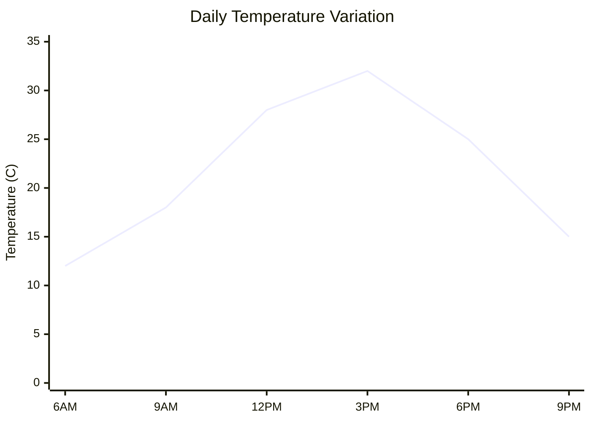

### Example 5: Test Scores Distribution

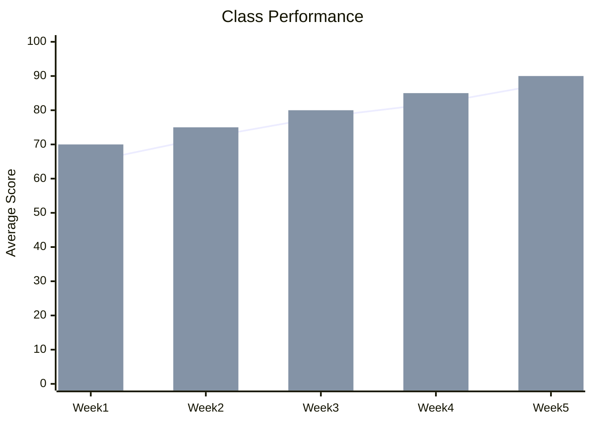

### Example 6: Budget Allocation by Department

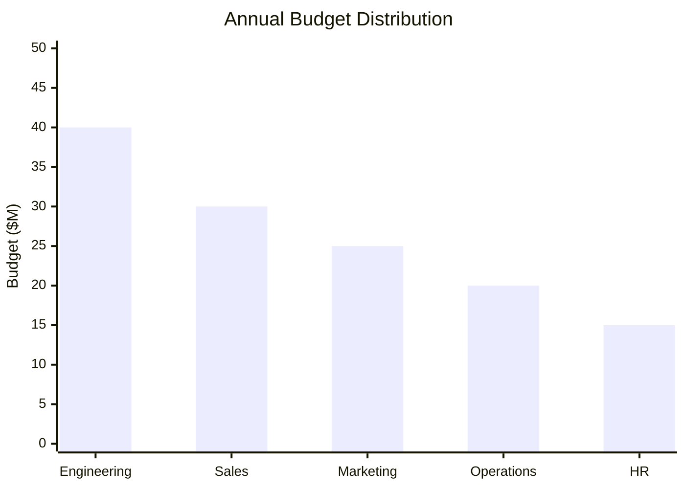

---

## Data Series Features

### Minimum Data Points

At least 2 data points are required for rendering:

```mermaid
xychart-beta
    x-axis [A, B]
    y-axis 0 --> 10
    line [5, 7]
```

### Large Datasets

Handle many data points:

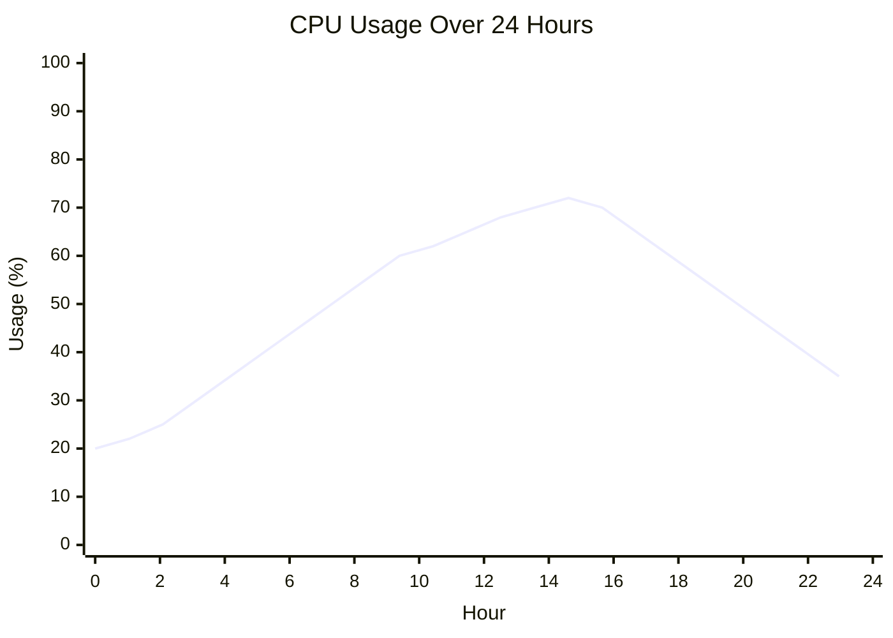

### Decimal Values

Support for precise measurements:

```mermaid
xychart-beta
    x-axis [A, B, C, D]
    y-axis "Precision" 0 --> 10
    line [2.5, 5.75, 7.25, 9.1]
```

---

## Advanced Features

### Title and Styling

```mermaid
xychart-beta
    title "Q4 Performance Review"
    x-axis [Oct, Nov, Dec]
    y-axis "Score" 0 --> 10
    line [7.5, 8.2, 8.9]
```

### Multi-Series Analysis

Compare multiple trends:

```mermaid
xychart-beta
    title "Sales vs Expenses"
    x-axis [Q1, Q2, Q3, Q4]
    y-axis "Amount ($K)" 0 --> 100
    line "Sales" [50, 60, 70, 80]
    bar "Expenses" [30, 35, 40, 45]
```

### Named Series

Use quoted names to label data series:

```mermaid
xychart-beta
    title "Market Share Analysis"
    x-axis [2019, 2020, 2021, 2022, 2023]
    y-axis "Share (%)" 0 --> 50
    line "Company A" [15, 20, 28, 35, 42]
    bar "Company B" [10, 14, 18, 22, 25]
```

---

## Configuration (Theme Variables)

### Customization Options

| Variable | Purpose | Example |
|----------|---------|---------|
| `width` | Chart width | `700` |
| `height` | Chart height | `500` |
| `plotColorPalette` | Colors for lines/bars | `#ff0000, #00ff00` |
| `titleFontSize` | Title text size | `14px` |
| `chartXAxisLabelFontSize` | X-axis label size | `12px` |
| `chartYAxisLabelFontSize` | Y-axis label size | `12px` |

### Custom Sizing

```mermaid
%%{init: {'xyChart': {'width': 800, 'height': 600}}}%%
xychart-beta
    title "Expanded Chart"
    x-axis [A, B, C, D]
    y-axis "Value" 0 --> 100
    line [25, 50, 75, 100]
```

---

## Obsidian Notes

**Theme Compatibility**: Chart colors adapt to Obsidian theme. Configure custom colors via theme variables for consistent appearance.

**Performance**: Charts render smoothly with 50+ data points. Very large datasets may require horizontal scrolling.

**Export**: PDF export renders charts as images. For external sharing, capture as PNG/SVG.

**Axis Labels**: Keep labels concise (2-3 words) for clarity on smaller charts.

**Data Range**: Y-axis range auto-generates from data if not specified. Explicitly set for consistent scaling.

**Multiple Series**: Mix line and bar charts on the same axes for comparative analysis.

**Code Block Format**:
````
```mermaid
xychart-beta
    title "Chart Title"
    x-axis [A, B, C]
    y-axis "Value" 0 --> 100
    line [25, 50, 75]
```
````

---

## Quick Reference Table

| Concept | Syntax | Example |
|---------|--------|---------|
| Chart type | `xychart-beta` or `xychart` | Start diagram |
| Horizontal | `xychart-beta horizontal` | Horizontal layout |
| Title | `title "Text"` | `title "Sales Data"` |
| X-axis (categories) | `x-axis [A, B, C]` | Category values |
| X-axis (with title) | `x-axis "title" [A, B, C]` | `x-axis "Month" [Jan, Feb]` |
| X-axis (numeric) | `x-axis min --> max` | `x-axis 0 --> 100` |
| Y-axis | `y-axis "label" min --> max` | `y-axis "Count" 0 --> 50` |
| Line series | `line [values]` | `line [1, 2, 3, 4]` |
| Named line | `line "name" [values]` | `line "Sales" [1, 2, 3]` |
| Bar series | `bar [values]` | `bar [5, 3, 8, 2]` |
| Named bar | `bar "name" [values]` | `bar "Revenue" [5, 3, 8]` |
| Numeric range | `min --> max` | `0 --> 100` |
| Data values | Comma-separated | `[10, 20, 30]` |
| Comments | `%%` | `%% note` |
