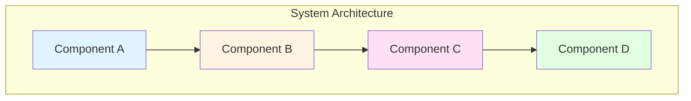
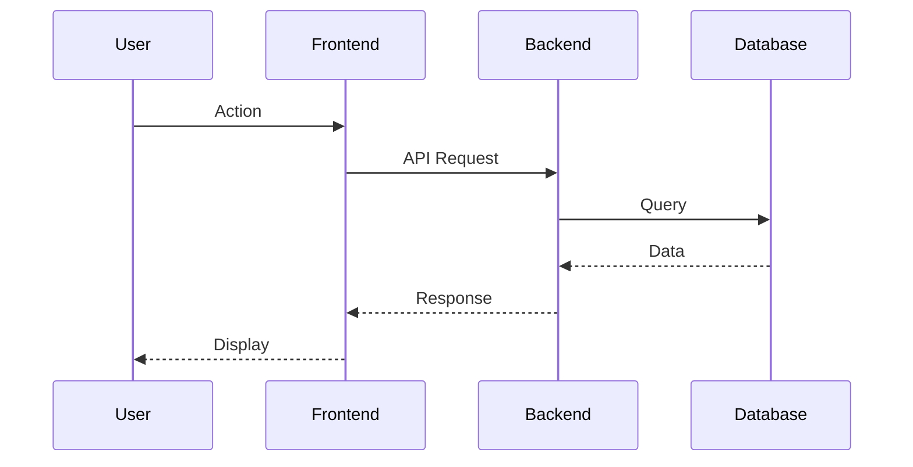
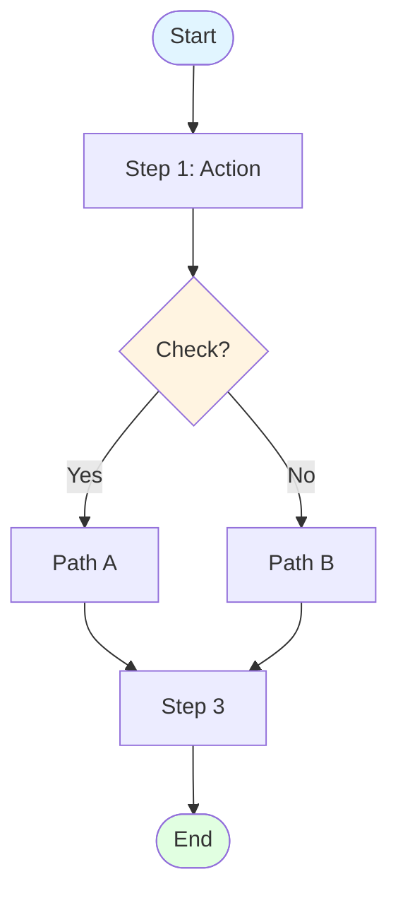
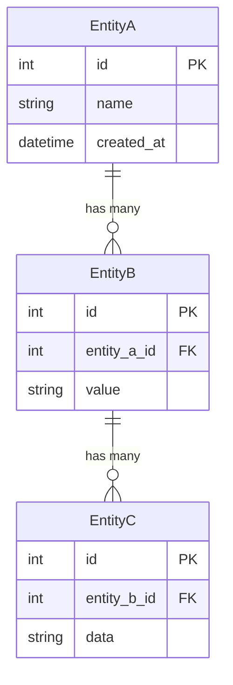
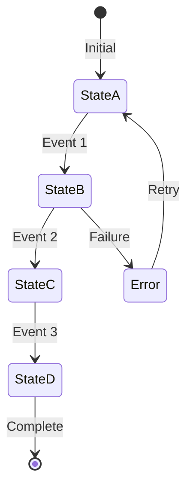

# [Document Title] - Visual Guide

**Source:** [Link to AI documentation]
**Diagrams:** [Number] visual representations
**Best for:** Visual learners, system overview, architecture understanding

---

## 📊 Diagram Index

1. [System Overview](#1-system-overview) - High-level architecture
2. [Data Flow](#2-data-flow) - How data moves through the system
3. [Component Interaction](#3-component-interaction) - How parts communicate
4. [Process Flow](#4-process-flow) - Step-by-step workflow
5. [Database Schema](#5-database-schema) - Data structure (if applicable)
6. [State Transitions](#6-state-transitions) - Status changes (if applicable)

---

## 1. System Overview

**Purpose:** Understand the big picture architecture

**Key Components:**
- **Component A:** [Purpose]
- **Component B:** [Purpose]
- **Component C:** [Purpose]
- **Component D:** [Purpose]

---

## 2. Data Flow

**Purpose:** See how data moves from input to output

```mermaid
flowchart LR
    Input[📥 Input] --> Process1[Process 1]
    Process1 --> Process2[Process 2]
    Process2 --> Process3[Process 3]
    Process3 --> Output[📤 Output]

    style Input fill:#e1f5ff
    style Output fill:#e1ffe1
```

**Flow Stages:**
1. **Input** → [What enters]
2. **Process 1** → [What happens]
3. **Process 2** → [What happens]
4. **Process 3** → [What happens]
5. **Output** → [What exits]

---

## 3. Component Interaction

**Purpose:** Understand how parts communicate

**Interaction Steps:**
1. User initiates action
2. Frontend processes request
3. Backend handles logic
4. Database provides data
5. Response flows back to user

---

## 4. Process Flow

**Purpose:** Step-by-step workflow

**Workflow Breakdown:**
- **Step 1:** [Description]
- **Decision Point:** [What determines path]
- **Path A:** [When this happens]
- **Path B:** [Alternative scenario]
- **Step 3:** [Final step]

---

## 5. Database Schema

**Purpose:** Data structure and relationships

**Table Descriptions:**
- **EntityA:** [Purpose and key fields]
- **EntityB:** [Purpose and relationships]
- **EntityC:** [Purpose and relationships]

---

## 6. State Transitions

**Purpose:** Status changes and lifecycle

**State Definitions:**
- **StateA:** [Description and meaning]
- **StateB:** [Description and transitions]
- **StateC:** [Description and transitions]
- **StateD:** [Final state description]
- **Error:** [Error handling]

---

## 🎨 Diagram Legend

### Colors
- 🔵 **Blue** - Input/Entry points
- 🟢 **Green** - Output/Success states
- 🟡 **Yellow** - Decision points
- 🔴 **Red** - Error states
- 🟣 **Purple** - Processing stages

### Symbols
- `-->` - Data flow
- `()` - Start/End points
- `{}` - Decision points
- `[]` - Process steps
- `||--o{` - Database relationships (one-to-many)

---

## 📖 Related Documentation

- **Full details:** [Link to AI documentation]
- **Summary:** [Link to summary doc]
- **Quick start:** [Link to quickstart doc]

---

## 💡 Tips for Reading These Diagrams

1. **Start with System Overview** - Get the big picture first
2. **Follow Data Flow** - Trace a single piece of data from start to finish
3. **Identify Key Components** - Focus on the most critical parts
4. **Understand Interactions** - See how pieces communicate
5. **Study Edge Cases** - Look at error states and alternative paths

---

## 🔄 Diagram Source Code

All diagrams use **Mermaid.js** syntax. You can:
- Copy the code blocks into any Mermaid editor
- Modify diagrams for your specific use case
- Embed diagrams in your own documentation

**Online Mermaid Editor:** https://mermaid.live

---

**Last Updated:** [Date]
**Version:** [Version]
