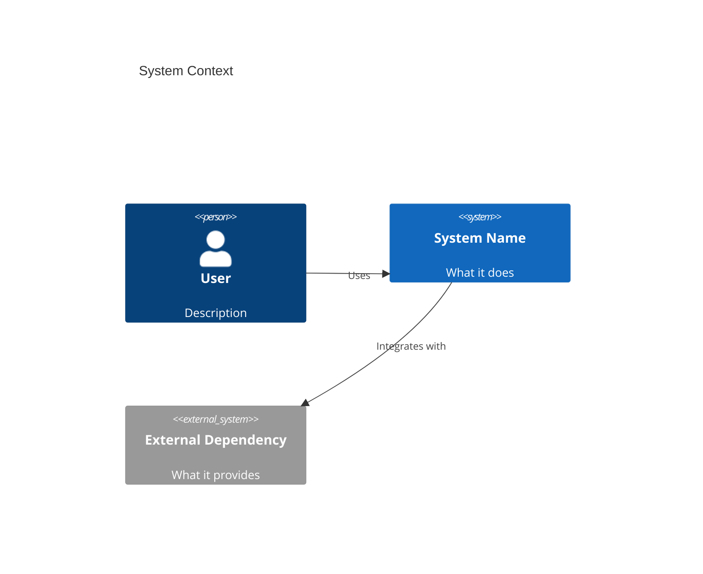
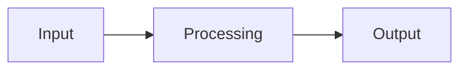
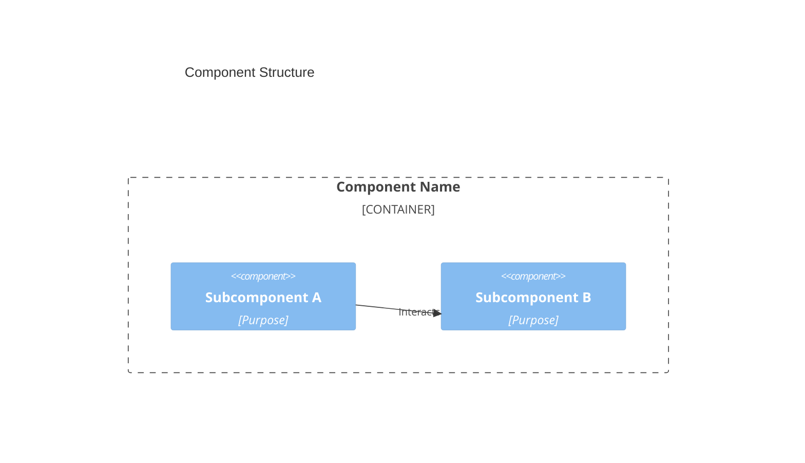
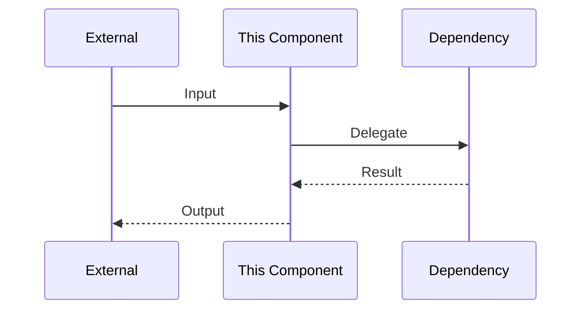

# Document Templates

## ARCHITECTURE.md Template

```markdown
# Architecture

Brief description of the system's purpose and scope (1-2 sentences).

## System Overview

High-level description of how the system works. Include the primary use case and key design decisions.



## Key Entry Points

| File | Description |
|------|-------------|
| `path/to/main` | Application entry point |
| `path/to/core/module` | Core business logic |
| `path/to/config` | Configuration and setup |

## Code Organization

Brief description of directory structure and conventions.

```
project/
├── src/           # Source code
│   ├── core/      # Core domain logic
│   ├── api/       # External interfaces
│   └── utils/     # Shared utilities
├── tests/         # Test suites
└── docs/          # Detailed documentation
```

## Key Abstractions

| Abstraction | Location | Purpose |
|-------------|----------|---------|
| `ClassName` | `path/to/file` | What it represents |
| `InterfaceName` | `path/to/file` | Contract it defines |

## Data Flow

Describe how data moves through the system.



## Testing

Overview of testing strategy and key test locations.

| Test Type | Location | Description |
|-----------|----------|-------------|
| Unit | `tests/unit/` | Component isolation tests |
| Integration | `tests/integration/` | Cross-component tests |

Key test fixtures and utilities: `tests/conftest.py` or equivalent.

## Detail Documentation

- [Component A](docs/component-a.md) - Description
- [Component B](docs/component-b.md) - Description
```

---

## Component Detail Document Template (`docs/*.md`)

```markdown
# Component Name

Brief description of this component's purpose and responsibilities.

## Overview

What this component does and why it exists. Include its role in the larger system.

## Architecture



## Key Files

| File | Description |
|------|-------------|
| `path/to/main/file` | Primary implementation |
| `path/to/interface` | Public API |
| `path/to/types` | Type definitions |

## Key Abstractions

### `ClassName`

Located in `path/to/file`.

Purpose and responsibilities. Key methods or behaviors.

### `InterfaceName`

Located in `path/to/file`.

Contract definition and implementations.

## Dependencies

| Dependency | Purpose |
|------------|---------|
| Component X | What it provides |
| External Lib | Why it's used |

## Data Flow



## Testing

Key test files and what they cover.

| Test File | Coverage |
|-----------|----------|
| `tests/test_component.py` | Core functionality |
| `tests/test_component_edge.py` | Edge cases |

## Configuration

Any configuration options or environment variables this component uses.
```

---

## Entry Points Table Format

Use this format consistently across all documentation:

```markdown
| File | Description |
|------|-------------|
| `src/main.py` | Application entry point, CLI handling |
| `src/core/engine.py` | Core processing engine |
| `src/api/handlers.py` | HTTP request handlers |
| `tests/conftest.py` | Shared test fixtures |
```

Guidelines:
- Use relative paths from project root
- Keep descriptions to one short phrase
- Order by importance or logical flow
- Include test entry points with implementation

---

## Key Abstractions Table Format

```markdown
| Abstraction | Location | Purpose |
|-------------|----------|---------|
| `Engine` | `src/core/engine.py` | Orchestrates processing pipeline |
| `Handler` | `src/api/base.py` | Abstract base for request handlers |
| `Repository` | `src/data/repo.py` | Data access interface |
```

Guidelines:
- Use actual class/interface/function names
- Include the file path for navigation
- Describe the role, not the implementation
