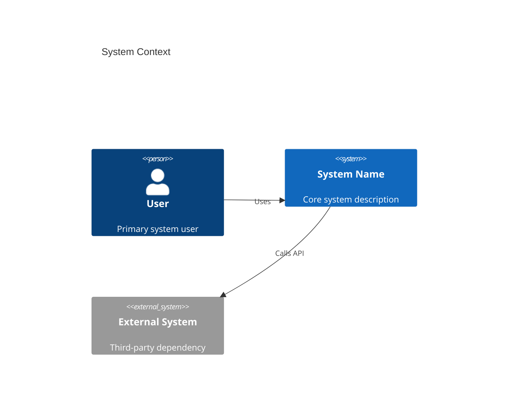
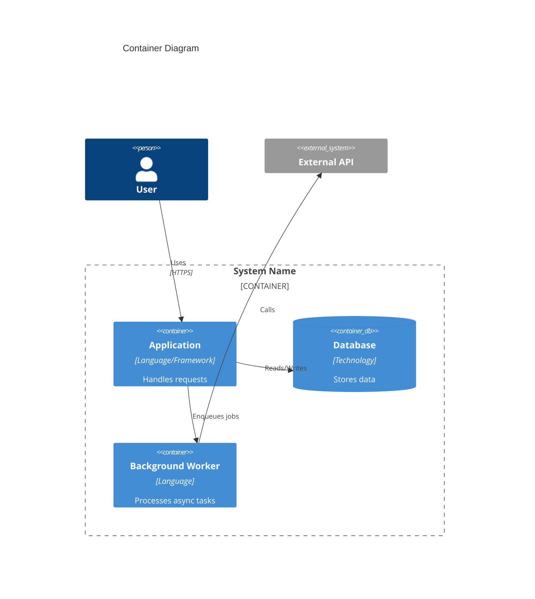
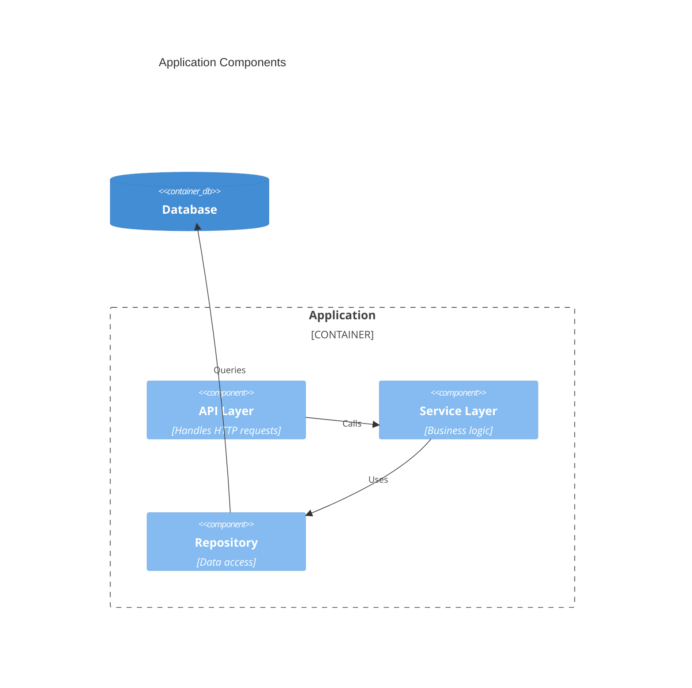
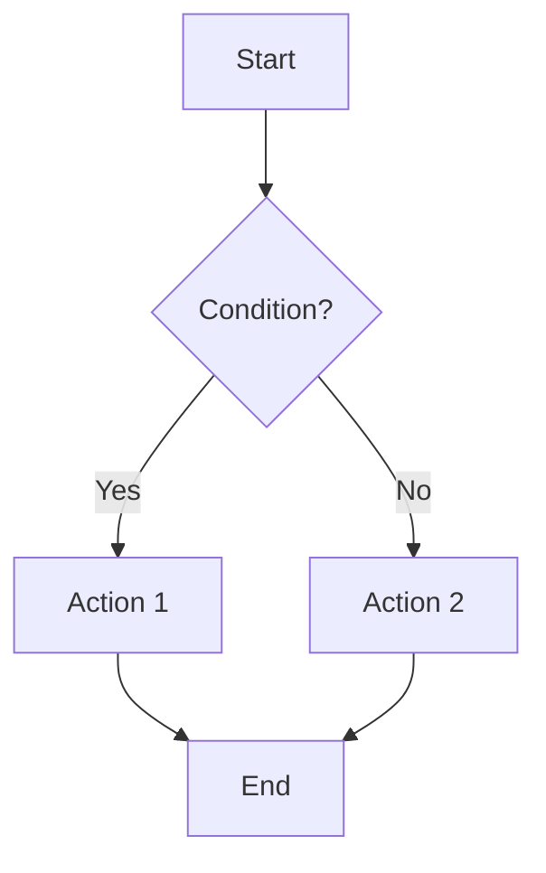
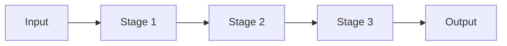
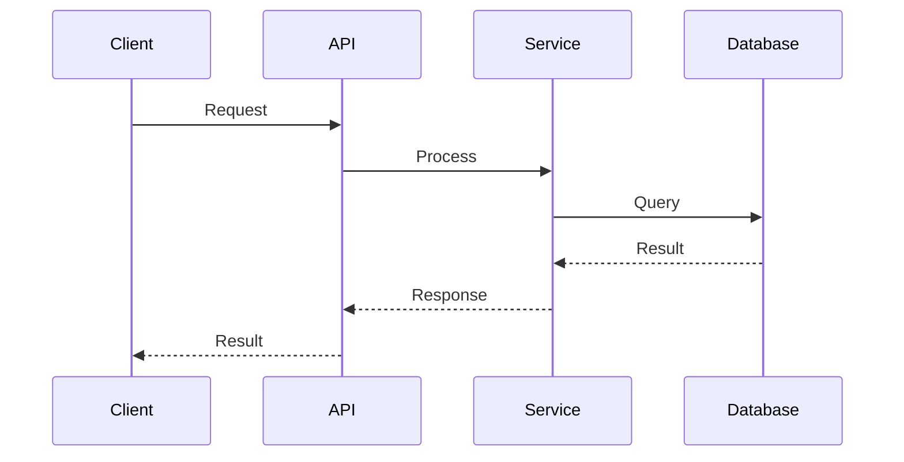
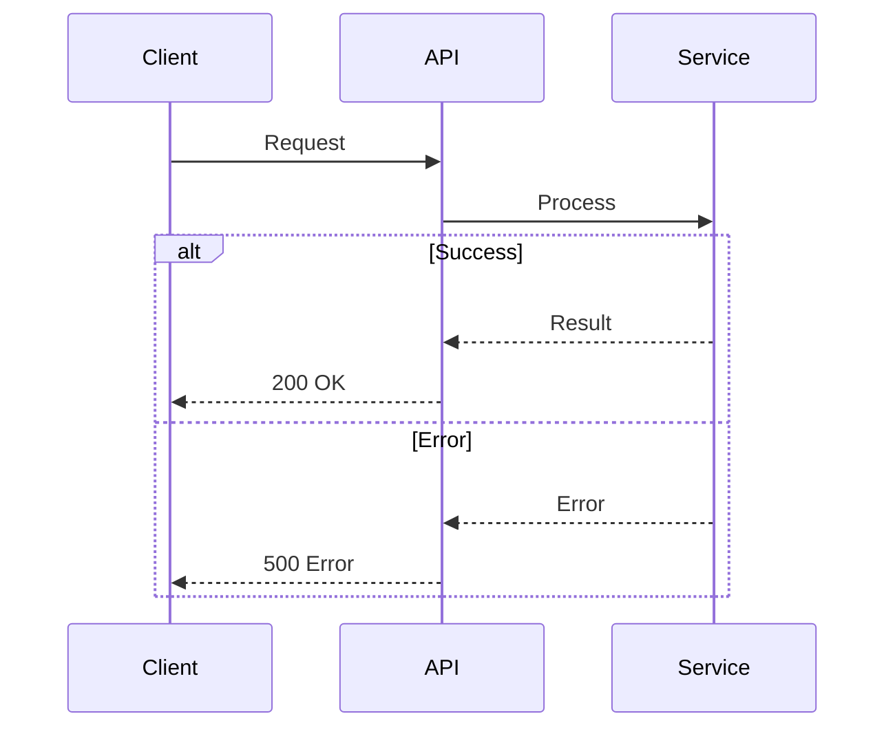
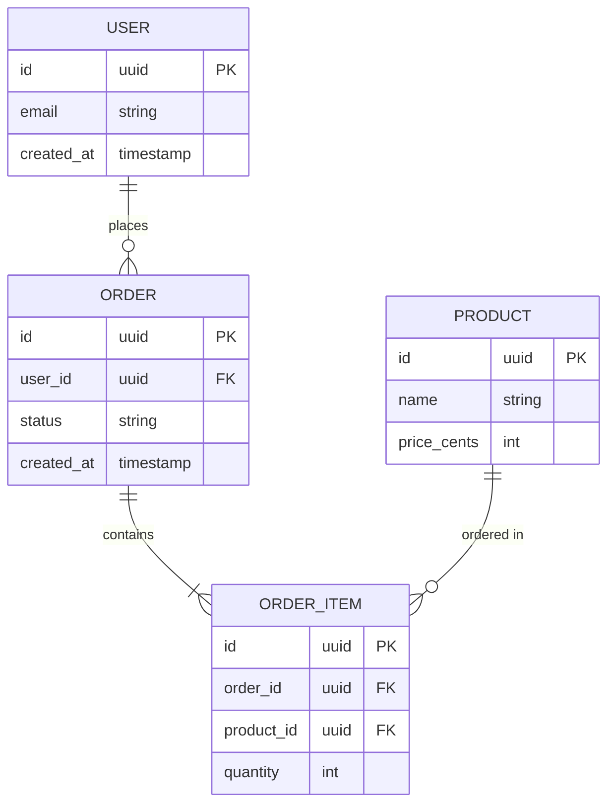
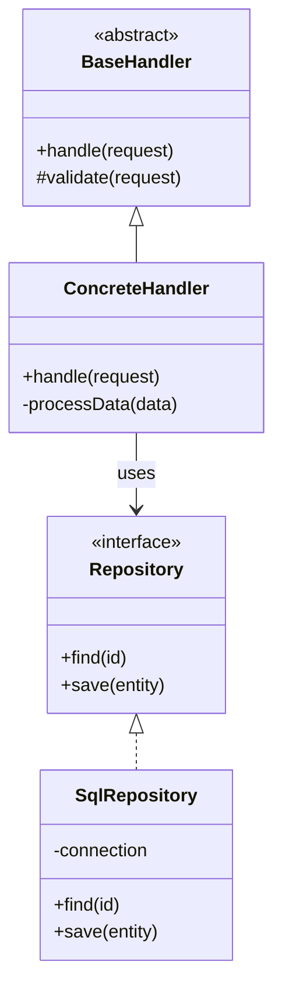

# Mermaid Diagram Patterns

## Diagram Selection

| Diagram | Use When |
|---------|----------|
| C4 Context | System boundaries, external actors, high-level dependencies |
| C4 Container | Deployable units (services, databases, apps) |
| C4 Component | Internal structure of a single container |
| Flowchart | Control flow, pipelines, decision trees |
| Sequence | Request flows, API interactions, multi-step processes |
| ER Diagram | Data models, database schemas, entity relationships |
| Class Diagram | Object hierarchies, interface implementations |

Start minimal (3-5 nodes). Expand only when clarity requires it.

---

## C4 Context Diagram

Shows system scope and external actors.

---

## C4 Container Diagram

Shows deployable units within the system.

---

## C4 Component Diagram

Shows internal structure of a container.

---

## Flowchart

Shows control flow and decision points.

### Pipeline Pattern

---

## Sequence Diagram

Shows interactions over time.

### With Error Handling

---

## ER Diagram

Shows data entities and relationships.

---

## Class Diagram

Shows object relationships and hierarchies.

---

## Tips

- **Labels on arrows**: Use short verb phrases (`Calls`, `Reads`, `Emits`, `Subscribes to`)
- **Color sparingly**: Only to distinguish categories (internal vs external)
- **Group related nodes**: Use subgraphs/boundaries for clarity
- **Consistent naming**: Match names to actual code (class names, service names)
- **Link to code**: Reference the diagram from relevant source files
