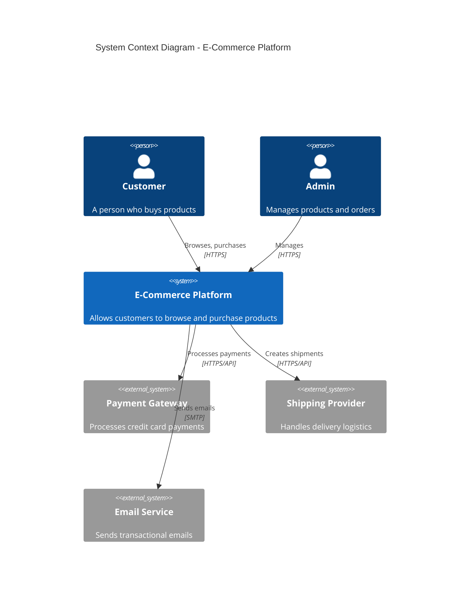
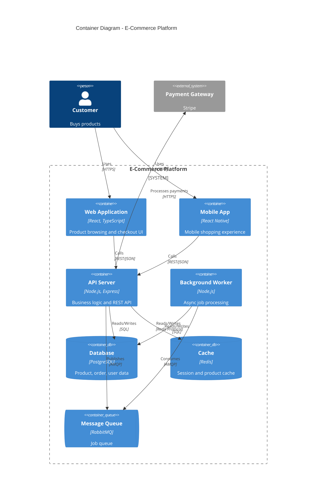
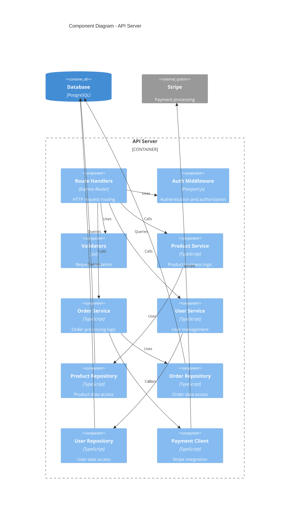

# Mermaid C4 Syntax Reference

Complete syntax reference for C4 diagrams in Mermaid.

## Diagram Types

```mermaid
C4Context    %% Level 1: Context
C4Container  %% Level 2: Container
C4Component  %% Level 3: Component
C4Dynamic    %% Sequence-style interactions
C4Deployment %% Deployment view
```

## Elements

### People

```mermaid
Person(id, "Label", "Description")
Person_Ext(id, "Label", "Description")  %% External person
```

### Systems

```mermaid
System(id, "Label", "Description")
System_Ext(id, "Label", "Description")  %% External system
System_Boundary(id, "Label") {
    %% Nested elements
}
```

### Containers

```mermaid
Container(id, "Label", "Technology", "Description")
ContainerDb(id, "Label", "Technology", "Description")     %% Database
ContainerQueue(id, "Label", "Technology", "Description")  %% Queue
Container_Ext(id, "Label", "Technology", "Description")   %% External
Container_Boundary(id, "Label") {
    %% Nested elements
}
```

### Components

```mermaid
Component(id, "Label", "Technology", "Description")
Component_Ext(id, "Label", "Technology", "Description")
```

### Boundaries

```mermaid
Enterprise_Boundary(id, "Label") {
    %% Group systems
}
System_Boundary(id, "Label") {
    %% Group containers
}
Container_Boundary(id, "Label") {
    %% Group components
}
```

## Relationships

### Basic Relationships

```mermaid
Rel(from, to, "Label")
Rel(from, to, "Label", "Technology")
```

### Directional

```mermaid
Rel(from, to, "Label")       %% Default: left to right
Rel_Back(from, to, "Label")  %% Right to left
Rel_Up(from, to, "Label")    %% Bottom to top
Rel_Down(from, to, "Label")  %% Top to bottom
```

### Bidirectional

```mermaid
BiRel(a, b, "Label")
```

## Complete Examples

### Context Diagram



### Container Diagram



### Component Diagram



## Styling (Optional)

```mermaid
UpdateElementStyle(id, $bgColor="blue", $fontColor="white")
UpdateRelStyle(from, to, $textColor="red", $lineColor="red")
```

## Tips

1. **Use meaningful IDs**: `api` not `c1`
2. **Include technology**: `"Node.js, Express"` not just `"API"`
3. **Label relationships**: `"Calls"`, `"Reads/Writes"`, `"Publishes"`
4. **Group with boundaries**: Use `System_Boundary`, `Container_Boundary`
5. **Keep it simple**: If diagram is too complex, split into multiple

## Resources

- [Mermaid C4 Docs](https://mermaid.js.org/syntax/c4.html)
- [C4 Model](https://c4model.com/)
- [Structurizr](https://structurizr.com/)
