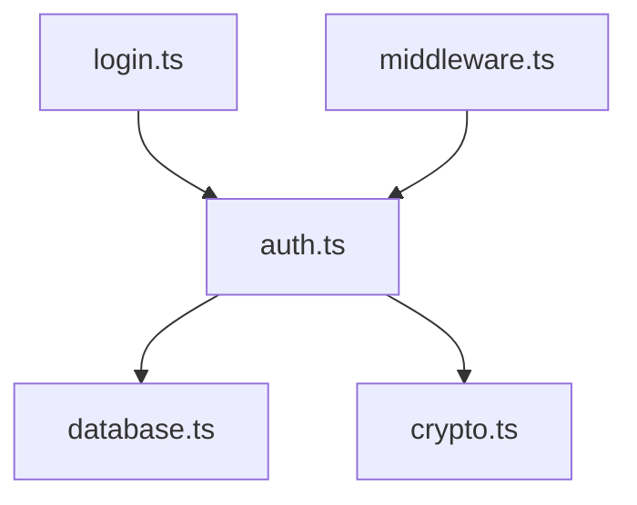

# Dependency Tracing

Map how modules connect and depend on each other.

## Import Pattern Recognition

| Language | Pattern | Example |
|----------|---------|---------|
| JavaScript/TS | `import ... from` | `import { foo } from './module'` |
| Python | `import`, `from ... import` | `from module import foo` |
| Go | `import` | `import "package/module"` |
| Java | `import` | `import com.example.Module;` |
| Rust | `use` | `use crate::module::foo;` |
| C/C++ | `#include` | `#include "module.h"` |
| Dart | `import` | `import 'package:foo/bar.dart';` |

## Tracing Commands

### JavaScript / TypeScript

```bash
# Find all imports of a module
grep -r "from ['\"].*module-name" --include="*.ts" --include="*.js"

# Find all usages of an exported symbol
grep -r "import.*SymbolName" --include="*.ts"

# List unique imports in project
grep -rh "^import.*from" --include="*.ts" | \
  sed "s/.*from ['\"]//;s/['\"].*//" | \
  sort | uniq -c | sort -rn

# Find circular dependencies (requires madge)
npx madge --circular src/
```

### Python

```bash
# Find imports of a module
grep -r "^from module import\|^import module" --include="*.py"

# Find all third-party imports
grep -rh "^import\|^from" --include="*.py" | \
  grep -v "^\(import\|from\) \." | \
  sort | uniq
```

### Go

```bash
# Find imports of a package
grep -r '"package/path"' --include="*.go"

# List all imports in project
grep -rh "^import" --include="*.go" -A20 | \
  grep -E '^\s+"' | sort | uniq
```

### C / C++

```bash
# Find includes of a header
rg '^#include' -g '*.h' -g '*.hpp' -g '*.c' -g '*.cc' -g '*.cpp' -g '*.cxx'

# Find usages of a symbol
rg 'SymbolName' -g '*.h' -g '*.hpp' -g '*.c' -g '*.cc' -g '*.cpp' -g '*.cxx'
```

### Dart / Flutter

```bash
# Find imports of a package
rg "^import 'package:" -g '*.dart'

# List all imports in project
rg "^import" -g '*.dart' | sort | uniq
```

## Building Dependency Graphs

### Level 1: Module Dependencies

```bash
# For each source file, list what it imports
for f in src/**/*.ts; do
  echo "=== $f ==="
  grep "^import" "$f" | head -10
done
```

### Level 2: Package Dependencies

```bash
# External dependencies (Node.js)
cat package.json | jq '.dependencies, .devDependencies'

# Python
cat requirements.txt
pip freeze

# Go
go list -m all

# Rust
cargo metadata --no-deps --format-version 1

# Dart
rg '^[[:space:]]{2}[a-zA-Z0-9_-]+:' pubspec.yaml
```

### Level 3: Call Graph (for critical paths)

```bash
# Find all function definitions and their calls
grep -n "function\|=>" src/critical-module.ts

# Find usages of specific function
grep -rn "functionName(" --include="*.ts"
```

## Detecting Circular Dependencies

### JavaScript/TypeScript

```bash
# Using madge
npx madge --circular --extensions ts src/

# Manual check: if A imports B and B imports A
grep -l "from.*moduleA" src/moduleB.ts && \
  grep -l "from.*moduleB" src/moduleA.ts
```

### Python

```bash
# Look for late imports (often indicates circularity)
grep -rn "^    import\|^        import" --include="*.py"
```

## Dependency Classification

| Type | Description | Action |
|------|-------------|--------|
| **Direct** | A imports B | Document |
| **Transitive** | A → B → C | Note chain |
| **Circular** | A → B → A | Flag for refactor |
| **Unused** | Imported but unused | Flag for cleanup |

## Output Format

```markdown
## Dependency Map

### Module: src/services/auth.ts

**Direct Dependencies:**
- `./database` - Database access
- `./crypto` - Password hashing
- `bcrypt` - External: encryption

**Depended On By:**
- `src/routes/login.ts`
- `src/middleware/auth.ts`

**Circular Dependencies:** None

### Dependency Graph


```
