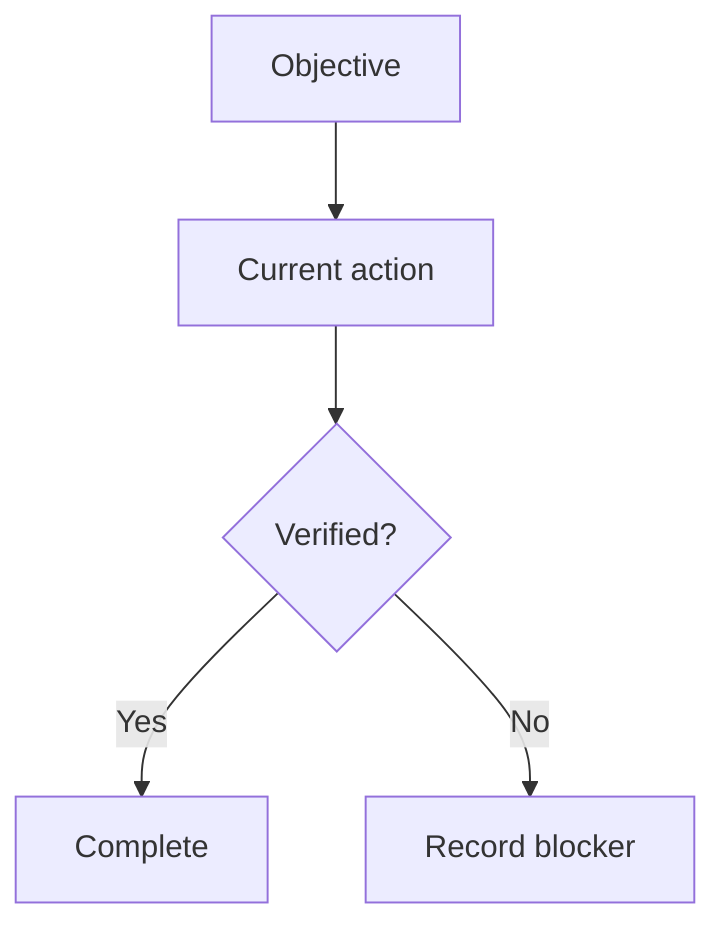

# Task State

## Objective

State the outcome, the project boundary, and any excluded systems.

## Current status

- **Completed:** No milestones recorded.
- **Active:** State the current action.
- **Blocked:** State `None` or name the blocker and owner.
- **Next:** State one concrete next action.

## Decisions

| Decision | Reason | Evidence |
| --- | --- | --- |
| No decisions recorded. | Not applicable. | Not applicable. |

## Evidence index

| Node ID | Type | Summary | Relative path |
| --- | --- | --- | --- |
| No evidence recorded. | Not applicable. | Not applicable. | Not applicable. |

## Verification limits

State what was checked, what could not be checked, and why.

## Optional task map

