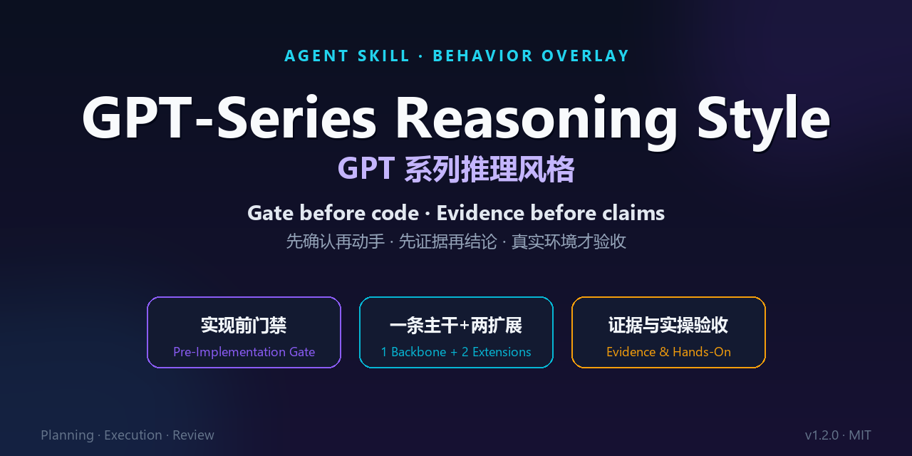
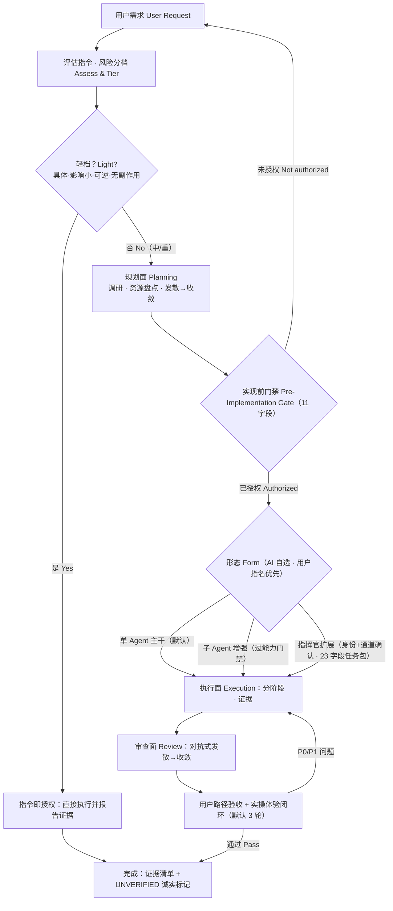

<div align="center">



# GPT系列推理风格 · GPT-Series Reasoning Style

**把"Agent 说做完了"变成"Agent 证明做完了"。**
**Turn "the agent says it's done" into "the agent proves it's done".**

一个面向 AI Agent 的**交付纪律行为层**（behavior overlay）——
实现前门禁、资源盘点、多 Agent 协作治理、证据核验与实操验收。

[](#versioning--版本)
[](#license--许可证)
[](#install--安装)
[](#tooling--工具链)
[](https://github.com/JadeYingWah/gpt-series-reasoning-style/actions)
[](#tooling--工具链)
[](#tooling--工具链)

</div>

> **Process-discipline layer only** — not a reasoning-capability booster and not GPT-specific —
> the name records its origin (distilled from a long series of GPT-series model dialogues).
>
> 本 skill 是**纯流程纪律层**：不提升模型推理能力，也不绑定 GPT 系列——名字记录的是它的来源
> （从一系列 GPT 系列大模型的真实对话中打磨提炼）。中文主导、分层双语（见 [Language Policy](#language-policy--语言策略)）。

---

## Quick Start / 快速开始

```bash
# 1. 安装（以 Claude Code 为例；其余 12 个平台见 Install 节）
git clone https://github.com/JadeYingWah/gpt-series-reasoning-style
cd gpt-series-reasoning-style
./scripts/install.sh claude            # Windows: .\scripts\install.ps1 -Platform claude

# 2. 在对话里按名调用
#    使用 gpt-series-reasoning-style 执行本次任务。
```

**Claude Code 免 clone 一键装（插件市场）**：在 Claude Code 里执行 `/plugin marketplace add JadeYingWah/gpt-series-reasoning-style`，再 `/plugin install gpt-series-reasoning-style@gpt-series-reasoning-style`（或直接在 `/plugin` 菜单里安装；钉版本可在 add 时加 `@v1.2.0`）。其余平台与手动方式见 [Install](#install--安装)。

加载后，AI 在动手建文件 / 写代码 / 跑命令之前，会先停下给你一张确认单；声称"做完了"时必须附上可核对的证据。

**只想要核心、不想装整套？** 把 [Minimal Usage](#minimal-usage--最小用法) 的三条规则贴进宿主配置即可（官方 **Lite 档**，实测 147 tokens）。

---

## 目录 / Table of Contents

- [Why / 为什么需要它](#why--为什么需要它)
- [Name & Origin / 名称与来源](#name--origin--名称与来源)
- [What It Is / 这是什么](#what-it-is--这是什么)
- [What It Is Not / 边界](#what-it-is-not--边界)
- [Core Mechanisms / 核心机制速览](#core-mechanisms--核心机制速览)
- [The Pre-Implementation Gate / 实现前门禁](#the-pre-implementation-gate--实现前门禁)
- [Workflow / 工作流](#workflow--工作流)
- [Collaboration Architecture / 协作架构](#collaboration-architecture--协作架构)
- [Honesty & Evidence / 诚实与证据](#honesty--evidence--诚实与证据)
- [Commander Multi-Agent Mode / 指挥官模式](#commander-multi-agent-mode--指挥官模式)
- [Built-in Identities / 内置身份](#built-in-identities--内置身份)
- [When To Use / 何时使用](#when-to-use--何时使用)
- [Cost & Benefit / 成本与收益](#cost--benefit--成本与收益)
- [Install / 安装](#install--安装)
- [Minimal Usage / 最小用法](#minimal-usage--最小用法)
- [Repository Layout / 仓库结构](#repository-layout--仓库结构)
- [Tooling / 工具链](#tooling--工具链)
- [Field Tests & Evidence / 实测与证据](#field-tests--evidence--实测与证据)
- [Language Policy / 语言策略](#language-policy--语言策略)
- [Complexity Budget / 复杂度预算](#complexity-budget--复杂度预算)
- [Maintainer Notes / 维护者笔记](#maintainer-notes--维护者笔记)
- [Versioning / 版本](#versioning--版本)
- [License / 许可证](#license--许可证)

---

## Why / 为什么需要它

AI 协作里最贵的两类失败，都不是"模型不够聪明"：

1. **未授权就动手**——AI 宣布了一串"接下来我要做什么"，然后直接建目录、写文件、跑命令；
2. **声称未验证的完成**——"已经修好了 / 测试都过了"，而磁盘上没有可核对的证据，甚至根本没跑过。

一次"假完成"的返工成本（澄清 + AI 重读上下文 + 重做）通常在 2 万–10 万 token；本 skill 整个任务周期的常驻开销约 3.8k token。**它把防假完成做成第一优先级，正是因为那是 token 账上最贵的一项。**

它带来的改变，一眼可见：

```text
【没有纪律】                    【有本 skill】
用户：帮我做个登录页             用户：帮我做个登录页
AI  ：好的，我开始建文件……       AI  ：【实现前确认】
      （直接动手）                     - 目标 / 风险分档 / 形态
                                      - 已盘点资源 / 推荐方案
                                      - 需要你确认：……
                                   （停下，等授权）

AI  ：做完了，测试都过了。        AI  ：完成。附磁盘自检清单：
      （无证据）                       - 改动文件 + 关键 diff
                                      - 测试 RED→GREEN 输出
                                      - 浏览器实测截图
                                      - 按钮交互我点不了：UNVERIFIED
```

---

## Name & Origin / 名称与来源

**GPT-Series Reasoning Style（GPT系列推理风格）**，Agent Skill 名 `gpt-series-reasoning-style`。

- **名字记录来源，不划能力边界**：规则纪律从一系列 GPT 系列大模型的真实对话记录中打磨提炼，公开发布线为 1.0.0 → 1.1.0 → **1.2.0**（更早的内部迭代已归档于 [`INTERNAL-HISTORY.md`](INTERNAL-HISTORY.md)）。
- **不依赖、也不限于 GPT 系列**：任何宿主模型（Claude / Gemini / DeepSeek / Qwen / GLM …）均可加载使用。
- **`reasoning-style` 指"推理的流程纪律风格"，不是推理能力上限**：它约束 AI 怎么干活（先盘点、先门禁、给证据），不会让模型变得更聪明。
- **曾用名 / Formerly**：`gpt-5-6-sol-multi-agent-style`（"GPT-5.6 Sol"，内部期），旧检索别名 `gpt-5-6-sol-reasoning-style`——供搜索引擎与联网 AI 把旧名归并到本仓库。

---

## What It Is / 这是什么

这是一层可以装进任何 Agent 宿主的行为纪律。它是一个普通 Agent Skills 包：常驻面只有 `SKILL.md` + `VERSION`（实测 3,843 tokens，o200k_base），
13 份 references 按需取节加载，`AGENTS.md` 为 Codex / Gemini CLI / Copilot CLI 等运行时提供跨运行时入口别名。

### 三大机制 / Three Mechanisms

| 机制 | 说明 |
| --- | --- |
| **实现前门禁 · Pre-Implementation Gate** | 建目录、写文件、跑实现命令之前，先输出 11 字段确认单并停下等待授权。宣布阶段序列不是确认；"开始"不是授权。 |
| **一条主干 + 两个按需扩展 · 1 Backbone + 2 Extensions** | 单 Agent 主干（默认）· 子 Agent 增强（能力门禁 + 六字段迷你包）· 指挥官扩展（身份+通道确认 + 23 字段任务包 + 完成闭环）。可按任务/阶段混合搭配。 |
| **证据与验收 · Evidence & Acceptance** | 对抗式审查、用户路径验收、实操体验闭环（默认 ≤3 轮、截图留证）；未亲手验证的一律标 `UNVERIFIED`，不伪造。 |

---

## What It Is Not / 边界

| 它不是 | 说明 |
| --- | --- |
| ❌ 推理能力增强器 | 纯流程纪律层；宿主据此判定挂载，避免"提升推理"类请求误触发（`agents/openai.yaml` 亦声明 `allow_implicit_invocation: false`）。 |
| ❌ GPT 专用 | 名字只记录来源；规则与模型无关。 |
| ❌ 身份替换 | 行为叠加层（behavior overlay）：宿主 Agent 的身份与平台规则永远优先。 |
| ❌ 常驻上下文包装 | 仅按需**显式按名调用**；琐碎任务走轻通道直接做。可选的单行 SessionStart hook 只是对"遗忘"的对冲（见 [Install](#install--安装)）。 |
| ❌ 宿主能力的重复叠加 | 宿主已自带同等规划/审查/验收时，优先用宿主原生流程；首次使用先做**宿主对齐声明**，被完整覆盖的小节标 SKIP（见下）。 |
| ❌ 全自动质量保证 | 机器只做机器能诚实做的事：结构检查、fresh 复跑、计数留痕；**判卷的是人**——自测判定、探针判分、内容真实性永远由人核证据。 |

**宿主对齐（Host Alignment，仅首次、仅一次）**：首次在当前宿主使用时，加载证明之后、首次门禁之前，AI 先输出一次宿主对齐声明（宿主已有能力清单 → 与本 skill 小节的重叠映射并标 SKIP → 裁剪后使用范围），经用户确认后本次会话生效；声明可落盘 `<项目根>/docs/agents/host-alignment.md` 复用。**三条底线永不可被对齐跳过：证据报告、`UNVERIFIED` 诚实标记、真实环境验收。** AI 不得为适配而修改 skill 本体文件，适配产物只落项目侧。

---

## Core Mechanisms / 核心机制速览

| # | 机制 | 一句话 |
| --- | --- | --- |
| 1 | **加载证明 / Load Proof** | 证明已加载只需 `SKILL.md` + `VERSION`：输出版本号、逐字引用门禁硬规则第一条、协作架构简介、实际读过的文件清单。读不到就请求权限，**不伪造**。 |
| 2 | **实现前门禁 / Pre-Implementation Gate** | 任何项目目录创建、文件编辑、实现命令之前，输出 11 字段确认单并停止。 |
| 3 | **轻量通道 / Light Channel** | 具体、影响小、完全可逆、无副作用的任务，指令本身即授权——直接做，做完仍报实际改动与证据。三条排除项防钻空子（见下）。 |
| 4 | **资源盘点 / Resource Survey** | 动手前盘点一切可用资源：本地已装 skills、可装技能候选（批准后才装）、可复用模板与现成实现、网络参考——能用的直接用，不从零造轮子。 |
| 5 | **风险分档 / Risk Trimming** | 轻 → 轻通道；中 → 全流程；重 → 全流程并考虑指挥官模式。**全新产物默认中档**。 |
| 6 | **证据纪律 / Evidence Discipline** | 证据强于信心；没有验证过的结论一律标 `UNVERIFIED`；完成声明必须附磁盘自检清单（文件 + 关键 diff + 实跑输出）。 |
| 7 | **实操验收 / Hands-On Acceptance** | 交互类产物必须亲手操作每个按钮、按键、手势并截图留证；没操作过的标 `UNVERIFIED`。 |
| 8 | **DRI 与收口 / Ownership** | 用户是最终决策者；委派之后总指挥仍是 DRI（最终收口负责人）；一任务一 DRI。 |

此外两条贯穿性原则：

- **创意任务防平庸**：门禁锁定范围与落盘，不锁定方向；大胆是默认，保守才需要理由。创意主导任务须并列 2–3 个真实不同方向，完全可逆的本地产物可免方向确认直接起跑。
- **让位原则**：本 skill 只规范流程、不主导内容——其他 skill 或宿主能力对内容/风格/创意有主张时让位配合；但诚实、安全防护、真实环境验收是最后防线，任何优先级下不失效。

---

## Collaboration Architecture / 协作架构

**单 Agent 主干 + 两个按需扩展**，可按任务/阶段混合搭配：

| 形态 | 说明 |
| --- | --- |
| **单 Agent 主干 / Single-Agent backbone**（默认） | 同一模型内部切换规划面、执行面、审查面；绝大多数任务由此完成。 |
| **子 Agent 增强 / Subagent enhancement** | 任务适合并行或隔离且宿主支持子 Agent 时启用；启用前必须先确认子 Agent 能力，能力未证实退回主干并标 `UNVERIFIED`；主干保留门禁、证据所有权与最终验收。派发用**六字段迷你包**（标准）。 |
| **指挥官扩展 / Commander extension** | 需要协调独立大模型/Agent 或经用户转交时，对该任务启用模式三协议（角色身份确认、协调通道确认、23 字段完整任务包与闭环）；只影响启用的任务。 |

**形态自选（Mode Self-Selection）判定顺序**——形态由 AI 按任务事实自选，在门禁中声明一行理由；用户指名的形态永远优先：

1. **轻量通道**命中 → 直接执行并报告证据（不涉及形态选择）；
2. **指挥官扩展**触发条件命中（用户明确要求多 AI / 跨窗口 / 经用户转交）→ 模式三协议；
3. **子 Agent 增强**：并行或隔离有真实收益（"同时/一起做"等并行信号须先评估并行收益 > 简报成本，否则回退主干）且宿主能力已证实；
4. 其余 → **单 Agent 主干**。

**任务包三层口径**（各归其权威，不得混用）：

- 11 字段**内部派发包** —— 仅单 Agent 主干内部派发；
- **六字段迷你包** —— 子 Agent 增强（信任层级限 T1/T2）；
- **23 字段完整任务包** —— 跨模型指挥官场景（信任层级 T1/T2/T3 全量）。

另有**五字段降级简化包**（目标/范围/验收标准/返回格式/信任层级）作为手动多窗口转交的低门槛入口——降级只减 briefing 复杂度，不减验收标准。

**信任层级 / Trust Tiers**：

| 层级 | 类型 | 执行前要求 |
| --- | --- | --- |
| **T1** | 调研分析 | 证据审阅后即可使用，无需单独确认。 |
| **T2** | 产物与文件写入 | 先向用户展示计划或产出，获得确认后再写。 |
| **T3** | 命令、部署、破坏性或外部操作 | 每次动作显式获得用户授权。 |

---

## The Pre-Implementation Gate / 实现前门禁

在创建项目目录、编辑文件或运行实现命令之前，先输出以下内容**并停止**。这是本 skill 最核心的动作——动手前先过 11 字段门禁：

```text
【实现前确认】
- 我理解的目标：...
- 风险分档：轻 / 中 / 重 — 判定理由（决定走轻通道还是全流程）
- 形态选择：单 Agent 主干 / 子 Agent 增强 / 指挥官扩展 — 一行理由（轻通道免填）
- 已盘点可用资源：本地 skills / 可装技能候选（批准后才装）/ 可复用模板与现成实现 / 网络参考（逐项列出）
- 最高影响问题（可多项）：...（技术风险与已知权衡，供你判断，不是提问）
- 推荐方案：...（创意/审美主导任务须并列 2–3 个真实不同方向）
- 其他选项：...（我已评估并否掉的备选，信息性、不需要你选）
- 完整计划：...
- 澄清方式：A 一次性确认推荐方案 / B 逐项问答
- 需要你确认：...（等你拍板的选项 + 推荐）
- 确认范围：本次确认锁定目标、范围、交付物与落盘路径；风格与方向不锁死
```

**硬性规则：**

- 宣布阶段序列不是确认。
- "开始""现在开始""直接做"不是实现授权。
- "你决定""按最高质量方案做"是显式委托；记录决定后再继续。
- 未盘点可用资源就输出计划，视为计划不完整。
- 用户确认前不创建目录、不写文件、不运行实现命令。

**轻量任务通道**（按风险分档，逐条满足才可适用）：任务指令具体明确、影响面小、完全可逆、无破坏性与外部副作用时，**该指令本身即为授权**，可跳过门禁直接执行；执行后仍须报告实际改动与证据。**排除项（命中即升中档全流程）**：

1. **全新产物默认中档**——除非指令已完整指定产物类型、位置与产品形态；
2. **多交付物**（≥2 个独立产物）；
3. **并行信号**（"同时/并行/一起做"）。

破坏性操作、外部执行、推送部署、含糊指令不适用轻通道；拿不准时自动升为中档。

门禁确认可落盘为项目治理产物：`<项目根>/docs/gate/<date>-<slug>.md`（proposed / confirmed / rejected / superseded 四态状态机，append-only），由 `scripts/artifact-check.py` 做结构校验——**结构合规 ≠ 内容真实**，内容真实性永远靠人核证据。

---

## Workflow / 工作流



1. **续会全面体检（Resume Check，7 项）**——接手既有会话或用户说"继续/检查项目"时必做：① Git 状态 ② 门禁与阶段 ③ 文档与实现同步 ④ 遗漏与矛盾 ⑤ 重锚定原始指令（重读全文，不靠记忆或转述）⑥ 项目根硬检查（首次写盘前核对当前目录=项目根，不符即停）⑦ 先报告、修过期项、再继续。不体检直接续干等于蒙眼开车。
2. **风险分档**：评估指令的歧义、矛盾、缺失约束与风险——轻 → 轻通道；中 → 全流程；重 → 全流程并考虑指挥官模式。
3. **调研与盘点优先**：官方文档、相似产品、本地 skills、可复用模板、网络参考（注明来源）；围绕指令发散、攻击候选方案、用证据收敛；与用户确认目标/范围/验收标准后合并完整计划，输出门禁并等待授权。
4. **分阶段执行**：每阶段关闭前切换到审查面用实际产物核验；全部阶段后做整体到细节的最终验收，真实目标环境验证不能少；收尾必须以用户方视角整体重看结果。
5. **实操体验闭环**：以真实用户方式亲自操作每一处交互（按钮/按键/手势/反馈/视觉）并截图留证，修复后亲自复验；循环到自评通过或上限（默认 3 轮）。运行环境无 GUI/截图能力时如实标 `UNVERIFIED` 并给出用户自验步骤。
6. **主动 bug sweep**：不等用户发现，主动执行发散-收敛的缺陷清扫；完成时给出实际文件、命令、测试、Git 状态与截图证据，未验证项标 `UNVERIFIED`。

完整 700+ 行流程（含授权矩阵、发散-收敛协议、审计模板）见
[`references/series-reasoning-workflow.md`](references/series-reasoning-workflow.md)——头部有 Section Map，按节定位取用，**勿整读**；英文镜像为
[`series-reasoning-workflow-en.md`](references/series-reasoning-workflow-en.md)（中文宿主勿读镜像，冲突以中文权威版为准）。

---

## Honesty & Evidence / 诚实与证据

这一节是整个 skill 的地基，也是它与其他流程类 skill 最大的差异点。

- **`UNVERIFIED` 标记**：没有验证过的结论一律标注；没操作过的一律不算验收。
- **证据必须 fresh**：完成声明引用的证据必须在本条消息内取得——"早些时候跑过"不算数。
- **完成门三条款**（Honesty Gate）：
  1. 完成声明必须附**磁盘自检清单**——改动文件清单 + 关键 diff + 实跑输出/退出码，逐项有路径。没有清单的完成只是意图；
  2. 回归测试有效必须附 **RED→GREEN 完整循环**——先看它红，再看它绿；
  3. "未发现问题"必须同时报告**检测方法与覆盖面**（工具、视口/环境矩阵、用例清单）——缺任一项按 `UNVERIFIED` 处理。
- **声称 ↔ 最小充分证据对照表**：[`references/common-failures.md`](references/common-failures.md) 给出 10+ 行"声称 / 不算数 / 最小充分证据"映射（测试通过、功能正确、扫描干净、bug 已修、文档已更新、Agent 报告完成……每行都锚定本仓库真实发生过的失败案例 F1–F6）。**"零命中/零错误"通则**：凡以 0 命中为结论的声明，必须先用已知存在的靶子验证工具真的能命中——静默通过 ≠ 通过。
- **证据产物是交付物**：日志/截图/验证脚本留在交付目录，不算运行时垃圾；确需删除须先逐条列出被删产物与内容摘要。声明里的计数与覆盖面须与产物**双向一致**——多报少报同罪。
- **目标相关缺陷不算无关问题**：影响任务目标正确性的发现必须主动修复，或在门禁/报告中显式提请裁决——仅记录了事视同未处理。
- **`scripts/claim-check.py`** 把完成门机械化：读 markdown 声明清单（`## Files` 存在性 / `## Commands` fresh 实跑+期望退出码 / `## Hashes` 内容 pin），逐项核验，并默认双层拦截：**25 类破坏性命令黑名单** + **解释器间接执行默认拒**（`python -c` / `python 脚本.py` 等载荷命令行上不可审计；窄白名单放行 `python -m unittest|pytest` 与 `--version`）。两层都不是沙箱。

---

## Commander Multi-Agent Mode / 指挥官模式

当任务需要协调**独立的大模型 / Agent**（多个对话窗口、多个宿主、经用户转交）时，对该任务启用模式三协议。

**启用前两道确认**（平台工具可用 ≠ 用户确认）：

1. **【角色身份确认】**——AI 出示候选身份（读 `identities/README.md`，每个身份附一行职责）供用户指定；
2. **【指挥官协调通道确认】**——逐接收方判定协调通道（直接工具 / 子 Agent / MCP / API / 用户转交）；用户选择用户转交后，不得擅自改用直接工具。

**核心规则**：

- **接收方按"角色 + 平台/窗口"命名**（笼统的"另一个 AI"不够）；底层大模型是可选参考元数据——从不主动询问，模型变动不使任务包或台账失效。
- **角色与承载模型解耦**：换模型、换会话不改变角色职责；身份声明格式 `身份：<角色名> / 任务 ID <ID>。`；身份互斥——不得越权执行另一角色的动作（越权由总指挥证据审查发现，不由自我报告）。
- **23 字段完整任务包** + 接收方启动提示词（自包含：加载指令 + 身份声明格式 + 简报文件路径）。推荐把任务包落盘为简报文件 `<项目根>/docs/plans/<task-id>-brief.md`——接收方一次 Read 读全包，任务文本不再经对话逐字中转。
- **项目治理产物以项目根为锚**：身份登记 `docs/agents/`、模式三计划 `docs/plans/`、派发台账 `docs/agents/dispatch-ledger.md`、发现账本 `docs/agents/findings-ledger.md`——绝不放进 AI 自己的工作区。
- **最小角色集**：选能完成任务和验证的最小集合（简单任务 → executor；中等 → executor + reviewer + acceptance-auditor……）；审查类角色默认只读；验收审计员必须在真实目标环境验证真实用户路径。
- **指挥官能力门**：声明"能力缺口"启用扩展时，必须附两条证据（缺什么能力+反证、目标接收方身份文件路径），无证据标 `UNVERIFIED` 回退主干。

权威规则见 [`references/multi-agent-closure-rules.md`](references/multi-agent-closure-rules.md)（身份声明硬规则、接手协议、任务包、信任层级、账本）与
[`references/agent-modes.md`](references/agent-modes.md)（形态判定与模板）。

---

## Built-in Identities / 内置身份

21 个内置角色身份（`identities/`，双语，每个角色一个文件）+ `_template.md` 自定义模板。
权威目录是 [`identities/README.md`](identities/README.md)；用户自定义身份放 `custom-identities/`（中文名：其他身份），采用前必须先读取。

| 分组 | 身份 |
| --- | --- |
| **指挥与计划** | `commander` 总指挥（用户沟通、全局计划、派发、证据核验、最终验收）· `deputy-commander` 副总指挥（指挥官不可用时保持连续性）· `planner` 计划者（实现前产出完整计划）· `deputy-planner` 副计划者（执行前审计计划与风险）· `requirements-analyst` 需求分析师（澄清目标、范围、可测验收标准） |
| **实现与集成** | `executor` 执行者（只实现已批准的任务包，返回真实产物与证据）· `architect` 架构师（技术选型、边界、数据模型）· `integration-coordinator` 集成协调员（共享接口、合并顺序、依赖流）· `deployment-release-engineer` 部署发布工程师（构建、打包、发布、回滚）· `performance-engineer` 性能优化员（用实测证据验证性能风险） |
| **审查与测试** | `reviewer` 审查者（审查实际产物，返回 P0/P1/P2/UNVERIFIED 发现）· `code-reviewer` 代码审查员（正确性、可读性、架构、安全、性能）· `qa-engineer` 测试工程师（把验收标准转成可重复证据）· `security-tester` 安全测试员（攻击信任边界、注入、密钥、AI/LLM 风险）· `acceptance-auditor` 验收审计员（在真实目标环境独立验证真实用户路径）· `documentation-consistency-reviewer` 文档一致性审查员（规范/代码/测试/文档/状态一致性） |
| **支持与合规** | `user-representative` 用户代表（真实用户需求、可用性、无障碍、边界用例）· `privacy-compliance-reviewer` 隐私合规审查员（数据流、留存、同意、监管边界）· `legal-reviewer` 专利法律审查员（许可、专利、法律、外部提交风险）· `risk-manager` 风险管理员（持续风险与升级登记）· `documentation-writer` 文档编写员（写与真实行为一致的文档） |

---

## When To Use / 何时使用

**适合：**

- 多阶段、含糊、高影响的构建任务——门禁与证据纪律直接命中痛点；
- **多 AI / 多窗口 / 跨模型协作**——指挥官协议 + 23 字段任务包 + 账本闭环（本 skill 独有的治理层）；
- 交付物需要可核对证据链（"Agent 说做完了"不可信的场景）；
- 反复出现"假完成 / 未授权动手"的宿主或团队。

**不需要 / 用更轻的：**

- **单轮或 10 分钟内的小任务** → 只钉 [`docs/minimal-discipline.md`](docs/minimal-discipline.md) 三条速查卡（**Lite 档**：三条本体实测 147 tokens / o200k_base）；
- **宿主已自带同等规划/审查/验收** → 优先用宿主原生流程（首次使用做宿主对齐声明）；
- **只想提升模型推理/智力** → 装错东西了，这是流程纪律层；
- 琐碎任务在 skill 内部就走轻通道，不会为小事开全流程。

---

## Cost & Benefit / 成本与收益

**成本全部实测（o200k_base 分词器）。收益只写有证据的部分，没实测的如实标注。**
/ All costs are measured; benefits are tagged with their evidence, and unmeasured ones say so.

### 成本 / Cost

| 项 | Tokens（o200k） | 何时发生 |
| --- | --- | --- |
| 常驻面：`SKILL.md` + `VERSION` | **3,843** | 装上后的每次会话 |
| 按需 references | 单份 280–13,420；一个中等任务全周期通常累计 2–3 份（约 1.5 万–3 万 tokens，**摊在整个任务，不是每条消息**） | 对应阶段首次需要时 |
| Lite 档（不装整包） | 三条本体 147（整卡 518） | 常驻 |

- 永远不会被宿主加载的面：`self-test.md`（13.4k，维护者自测专用，明确不在任务路径）与英文镜像 `series-reasoning-workflow-en.md`（中文宿主不读）——上表"单份"含它们，实际任务面更小。
- 琐碎任务走轻通道：不进门禁、不写治理产物，成本就是常驻面 + 一句证据报告。

### 直观对比 / What that actually feels like

| 参照物 | 量级 | 性质 |
| --- | --- | --- |
| 常驻面 3,843 tok | **128k 上下文窗口的约 3.0%**（200k 约 1.9%）；≈ 3,191 汉字 ≈ 4 页 A4 中文 | 精确算术 |
| 20 轮的任务 | 摊销 ≈ **192 tok/轮** | 精确算术 |
| 全周期（常驻 + 按需）1.8 万–3.3 万 tok | ≈ **一次返工来回的常见量级**（澄清 + AI 重读上下文 + 重做，常见 2 万–10 万 tok） | 量级推算，非实测 |

一句话：**只要拦下一次「假完成返工」，整个任务期的 skill 开销就回本了。**

### 收益 / Benefit

| 收益 | 证据 | 强度 |
| --- | --- | --- |
| **返工减少** | A/B R2/R3：位置违规 6+ 起 → **0**；声称失实 3 → 1 → 1；T12 完成门弧线 5 → 3 → 8 | 实测（每格 n=1，不外推） |
| **交付质量** | 端到端 16 分制 16/16 × 2；bug sweep 抓到 4 个边界缺陷；「测试全绿 ≠ 功能正确」实例入册 | 实测（n=1） |
| **安全面** | 审查面强制攻击信任边界（注入 / 密钥 / 权限 / AI-LLM 风险）；实测中指挥官层抓到执行者未发现的 P0 | 机制 + 个案 |
| **开发时间** | **未实测**。机制上：每拦下一次「假完成」就省一整轮返工来回——R2/R3 的分差主要来自返工减少 | 机制推断（如实标注） |

### 首次加载会发生什么 / First load

1. **加载证明自检**：输出版本号、逐字引用门禁硬规则第一条、协作架构简介、实际读过的文件清单——证明「真的加载了」，读不到就请求权限，不伪造。
2. **宿主对齐（仅首次、仅一次）**：先盘点**宿主已有能力** → 与 skill 小节做重叠映射，被宿主完整覆盖的小节标 **SKIP**（优先用宿主原生流程）→ 裁剪后范围经你确认生效。AI 不得为适配而改 skill 本体。
3. **三条底线永不可被对齐跳过**：证据报告、`UNVERIFIED` 诚实标记、真实环境验收。
4. 之后才谈任务：琐碎任务走轻通道，其余过门禁。

---

## Install / 安装

本 skill 是普通 Agent Skills 包（顶层布局）。**保持文件夹名 `gpt-series-reasoning-style`**，整包复制或软链到宿主的 skill 目录即可。

```bash
# macOS / Linux
chmod +x scripts/install.sh
./scripts/install.sh agents          # 平台参数见下表；FORCE=1 覆盖安装

# Windows (PowerShell)
powershell -ExecutionPolicy Bypass -File .\scripts\install.ps1 -Platform agents
```

安装器会剥离仓库专属面（`.git*`、`.github/`、`site/`、`__pycache__/`），装出的副本只含宿主需要的文件。

**Claude Code 插件市场（可选，免 clone）**：本仓库同时是一个单体插件 marketplace（清单在 `.claude-plugin/`，根目录 `SKILL.md` 直接作为单 skill 加载）。在 Claude Code 中：

```text
/plugin marketplace add JadeYingWah/gpt-series-reasoning-style
/plugin install gpt-series-reasoning-style@gpt-series-reasoning-style
```

钉某个版本：`/plugin marketplace add JadeYingWah/gpt-series-reasoning-style@v1.2.0`。提交到官方/社区目录前，可用 `claude plugin validate` 本地校验清单。

| 平台 | Skill 目录 | 脚本参数 |
| --- | --- | --- |
| Codex CLI / Codex desktop | `~/.codex/skills/` | `codex` |
| Claude Code | `~/.claude/skills/` | `claude` |
| VS Code Copilot | `~/.claude/skills/` 或 `.github/skills/` | （手动复制） |
| Cursor | `.cursor/rules/` | `cursor` |
| Windsurf | `.windsurf/rules/` | `windsurf` |
| Cline | `.clinerules/` | `cline` |
| Gemini CLI | `~/.gemini/skills/` | `gemini` |
| Kiro | `~/.kiro/skills/` | `kiro` |
| Trae | `.trae/rules/` | `trae` |
| Goose | `~/.config/goose/skills/` | `goose` |
| OpenCode | `~/.config/opencode/skills/` | `opencode` |
| Roo Code | `.roo/rules/` | `roo` |
| Antigravity | `~/.agents/skills/` | `antigravity`（与 `agents` 同路径别名） |
| 通用 Agent Skills | `~/.agents/skills/` | `agents`（默认） |

> 徽章口径：脚本接受 **13 个平台参数**（`antigravity` 与 `agents` 同指 `~/.agents/skills/`）；安装表含手动路径共 14 行。
>
> **只要核心收益？/ Lite install**：可以不装整包——把 [Minimal Usage](#minimal-usage--最小用法) 的三条写进宿主配置即可（三条本体实测 **147 tokens** / o200k_base；完整治理随时整包叠加，三条中的「全新产物默认中档」边界不要省）。

**验证安装**——按名调用：

```text
使用 $gpt-series-reasoning-style 按本推理风格执行本次任务。
```

skill 应加载 `SKILL.md`；references 仅在当前阶段需要时按需读取。

**平台附加件（可选）：**

- `agents/openai.yaml` —— OpenAI/Codex 兼容 skill 面的 UI 元数据。其 `default_prompt` 是执行层的一部分（把门禁与澄清模式选择带进首次调用）；使用 `default_prompt` 的平台**不要**把它换成泛泛的"use the skill"。
- `AGENTS.md` —— Codex / Gemini CLI / Copilot CLI 等识别 `AGENTS.md` 的运行时的入口别名：读 `SKILL.md` + `VERSION` → 按规则执行 → 被要求证明加载时输出版本号、硬规则第一条原文、协作架构与已读文件。冲突时以 `SKILL.md` 与 `references/` 为权威。
- `hooks/session-reminder.sh`（**opt-in，默认不装**）—— Claude Code `SessionStart` hook，会话开始注入恰好一行提醒，对冲"模型想不起调用"。matcher 建议 `startup|clear|compact`（compact 后重注入）。不装不影响任何功能。

---

## Minimal Usage / 最小用法

只想要核心收益、不想要全套治理（23 字段任务包、21 个身份、指挥官协议、自测台账）？
把 [`docs/minimal-discipline.md`](docs/minimal-discipline.md) 的三条写进宿主配置即可——这就是官方 **Lite 装法**：三条本体实测 **147 tokens**（o200k_base；cl100k_base 193，整文件 518/697），覆盖约八成流程收益（工程估算，非实测）：

1. **建文件 / 跑命令前先确认**：先输出"我理解的目标 / 风险分档 / 推荐方案 / 需要你确认"，未经确认不动手。"开始""直接做"不算授权；"你决定"算显式委托。
2. **轻任务免流程**：具体、影响小、可逆、无副作用的轻任务，指令本身即授权，直接做，做完报实际改动与证据。
3. **证据诚实**：没验证过的结论一律标 `UNVERIFIED`，不许编造证据。

**一个务必保留的边界**：完整 skill 的"全新产物默认中档、除非指令已完整指定类型/位置/形态"这条**不要简化掉**——它是三轮对抗探针实测换来的反绕过边界；放宽会重演已被抓出来的轻通道回归。

---

## Repository Layout / 仓库结构

```text
gpt-series-reasoning-style/
├── SKILL.md                 # 入口：加载证明、协作架构、门禁、工作流、References 索引（≈113 行 / ≈4k tok）
├── VERSION                  # 1.2.0 —— 加载证明只需要 SKILL.md + VERSION
├── AGENTS.md                # 跨运行时入口别名（Codex / Gemini CLI / Copilot CLI）——只指路，权威仍在 SKILL.md
├── README.md / LICENSE / CHANGELOG.md / INTERNAL-HISTORY.md
├── agents/
│   └── openai.yaml          # OpenAI/Codex 兼容面的可选 UI 元数据（display_name / default_prompt）
├── identities/              # 21 个内置角色身份（双语）+ _template.md
├── custom-identities/       # 用户自定义身份（中文名：其他身份）
├── references/              # 13 份按需规则文档
│   ├── series-reasoning-workflow.md      # 完整流程与审计模板（中文权威版，Section Map 分节）
│   ├── series-reasoning-workflow-en.md   # 上者的英文镜像（中文宿主勿读）
│   ├── agent-modes.md                    # 协作架构、形态自选、确认模板、任务包
│   ├── multi-agent-closure-rules.md      # 指挥官闭环：身份、23 字段任务包、账本、信任层级
│   ├── identity-library.md               # 身份库契约（P0/P1/P2 判据权威表）
│   ├── commander-roles.md                # 角色库与最小角色集
│   ├── project-artifacts.md              # 门禁单/台账落盘约定
│   ├── project-policy-template.md        # 项目政策模板（复制到项目内替换占位使用）
│   ├── common-failures.md                # 高频造假对照表 + 自留失败档案 F1–F6
│   ├── series-reasoning-lessons.md       # 反模式与教训
│   ├── series-reasoning-examples.md      # 行为示例
│   ├── self-test.md                      # 77 条行为自测（冻结；非宿主任务路径）
│   └── platform-installation.md          # 安装方式与平台路径
├── docs/
│   ├── minimal-discipline.md             # 最小纪律速查卡（三条常驻，可独立使用）
│   ├── field-tests/                      # 实测报告：端到端 ×2、探针系列、盲测 ×2、A/B 三轮、鹈鹕创意 A/B
│   ├── reviews/                          # 外部评审归档（AI 丁 / 三 AI 审计 / 深审 / 外审 3–7）
│   ├── proposals/                        # 候选提案（增量门禁+任务包模板、散文计数守卫）
│   └── selftest-run/                     # 自测判定表（.gitignore，每次运行生成）
├── hooks/                    # 可选单行 SessionStart 提醒（opt-in）
├── scripts/
│   ├── install.sh / install.ps1          # 13 平台安装器（剥离仓库专属面）
│   ├── selfcheck.py                      # SB1–SB22 静态自检（机器可判的仓库完整性）
│   ├── selftest-runner.py                # 77 条行为自测的 list / schema / archive
│   ├── claim-check.py                    # 完成声明机械核验器（Files / Commands / Hashes）
│   ├── artifact-check.py                 # 项目治理产物结构校验
│   ├── mutation-kill.py                  # 变异杀伤检验器（验证产物自检有没有鉴别力）
│   ├── examples/                         # 上者的可运行示例（极小产物 + manifest，开箱可跑）
│   └── _selftest_parser.py               # 自测解析公共模块
├── probes/
│   ├── probe-scenarios.json              # 3 轮对抗探针场景（统一提示词 + 判定条件）
│   └── probe-runner.py                   # list / report / archive / verify（可判 FAIL，永不自动 PASS）
├── site/index.html            # 双语静态单页文档站（GitHub Pages 可直接指向）
├── generate-banner.py         # 维护者工具：渲染 social-preview.png（1280×640）
└── social-preview.png / .svg  # GitHub 社交预览图（SVG 文字已转曲）
```

---

## Tooling / 工具链

全部**校验类**工具为 Python 3.9+ 标准库实现（无第三方依赖），设计哲学一致：**机器只做机器能诚实做的事，判卷的是人。**（维护者工具 `generate-banner.py` 额外需要 Pillow，不属运行时面、不进 CI。）

| 工具 | 作用 | 诚实边界 |
| --- | --- | --- |
| `scripts/selfcheck.py` | **SB1–SB22 静态自检**：版本/编号一致性、结构完整性、交叉引用、围栏配对、身份与 references 计数、门禁字段多表面同步、语言策略锚点、agentskills.io 规范子集、身份计数跨面一致、写入点换行策略、**散文计数与其来源一致**等。`--out` 输出留痕报告。 | 只验证字面层；语义漂移、逐条双语对齐等**已知盲区在 docstring 里写明**。绿色 = 字面层完好，仅此而已。 |
| `scripts/selftest-runner.py` | **77 条行为自测**的操作化：`list` 导出逐条提示词；`schema` 生成判定表（判定列留给人填）；`archive` 统计 + 内容指纹出可复现报表。 | 待判定项计作"未运行"而非"通过"；**工具永不自判 PASS**。 |
| `scripts/mutation-kill.py` | **变异杀伤检验**：把产物自带的自检当被测对象，注入单点变异体、与**基线（未变异）**判定比对、逐错误类别统计**区分率**（= 判定与基线不同的变异体 / 该类有效变异体）。原产物只读；**需要且只需要一个基线变异体**，缺基线直接拒绝（exit 2）；ERROR 不计入分母；示例见 `scripts/examples/`。 | 报告的是**自检自己的判定**，不是产物正确性；工具永不自判 PASS。区分率 0% = 该类证据为零；区分率 ≠ 命中期望，两者是不同的数。 |
| `scripts/claim-check.py` | **完成声明机械核验**：`## Files` 存在性 / `## Commands` fresh 实跑 + 期望退出码 / `## Hashes` sha256 内容 pin。 | 声明文件按**不可信输入**处理，默认双层拦截（`--allow-dangerous` 人工复核后解锁）：**25 类破坏性命令黑名单** + **解释器间接执行默认拒**（首词是 python/py/pypy/node/nodejs/shell 家族等即拦，`-c/-e/脚本` 载荷命令行上不可审计；窄白名单放行 `-m unittest|pytest`、`--version`）；打印实际执行数供审计。两层都不是沙箱。 |
| `scripts/artifact-check.py` | **项目治理产物结构校验**：`docs/gate/*.md` 十一字段标签与状态机、派发台账非空、发现账本逐轮四字段。 | 结构合规 ≠ 内容真实——授权是否真的发生过，仍靠人核证据。 |
| `probes/probe-runner.py` | **3 轮对抗探针**的可重跑回归仪器：`list` / `report` / `archive`（append-only 留痕）/ `verify`（机械预检）。 | `verify` 只能把 fail_pattern 命中判 FAIL，**永不自动判 PASS**；pass/fail 由人读宿主输出决定。`probes/last-run.md` 被 git 追踪：跑一次 `archive` 工作树就会变脏，**属预期**（追加式留痕）。 |
| `generate-banner.py` | 渲染社交预览图 `social-preview.png`（跨平台 CJK 字体回退链）。 | — |

**CI（`.github/workflows/selfcheck.yml`，push/PR 触发，Python 3.9）**：selfcheck SB1–SB22 → `--out` 冒烟 → 官方 `skilllint@1.19.2`（经 uvx，agentskills.io 规范）→ `openai.yaml` YAML 解析 → 检查器 `--help` → **claim-check 两层拦截行为回归**（入仓夹具断言解释器默认拒 + 黑名单都真的拦下、且普通命令仍放行）→ artifact-check 空目录阴性测试 → 探针场景解析 → 77 条自测解析 + 判定表 schema 冒烟 → mutation-kill CLI + 示例 manifest 解析。所有 GitHub Actions 均按 commit SHA 钉死，`pip install` 的包同样钉版本。**CI 步数由 SB21 守卫（当前 14/14 步；守卫自身空转也会被判失败）。**

---

## Field Tests & Evidence / 实测与证据

> 这个 skill 用自己的标准要求自己：每条规则都必须在真实多 AI 协作中经受检验，实测发现的缺陷连同修复一起公开在
> [`docs/field-tests/`](docs/field-tests/)——**包括缺陷出在 skill 自己规则上的那几轮**。

**两件测试仪器**：

1. **端到端实测**——真实多阶段构建走完整协议，按公开 16 分制判分（9 核心检查 + 3 预埋陷阱 + 4 阴性检查）；**未触发的陷阱记"未测出"，不记"通过"**。
2. **对抗探针系列**——一个最小受控提示词跨规则状态复测，每轮只攻击一个疑似弱点：观察 → 定根因 → 修规则 → 复测。是 skill 自身规则的回归测试仪。

**核心结果**：

| 仪器 | 结果 | 抓到并回灌的规则缺陷 |
| --- | --- | --- |
| 端到端 ×2（指挥官 / 单主干） | 均 **16/16** 触发项通过；bug sweep 另抓到 4 个边界缺陷 | "DOM 状态变化 ≠ 渲染证据"、"测试全绿 ≠ 功能正确"（`clear()` 在 38/38 全绿时仍错）入册；指挥官抓到执行者未发现的 P0 |
| 探针 R1–R3 | 三轮各抓一层，全部修复 | 门禁模板缺形态字段 / 轻通道无排除项 / 规则三处自相矛盾 |
| **A/B 基线评测三轮**（12 任务 × 双臂 × 3 轮） | 总分 **81 vs 84 → 89 vs 87 → 93 vs 86**；位置违规 6+ → **0**；T12 完成门弧线 5 → 3 → **8** | R1 未跑赢（环境噪声）→ Resume Check 5→7 项；R2 首次跑赢；R3 三轮最大分差。完成门假完成 → 三条款 + claim-check |
| 77 条行为自测全量执行（独立会话 ×77 + 带预置工程复跑 10 格） | R1 逐格判定 39 PASS / 35 PARTIAL / 3 FAIL；10 格复跑 8/2/0 | 装备缺口 → 增 `Fixture:` 声明；Test 9/19 期望按授权纪律修订；反哺 SB19/SB20 |
| 鹈鹕骑车创意 A/B（同模型双臂） | 抓到**创意压制**：单一推荐方案被一字回复锁死方向、已装设计 skill 被无理由弃用 | 催生"方向并列 / 可逆冒险 / 盘点默认用 / 让位"四条款；v5 复跑验证方向质量反转（[判读表](docs/field-tests/pelican-ab-2026-09-11/report.md)） |

**A/B 协议**：12 个自包含任务 × 双臂（A 带 skill / B 同宿主同模型不带）× 3 轮；裁判人工逐格核验证据（diff/实跑/运行时验证），不采信被测 AI 自我声明；四维判分（流程/证据/诚实/结果，各 0–2）。详见
[`docs/field-tests/ab-baseline/`](docs/field-tests/ab-baseline/)。

**证据强度口径（诚实声明）**：盲测每格 n=1、裁判为 skill 作者（基线不中立）；A/B 三轮亦为 n=1 且同一作者判分。这些实验证明的是"**机制存在且改变流程**"，"缺陷减少"的证据在 R2/R3 方向明确但样本量不足以外推——**结论只在这批样例与该模型组合上成立，不外推为普适**。批评性外部评审逐条归档于 [`docs/reviews/`](docs/reviews/)。

**自己测**（[A/B 验收指南](docs/field-tests/README.md)）：同一批任务，宿主分别"未装 / 已装"各跑一遍，只比较两个数——**交付缺陷数**（越少越好）与 **token 消耗**（增幅可接受才值得留）。注意天花板效应：任务太简单时 0 vs 0 不代表纪律无效，只是没有区分空间。

---

## Language Policy / 语言策略

本 skill 是**分层双语（layered bilingual）、中文主导**——层间切换是设计特性而非缺陷：

| 层 | 语言 |
| --- | --- |
| `SKILL.md`（常驻入口） | 中文为主 + 英文签名术语 |
| `README.md` / `AGENTS.md` / `site/` | 双语 |
| `series-reasoning-workflow.md`（权威版） | 中文（双语 Section Map）；`-en.md` 为英文镜像，冲突以中文为准 |
| `agent-modes.md` / `multi-agent-closure-rules.md`（规则层） | 双语严查（tier-A） |
| `identity-library.md` / `commander-roles.md` / `platform-installation.md` / `project-policy-template.md` / `series-reasoning-lessons.md` | 英文为主 |
| `common-failures.md` / `project-artifacts.md` | 中文为主 |
| `series-reasoning-examples.md` / `docs/` | 中文 |
| `identities/*.md` / `self-test.md` | 双语 |

**英文签名术语恒不翻译**：`UNVERIFIED`、`P0/P1/P2`、light channel、pre-implementation gate、load proof——跨语言轮次保持字节级保真（Test 1 自测项）。

---

## Complexity Budget / 复杂度预算

为防"规则越写越多、检查越加越重"的失控，本仓库给自己立了预算：

- **`SKILL.md` ≤ 250 行**（当前约 113 行 / 实测 3,843 tokens 常驻，o200k_base）——入口只保留决策点，细节下沉到按需的 references；
- **静态检查上限 22 项（SB1–SB22）**：新增第 23 项必须先证明它抓到过**真实缺陷**（可指认提交哈希）——SB18/19/20/21/22 均按此准入立项；
- **77 条行为自测冻结**：只做"旧测失去鉴别力 → 替换"，不再扩容；
- **收敛优先于加码**：版本对外固定 `1.2.0` 基线，post-1.2.0 增量以 CHANGELOG 的 Unreleased 批次计价，引用时注明批次。

---

## Maintainer Notes / 维护者笔记

改**门禁字段、硬规则或模板**时必须同步的重述面（selfcheck 的 SB 多表面检查会抓漂移）：

- **权威面**：`SKILL.md`（入口）· `references/series-reasoning-workflow.md`（流程权威）· `references/agent-modes.md` / `multi-agent-closure-rules.md`（规则层）
- **镜像**：`references/series-reasoning-workflow-en.md`（同版本内同步；冲突以中文权威为准）
- **重述面**：`agents/openai.yaml`（default_prompt）· `README.md` · `docs/minimal-discipline.md` · `references/series-reasoning-examples.md` · `references/series-reasoning-lessons.md` · `references/self-test.md` · `site/index.html`
- **计数类**改动会触发 SB 身份/references 计数与跨面一致性检查（SB4/SB19）；写入点换行由 SB20 把关；**散文中的派生计数**（检查项数 / `SKILL.md` 行数 / 自测条数 / references 份数）由 SB21 对齐其来源。

**发布前自检**：`python scripts/selfcheck.py`（22/22）→ `uvx skilllint@1.19.2 check gpt-series-reasoning-style`（自父目录运行）→ 更新 `CHANGELOG.md` 批次 → push 后确认 CI 绿。

**归档纪律**：外部评审 → `docs/reviews/`；实测报告 → `docs/field-tests/`；提案 → `docs/proposals/`；内部迭代史 → `INTERNAL-HISTORY.md`（公开线 1.1.0 之前的 0.1.x–3.3.x 全部归档于此）。历史记录按史实保留，"过去的数对当时是对的"。

---

## Versioning / 版本

- **当前公开版本：`1.2.0`**（发布基线；`VERSION` 文件为唯一权威）。
- post-1.2.0 的增量**不跳号**：按批次记入 [`CHANGELOG.md`](CHANGELOG.md) 的 *Unreleased* 节（批次总数以 CHANGELOG Unreleased 最新条目为准），引用规则出处时注明批次。
- 语义：1.2.0 基线 + Unreleased 批次计价；升版需维护者裁决。
- 完整内部迭代史（`0.1.x`–`3.3.x` 及旧公开线）见 [`INTERNAL-HISTORY.md`](INTERNAL-HISTORY.md)。

---

## License / 许可证

[MIT](LICENSE) © 2026 JadeYingWah

---

<div align="center">

**它约束流程，不抬升模型推理上限。**
**It disciplines process; it does not raise a model's reasoning ceiling.**

</div>
