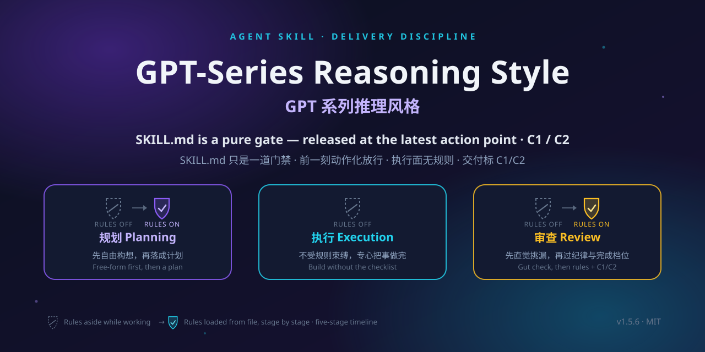

# gpt-series-reasoning-style · 说明书

<div align="center">

</div>

<div align="center">


</div>

> **把"Agent 说做完了"变成"Agent 证明做完了"。**
> 交付验收与多智能体协作纪律层。纯文本、零代码运行时、不联网、不上报。

| 项 | 值 |
|---|---|
| 版本 | **1.6.0**（以 `VERSION` 为准） |
| 许可 | MIT |
| 主导语言 | 中文 |
| 运行时形态 | 纯文本——不改代码、不联网、不上报 |

---

## 1. 定位与它治的病

**它是什么**：交付验收纪律层——只约束两件事：方案有没有跳步乱确认，交付有没有假完成。

**它不是什么**：
- 不是思维方法教程——不教你怎么思考
- 不是创意质量标准——好不好看、手感行不行，只由用户裁决
- 不是实现技术手册——不教你怎么写代码、怎么做设计

**它治的病**：AI 交付最常见的失败不是"不会做"，而是**没验过就说做完了**——测试没真跑说"全过"、HTML 没开说"没问题"、数字没对源说"统计好了"、说明写了功能 A 但产物里没有 A。

在四轮独立复现、共 14 个实验臂的对照里，AI 无一例外自报"测试全过、验证有效"——独立复查仍判出大量真实缺陷。**自报 ≠ 验证**，这个 gap 既是本 skill 存在的理由，也是它的天花板：它降低"假完成"，不能保证"真完成"。

**一句话**：让「我说做完了」变成「我验过了，证据在这儿」。

---

## 2. 何时加载（先看这张表）

| 任务形态 | 要不要挂 | 原因 |
|---------|---------|------|
| 带关键数字的数据/研究/表格 | **要** | 必须能重算、能对源 |
| 代码、页面、可运行产物 | **要** | 必须真跑/真开过 |
| 从零完整交付物（应用/长报告/游戏） | **要** | 至少 A 档对齐方向 + 阶段5验收 |
| 多 Agent / 派子任务 / 换模型分工 | **要** | 形态裁定 + 子任务默认 C1 |
| 用户说「做完帮我查 / 验收 / 对不对」 | **要** | 阶段5就是干这个的 |
| 单点小改、一句话问答、熟路微调 | **不要** | 规则自己写明：指令即授权 |
| 只聊天、只解释概念 | **不要** | 无交付物，无验收对象 |

**显式触发**（最稳）：
```text
使用 gpt-series-reasoning-style 执行本次任务
```

**隐式触发**：任务里出现「验收 / 防假完成 / 完成档位 / 数字要可信 / 派子任务」等词，或全局 `AGENTS.md` 规定交付默认挂载。

**结构提醒**：`SKILL.md` 只是门禁（很薄）。真正的纪律在：
- 动手前一刻 → 读 `DISCIPLINE.md`
- 进入规划 → 读 `references/plan-rules.md`
- 进入验收 → 读 `references/review-rules.md`
- 要派工 → 再读 `references/multi-agent.md`

不要提前把三份 references 全灌进上下文；执行期应让规则文件不在场。

---

## 3. 五阶段流程

```text
1 自由构想 → 2 规则规划 → 3 执行 → 4 直觉检查 → 5 纪律检查 → 交付
     ↑              ↑                      ↑
  不读规则      读 plan-rules          读 review-rules
              （创意类可跳过2）        （全类型都要过9条档位）
```

| 阶段 | 做什么 | 退出条件（口语版） |
|------|--------|-------------------|
| 1 构想 | 把想法摊开，不读规则 | 要点列完了，准备规划/动手 |
| 2 规划 | 读 plan-rules：回应每条构想、裁定形态、分风险、A/B 档确认 | 方案你点头了，没有再要问的 |
| 3 执行 | 凭能力做；创意先竖切出一条能玩/能看的完整路 | 无未调 bug；创意类有真实可打开路径 |
| 4 直觉 | 发现疑点当场修，不带进验收 | 没有新疑点 |
| 5 验收 | 读 review-rules，过完对应等级的条款 | 三件套齐全 + 档位标对 |

**只有阶段 2 和 5 是本 skill 的「牙齿」。** 阶段 1/3/4 不接管——实现型 skill、你的写法、工具随便用。

### 创意类（游戏 / UI / 视觉）的特殊规则
- **阶段 2 可直接跳过**（陌生专名/概念仍须先问或先搜）
- 阶段 3：先竖切，再打磨；真打开给你看
- 质量上限默认：**最多 2 轮打磨，或只修试玩时最弱的 1 项**
- **C2 只能来自你确认**；Agent 禁止单方面宣布「满意了」

**两道检查为什么是两次**：阶段4 不带纪律裸看，抓规则**没覆盖到**的盲区（带着清单会自我说服"我符合第3条了"）；阶段5 逐条过纪律，确保规则**覆盖到**的都做到。互不替代。

结果是两个「零」：**执行期零干扰**（规则退场，心流不断）＋ **验收期零妥协**（八条逐条过，一条不少）。

任务交付后：**彻底忘记 plan-rules / review-rules / multi-agent 的具体内容**，只记"有五个阶段、到哪读哪"，下次需要时再读。`docs/` 下的档案性文件（台账、身份档案、任务包）不在遗忘范围。

---

## 4. 阶段 2：规划时到底多了哪几步

（非创作类、或未跳过阶段 2 时）

1. **构想不许无声消失**：阶段 1 每条 → 进方案，或写「放弃 + 一句理由」
2. **形态留一行**：`形态裁定：形态一/二/三（依据：…）`
   - 一：自己干
   - 二：派子 Agent（有独立子活 / 要并行 / 要独立挑刺）
   - 三：多智能体（须先经你同意）
3. **风险分级**
   - 轻：单点、可逆、错了删掉即可 → 直接做，验收只做 3 条★ + 档位
   - 重：数据 / 代码 / 文档研究 / 多 Agent / 从零完整交付 → 全套
4. **确认方式**
   - 默认 **A 档**：推荐方案一次列清，你同意就开工
   - A 档只锁：做什么 / 不做什么 / 形态 / 硬约束 / 落盘路径；**不锁质量上限**
   - 你主动说「一个一个问」才用 B 档；未主动说时 B 档最多 1 题（专名确认）
   - **竖切优先**：A 档确认后立刻做最小可玩/可看切片，真打开截图给你看
5. **从零新建 ≠ 小改**：页面/应用/游戏/长报告至少走 A 档；好不好要你判的创意物，先对方向再动手

**退出时应能交出**：已确认方案 + 风险等级 + 形态一行 +（创意）质量预算一行。

---

## 5. 阶段 5：验收清单（核心）

轻任务：只做 ★ 三条 + 第 9 条；重任务：8 条全过 + 第 9 条。

| # | 条款 | 实操含义 |
|---|------|---------|
| ★1 | **真打开** | 浏览器真渲染 / 游戏真走一轮 / 报告数字逐个对源。跑脚本 ≠ 真打开 |
| ★2 | **未验证标注** | 没验的必须醒目标出；按**用户能走的每条操作路径**拆，禁止「整体功能」这种集合词；高风险未验置顶 |
| 3 | 声明对得上 | 「做了 X」必须在产物里指得到 X，指不到就补做或改口 |
| 4 | 失败两次换路 | 同动作连败 2 次，禁止第 3 次原样重试 |
| 5 | 全绿不算证据 | 故意制造一次应失败，确认会红；文档类 = 最可能错的点逐项实查 |
| 6 | 关键数字重算 | 独立方法或双源交叉；对不上以重算为准 |
| 7 | 临时物隔离 | 临时文件不进交付目录 |
| ★8 | 防死循环 | 同文件读 3 次无新信息就停 |
| 9 | **完成档位** | 见下节，全类型必过 |

### 交付必须能回答三件套

1. **做了什么**
2. **怎么验的**（可复现命令或操作步骤）
3. **哪些没验**（格式：`①XX——原因是XX；②XX——原因是XX`）

预期类（像不像、手感、符不符合想象）**也算没验**，只能由你确认，不得写成「风格已确认」。

---

## 6. 完成档位 C1 / C2

| 档位 | 含义 | 谁能宣布 | 交付怎么写 |
|------|------|---------|-----------|
| **C1** | 可验收：阶段 5 诚信审查通过 | Agent | 首行 `完成档位：C1` + `产品档：未拉满/已拉满`；未拉满写**一句差在哪** |
| **C2** | 产品满意 | **仅用户**或外部 scorecard | 必须附确认原话/选项卡结果；没有不得标 C2 |

硬规则：
- 测试全绿、证据齐全、变异红过再绿 → **只支持 C1，不能单独升 C2**
- 禁止用「手感已调好」「风格已确认」冒充 C2
- 多 Agent：子任务默认 C1；C2 只对**最终交付物**向你索取

---

## 7. 与其他 skill 怎么分工

```text
实现型 skill（xlsx / pptx / frontend / imagegen …）
    └─ 管：方法、格式、工具怎么用对
gpt-series-reasoning-style
    └─ 管：方案有没有乱确认 + 交付有没有假完成
创意 / 审美
    └─ 管：好不好 —— 只有用户能给 C2
```

**共存规则**：本 skill 只在阶段 2 和 5 有影响；阶段 1、3、4 完全开放——给其他类型 skill、使用者能力、工具自己发挥。

冲突时优先级：**宿主平台 / 安全沙箱 / 你当前的明确指令 > 本 skill。**

本 skill 不提权、不绕过确认、不改指令层级。

---

## 8. 多智能体协作

三形态可叠加，非三选一。

**形态一·单智能体**：默认。

**形态二·子智能体**（命中任一，评估后开）：独立子活 / 并行两件以上 / 独立挑刺视角 / 怕污染主上下文。派给子 Agent 时给清三样：目标、完成标准、交回给谁。交回后主 Agent 仍是 DRI，必须自己验收；一个人能连贯干完的事不开二。

**形态三·多智能体**（命中任一，先与用户确认）：用户指名 / 让另一个 AI 干 / 任务大到分工 / 跨模型。因要建 `docs/` 治理体系（ai-members + plans + 台账），有外部副作用。执行者与审查者窗口不加载本 skill——他们的全部行为规范来自身份文件与任务包。

**红线**：执行者说"我做完了"不算验收；审查者不亲自改；不绕开指挥官直接汇报。

---

## 9. 实测与证据

实验素材在 [`experiments` 分支](https://github.com/JadeYingWah/gpt-series-reasoning-style/tree/experiments)。

### 2026-09-17 三组对照

| 实验 | 有 skill | 无 skill | 谁更好 |
|---|---|---|---|
| **菲比秋比钓鱼**（陌生专名+从零新建游戏） | 两轮搜索查到《鸣潮》团子梗→三问确认→做成主角 | 核心词"菲比秋比"被**静默丢弃**，只做出通用钓鱼游戏 | **有 skill 明显更好** |
| **三游戏合集**（HTML+Python+Java，要求能打开玩） | exe 双击直启（自带 JRE/Python 环境），3/3 可玩，未验证项自动化闭环 | bat 启动器依赖用户机器环境，**2/3 打不开**，零未验证标注 | **有 skill 全面更好** |
| **问答双臂**（信息型问答） | 搜索核实+读文件+标来源 | 同样双问全对 | **平手**——裸平台已够好，据此撤销问答强制调研条款 |

一句话：条款只为实测出的缺口而设，不为已经做对的场景加规则。

### 历史实验（v1.2.x 旧版线）

v1.2.x 重版本（179 行、77 条自检、38.7KB）被实验直接证伪并废弃——执行者记不住繁复步骤、模板填不满，最后流于形式应付。现行 1.6.0 已完全重写，不适用该对比。

---

## 10. 成本

| 项目 | 实测值 |
|---|---|
| SKILL.md | 3594 字节 / 21 行（常驻约 0.6k token）——纯门禁 |
| DISCIPLINE.md | 3862 字节 / 22 行——动手前一刻才读 |
| plan-rules.md | 6162 字节——仅阶段 2 |
| review-rules.md | 5041 字节——仅阶段 5 |
| multi-agent.md | 5718 字节——仅形态二三 |
| 峰值常驻 | 任一时刻上下文里的规则文本不超过一份（规划或审查，不同时在场） |

**这意味着什么**：常驻门禁约 0.6k token（相当于一页短信），执行期上下文里没有任何纪律规则文本——挂着它的边际成本在执行期趋近于零。

对比 v1.2.5 重版本：38.7KB / 179 行 / ~12k token 全程在场——已被实验证明是更差的选择。

---

## 11. 诚实边界

这一节写的是我们自己测出来的局限，不是谦虚，是口径。

- **不提升推理能力，也不是 GPT 专用**——从 GPT 系列提炼，但适用于所有具备指令遵循能力的模型。
- **不提升代码质量**——代码本体两臂差别不大，变好的是交付可信度。
- **不是加速器**——验证习惯占约三到四成时间预算，换"敢直接用"的交付。要最快出活，这个 skill 不适合你。
- **不是流程绑架**——执行阶段规则文件根本不加载，创作不被打断；轻任务几乎无感。
- **规则只覆盖已知失败模式**——有限文本无法穷举无限缺陷，这是结构性上限。
- **自报 ≠ 验证**——它降低假完成，不能保证真完成。
- **边界条款**：只改完成任务必须改的地方；会让交付物坏着交的问题顺手修，其余不碰。

---

## 12. 最小正确用法（记不住就只记这个）

```text
要交付？
  ├─ 小改/问答 → 不挂，直接做
  └─ 数字/代码/页面/多Agent/从零成品
        ├─ 动手前：读 DISCIPLINE；重任务读 plan-rules，做完 A 档确认
        ├─ 执行中：不背规则；创意先竖切
        └─ 交付前：读 review-rules
              → 真打开该打开的
              → 未验路径逐条标出
              → 关键数字重算
              → 首行：完成档位 C1（+产品档）或经你确认的 C2
```

**任务结束后**：忘掉 rules 正文，只留「五阶段、到哪读哪份」；下次再读。`docs/` 台账类档案不算规则，可保留。

---

## 13. 用对 / 用错的判据

**用对了，应观察到：**
- 动手前有一句形态裁定和风险分级（重任务）
- 从零任务先有一次 A 档方案（或创意先有竖切）
- 交付里有三件套；没验的路径单独列出
- 首行有 C1/C2，且 C2 来自你而不是 Agent

**用错了（常见变形）：**

| 症状 | 说明 |
|------|------|
| 全程背着 9 条写代码 | 应阶段 3 再读；执行期规则不该常驻 |
| 问答也走五阶段 | 小任务/问答应直接不挂 |
| 只标 C1 不写差在哪 | 档位空转 |
| 「部分未验证」一笔带过 | 违反第 2 条拆分要求 |
| Agent 宣布 C2 | 违反档位定义 |
| 把质量条款当本 skill 输出 | 本 skill 不定义「好不好」 |

---

## 14. 安装

两类装法：**原生 Skill**（放进客户端 skills 目录，自动发现、按上下文触发，推荐）与 **AGENTS.md 项目指令**（`cd` 进仓库，由入口指路加载）。

**原生 Skill 目录**（`<name>` = `gpt-series-reasoning-style`）：

| 客户端 | 个人级（全局） | 项目级（随仓库共享） |
|---|---|---|
| Claude Code | `~/.claude/skills/` | `.claude/skills/` |
| Cursor（2.4+） | `~/.cursor/skills/` | `.cursor/skills/` |
| Codex CLI | `~/.codex/skills/` | `.codex/skills/`（或 `.agents/skills/`） |
| WorkBuddy | `~/.workbuddy/skills/` | — |

```bash
# macOS / Linux
git clone https://github.com/JadeYingWah/gpt-series-reasoning-style
cp -r gpt-series-reasoning-style ~/.claude/skills/
```

```powershell
# Windows PowerShell
git clone https://github.com/JadeYingWah/gpt-series-reasoning-style
New-Item -ItemType Directory -Force "$HOME\.claude\skills" | Out-Null
Copy-Item -Recurse -Force gpt-series-reasoning-style "$HOME\.claude\skills\"
```

**注意**：拷整个文件夹，不能只拷 `SKILL.md`（`DISCIPLINE.md`、`references/`、`templates/`、`scripts/` 按需加载）。

```bash
cd <skills目录>/gpt-series-reasoning-style && git pull   # 更新，版本号见 VERSION
python scripts/selfcheck.py      # 可选：38 项静态自检
```

验证生效：新开会话问 agent「你的版本号是多少？加载证明需要哪几个文件？」——应答 **1.6.0**，说得出门禁链路与五阶段时序。

---

## 15. 仓库结构

| 文件 | 角色 |
|---|---|
| `SKILL.md` | 门禁（21行），不含纪律正文 |
| `VERSION` | 当前版本号（1.6.0） |
| `DISCIPLINE.md` | 纪律全文（22行：五阶段+完成档位C1/C2+任务后遗忘+边界+加载） |
| `references/plan-rules.md` | 阶段2专用：规划规则 |
| `references/review-rules.md` | 阶段5专用：8条纪律+第9条完成档位 |
| `references/multi-agent.md` | 形态二三细则 |
| `templates/` | commander / executor / reviewer 三张角色卡 |
| `scripts/selfcheck.py` | 仓库一致性自检（38项） |
| `AGENTS.md` | 跨运行时入口路由 |
| `docs/` | 形态三运行时按需创建 |
| `.github/workflows/ci.yml` | CI：推送/PR 时自动跑 selfcheck |
| `SECURITY.md` | 安全模型说明 |
| `CHANGELOG.md` | 版本变更记录 |
| `README.md` / `REFERENCE.md` | 面向使用者的介绍 / 本完整说明书 |
| `assets/social-preview.svg` / `.png` | 仓库横幅（1280×640） |
| `LICENSE` | MIT |

---

## 16. 版本策略

- **当前主线：v1.6.0**——五阶段时序、文件级渐进加载、与其他 skill 共存、创作类跳过阶段2、C1/C2完成档位；
- v1.5.x：门禁动作化 + 完成档位；
- v1.4.x：五阶段时序前身；
- v1.2.x 重版线：已被实验证伪，该线废弃；
- patch 版（1.6.x）不打 tag，minor 大版本（1.7+）须主动提起后才打 tag。

---

*MIT License · 本说明书对应版本 1.6.0*
