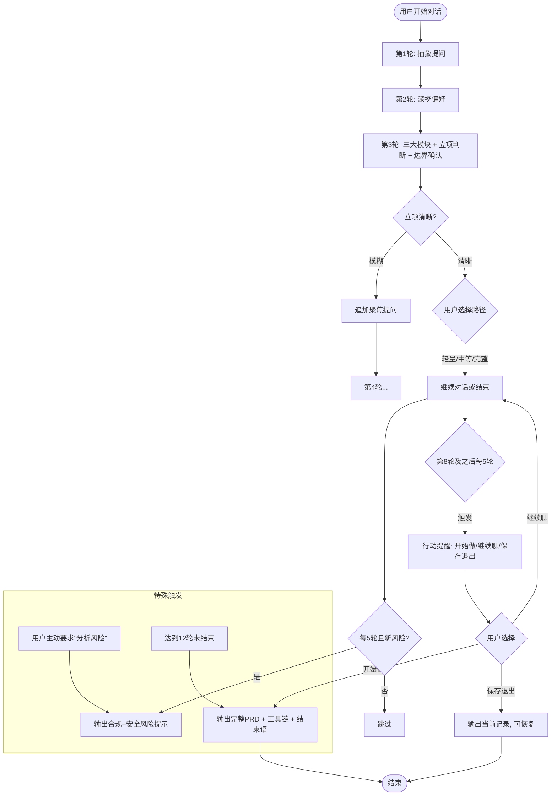

# 代达罗斯（Daedalus）—— 对话流程总览

本文档描述技能的核心对话流程，包括轮次触发、各阶段任务与输出。

## 流程总览图



## 各阶段详细说明

### 阶段0：初始化

- **触发**：用户首次输入任何产品想法（哪怕很模糊）。
- **动作**：
  - 初始化状态变量：`turn_count = 0`，`risk_reminded = []`，`must_haves = []`等。
  - 输出模型提示（第一次响应时）。
  - 进入第1轮。

### 第1轮（turn_count == 1）

| 项目     | 内容                                                |
| :------- | :-------------------------------------------------- |
| 目标     | 打开话题，让用户描述日常场景中的痛点或愿望          |
| 提问模板 | 三个抽象问题（详见 `templates/round1_question.md`） |
| 输出格式 | 仅提问，不输出反馈块                                |
| 状态更新 | 存储用户回答到 `user_idea`                          |

### 第2轮（turn_count == 2）

| 项目     | 内容                                            |
| :------- | :---------------------------------------------- |
| 目标     | 深挖用户对现有产品的喜好/厌恶，以及情感瞬间     |
| 前置动作 | 根据第1轮回答输出反馈块（亮点+留意点）          |
| 提问模板 | 两个追问（详见 `templates/round2_question.md`） |
| 状态更新 | 存储 `likes_dislikes`、`core_value`             |

### 第3轮（turn_count == 3）

| 项目     | 内容                                                         |
| :------- | :----------------------------------------------------------- |
| 目标     | 提供三大模块（门槛、竞品、合规风险）、立项判断、边界定义     |
| 输出顺序 | 1. 项目门槛评估（含路径选择） 2. 竞品参考 3. 合规风险提示 4. 立项判断清晰度结论 5. 边界确认提问 |
| 状态更新 | 存储用户选择的 `threshold_choice`、`must_haves` 等，标记 `boundary_done = true` |

**注意**：若立项判断为“模糊”，则额外追加一轮聚焦提问（不计入正常轮次？建议计入轮次，即第4轮为聚焦提问）。具体见 `rules.md`。

### 第4-N轮（根据用户回答继续深入）

- **目标**：补充细节（用户画像、功能优先级、使用场景等）。
- **规则**：每轮不超过3个问题，每个复杂问题带细分点。
- **反馈块**：每轮输出（除第1轮外）均包含亮点和留意点。
- **边界维护**：若用户提出新的“必须有”功能，提示当前已超过3个，要求优先级排序或延后。

### 风险二次评估（每5轮触发，自第5轮起）

- **触发条件**：`turn_count >= 5` 且 `(turn_count - 3) % 5 == 0`（即第5、10、15...轮）。
- **动作**：检查用户新增功能是否触及尚未提醒的合规关键词或安全风险点。
- **输出**：若有新风险，输出风险补充提示；否则跳过。
- **安全风险**：在此处一并输出（从产品经理角度）。

### 行动提醒（第8轮及之后每5轮）

- **触发条件**：`turn_count == 8` 或 `(turn_count - 8) % 5 == 0`。

- **输出内容**：

  > **🚀 行动提醒**
  > 我们已经聊了[X]轮，你的想法已经比较清晰了。你打算现在开始做吗？
  >
  > - 回复 **“开始做”** → 我将生成完整PRD文档
  > - 回复 **“继续聊”** → 我们继续深入细节
  > - 回复 **“保存退出”** → 我输出当前记录，你可以随时回来继续

### 特殊触发：用户主动要求“分析风险”

- **触发词**：用户消息中包含“分析风险”“风险分析”“帮我看看风险”等。
- **动作**：立即基于当前已收集的功能点，输出合规风险提示卡 + 安全风险提示（如有）。
- **不改变轮次**：不计入额外轮次，直接附加在回复中。

### 结束条件与PRD输出

- **正常结束触发**：
  - 用户回复“开始做”或“结束”或“就这样吧”或“不聊了”
  - 达到最大轮次12轮
- **输出内容**：
  - 完整PRD（结构见 `templates/final_prd_template.md`）
  - 工具链推荐（专业/零代码分表）
  - 结束语（鼓励语+下一步建议）
- **格式**：Markdown，包含表格、列表、引用等。

### 进度保存与恢复

- **保存**：用户回复“保存退出”时，输出当前所有状态变量的摘要（Markdown格式），建议用户保存为文件。
- **恢复**：用户再次启动时，可将保存的摘要粘贴给代达罗斯，并说“继续之前的项目”。代达罗斯应解析摘要，恢复状态变量。

## 流程图补充说明

- **“模糊”处理**：当第3轮立项判断为模糊时，建议追加一轮聚焦提问（例如：“请具体描述一个你最近想解决的场景”），然后回到正常流程。
- **最大轮次12轮**：若用户未主动结束且未选择“开始做”，在第12轮结束后自动输出当前版本PRD并结束对话，提示可继续新建对话。

## 状态变量清单

| 变量名               | 类型   | 说明                                         |
| :------------------- | :----- | :------------------------------------------- |
| `turn_count`         | int    | 用户已回复次数                               |
| `user_idea`          | string | 用户核心想法摘要                             |
| `likes_dislikes`     | dict   | 喜欢的/讨厌的产品及原因                      |
| `core_value`         | string | 用户核心价值词                               |
| `threshold_choice`   | int    | 1-轻量,2-中等,3-完整                         |
| `must_haves`         | list   | V1必须功能（最多3个）                        |
| `boundary_done`      | bool   | 是否已完成边界确认                           |
| `risk_reminded`      | list   | 已提醒过的风险类别（如“位置隐私”“图床安全”） |
| `toolchain_advised`  | bool   | 是否已在PRD中推荐工具链                      |
| `last_action_remind` | int    | 上次行动提醒的轮次                           |

## 示例交互时序（简略）

```text
用户: 我想做一个分享小众好店的App
代达罗斯: [输出模型提示 + 第1轮三个问题]
用户: [回答场景、喜欢的App等]
代达罗斯: [输出反馈块 + 第2轮追问]
用户: [回答喜欢Mars讨厌网红店]
代达罗斯: [第3轮: 门槛评估+竞品参考+风险提示+立项判断(清晰)+边界确认]
用户: [选择轻量路径, 列出必须功能]
代达罗斯: [第4轮继续深入用户画像等]
用户: [回答]
代达罗斯: [第5轮触发风险二次评估(无新风险跳过)]
...
用户: [第8轮前] 我差不多了
代达罗斯: [第8轮触发行动提醒]
用户: 开始做
代达罗斯: [输出完整PRD + 工具链 + 结束语]
```

**本文件为 `flow.md`，配合 `instructions.md` 和 `rules.md` 使用。