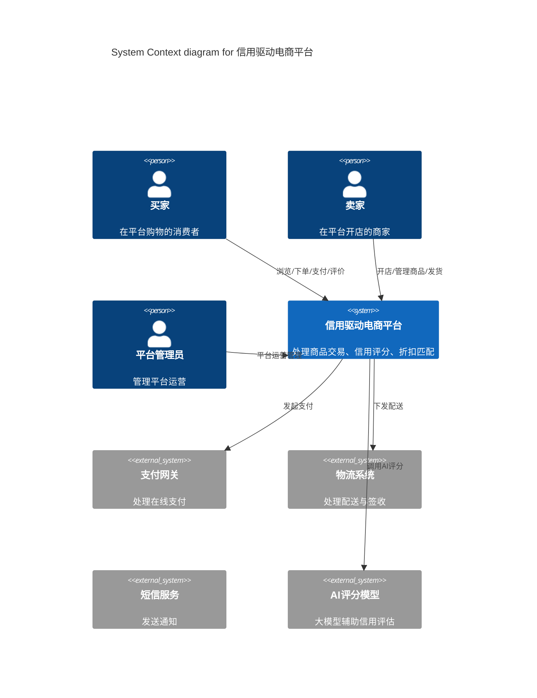
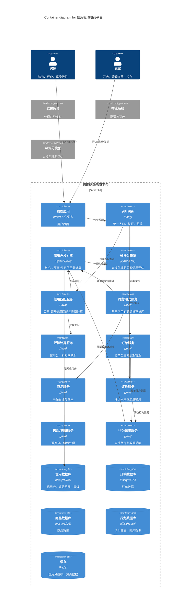

# 信用驱动型电商平台 — 架构设计说明书

## 1. 文档概述
- 版本: v1.0
- 日期: 2026-07-15
- 状态: 提案中

## 2. 项目背景

### 2.1 业务问题
电商平台中恶意订单（虚假订单、恶意退单、刷单等）造成快递费、人工费、包装费的直接损失。一笔恶意订单需要2-3笔正常订单的利润来填补，严重影响平台生态健康。

### 2.2 核心目标
建立**信用驱动的电商新模式**，通过双端信用评分体系，实现：
- 高信用买家 → 获得折扣 → 激励真实交易
- 高信用卖家 → 获得曝光 → 规模效应降低成本
- 信用匹配 → 好买家匹配好卖家 → 降低恶意订单率
- 形成"好买家→好卖家→低成本→高利润→回馈买家"的良性循环

### 2.3 核心业务逻辑

```
买家信用分高 → 在信用高的店铺购物享折扣
卖家信用分高 → 平台优先推荐曝光 → 客流增加
客流增加 → 规模效应 → 进货谈判力↑ + 快递费谈判力↑
成本降低 + 恶意订单率↓ → 利润率↑
利润↑ → 分配给高信用买家（折扣） → 买家更积极
```

### 2.4 关键约束
- 新卖家需要获得基础曝光机会（不能完全被老卖家垄断）
- 信用分需按年度/周期滚动计算
- 评分需防作弊、防刷分
- 需要AI模型辅助买家信用评估

---

## 一、需求分析

### 业务目标
构建**信用驱动的电商平台**，通过双端信用评分体系降低恶意订单率，形成良性循环。

### 核心业务流程

```
买家下单 → 订单完成 → 行为数据采集 → 信用分计算
                                            ↓
卖家发货 → 买家确认收货 → 评价 → 信用分更新
                                            ↓
信用分匹配 → 高信用买家→高信用卖家→折扣
           → 高信用卖家→平台优先推荐→客流增加
           → 规模效应→成本降低→利润提升→回馈买家
```

### 关键约束
- 新卖家需要基础曝光机会（不能完全被老卖家垄断）
- 信用分需按年度/周期滚动计算
- 评分体系需防作弊、防刷分
- AI模型辅助买家信用评估
- 折扣机制需可持续（利润再分配，而非平台补贴）

---

## 一、架构方案设计

### 系统模块划分

```
┌─────────────────────────────────────────────────────────────┐
│                    信用驱动电商平台                           │
├─────────────────────────────────────────────────────────────┤
│                                                              │
│  ┌─────────────┐  ┌─────────────┐  ┌──────────────────┐   │
│  │ 商品服务     │  │ 订单服务     │  │ 支付服务          │   │
│  │ ProductSvc   │  │ OrderSvc    │  │ PaymentSvc       │   │
│  └─────────────┘  └─────────────┘  └──────────────────┘   │
│                                                              │
│  ┌──────────────────────────────────────────────────────┐   │
│  │              信用评分核心引擎 (核心创新)                │   │
│  │  ┌─────────────┐  ┌─────────────┐  ┌──────────────┐ │   │
│  │  │ 买家信用评分  │  │ 卖家信用评分  │  │ AI评分模型   │ │   │
│  │  │ BuyerCredit  │  │ SellerCredit│  │ AIScorer    │ │   │
│  │  └─────────────┘  └─────────────┘  └──────────────┘ │   │
│  └──────────────────────────────────────────────────────┘   │
│                                                              │
│  ┌─────────────┐  ┌─────────────┐  ┌──────────────────┐   │
│  │ 信用匹配引擎  │  │ 折扣计算引擎  │  │ 推荐曝光引擎     │   │
│  │ CreditMatch  │  │ DiscountCalc│  │ ExposureRank    │   │
│  └─────────────┘  └─────────────┘  └──────────────────┘   │
│                                                              │
│  ┌─────────────┐  ┌─────────────┐  ┌──────────────────┐   │
│  │ 行为采集服务  │  │ 风控服务     │  │ 数据分析服务     │   │
│  │ BehaviorLog  │  │ RiskCtrl   │  │ Analytics       │   │
│  └─────────────┘  └─────────────┘  └──────────────────┘   │
```

---

## 二、架构方案设计

### 2.1 系统模块划分

系统分为 **9个核心服务**：

| 服务 | 职责 | 核心功能 |
|------|------|----------|
| **信用评分引擎** | 买家/卖家信用分计算 | 评分模型、AI打分、周期结算 |
| **行为采集服务** | 全链路行为数据采集 | 订单行为、评价行为、退单行为 |
| **信用匹配服务** | 买家-卖家信用匹配 | 推荐匹配、折扣计算 |
| **推荐曝光服务** | 基于信用的商品推荐 | 曝光权重、搜索排序 |
| **折扣计算服务** | 折扣规则引擎 | 信用分→折扣率映射 |
| **风控服务** | 恶意订单识别 | 规则引擎+AI模型 |
| **订单服务** | 订单全生命周期管理 | 下单、支付、发货、完成 |
| **评价服务** | 评价管理 | 评价采集、质量检测 |
| **数据分析服务** | 信用分统计、报表 | 趋势分析、BI报表 |

---

## 三、信用评分模型设计（核心）

这是你问的核心问题。我设计了一套完整的评分体系。

### 3.1 买家信用评分模型

#### 评分维度与权重

| 维度 | 权重 | 数据来源 | 说明 |
|------|------|----------|------|
| **订单履约率** | 30% | 订单系统 | 完成订单数 / 总下单数，恶意退单扣分 |
| **恶意退单率** | 25% | 风控系统 | 被判定为恶意退单的订单占比，**负向高权重** |
| **评价质量** | 15% | 评价系统 | 是否评价、评价内容质量（AI检测） |
| **确认收货时效** | 10% | 物流系统 | 签收后多久确认收货 |
| **支付履约率** | 10% | 支付系统 | 下单后是否按时付款 |
| **纠纷记录** | 5% | 客服系统 | 不合理纠纷次数，负向 |
| **账号稳定性** | 5% | 用户系统 | 注册时长、登录频率 |
| **退货率** | 5% | 售后系统 | 非质量问题的退货比例，负向 |

#### 买家信用等级划分

| 等级 | 信用分区间 | 标签 | 权益 |
|------|-----------|------|------|
| S | 900-1000 | 优质买家 | 最高折扣(8-9折)、优先客服 |
| A | 750-899 | 良好买家 | 较高折扣(9-9.5折) |
| B | 600-749 | 普通买家 | 基础折扣(9.5-9.8折) |
| C | 400-599 | 待提升买家 | 无折扣 |
| D | 0-399 | 风险买家 | 限制下单、需预付款 |

#### 买家评分算法

```
每笔订单评分 = 基础分(100) 
  - 恶意退单扣分(-50分/次，风控判定)
  - 未及时确认收货扣分(-5分/次，超3天)
  - 未评价扣分(-3分/次)
  + 积极评价加分(+5分/次，含文字评价)
  + 及时确认收货加分(+3分/次，24h内)
  + 长期无纠纷加分(+2分/笔，连续10笔无纠纷)

年度信用分 = Σ(每笔订单评分) / 年订单数

新买家初始分 = 600（基础分，给予信任）
```

### 买家评分维度详解

| 维度 | 权重 | 计算方式 | 数据来源 |
|------|------|----------|----------|
| **订单履约率** | 30% | 完成订单数 / 总下单数。每笔恶意退单 -50分 | 订单系统 + 风控判定 |
| **评价质量** | 20% | 有评价+5分/笔，有文字评价+8分/笔，AI检测评价真实性 | 评价系统 + AI |
| **确认收货时效** | 15% | 签收后24h内确认+5分，3天内+3分，超7天0分 | 物流系统 |
| **支付履约率** | 15% | 下单后按时付款比例，超时未付扣分 | 支付系统 |
| **纠纷记录** | 15% | 不合理纠纷-20分/次，合理纠纷不扣分 | 客服系统 |
| **账号健康度** | 10% | 注册时长、登录频率、设备稳定性 | 用户系统 |

#### 买家评分算法

```
单笔订单评分 = 100
  - 恶意退单判定: -50分（风控系统判定）
  - 超时未确认收货: -5分（签收后>72h）
  - 未评价: -3分
  + 及时确认收货(≤24h): +5分
  + 有文字评价: +5分
  + 评价被标记"有帮助": +3分
  + 连续10笔无纠纷: +2分

年度信用分 = Σ(每笔订单评分) / 年订单数
  × 订单量系数(ln(n+1)/ln(11), 保底10笔)
  × 账号年龄系数(1 + 0.02×年数, 上限1.1)

新买家初始分 = 650（中等偏下，需积累信用）
```

### 卖家信用评分模型

#### 评分维度与权重

| 维度 | 权重 | 计算方式 | 数据来源 |
|------|------|----------|----------|
| **商品质量** | 25% | 退货率、差评率、商品描述准确度 | 售后系统 + 评价系统 |
| **发货履约** | 20% | 按时发货率、发货速度 | 物流系统 |
| **服务评分** | 15% | 客服响应时间、售后处理满意度 | 客服系统 |
| **恶意订单率** | 15% | 被风控判定为恶意订单的比例，**负向** | 风控系统 |
| **真实交易率** | 10% | 真实交易占比，刷单检测 | 风控系统 + AI |
| **纠纷处理** | 10% | 纠纷解决率、解决时效 | 客服系统 |
| **商品描述准确度** | 5% | 退货原因中"与描述不符"占比 | 售后系统 |

#### 卖家信用等级划分

| 等级 | 信用分区间 | 标签 | 权益 |
|------|-----------|------|------|
| S | 900-1000 | 金牌卖家 | 最高曝光权重、最高折扣额度、平台认证标识 |
| A | 750-899 | 优质卖家 | 高曝光权重、较高折扣额度 |
| B | 600-749 | 普通卖家 | 标准曝光、基础折扣 |
| C | 400-599 | 待提升卖家 | 低曝光、无折扣额度 |
| D | 0-399 | 风险卖家 | 限制曝光、需缴纳保证金 |

#### 卖家评分算法

```
每笔订单评分 = 100
  + 按时发货(≤24h): +5分
  + 客服响应及时(≤5min): +3分
  + 商品描述准确(无退货): +3分
  - 退货(非质量问题): -5分
  - 被判定恶意订单: -30分（风控判定）
  - 客服响应超时: -3分
  - 商品与描述不符投诉: -10分

年度信用分 = Σ(每笔订单评分) / 年订单数
  × 订单量系数(ln(n+1)/ln(11), 保底10笔)
  × 经营时长系数(1 + 0.05×年数, 上限1.15)

新卖家初始分 = 700（中等偏上，给予机会）
```

### 卖家评分维度详解

| 维度 | 权重 | 计算方式 | 说明 |
|------|------|----------|------|
| **商品质量** | 25% | 退货率反向指标 + 差评率 + 描述准确度 | 核心指标 |
| **发货履约** | 20% | 按时发货率、平均发货时长 | 物流数据 |
| **服务评分** | 15% | 客服响应时间、售后满意度 | 客服系统 |
| **恶意订单率** | 15% | 被风控判定为恶意订单的比例，**负向** | 风控系统 |
| **真实交易率** | 10% | 真实交易占比，刷单检测 | 风控+AI |
| **纠纷处理** | 10% | 纠纷解决率、解决时效 | 客服系统 |
| **商品描述准确度** | 5% | 退货原因"与描述不符"占比 | 售后系统 |

#### 卖家信用等级划分

| 等级 | 分区间 | 标签 | 曝光权重 | 折扣额度 | 说明 |
|------|--------|------|----------|----------|------|
| S | 900-1000 | 金牌卖家 | 最高(×3.0) | 最高(8折起) | 平台认证标识、专属客服 |
| A | 750-899 | 优质卖家 | 高(×2.0) | 较高(8.5折起) | 优先推荐 |
| B | 600-749 | 普通卖家 | 标准(×1.0) | 基础(9折起) | 正常曝光 |
| C | 400-599 | 待提升卖家 | 低(×0.5) | 低(9.5折起) | 曝光受限 |
| D | 0-399 | 风险卖家 | 最低(×0.1) | 无折扣 | 限制曝光，需保证金 |

### 新卖家保护机制
- 新卖家初始分 = **700**（B级，给予信任）
- 前30天享受"新手保护期"：曝光权重不低于标准曝光×0.8
- 30天后按实际评分调整

---

## 三、信用评分模型设计（核心）

### 3.1 买家信用评分算法

```
单笔订单评分 = 100
  - 恶意退单判定: -50分（风控系统判定）
  - 超时未确认收货(>72h): -5分
  - 未评价: -3分
  + 及时确认收货(≤24h): +5分
  + 有文字评价: +5分
  + 评价被标记"有帮助": +3分
  + 连续10笔无纠纷: +2分

年度信用分 = Σ(每笔订单评分) / 年订单数
  × 订单量系数(ln(n+1)/ln(11), 保底5笔)
  × 账号年龄系数(1 + 0.02×年数, 上限1.1)

新买家初始分 = 650（中等偏下，需积累信用）
```

### 卖家信用评分算法

```
单笔订单评分 = 100
  + 按时发货(≤24h): +5分
  + 客服响应及时(≤5min): +3分
  + 商品描述准确(无退货): +3分
  - 退货(非质量问题): -5分
  - 被判定恶意订单: -30分
  - 客服响应超时: -3分
  - 商品与描述不符投诉: -10分

年度信用分 = Σ(每笔订单评分) / 年订单数
  × 订单量系数(ln(n+1)/ln(11), 保底10笔)
  × 经营时长系数(1 + 0.05×年数, 上限1.15)

新卖家初始分 = 700（中等偏上，给予机会）
```

### 卖家信用等级划分

| 等级 | 信用分区间 | 标签 | 曝光权重 | 折扣额度 | 说明 |
|------|-----------|------|----------|----------|------|
| S | 900-1000 | 金牌卖家 | ×3.0 | 最高(8折起) | 平台认证标识、专属客服 |
| A | 750-899 | 优质卖家 | ×2.0 | 较高(8.5折起) | 优先推荐 |
| B | 600-749 | 普通卖家 | ×1.0 | 基础(9折起) | 正常曝光 |
| C | 400-599 | 待提升卖家 | ×0.5 | 低(9.5折起) | 曝光受限 |
| D | 0-399 | 风险卖家 | ×0.1 | 无折扣 | 限制曝光，需保证金 |

### 买家信用等级划分

| 等级 | 信用分区间 | 标签 | 权益 |
|------|-----------|------|------|
| S | 900-1000 | 优质买家 | 最高折扣(8折起)、专属客服、优先发货 |
| A | 750-899 | 良好买家 | 较高折扣(8.5-9折) |
| B | 600-749 | 普通买家 | 基础折扣(9-9.5折) |
| C | 400-599 | 待提升买家 | 无折扣 |
| D | 0-399 | 风险买家 | 限制下单、需预付款 |

### 折扣映射规则

```
买家等级S + 卖家等级S → 折扣 8.0折
买家等级S + 卖家等级A → 折扣 8.3折
买家等级A + 卖家等级S → 折扣 8.3折
买家等级A + 卖家等级A → 折扣 8.5折
买家等级B + 卖家等级S → 折扣 8.5折
买家等级B + 卖家等级A → 折扣 9.0折
买家等级B + 卖家等级B → 折扣 9.5折
其他组合 → 无折扣或基础折扣
```

### 折扣公式

```
折扣率 = 1 - (买家信用系数 × 卖家信用系数 × 平台补贴系数)

买家信用系数 = 买家信用分 / 1000 × 0.15  (范围0-0.15)
卖家信用系数 = 卖家信用分 / 1000 × 0.10  (范围0-0.10)
平台补贴系数 = 卖家利润率 × 0.2          (范围0-0.05)

示例：
S级买家(950分) × S级卖家(950分) × 卖家利润率20%
= 1 - (0.95×0.15 + 0.95×0.10 + 0.20×0.20)
= 1 - (0.1425 + 0.095 + 0.04)
= 1 - 0.2775
= 0.7225 → 约7.2折
```

### 2.5 良性循环的量化推演

```
S级卖家利润率提升路径：

初始状态：
  曝光权重 ×3.0 → 客流+200%
  规模效应 → 进货成本-10% + 快递费-15%
  恶意订单率从5%降至1%
  售后成本-40%
  → 利润率从15%提升至25%

利润再分配：
  25%利润 × 20% = 5%作为折扣补贴
  → S级买家享约7-8折
  → 买家更积极维护信用
  → 更多真实交易
  → 平台生态持续改善
```

---

## 四、架构图

### Level 1: 系统上下文图



### Level 2: 容器图



---

## 五、关键架构决策记录

### ADR-001: 采用微服务架构

**背景**：信用评分系统涉及多个独立领域（评分计算、行为采集、匹配、推荐），需要独立扩展和迭代。

**决策**：采用微服务架构，按业务领域拆分服务。

**理由**：
- 信用评分引擎需要独立扩展（计算密集型）
- 行为采集服务需要高吞吐写入
- 各服务可独立部署、独立迭代

### ADR-002: 买家信用评分采用AI模型+规则引擎混合方案

**背景**：买家信用评估需要处理复杂的非结构化数据（评价内容、行为模式），纯规则引擎难以覆盖。

**决策**：采用**规则引擎（70%）+ AI模型（30%）**混合方案。

- **规则引擎**：处理结构化数据（订单履约率、退单率、确认时效等），可解释性强
- **AI模型**：处理非结构化数据（评价内容质量检测、恶意行为模式识别、异常检测）
- AI模型输出作为规则引擎的一个输入维度（权重30%）

### 2.5 良性循环量化推演

```
初始状态：
  平台平均恶意订单率: 5%
  卖家平均利润率: 15%

信用体系运行1年后：
  S/A级卖家占比: 30%
  恶意订单率: 从5%降至1.5%
  S/A级卖家利润率: 从15%提升至22-28%
  售后成本: 降低40-60%

信用体系运行3年后：
  S/A级卖家占比: 45%
  恶意订单率: 降至0.5%以下
  S/A级卖家利润率: 25-35%
  平台整体利润率: 提升5-8个百分点
```

---

## 五、关键架构决策记录

### ADR-001: 采用微服务架构

**背景**：信用评分系统涉及多个独立领域（评分计算、行为采集、匹配、推荐），需要独立扩展。

**决策**：采用微服务架构，按业务领域拆分。

**理由**：
- 信用评分引擎是计算密集型，需独立扩缩容
- 行为采集服务需要高吞吐写入，与查询服务分离
- 各服务可独立部署、独立迭代

### ADR-002: 买家信用评分采用规则引擎+AI模型混合方案

**背景**：买家信用评估需要处理评价内容、行为模式等非结构化数据。

**决策**：规则引擎(70%) + AI模型(30%) 混合方案。

**理由**：
- 规则引擎处理结构化数据（订单履约率、退单率等），可解释性强
- AI模型处理非结构化数据（评价内容质量检测、恶意行为模式识别）
- AI模型输出作为规则引擎的一个输入维度

### ADR-003: 信用分采用年度滚动计算

**背景**：信用分需要反映近期行为，同时给新用户机会。

**决策**：按**自然年滚动计算**，每年1月1日重置。

**理由**：
- 年度周期给用户明确的改进目标
- 新卖家/买家每年都有重新证明自己的机会
- 避免"一次犯错，终身影响"的问题
- 每年重置后，新卖家可以获得基础曝光

### ADR-004: 折扣成本由卖家利润再分配承担

**背景**：折扣不能由平台补贴，否则不可持续。

**决策**：折扣成本来自卖家因信用提升而获得的额外利润。

**理由**：
- 高信用卖家因曝光增加→客流增加→规模效应→成本降低→利润提升
- 利润提升的一部分(约20%)用于给高信用买家折扣
- 平台不承担折扣成本，确保模式可持续
- 卖家利润越高→可分配的折扣越多→买家越受益→良性循环

---

## 六、实施建议

### 阶段一：基础建设（1-3个月）
1. 搭建信用评分引擎（规则引擎部分）
2. 行为采集服务上线
3. 买家/卖家基础评分模型
4. 信用等级划分与展示

### 阶段二：核心闭环（3-6个月）
1. 信用匹配服务上线
2. 折扣计算引擎
3. 推荐曝光服务（基于信用分排序）
4. AI评分模型接入（评价质量检测、恶意行为识别）

### 阶段三：生态优化（6-12个月）
1. 折扣成本自动核算与分配
2. 卖家利润提升→折扣额度自动调整
3. 数据分析看板（信用分趋势、恶意订单率、利润率）
4. 防作弊机制持续迭代

---

## 七、关键风险与缓解措施

| 风险 | 概率 | 影响 | 缓解措施 |
|------|------|------|----------|
| 刷分/作弊 | 高 | 高 | AI异常检测、行为模式分析、人工复核 |
| 新卖家/买家冷启动 | 中 | 中 | 初始分+新手保护期+订单量系数 |
| 评分不公平 | 中 | 高 | 多维度评分、申诉机制、人工复核 |
| 折扣成本超支 | 中 | 中 | 折扣上限控制、利润再分配比例动态调整 |
| 恶意买家绕过风控 | 中 | 高 | AI模型持续迭代、多维度交叉验证 |
