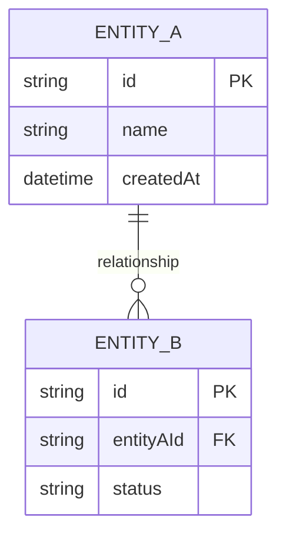

# Phase 2: Domain Modeling

**Goal:** Identify the core concepts, their relationships, and the ubiquitous language.

## Prerequisites

- Phase 1 Discovery completed
- Problem statement and actors defined

## Entry Questions

### 1. Core Concepts
- "What are the main 'things' in this domain?"
- "If you had to explain this to a new team member, what nouns would you use?"
- "What's the most important entity? The one everything else relates to?"

### 2. Relationships
- "How do these concepts relate to each other?"
- "Which relationships are required vs optional?"
- "Are there any many-to-many relationships?" (complexity signal)

### 3. Behaviors
- "What actions can be performed on/by each entity?"
- "What changes state in this system?"
- "What are the key workflows/processes?"

### 4. Invariants
- "What rules must ALWAYS be true?"
- "What would be a 'corrupted' state?"
- "What constraints does the business enforce?"

## Domain Modeling Techniques

### Entity Extraction
Listen for nouns in user descriptions. Candidates for entities:
- Have identity (unique identifier)
- Have lifecycle (created, modified, deleted)
- Are referenced by other concepts

### Value Object Identification
Concepts that:
- Are defined by their attributes, not identity
- Are immutable
- Examples: Money, Address, DateRange, Email

### Aggregate Boundaries
Ask: "If I delete [X], what else must be deleted with it?"
- Things deleted together = same aggregate
- Things that can exist independently = separate aggregates

## Mermaid Diagram Output

Generate a domain model diagram:



## Ubiquitous Language

Build a glossary as you model:

| Term | Definition | Example |
|------|------------|---------|
| [Domain Term] | [What it means in THIS context] | [Concrete example] |

**Critical:** Use the same terms everywhere - code, docs, conversations.

## Probing Questions

| If they describe... | Ask... |
|--------------------|--------|
| A complex entity | "Can this be broken into smaller concepts?" |
| Overlapping concepts | "Are these the same thing with different names?" |
| Vague relationships | "Is this 1:1, 1:many, or many:many?" |
| Missing behaviors | "Who/what triggers this change?" |

## Red Flags

- **God entities** - one entity that everything relates to
- **Anemic domain** - entities with no behaviors
- **Leaky abstractions** - technical terms in domain model (e.g., "DatabaseRecord")
- **Missing aggregates** - no clear boundaries

## Modeling Outputs

Before moving to Phase 3:

```markdown
## Core Entities
- [Entity]: [Purpose]

## Value Objects
- [ValueObject]: [What it represents]

## Aggregates
- [Aggregate Root]: [Entities it contains]

## Key Relationships
- [Entity A] → [Entity B]: [Nature of relationship]

## Invariants/Business Rules
- [Rule 1]
- [Rule 2]

## Ubiquitous Language
| Term | Definition |
|------|------------|
```

## Transition to Phase 3

When modeling is complete:

1. Present the domain model diagram
2. Walk through each aggregate
3. Confirm ubiquitous language
4. Ask: "Ready to define the system boundaries?"

Then: `read ./workflows/03-boundaries.md`
