# Mermaid Common Reference

This document covers syntax and features shared across all Mermaid diagram types.

---

## 1. Code Block Format

In Obsidian, use fenced code blocks:

````markdown
```mermaid
<diagram-type>
    <content>
```
````

---

## 2. Comments

Use `%%` for single-line comments (works in all diagram types):

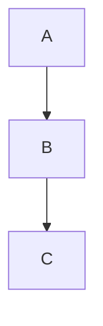

---

## 3. Direction (Flowchart/Subgraph)

| Direction | Description |
|-----------|-------------|
| `TB` / `TD` | Top to Bottom (default) |
| `BT` | Bottom to Top |
| `LR` | Left to Right |
| `RL` | Right to Left |

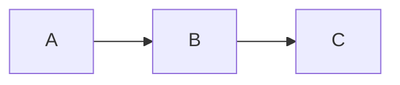

Subgraphs can have independent directions:

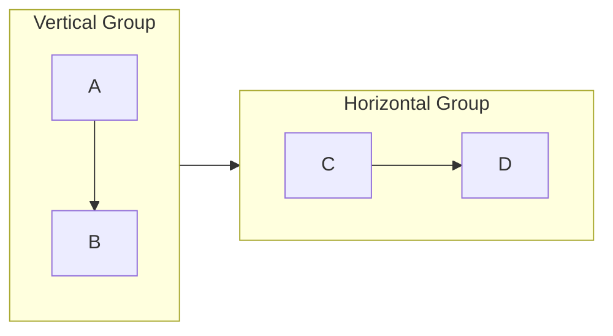

---

## 4. Styling Nodes

### Inline Style

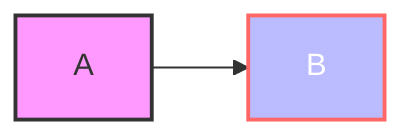

### Style Properties

| Property | Description | Example |
|----------|-------------|---------|
| `fill` | Background color | `fill:#f9f` |
| `stroke` | Border color | `stroke:#333` |
| `stroke-width` | Border thickness | `stroke-width:2px` |
| `color` | Text color | `color:#fff` |
| `stroke-dasharray` | Dashed border | `stroke-dasharray: 5 5` |

### Class Definition

Define reusable styles with `classDef`:


### Apply Class to Multiple Nodes

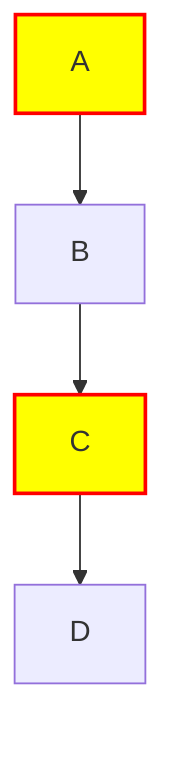

### Default Style

Override the default style for all nodes:

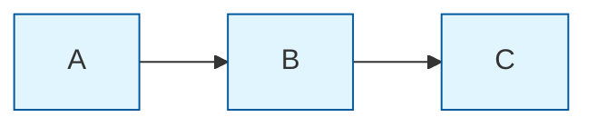

---

## 5. Styling Links (Edges)

### By Index

Links are numbered starting from 0 in order of appearance:

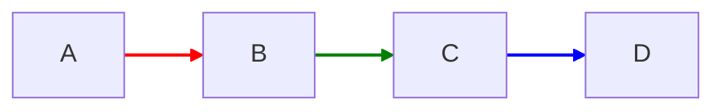

### Default Link Style

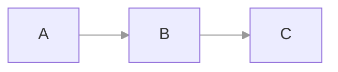

### Multiple Links at Once

```mermaid
flowchart LR
    A --> B --> C --> D --> E
    linkStyle 0,2,4 stroke:red,stroke-width:3px
```

---

## 6. Directives and Configuration

### Inline Directives

Use `%%{init: {...}}%%` at the start of a diagram:

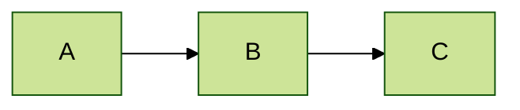

### Common Configuration Options

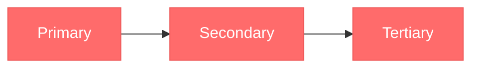

---

## 7. Themes

### Available Themes

| Theme | Description |
|-------|-------------|
| `default` | Standard blue-ish theme |
| `neutral` | Grayscale, good for printing |
| `dark` | Dark background |
| `forest` | Green-toned |
| `base` | Minimal, best for custom theming |

### Theme Examples

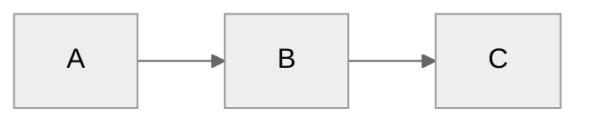

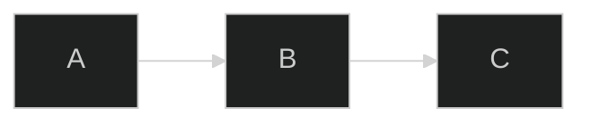

### Custom Theme Variables

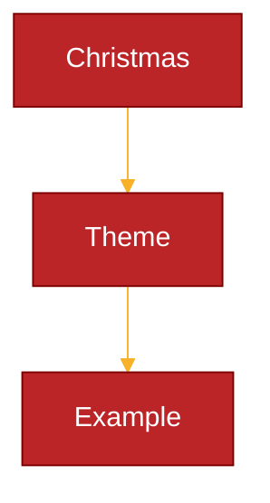

---

## 8. Accessibility

Add title and description for screen readers:

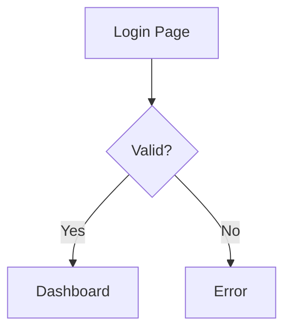

---

## 9. Special Characters

### Escaping

Wrap text in quotes for special characters:


### HTML Entities


### Unicode

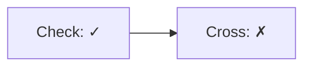

---

## 10. Multiline Text

Use `<br/>` or actual line breaks within quotes:

```mermaid
flowchart TD
    A["Line 1<br/>Line 2<br/>Line 3"]
```

---

## 11. Troubleshooting

### Diagram Not Rendering

| Symptom | Cause | Fix |
|---------|-------|-----|
| Blank output | Syntax error | Check for missing arrows, unclosed brackets |
| Partial render | Invalid node ID | Avoid starting IDs with numbers; use letters |
| Theme ignored | Obsidian override | Use explicit `style` commands |

### Common Syntax Errors

```
%% WRONG: Space in node ID
flow chart TD  %% Should be: flowchart TD

%% WRONG: Missing arrow type
A - B          %% Should be: A --> B or A --- B

%% WRONG: Unquoted special characters
A[Text -> here] %% Should be: A["Text -> here"]
```

### Performance Issues

- **50+ nodes**: Split into multiple diagrams
- **Complex styling**: Use `classDef` instead of individual `style`
- **Large Gantt**: Limit visible date range

### Obsidian-Specific Issues

| Issue | Solution |
|-------|----------|
| Colors differ between themes | Use explicit hex colors in `style` |
| Click events don't work | Obsidian disables JS for security |
| New Mermaid features missing | Wait for Obsidian update or use stable syntax |
| PDF export issues | Diagram is rasterized; use high-res capture |

---

## 12. Quick Reference

### Flowchart Shapes

| Shape | Syntax |
|-------|--------|
| Rectangle | `[text]` |
| Rounded | `(text)` |
| Stadium | `([text])` |
| Diamond | `{text}` |
| Hexagon | `{{text}}` |
| Circle | `((text))` |
| Cylinder | `[(text)]` |

### Arrow Types

| Arrow | Syntax | Description |
|-------|--------|-------------|
| Solid | `-->` | Standard arrow |
| Dotted | `-.->` | Dependency/optional |
| Thick | `==>` | Emphasized |
| No arrow | `---` | Association |
| Circle end | `--o` | Aggregation |
| X end | `--x` | Failure/block |
| Bidirectional | `<-->` | Two-way |

### Sequence Arrows

| Arrow | Syntax | Use |
|-------|--------|-----|
| Sync call | `->>` | Request |
| Response | `-->>` | Reply |
| Async | `-)` | Fire and forget |
| Async response | `--)` | Async reply |
| Failed | `-x` | Error/termination |

---

## 13. Diagram Type Keywords

| Diagram | Keyword |
|---------|---------|
| Flowchart | `flowchart` or `graph` |
| Sequence | `sequenceDiagram` |
| Class | `classDiagram` |
| State | `stateDiagram-v2` |
| Gantt | `gantt` |
| Gitgraph | `gitGraph` |
| Mindmap | `mindmap` |
| Pie | `pie` |
| ER Diagram | `erDiagram` |
| Journey | `journey` |

---

## External Resources

- [Mermaid Official Docs](https://mermaid.js.org/)
- [Mermaid Live Editor](https://mermaid.live/)
