# Sankey Diagram Reference

Complete guide for Mermaid Sankey diagrams in Obsidian.

---

## Overview

A Sankey diagram visualizes flows between connected elements using proportional bands. The width of each band represents the magnitude of the flow, making it ideal for showing distribution, allocation, and transformation of quantities.

---

## Basic Syntax

Sankey diagrams use CSV format with three columns: **source**, **target**, and **value**.

### Simple Example

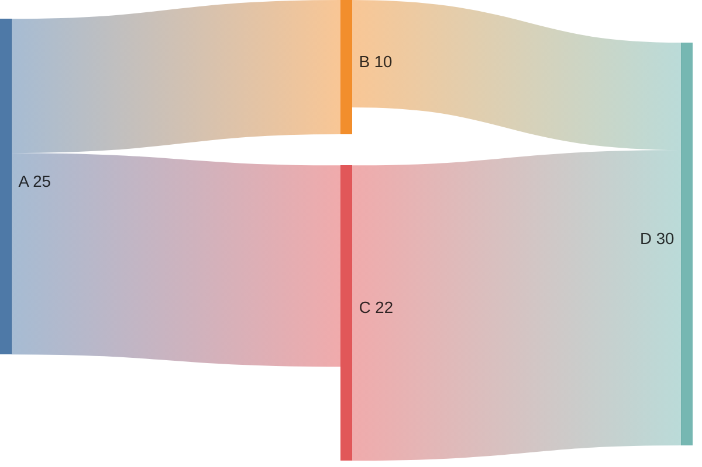
```mermaid
sankey-beta

A,B,10
A,C,15
B,D,8
C,D,22
```

**Note**: Do NOT include a header row. The CSV format expects data rows only (source,target,value).

### CSV Format Rules

| Rule | Example |
|------|---------|
| Three columns required | `source, target, value` |
| Values must be numeric | `10`, `42`, `100.5` |
| Empty lines allowed | Blank lines for organization |
| Commas in names | Use double quotes: `"New York"` |
| Case sensitive | `A` and `a` are different nodes |

---

## Node Concepts

### Automatic Node Creation

Nodes are automatically created from source and target values:

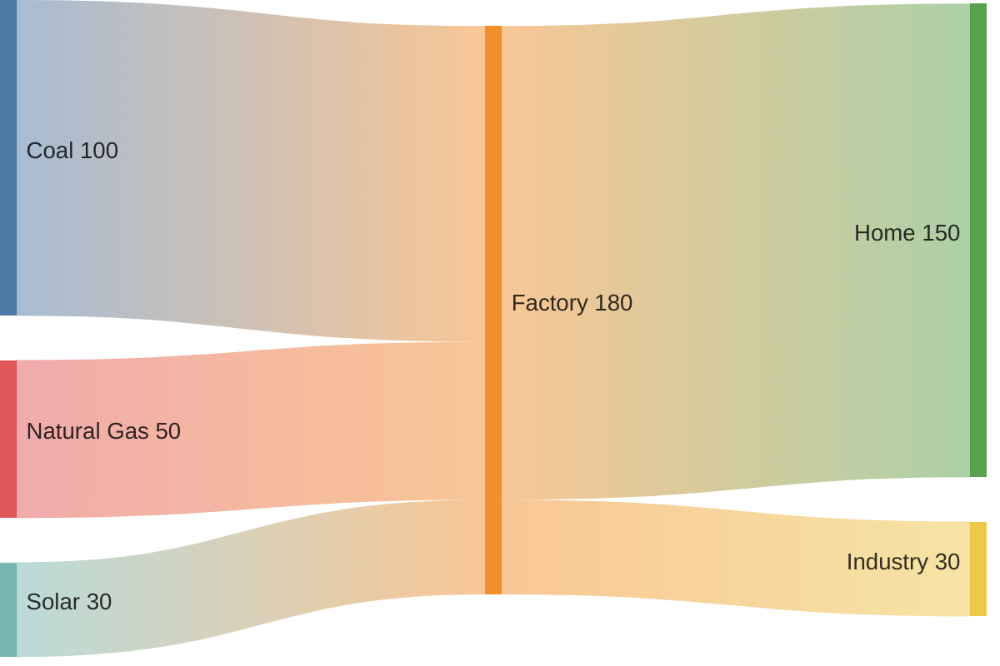
```mermaid
sankey-beta

Coal,Factory,100
Natural Gas,Factory,50
Solar,Factory,30
Factory,Home,150
Factory,Industry,30
```

### Node Order

Nodes appear in the order they are first mentioned in the data.

---

## Configuration

### Link Color Strategy

Control how flows are colored using YAML frontmatter configuration:

**Source Color** (inherits from source node):
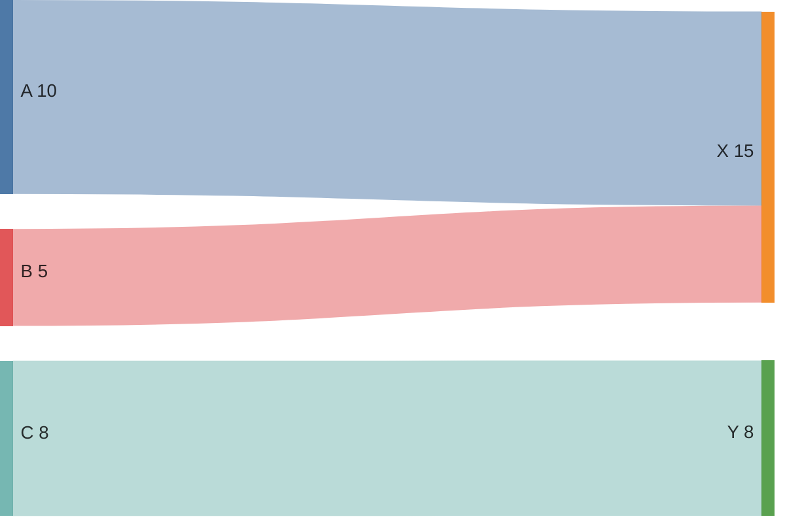
```mermaid
---
config:
  sankey:
    linkColor: source
---
sankey-beta

A,X,10
B,X,5
C,Y,8
```

**Target Color** (inherits from target node):
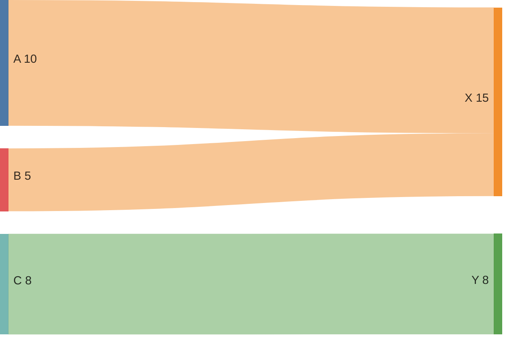
```mermaid
---
config:
  sankey:
    linkColor: target
---
sankey-beta

A,X,10
B,X,5
C,Y,8
```

**Gradient Color** (smooth transition):
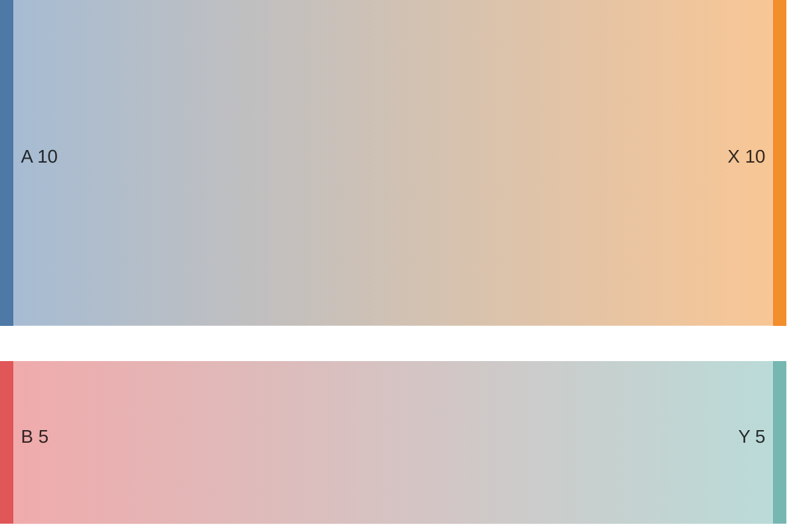
```mermaid
---
config:
  sankey:
    linkColor: gradient
---
sankey-beta

A,X,10
B,Y,5
```

**Custom Hex Color**:
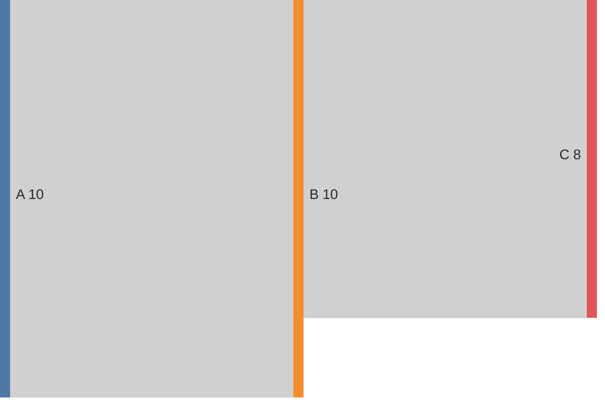
```mermaid
---
config:
  sankey:
    linkColor: '#a1a1a1'
---
sankey-beta

A,B,10
B,C,8
```

### Node Alignment

Configure node positioning:

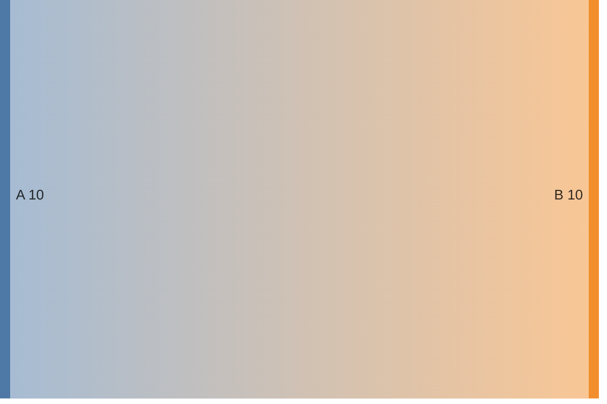
```mermaid
---
config:
  sankey:
    nodeAlignment: center
---
sankey-beta

A,B,10
```

| Alignment | Behavior |
|-----------|----------|
| `justify` | Spread nodes across height |
| `center` | Center nodes vertically |
| `left` | Align to left side |
| `right` | Align to right side |

### Additional Configuration Options

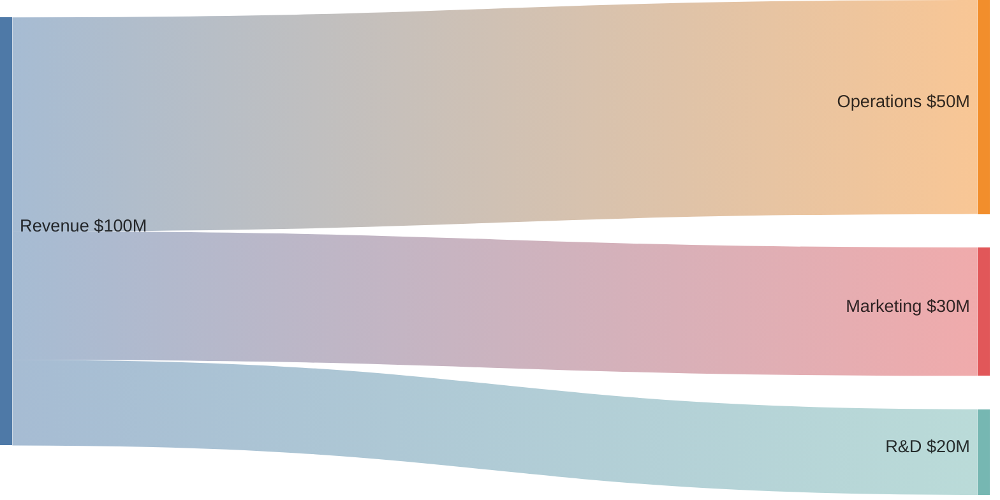
```mermaid
---
config:
  sankey:
    showValues: true
    prefix: '$'
    suffix: 'M'
    width: 800
    height: 400
    useMaxWidth: true
    linkColor: gradient
    nodeAlignment: justify
---
sankey-beta

Revenue,Operations,50
Revenue,Marketing,30
Revenue,R&D,20
```

| Option | Type | Description |
|--------|------|-------------|
| `showValues` | boolean | Display values on links |
| `prefix` | string | Text before values (e.g., `$`) |
| `suffix` | string | Text after values (e.g., `M`, `K`) |
| `width` | number | Diagram width in pixels |
| `height` | number | Diagram height in pixels |
| `useMaxWidth` | boolean | Use container max width |
| `linkColor` | string | `source`, `target`, `gradient`, or hex |
| `nodeAlignment` | string | `justify`, `center`, `left`, `right` |

---

## Practical Examples

### Example 1: Website Traffic Flow

```mermaid
sankey-beta

%% Website visitor flow
Google,Homepage,1200
Direct,Homepage,800
Facebook,Homepage,450
Homepage,Product Page,1500
Homepage,Blog,500
Homepage,Pricing,250
Product Page,Cart,600
Product Page,Homepage,400
Blog,Homepage,200
Cart,Checkout,450
```

### Example 2: Energy Distribution

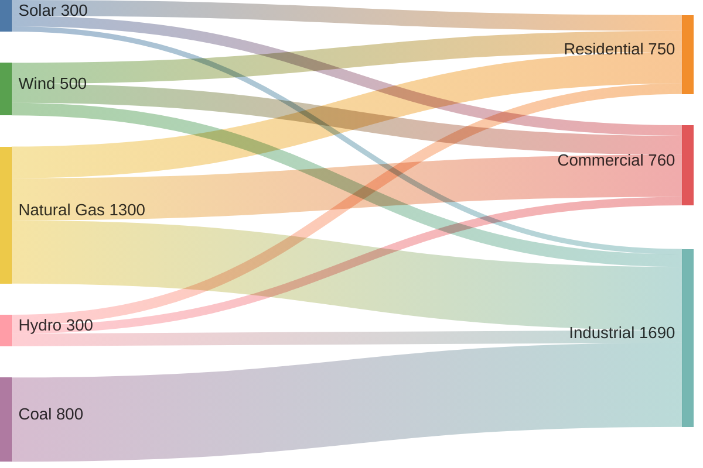
```mermaid
sankey-beta

%% Energy distribution by sector
Solar,Residential,150
Solar,Commercial,100
Solar,Industrial,50
Wind,Residential,200
Wind,Commercial,180
Wind,Industrial,120
Natural Gas,Residential,300
Natural Gas,Commercial,400
Natural Gas,Industrial,600
Coal,Industrial,800
Hydro,Residential,100
Hydro,Commercial,80
Hydro,Industrial,120
```

### Example 3: Budget Allocation

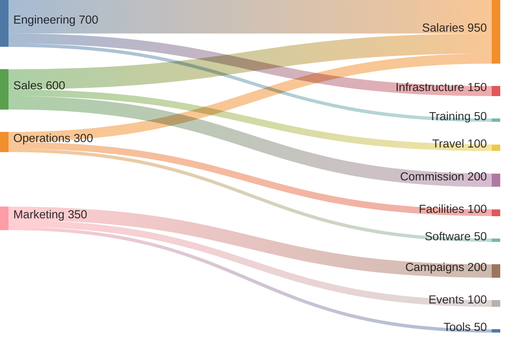
```mermaid
sankey-beta

%% Department budget breakdown
Engineering,Salaries,500
Engineering,Infrastructure,150
Engineering,Training,50
Sales,Salaries,300
Sales,Travel,100
Sales,Commission,200
Marketing,Campaigns,200
Marketing,Events,100
Marketing,Tools,50
Operations,Salaries,150
Operations,Facilities,100
Operations,Software,50
```

### Example 4: Data Pipeline Flow

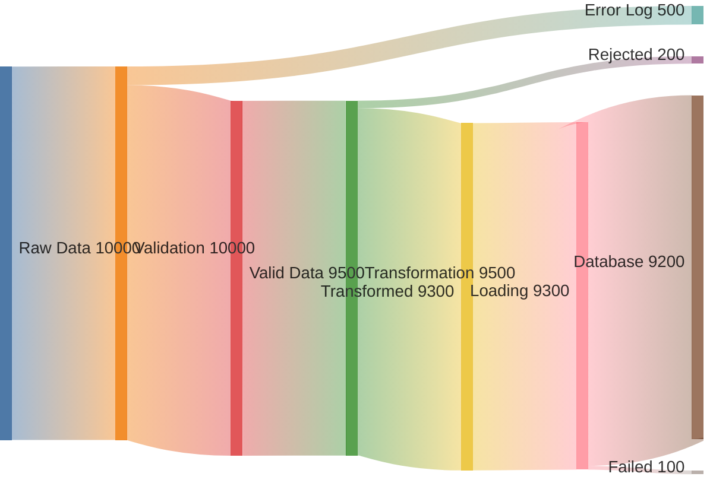
```mermaid
sankey-beta

%% Data processing pipeline
Raw Data,Validation,10000
Validation,Valid Data,9500
Validation,Error Log,500
Valid Data,Transformation,9500
Transformation,Transformed,9300
Transformation,Rejected,200
Transformed,Loading,9300
Loading,Database,9200
Loading,Failed,100
```

### Example 5: Software Development Workflow

```mermaid
sankey-beta

%% Development workflow
Backlog,In Development,15
In Development,Testing,12
Testing,Deployment,10
Testing,Fix Required,2
Fix Required,Testing,2
Deployment,Production,10
Production,Monitoring,10
Backlog,Documentation,3
```

---

## Data Preparation Tips

### Handling Large Values

Use consistent units and scale for clarity:

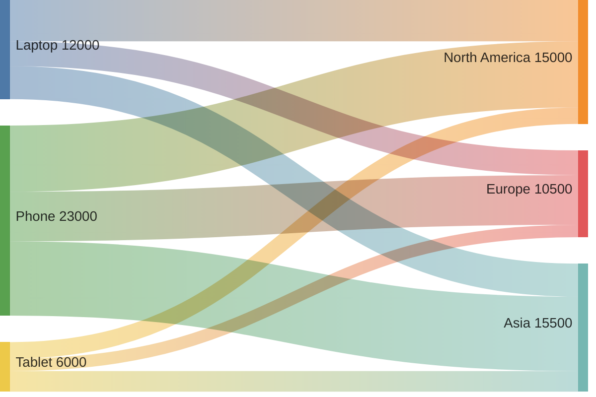
```mermaid
sankey-beta

%% Product sales by region
Laptop,North America,5000
Laptop,Europe,3000
Laptop,Asia,4000
Phone,North America,8000
Phone,Europe,6000
Phone,Asia,9000
Tablet,North America,2000
Tablet,Europe,1500
Tablet,Asia,2500
```

### Multi-Level Flows

Create hierarchical flows:

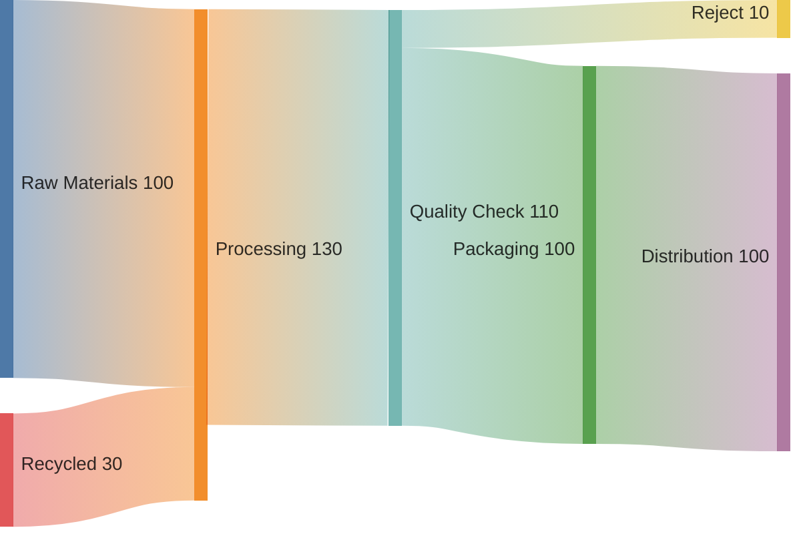
```mermaid
sankey-beta

%% Manufacturing pipeline
Raw Materials,Processing,100
Recycled,Processing,30
Processing,Quality Check,110
Quality Check,Packaging,100
Quality Check,Reject,10
Packaging,Distribution,100
```

### Balanced Flows

Ensure upstream equals downstream:

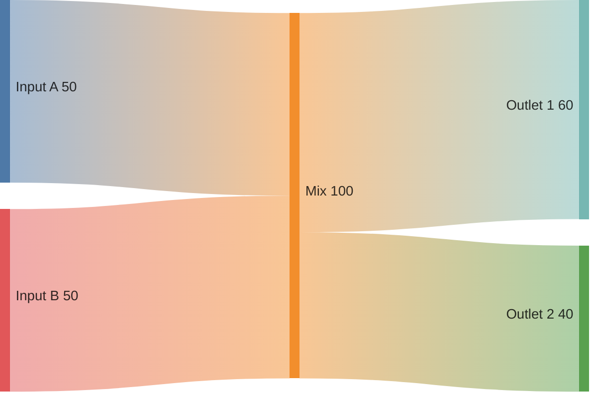
```mermaid
sankey-beta

%% Balanced mixing process
Input A,Mix,50
Input B,Mix,50
Mix,Outlet 1,60
Mix,Outlet 2,40
```

---

## Advanced Features

### Large Datasets

Sankey handles many nodes and flows efficiently:

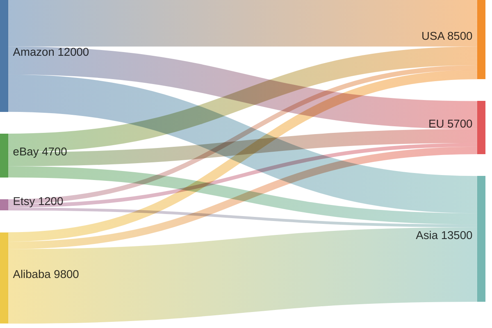
```mermaid
sankey-beta

%% E-commerce marketplace distribution
Amazon,USA,5000
Amazon,EU,3000
Amazon,Asia,4000
eBay,USA,2000
eBay,EU,1500
eBay,Asia,1200
Alibaba,USA,1000
Alibaba,EU,800
Alibaba,Asia,8000
Etsy,USA,500
Etsy,EU,400
Etsy,Asia,300
```

### Comments

Add comments for organization:

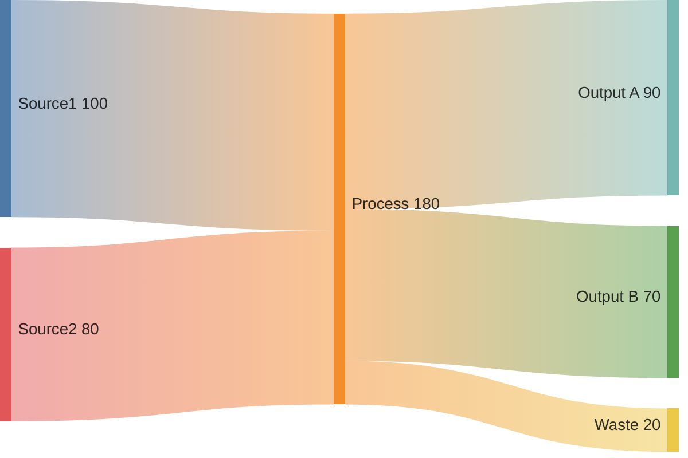
```mermaid
sankey-beta

%% Primary sources
Source1,Process,100
Source2,Process,80

%% Processing stage
Process,Output A,90
Process,Output B,70
Process,Waste,20
```

### Special Characters in Names

Use quotes for names with spaces or special characters:

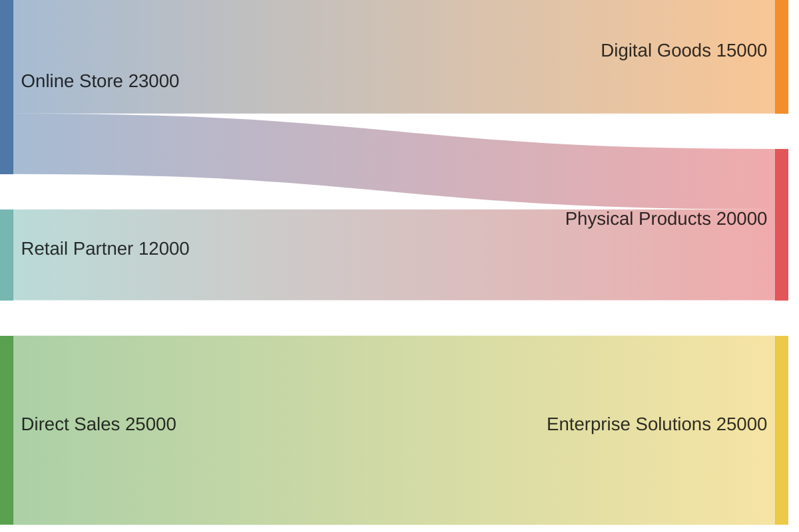
```mermaid
sankey-beta

%% Sales channels with quoted names
"Online Store","Digital Goods",15000
"Online Store","Physical Products",8000
"Retail Partner","Physical Products",12000
"Direct Sales","Enterprise Solutions",25000
```

---

## Obsidian Notes

**Theme Compatibility**: Sankey link colors adapt to Obsidian theme. Use `linkColor: '#hex'` for consistent appearance across themes.

**Performance**: Sankey diagrams handle 50+ nodes smoothly. Very large datasets (200+ flows) may require horizontal scrolling.

**Export**: PDF export renders Sankey diagrams as images. For external sharing, capture as PNG/SVG.

**Node Ordering**: Nodes appear in the order they first appear in the CSV. Reorganize rows to change layout if needed.

**Value Units**: The value column represents flow quantity—units are arbitrary (can be dollars, units, people, etc.).

**Code Block Format**:
````
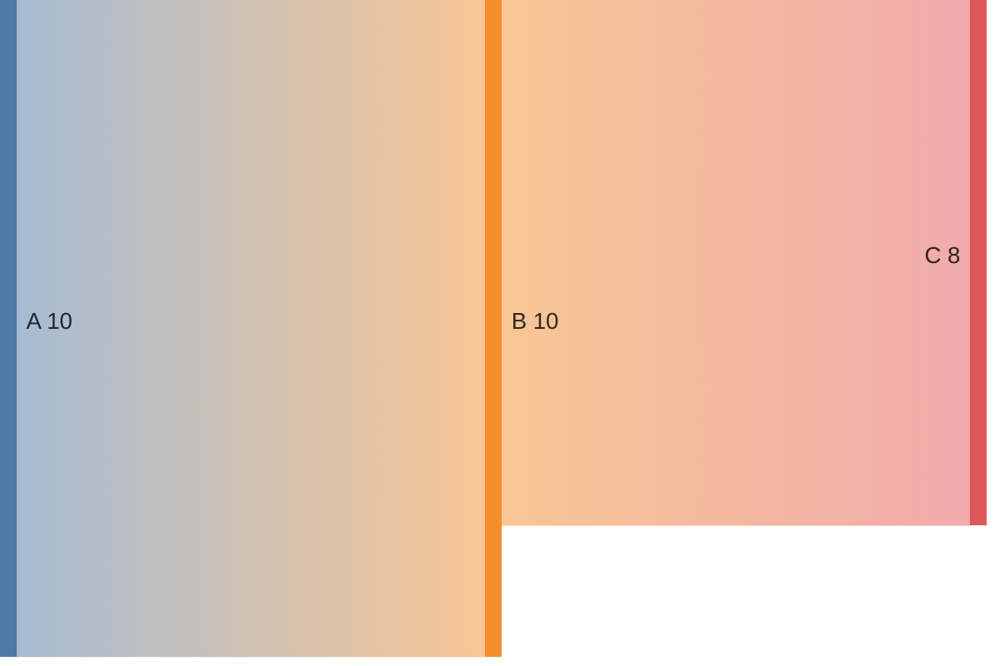
```mermaid
sankey-beta

A,B,10
B,C,8
```
````

---

## Quick Reference Table

| Concept | Syntax | Example |
|---------|--------|---------|
| Chart type | `sankey-beta` | Start diagram |
| CSV format | `source,target,value` | `A,B,10` |
| Node name | Text value | `Sales Channel` |
| Flow value | Number | `1500` |
| Names with spaces | Quoted | `"New York"` |
| Config block | YAML frontmatter | `---\nconfig:\n  sankey:\n---` |
| Link color | `linkColor: source` | `source`, `target`, `gradient`, hex |
| Node alignment | `nodeAlignment: center` | `justify`, `center`, `left`, `right` |
| Show values | `showValues: true` | Display values on links |
| Value prefix | `prefix: '$'` | Text before values |
| Value suffix | `suffix: 'M'` | Text after values |
| Comments | `%%` | `%% note` |
| Empty lines | Allowed | Visual organization |
