# Mermaid Diagram Examples

This reference provides ready-to-use Mermaid diagram templates for common documentation scenarios.

## Flowcharts (graph)

### System Architecture

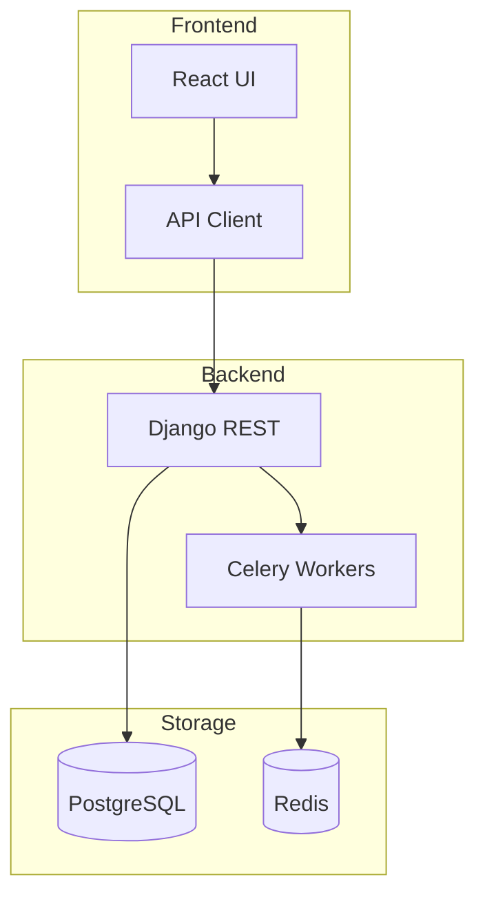

### Data Processing Flow

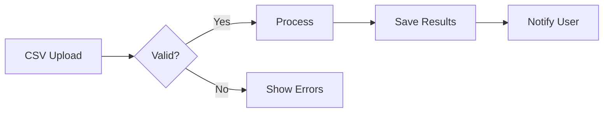

### Decision Tree

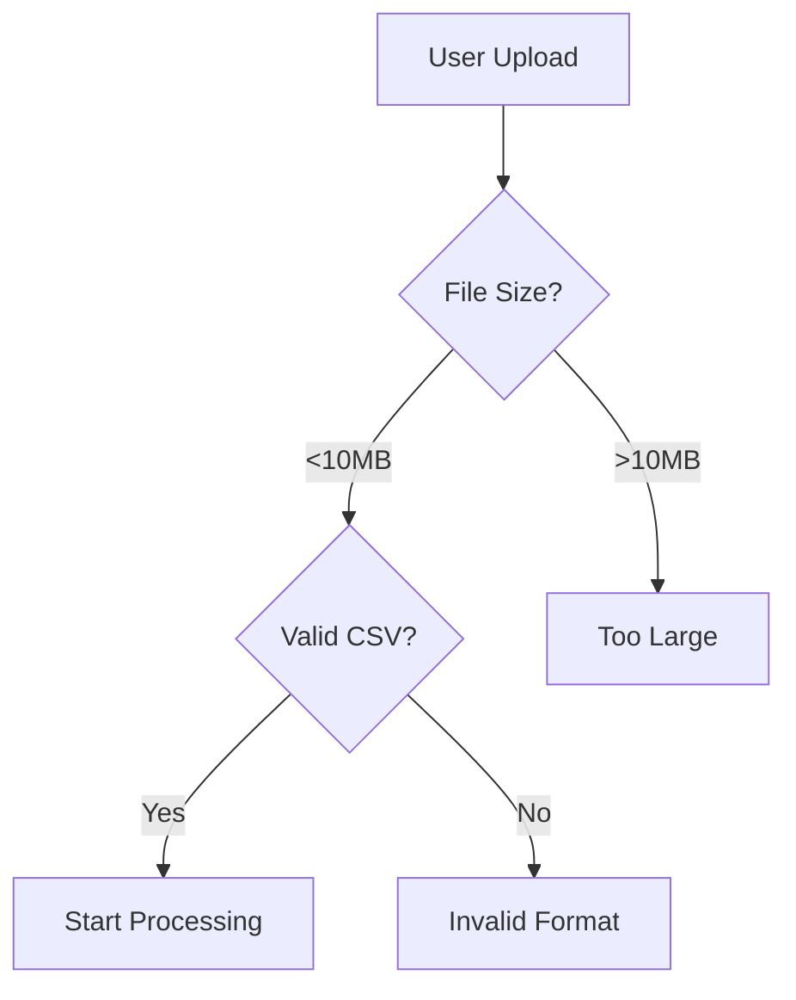

## Sequence Diagrams

### API Call Flow

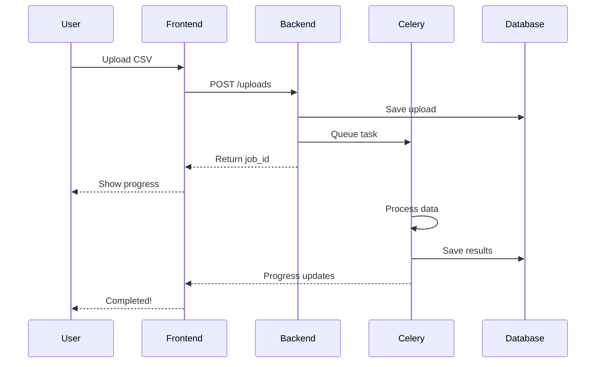

### Authentication Flow

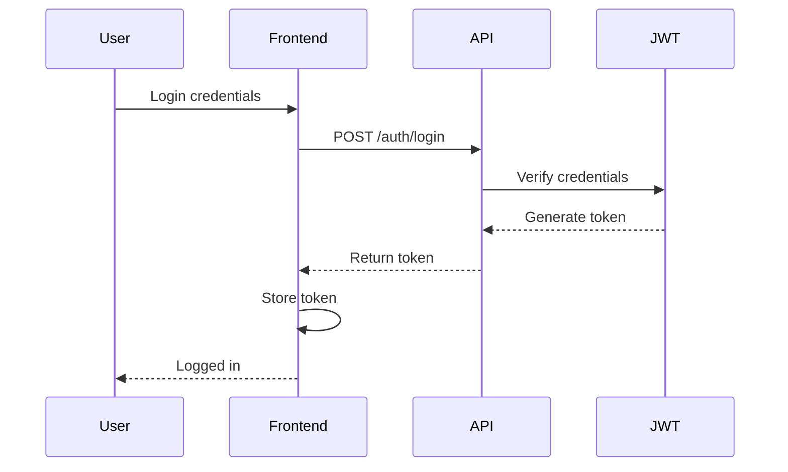

## Entity Relationship Diagrams

### Database Schema

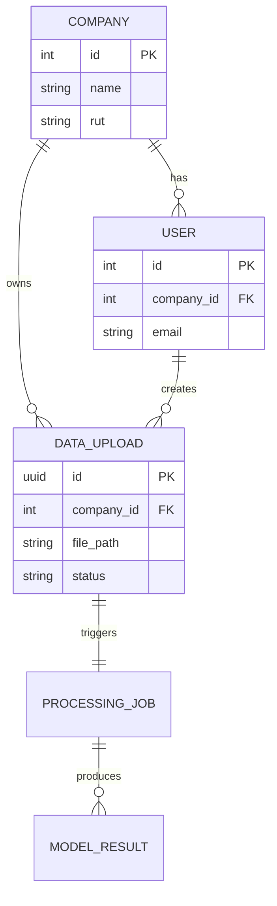

## State Diagrams

### Job Status States

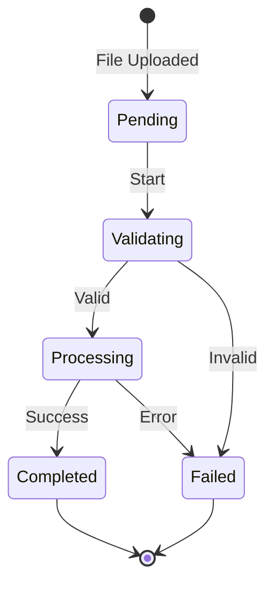

### User Journey

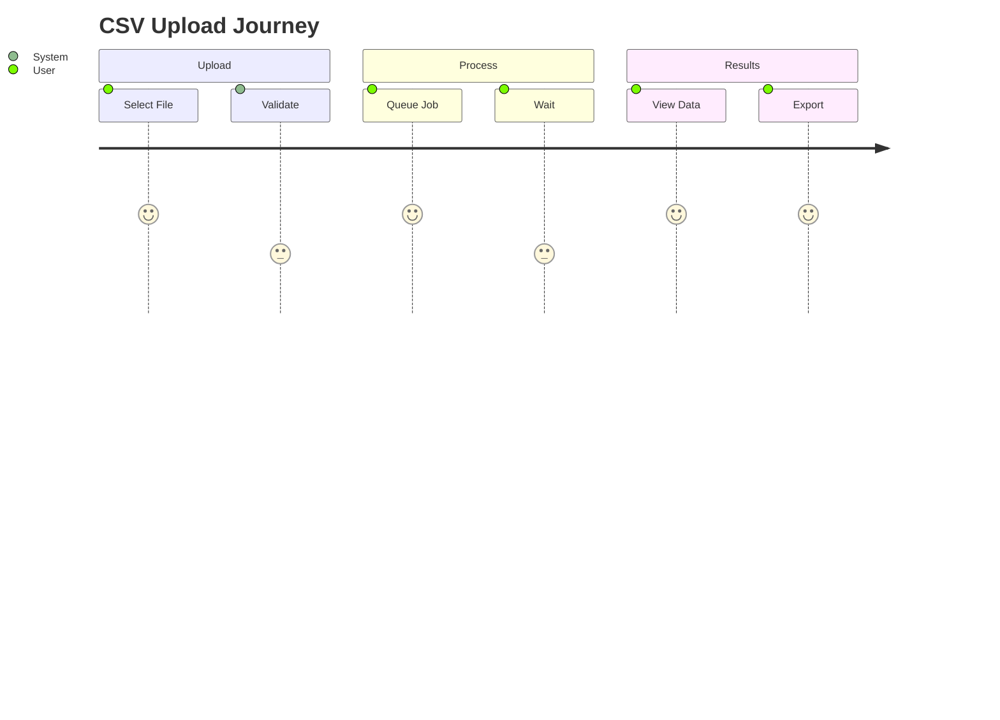

## Gantt Charts

### Project Timeline

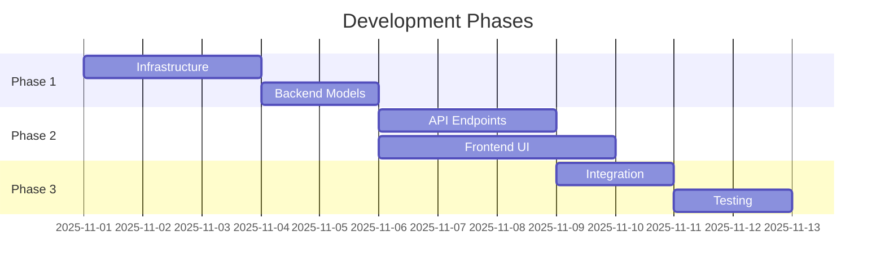

## Tips for Effective Diagrams

### Keep it Simple
- Maximum 7-10 nodes per diagram
- Split complex flows into multiple diagrams
- Use subgraphs for grouping

### Use Descriptive Labels
- Clear, concise text
- Action verbs for processes
- Questions for decisions

### Color Coding (Optional)
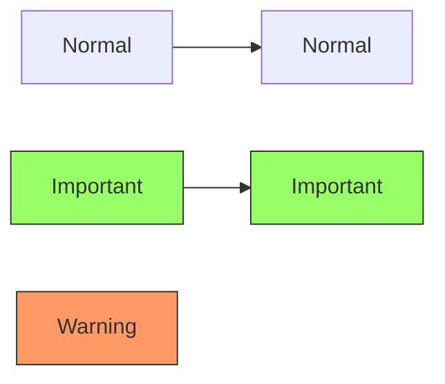

### Direction Matters
- `TB` (Top to Bottom) - Hierarchies, workflows
- `LR` (Left to Right) - Timelines, processes
- `RL` (Right to Left) - Reverse flows
- `BT` (Bottom to Top) - Rare, specific cases

## Common Patterns

### Multi-Step Process
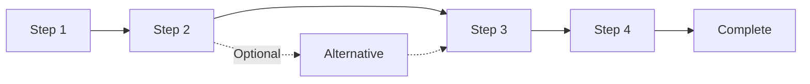

### System Components
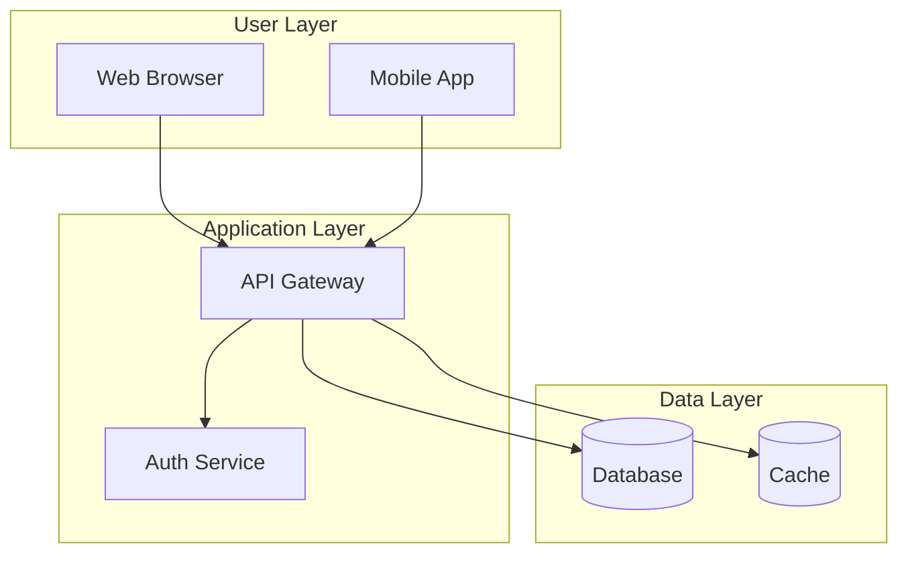

### Error Handling
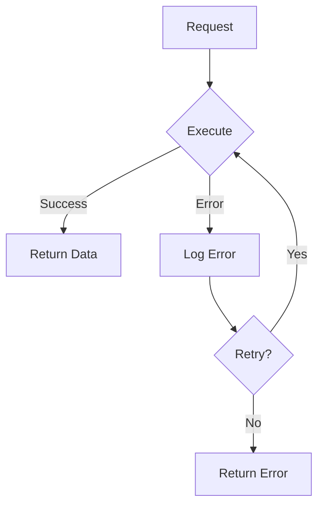

## Mermaid Resources

- **Official Docs:** https://mermaid.js.org/
- **Live Editor:** https://mermaid.live/
- **GitHub Support:** Renders automatically in .md files
- **VS Code:** Install "Markdown Preview Mermaid Support" extension