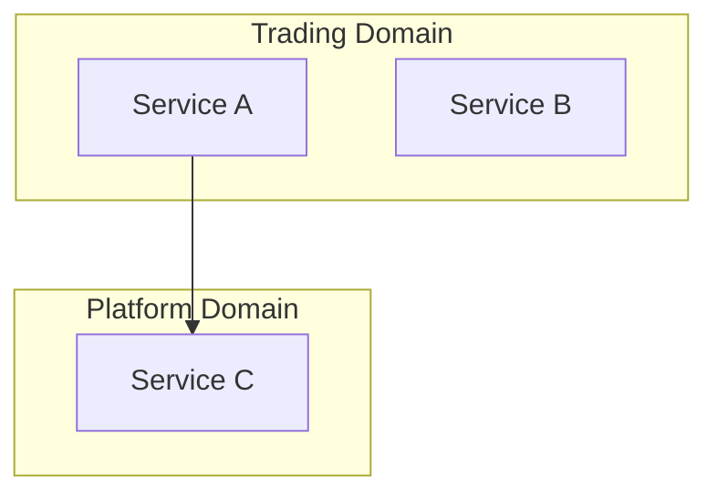
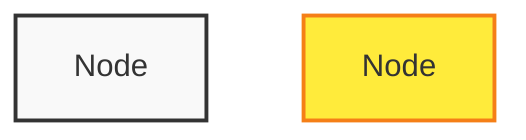

# Mermaid View Templates

Templates for generating different architectural views as Mermaid diagrams.

## Service Dependency Graph Template

```mermaid
graph TD
    %% Gateways
    %% For each component with type=gateway
    Gateway[{{name}}<br/>type: {{type}}]

    %% Services
    %% For each component with type=service
    Service[{{name}}<br/>type: {{type}}]

    %% Workers
    %% For each component with type=worker
    Worker[{{name}}<br/>type: {{type}}]

    %% Databases - use different shape
    %% For each component with type=database
    DB[({{name}}<br/>type: {{type}})]

    %% Dependencies - edges from dependsOn
    %% For each dependency in component.dependsOn
    Gateway --> Service
    Service --> DB
    Worker --> DB

    %% Styling
    classDef gateway fill:#e1f5fe
    classDef service fill:#f3e5f5
    classDef worker fill:#fff3e0
    classDef database fill:#e8f5e9

    class Gateway gateway
    class Service service
    class Worker worker
    class DB database
```

### Generation Rules

1. **Node shapes:**
   - Gateway/Service/Worker: `[Name]`
   - Database: `[(Name)]`

2. **Node labels:**
   - Format: `{name}<br/>type: {type}`
   - Optionally add domain if available

3. **Edges:**
   - From `dependsOn` relationships
   - Arrow direction: dependent → dependency

4. **Layout:**
   - Use `graph TD` (top-down) for better readability
   - Consider `graph LR` (left-right) for wide architectures

## Request Flow Map Template

```mermaid
flowchart LR
    Client[External Client] --> Gateway[{{gateway-name}}]

    %% Routes from gateway
    %% For each route in gateway.routes
    Gateway -->|{{route.path}}| Downstream[{{route.forwardsTo}}]

    %% Service dependencies
    %% For each service.dependsOn
    Downstream --> DB[(database)]

    %% Styling
    classDef gateway fill:#e1f5fe,stroke:#01579b
    classDef service fill:#f3e5f5,stroke:#4a148c
    classDef database fill:#e8f5e9,stroke:#1b5e20
    classDef external fill:#ffebee,stroke:#b71c1c
```

### Generation Rules

1. **Start from gateways:**
   - Find all components with `type: gateway`
   - These are the entry points

2. **Follow routes:**
   - Parse `routes` array from gateway metadata
   - Create edge with route path as label
   - Handle both `handler: this` and `forwardsTo: service`

3. **Add dependencies:**
   - Include databases and caches that services depend on
   - Don't show service-to-service dependencies (avoid clutter)

4. **Edge labels:**
   - Show route patterns: `/api/users/*`
   - Use `|label|` syntax in Mermaid

## Event Topology Template

```mermaid
graph LR
    %% Producers
    %% For each component with eventProducers
    Producer[{{service-name}}] -->|{{topic}}| Topic[(Kafka:<br/>{{topic}})]

    %% Topics to Consumers
    %% For each topic's consumers
    Topic --> Consumer[{{service-name}}]

    %% Styling
    classDef producer fill:#e8f5e9
    classDef consumer fill:#fff3e0
    classDef topic fill:#e1f5fe,stroke:#0277bd

    class Producer producer
    class Consumer consumer
    class Topic topic
```

### Generation Rules

1. **Topic nodes:**
   - Create a topic node for each unique topic name
   - Format: `[(Kafka: {topic})]`
   - Group by topic, not by producer

2. **Producer edges:**
   - From service to topic it produces
   - Label: topic name

3. **Consumer edges:**
   - From topic to consuming service
   - If multiple consumers, show all

4. **Message flow:**
   - Optional: show event schema on edges
   - Format: `|{event}| {topic}`

## Domain Grouping Template

Not a Mermaid diagram - use Markdown tables:

```markdown
## Services by Domain

| Domain | Services | Owner | Gateway | Service | Worker |
|--------|----------|-------|---------|---------|--------|
| trading | order-service, trade-service | trading-team | trading-gateway | order-service, trade-service | order-processor |
| platform | user-service, auth-service | platform-team | api-gateway | user-service, auth-service | notification-worker |

## Service Ownership

| Service | Domain | Type | Owner |
|---------|--------|------|-------|
| api-gateway | platform | gateway | platform-team |
| user-service | platform | service | platform-team |
| order-service | trading | service | trading-team |
```

## Complete Architecture Template

Combine all views:

```markdown
# System Architecture

## Overview
[Summary text about the system]

## Service Dependency Graph
[Mermaid dependency graph]

## Request Flows
[Mermaid request flow diagram]

## Event Topology
[Mermaid event graph]

## Service Groupings
[Markdown tables by domain]

## Data Flows
[Additional detail on how data flows through the system]
```

## Mermaid Syntax Quick Reference

### Graph Types
- `graph TD` - Top-down
- `graph LR` - Left-right
- `flowchart LR` - Flowchart (more control)

### Shapes
- `[text]` - Rectangle (process)
- `[(text)]` - Cylinder (database)
- `((text))` - Circle (connector)
- `{text}` - Rhombus (decision)
- `[[text]]` - Square with rounded corners

### Edges
- `A --> B` - Arrow
- `A -->|label| B` - Labeled arrow
- `A -.-> B` - Dotted arrow
- `A === B` - Thick line

### Subgraphs


### Styling

