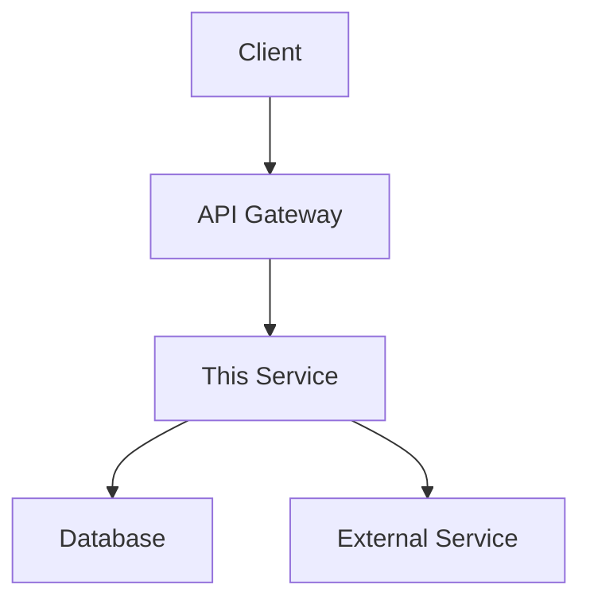

# Architecture

System architecture for [Project Name]

## Overview

[One-paragraph description of the system's purpose and design philosophy]

## System Components

| Component | Responsibility | Tech |
|-----------|----------------|------|
| [Name] | [What it does] | [Tech stack] |
| [Name] | [What it does] | [Tech stack] |

## Cross-Repository Architecture

### This Repository's Role

[Position in the broader ecosystem - e.g., "This is the API gateway that routes requests to downstream services"]

### Upstream Dependencies

| Repository/Service | Provides | Communication |
|--------------------|----------|---------------|
| [Repo name] | [What] | [Protocol - REST/gRPC/events] |
| [Service name] | [What] | [Protocol] |

### Downstream Consumers

| Repository/Service | Consumes | Communication |
|--------------------|----------|---------------|
| [Repo name] | [What from this] | [Protocol] |
| [Service name] | [What from this] | [Protocol] |

## Data Flow

1. **[Request Type]**: Client → [This Service] → [Upstream] → Response
2. **[Event Type]**: [Producer] → [Message Bus] → [This Service] → Process

## Design Decisions

| Decision | Rationale |
|----------|-----------|
| [Choice A over B] | [Why] |
| [Pattern used] | [Why] |

## Scaling Considerations

- [Horizontal scaling approach]
- [Bottlenecks and mitigations]
- [Caching strategy]

## Security

- [Authentication flow]
- [Authorization model]
- [Data encryption at rest/transit]
