# Entity Relationship Diagram Reference

Complete guide for Mermaid ER diagrams in Obsidian.

---

## Entity Definition

### Basic Entity

Define an entity by name only:

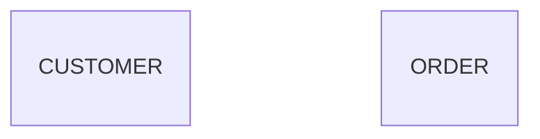

### Entity with Attributes

Define properties using type-name pairs within braces:

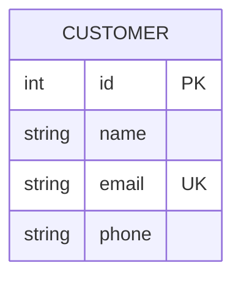

### Attribute Modifiers

| Modifier | Meaning | Example |
|----------|---------|---------|
| `PK` | Primary Key | `int id PK` |
| `FK` | Foreign Key | `int customer_id FK` |
| `UK` | Unique Key | `string email UK` |
| `PK, FK` | Composite Key | `string order_id PK, FK` |
| (none) | Regular attribute | `string phone` |

### Attribute Comments

Add descriptions in double quotes at the end of an attribute:

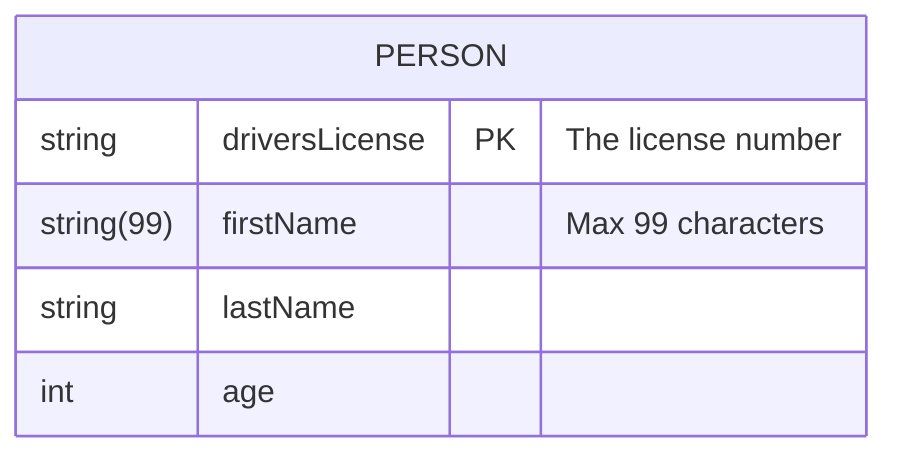

### Advanced Attribute Types

| Type | Example | Description |
|------|---------|-------------|
| `string(n)` | `string(99) name` | Length-limited string |
| `type[]` | `string[] tags` | Array type |

### Entity Aliases

Display alternative names in square brackets:

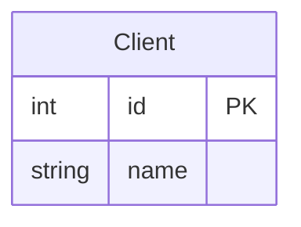

---

## Relationships and Cardinality

### Relationship Syntax

Basic format: `ENTITY1 RELATION ENTITY2 : LABEL`

### Cardinality Notation (Crow's Foot)

| Left Symbol | Right Symbol | Meaning |
|-------------|--------------|---------|
| `\|o` | `o\|` | Zero or one |
| `\|\|` | `\|\|` | Exactly one |
| `}o` | `o{` | Zero or more |
| `}\|` | `\|{` | One or more |

**Note:** The outermost character represents the maximum value, and the innermost character represents the minimum value.

### Cardinality Aliases

Mermaid also accepts text-based aliases instead of symbols:

| Alias | Equivalent Symbol |
|-------|-------------------|
| `zero or one`, `one or zero` | `\|o` / `o\|` |
| `only one`, `1` | `\|\|` |
| `zero or more`, `zero or many`, `many(0)`, `0+` | `}o` / `o{` |
| `one or more`, `one or many`, `many(1)`, `1+` | `}\|` / `\|{` |

Example using aliases:

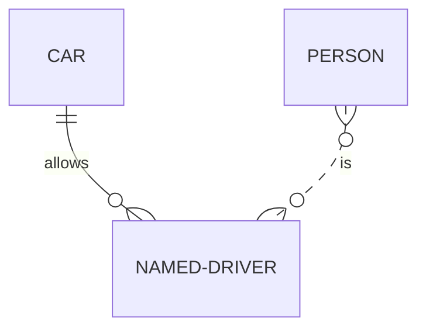

### Identifying vs. Non-Identifying

- `--` (solid line): Identifying relationship
- `..` (dashed line): Non-identifying relationship

### Relationship Examples

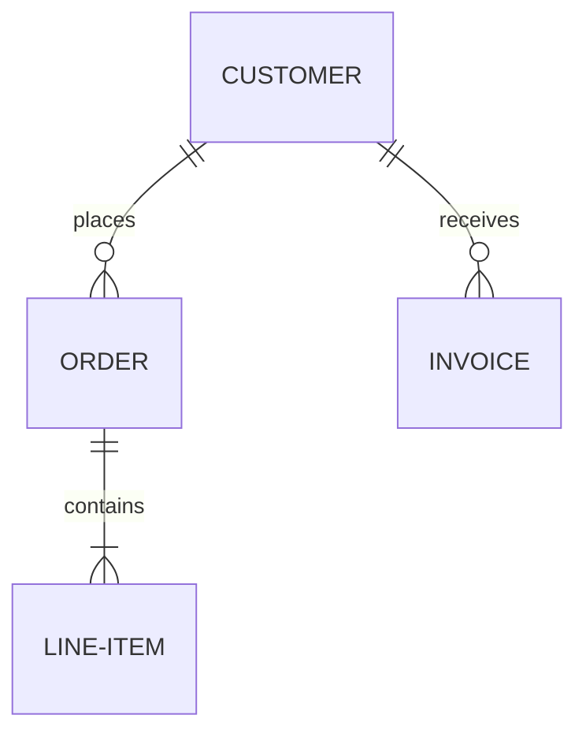

**Reading examples:**
- `CUSTOMER ||--o{ ORDER` → A customer places zero or more orders
- `ORDER ||--|{ LINE-ITEM` → An order contains one or more line items

---

## Complete Attribute Types

| Type | Example | Use Case |
|------|---------|----------|
| `int` | `int id` | Integer numbers |
| `string` | `string name` | Text |
| `float` | `float price` | Decimal numbers |
| `bool` | `bool active` | True/false values |
| `date` | `date created_at` | Date values |
| `text` | `text description` | Long text |

---

## Direction

Control diagram layout direction:

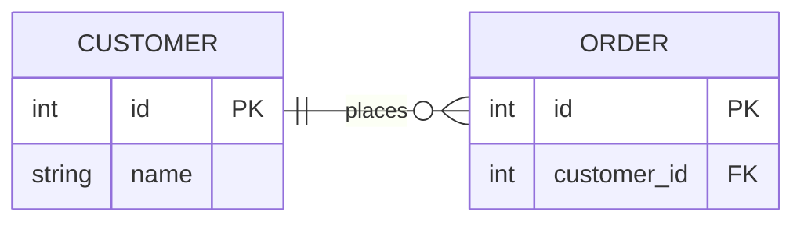

| Direction | Layout |
|-----------|--------|
| `TB` | Top to Bottom (default) |
| `BT` | Bottom to Top |
| `LR` | Left to Right |
| `RL` | Right to Left |

---

## Practical Examples

### Example 1: E-Commerce Database

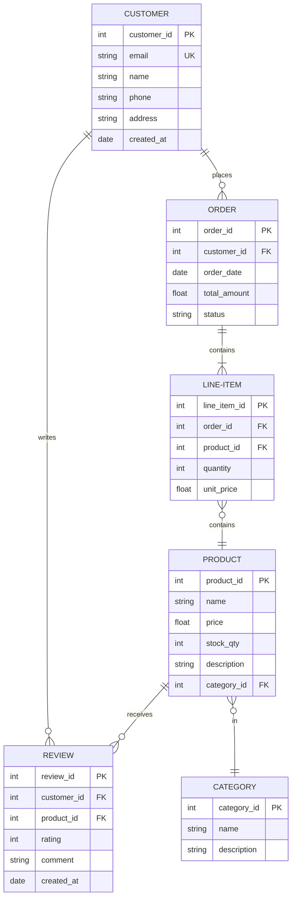

### Example 2: Social Media Platform

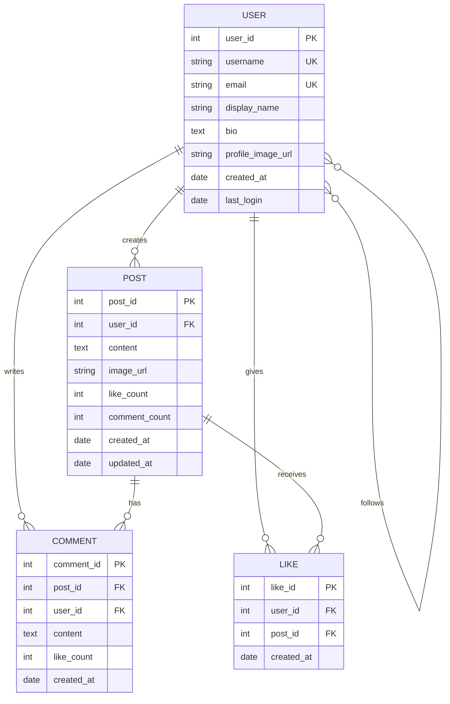

### Example 3: University Management System

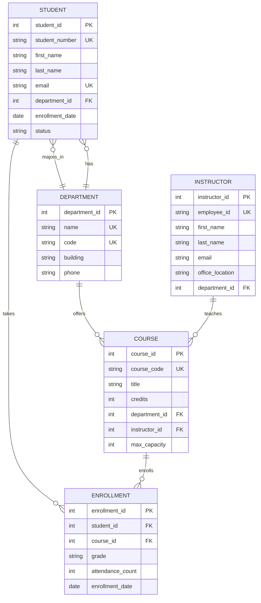

---

## Styling

### Using classDef and Style Classes

Define style classes with `classDef` and apply them using the `:::` operator:

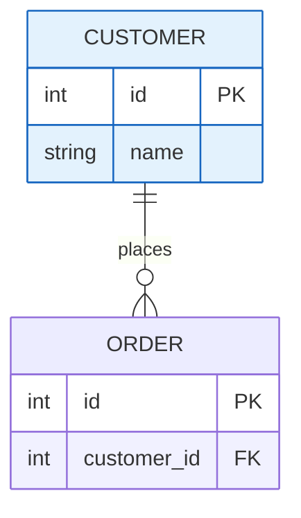

### Multiple Style Classes

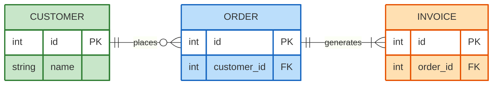

---

## Advanced Features

### Comments

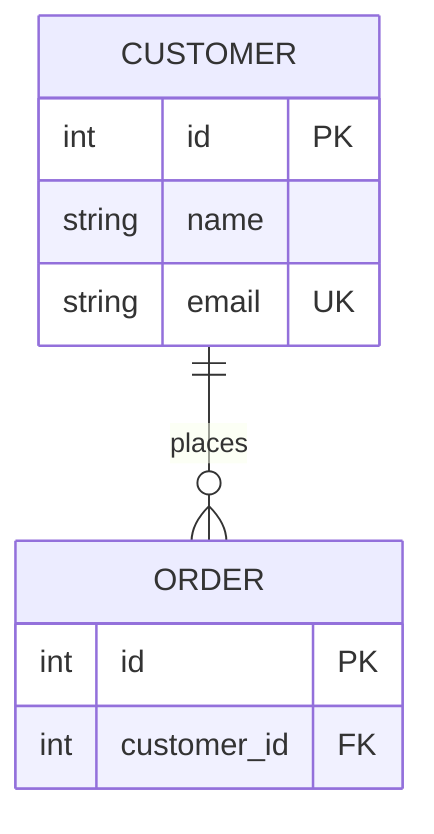

### Multiple Relationships

Entities can have multiple relationships:

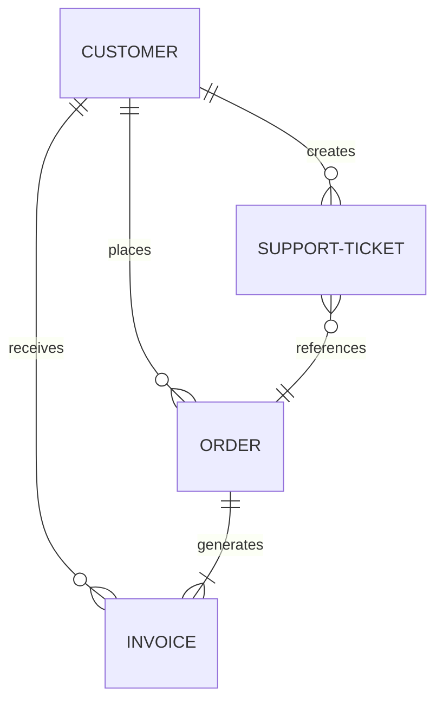

### Circular Relationships

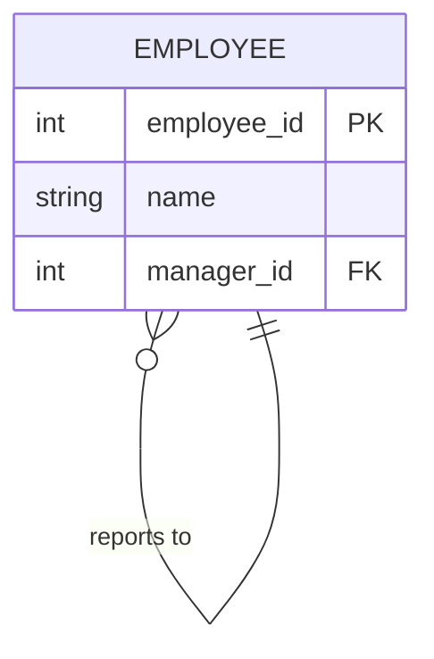

---

## Obsidian Notes

**Theme Compatibility**: ER diagram colors may vary with Obsidian themes. Use explicit styles for consistent appearance.

**Complex Diagrams**: Large ER diagrams (15+ entities) may slow rendering. Consider splitting by domain or layer.

**Export**: PDF export renders diagrams as images. For external sharing, capture as PNG/SVG.

**Primary Keys**: Always clearly mark primary keys with `PK` for data integrity visualization.

**Code Block Format**:
````
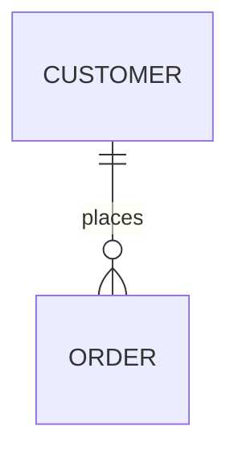
````

---

## Quick Reference Table

| Concept | Syntax | Example |
|---------|--------|---------|
| Entity | `ENTITY_NAME` | `CUSTOMER` |
| Attribute | `type name [MODIFIER]` | `int id PK` |
| Primary Key | `PK` suffix | `int id PK` |
| Foreign Key | `FK` suffix | `int customer_id FK` |
| Unique Key | `UK` suffix | `string email UK` |
| Composite Key | `PK, FK` suffix | `string id PK, FK` |
| Attribute Comment | `"comment"` suffix | `string name "Required"` |
| Zero or one | `\|o` / `o\|` | `CUSTOMER \|o--\|\| ADDRESS` |
| Exactly one | `\|\|` | `CUSTOMER \|\|--\|\| PROFILE` |
| Zero or more | `}o` / `o{` | `CUSTOMER }o--o{ ORDER` |
| One or more | `}\|` / `\|{` | `ORDER }\|--\|{ LINE-ITEM` |
| Identifying | `--` | `CUSTOMER--ORDER` |
| Non-identifying | `..` | `CUSTOMER..ORDER` |
| Relationship | `ENTITY1 REL ENTITY2 : label` | `CUSTOMER \|\|--o{ ORDER : places` |
| Alias | `[alias]` | `CUSTOMER [Client]` |
| Direction | `direction DIR` | `direction LR` |
| Style Class | `classDef name props` | `classDef highlight fill:#f0f` |
| Apply Style | `ENTITY:::class` | `CUSTOMER:::highlight` |
