# Flowchart Reference

Complete guide for Mermaid flowcharts in Obsidian.

---

## Direction

| Keyword | Direction |
|---------|-----------|
| `TD` / `TB` | Top to Bottom |
| `BT` | Bottom to Top |
| `LR` | Left to Right |
| `RL` | Right to Left |

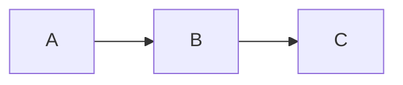

---

## Node Shapes

| Shape | Syntax | Use Case |
|-------|--------|----------|
| Rectangle | `[text]` | Process, action |
| Rounded | `(text)` | Start/end, general |
| Stadium | `([text])` | Terminal, pill shape |
| Subroutine | `[[text]]` | Predefined process |
| Cylinder | `[(text)]` | Database, storage |
| Circle | `((text))` | Connector, event |
| Diamond | `{text}` | Decision, condition |
| Hexagon | `{{text}}` | Preparation |
| Parallelogram | `[/text/]` | Input/output |
| Trapezoid | `[/text\]` | Manual operation |
| Double Circle | `(((text)))` | End state |
| Flag | `>text]` | Async, signal |

### All Shapes Example

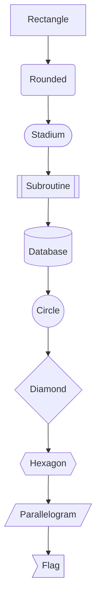

---

## Links (Connections)

### Arrow Types

| Style | Syntax | Description |
|-------|--------|-------------|
| Arrow | `-->` | Standard flow |
| Open | `---` | No arrow |
| Dotted arrow | `-.->` | Optional, async |
| Thick arrow | `==>` | Emphasis, main flow |
| Circle end | `--o` | Reference |
| Cross end | `--x` | Termination |
| Bidirectional | `<-->` | Two-way flow |

### With Labels

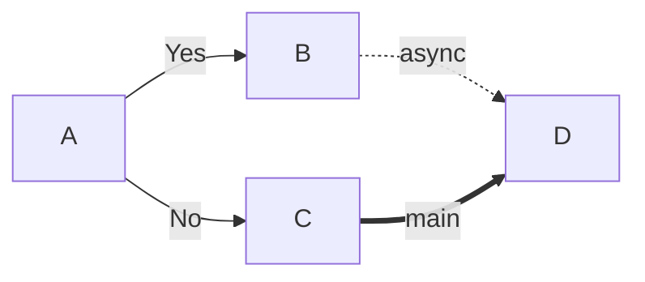

### Link Length

More dashes = longer link:

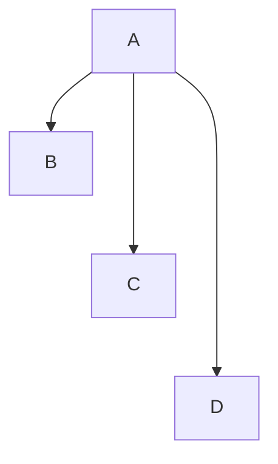

---

## Subgraphs

Group related nodes together.

### Basic Subgraph

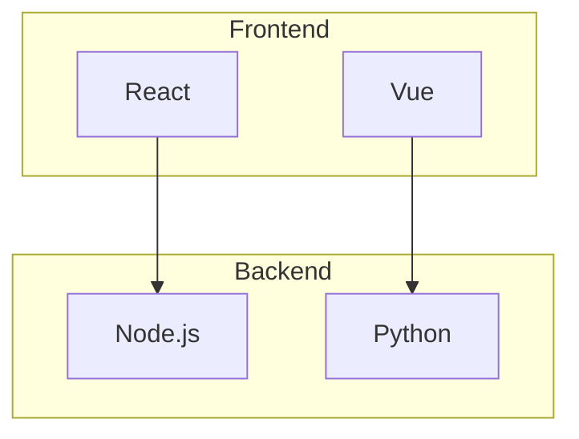

### Subgraph with ID

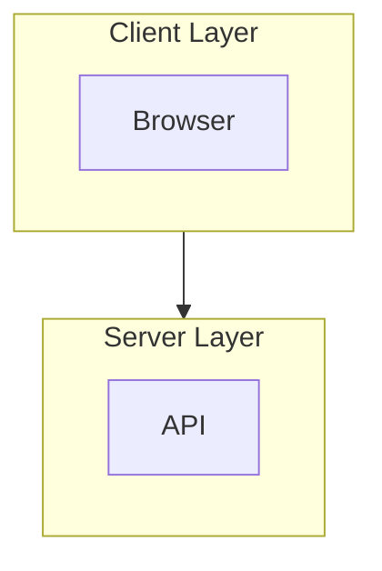

### Nested Subgraphs

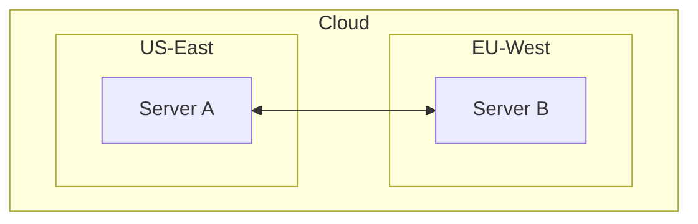

### Subgraph Direction

Each subgraph can have its own direction:

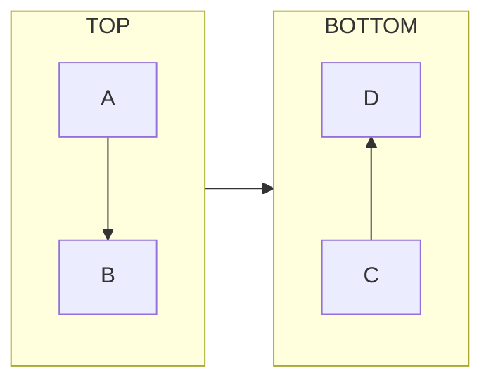

---

## Styling

### Inline Style

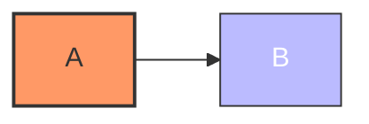

### Style Properties

| Property | Example | Description |
|----------|---------|-------------|
| `fill` | `fill:#f9f` | Background color |
| `stroke` | `stroke:#333` | Border color |
| `stroke-width` | `stroke-width:2px` | Border thickness |
| `color` | `color:#fff` | Text color |
| `stroke-dasharray` | `stroke-dasharray:5 5` | Dashed border |

### Class Definitions

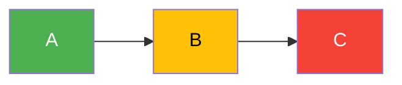

### Apply Class to Multiple Nodes

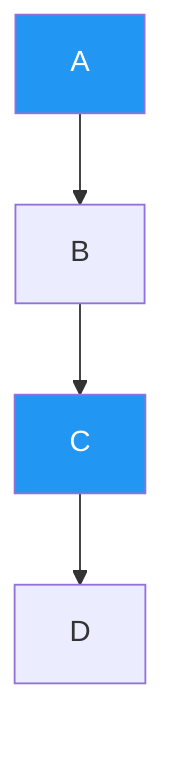

### Default Class

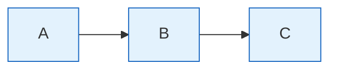

### Link Styling

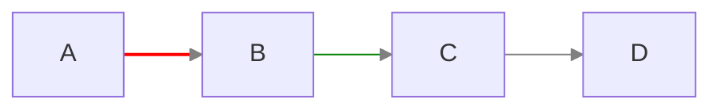

---

## Special Features

### Chaining

Connect multiple nodes at once:

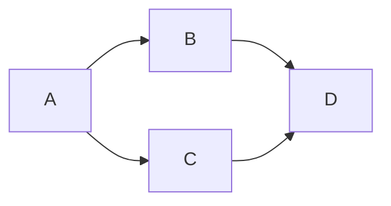

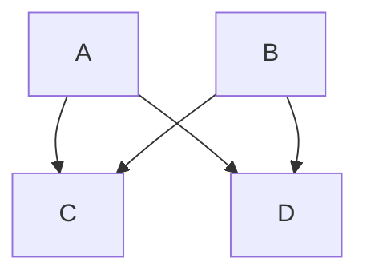

### Multiline Text

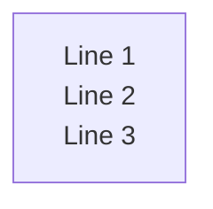

### Special Characters

Wrap in quotes for special characters:

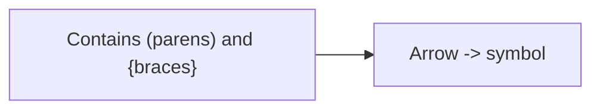

### Comments

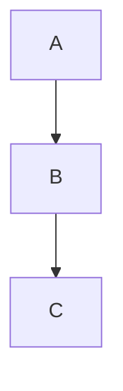

---

## Practical Examples

### Example 1: User Authentication Flow

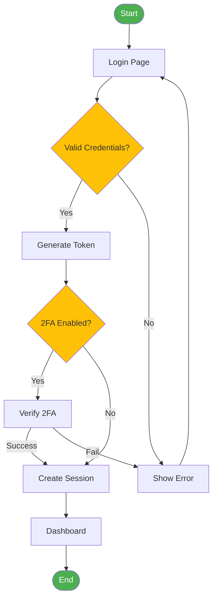

### Example 2: CI/CD Pipeline

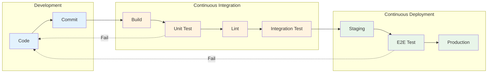

### Example 3: E-Commerce Order Processing

```mermaid
flowchart TB
    A([Order Received]) --> B{In Stock?}

    B -->|Yes| C[Process Payment]
    B -->|No| D[Backorder]
    D --> E{Restock Available?}
    E -->|Yes| B
    E -->|No| F[Cancel & Refund]

    C --> G{Payment OK?}
    G -->|Yes| H[Prepare Shipment]
    G -->|No| I[Retry Payment]
    I --> C

    H --> J[Ship Order]
    J --> K[Update Tracking]
    K --> L([Delivered])
    F --> M([Cancelled])

    style A fill:#2196F3,color:white
    style L fill:#4CAF50,color:white
    style M fill:#F44336,color:white
    style B fill:#FFC107
    style G fill:#FFC107
    style E fill:#FFC107
```

### Example 4: Microservices Architecture

```mermaid
flowchart TB
    subgraph Client
        A[Web App]
        B[Mobile App]
    end

    subgraph Gateway
        C[API Gateway]
    end

    subgraph Services
        D[Auth Service]
        E[User Service]
        F[Order Service]
        G[Payment Service]
    end

    subgraph Data
        H[(User DB)]
        I[(Order DB)]
        J{{Message Queue}}
    end

    A --> C
    B --> C
    C --> D & E & F & G

    D --> H
    E --> H
    F --> I
    G --> I

    F <-.-> J
    G <-.-> J

    classDef client fill:#e3f2fd
    classDef gateway fill:#fff3e0
    classDef service fill:#e8f5e9
    classDef data fill:#fce4ec

    class A,B client
    class C gateway
    class D,E,F,G service
    class H,I,J data
```

---

## Obsidian Notes

**Theme Compatibility**: Colors may vary with Obsidian themes. Use explicit styles for consistent appearance.

**Performance**: Large diagrams (50+ nodes) may slow rendering. Split into multiple diagrams.

**Export**: PDF export renders diagrams as images. For sharing, capture as PNG/SVG.

**No JavaScript**: Click events and callbacks are disabled for security.

**Code Block Format**:
````
```mermaid
flowchart TD
    A --> B
```
````

---

## Quick Reference Table

| Category | Syntax | Example |
|----------|--------|---------|
| Direction | `flowchart DIR` | `flowchart LR` |
| Rectangle | `id[text]` | `A[Process]` |
| Diamond | `id{text}` | `B{Decision}` |
| Circle | `id((text))` | `C((Event))` |
| Database | `id[(text)]` | `D[(DB)]` |
| Arrow | `-->` | `A --> B` |
| Dotted | `-.->` | `A -.-> B` |
| Thick | `==>` | `A ==> B` |
| Label | `--\|text\|` | `A --\|Yes\| B` |
| Subgraph | `subgraph name` | `subgraph API` |
| Style | `style id prop` | `style A fill:#f96` |
| Class | `classDef name` | `classDef red fill:#f00` |
| Apply | `:::class` | `A:::red` |
| Comment | `%%` | `%% note` |
