# Timeline Diagram Reference

Complete guide for Mermaid timeline diagrams in Obsidian.

---

## Introduction

Timeline diagrams visualize events or milestones in chronological order. They're ideal for showing historical progressions, product releases, project milestones, or any sequence of time-based events.

---

## Basic Structure

### Simple Timeline

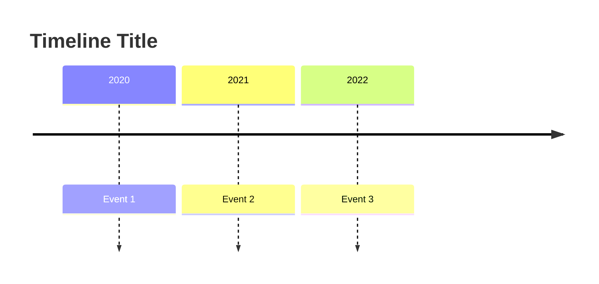

### Key Characteristics

- Time periods can be any text (not just years)
- Events are organized chronologically
- Multiple events per time period are supported
- Automatic color coding by section

---

## Syntax Reference

### Title

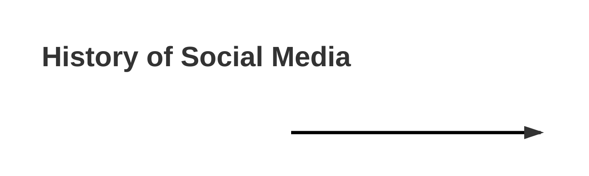

### Time Period and Events

```
timeline
    {time-period} : {event}
```

Format options:

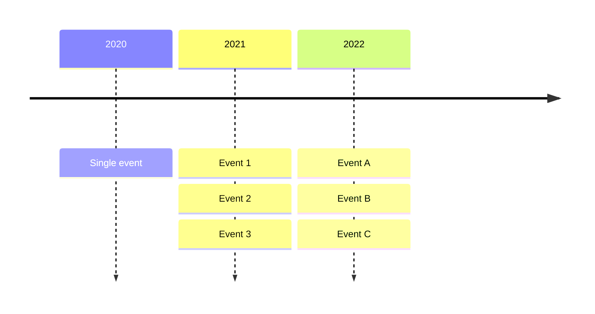

| Component | Details | Example |
|-----------|---------|---------|
| Time period | Any text label | `2020`, `Q1`, `January` |
| Event | Describes what happened | `Product Launch` |
| Multiple events | Use colons or indentation | `2020 : Event1 : Event2` |

---

## Time Periods

### Numeric Years

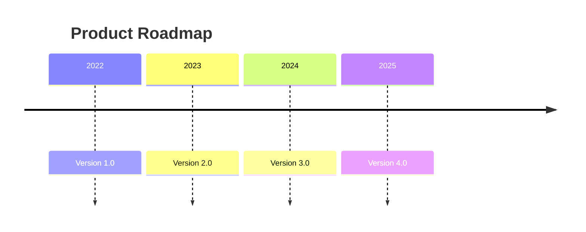

### Calendar Quarters

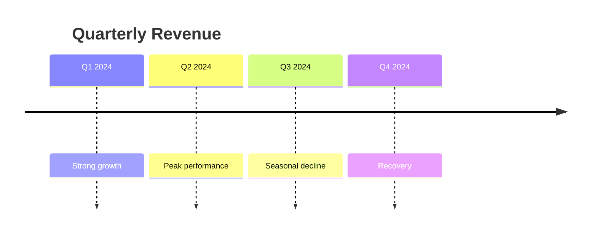

### Month/Year Format

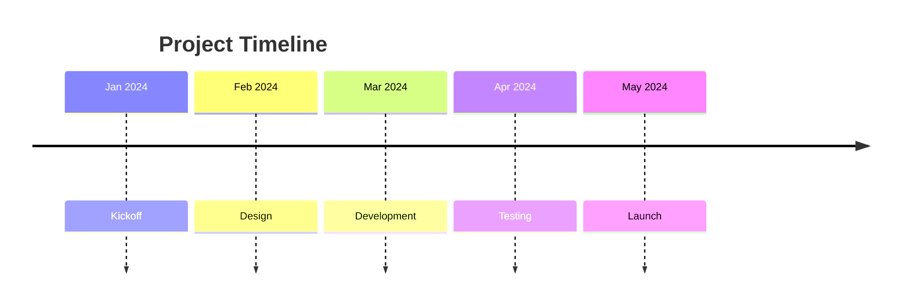

### Custom Periods

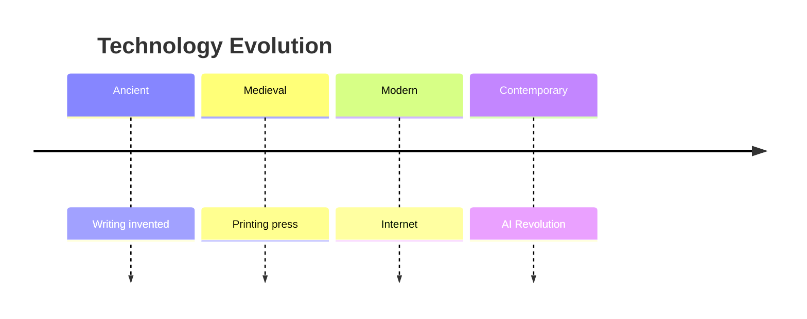

---

## Sections

Organize time periods into named sections with shared color schemes:

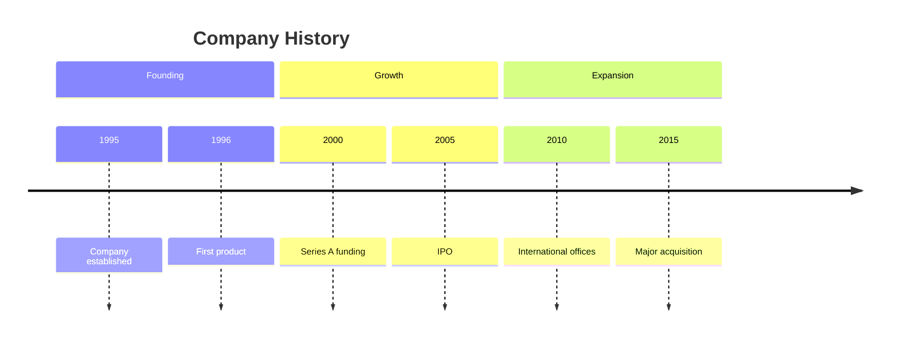

### Multiple Events per Period

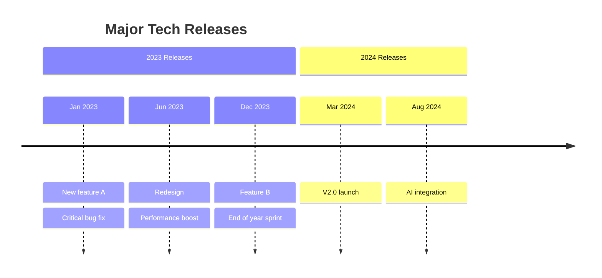

---

## Practical Examples

### Example 1: Historical Timeline

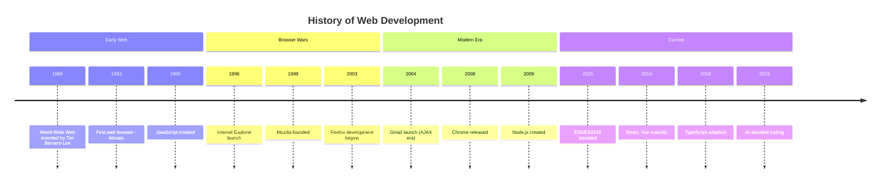

### Example 2: Product Release Timeline

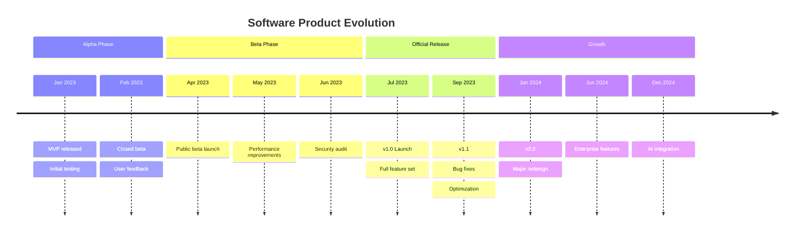

### Example 3: Project Timeline

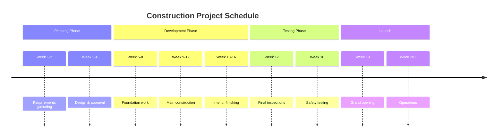

### Example 4: Company Milestones

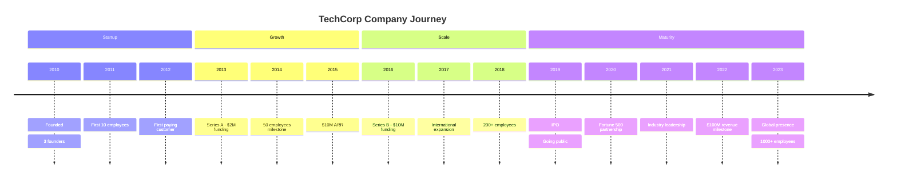

### Example 5: Learning Progression

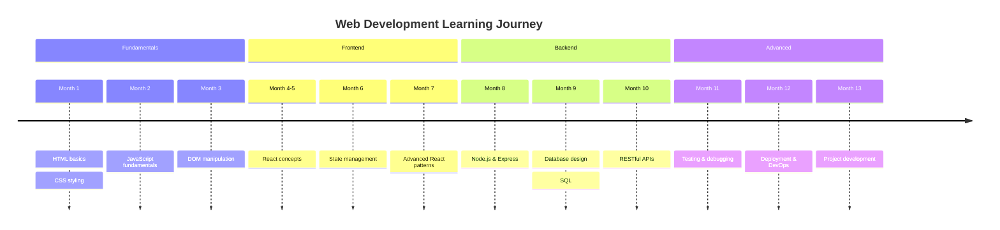

---

## Advanced Features

### Comments

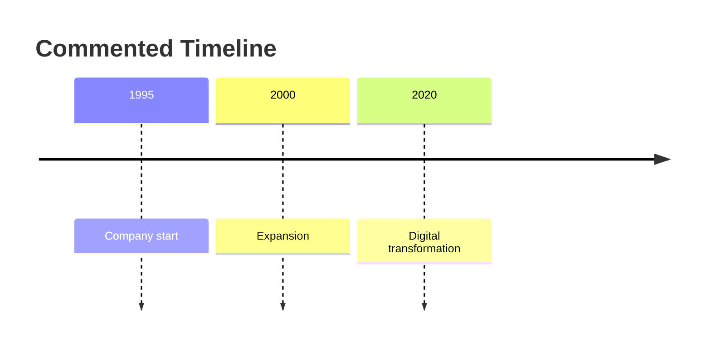

### Multi-Line Events

Use `<br>` for line breaks in events:

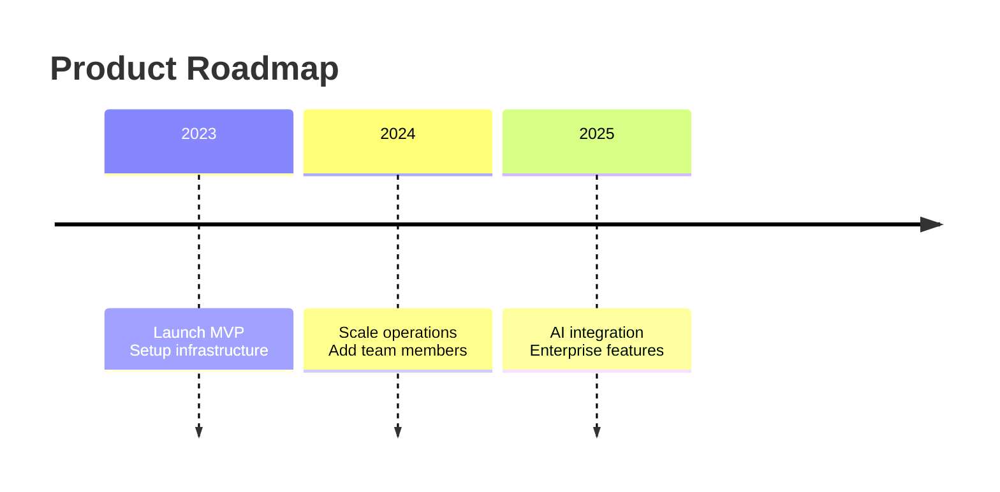

### Different Time Scales

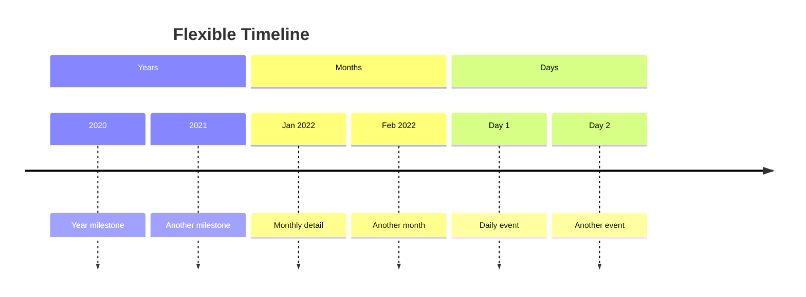

---

## Styling

### Custom Themes

Use YAML frontmatter to configure themes:

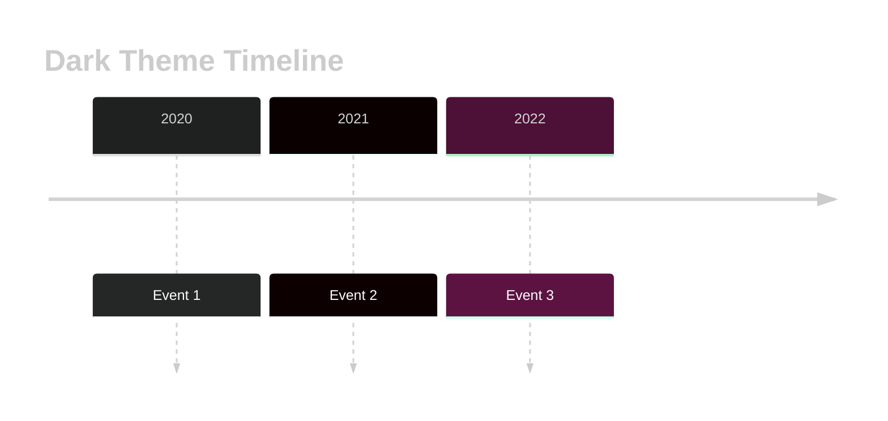

### Color Scheme

Timeline sections automatically get different colors. Customize using theme variables:

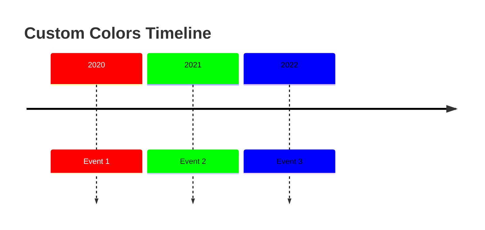

---

## Best Practices

### Time Period Format

- **Years**: `2020`, `2021`, `2022`
- **Quarters**: `Q1 2024`, `Q2 2024`
- **Months**: `January 2024`, `Jan 2024`
- **Custom**: `Phase 1`, `Ancient Era`, `Modern Age`

### Event Description

- Keep descriptions concise (1-5 words)
- Use clear, descriptive action words
- Avoid overly technical language
- Use consistent formatting

### Section Organization

- Group related time periods together
- Use 3-5 sections maximum
- Place most important milestones prominently
- Order chronologically

### Readability

- Limit events per period to 3-5
- Use line breaks for multiple events
- Avoid very long event descriptions
- Keep timeline width reasonable

---

## Common Patterns

### Annual Review

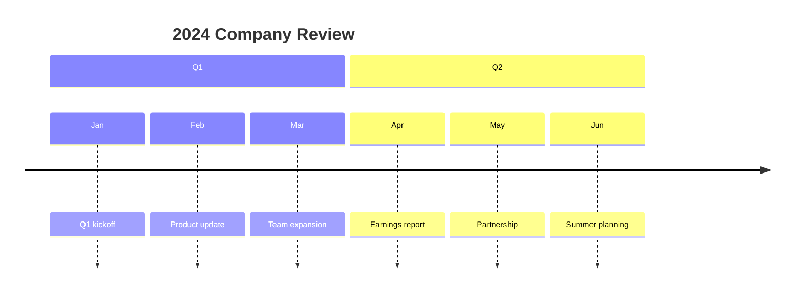

### Milestone Tracking

```mermaid
timeline
    title Development Milestones
    Alpha : Design complete
    Beta : Initial release
    RC : Release candidate
    v1.0 : Official launch
```

---

## Obsidian Notes

**Time Unit**: Not limited to years - use any text as time periods (months, quarters, phases, eras).

**Section Colors**: Sections get automatically assigned different background colors for visual distinction.

**Event Count**: Aim for 2-5 events per time period for optimal readability.

**Performance**: Very long timelines (50+ events) may slow rendering. Consider splitting into multiple diagrams.

**Export**: PDF export renders diagrams as images. For external sharing, capture as PNG/SVG.

**Responsive**: Timeline adapts to Obsidian viewport width. Long event text wraps automatically.

**Code Block Format**:
````
```mermaid
timeline
    title My Timeline
    2020 : Event
    2021 : Event
```
````

---

## Quick Reference Table

| Element | Syntax | Example |
|---------|--------|---------|
| Diagram start | `timeline` | `timeline` |
| Title | `title text` | `title Company History` |
| Time period | `period : event` | `2020 : Founded` |
| Multiple events | `period : event1 : event2` | `2020 : Founded : v1.0` |
| Alternative format | Indented under period | `: Event` on next lines |
| Section | `section name` | `section Growth` |
| Comment | `%% text` | `%% Founding era` |
| Line break | `<br>` | `Founded<br>v1.0` |
| Year format | Text label | `2020`, `Q1 2024` |
| Month format | Full or abbreviated | `January 2024`, `Jan 2024` |
| Custom period | Any text | `Ancient`, `Phase 1` |
| Theme | YAML frontmatter | `---\nconfig:\n  theme: 'dark'\n---` |
