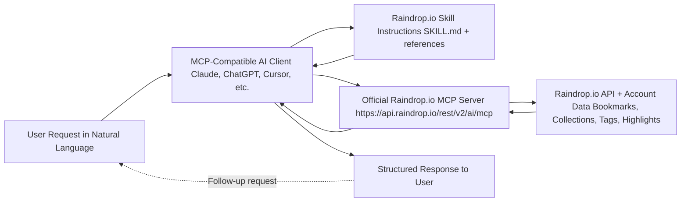

# Raindrop.io AI Skill

A production-ready AI skill for managing Raindrop.io bookmarks through natural language conversations. Compatible with Claude Code, Claude Desktop, Claude.ai, and other MCP-enabled AI clients.

## Overview

This skill provides a conversational interface to the [official Raindrop.io MCP server](https://help.raindrop.io/mcp), enabling you to:

- **Save and organize bookmarks** with intelligent tagging and collection management
- **Search your collection** using natural language queries with advanced filters
- **Manage reading lists** with progress tracking and highlights
- **Organize research** with systematic workflows and bulk operations

## Skill Flow



## Features

- Natural language bookmark management
- Smart tagging and collection organization
- Advanced search with multiple filters
- Reading list workflows with highlights
- Research project management templates
- Bulk operations for cleanup and organization
- Cross-collection search patterns
- Tag management and consolidation

## Requirements

- **Raindrop.io Pro subscription** ($28/year) - Required for MCP access
- **MCP-compatible AI client**:
  - Claude Code (VS Code extension)
  - Claude Desktop
  - Claude.ai (web interface)
  - ChatGPT (Plus/Pro/Business/Enterprise)
  - Cursor, Windsurf, VS Code, Zed, or other MCP clients
- **Official Raindrop.io MCP server configured** (instructions below)

## Quick Start

### 1. Install the Skill

**From Skillstore.io**:
```bash
# Visit skillstore.io and search for "raindrop-io"
# Click "Install" and follow the prompts
```

**Manual Installation**:
```bash
git clone https://github.com/dansegal/raindrop-io-skill.git
# Then load the skill in your AI client
```

### 2. Configure MCP Server

The skill requires the official Raindrop.io MCP server to be configured.

**For Claude.ai (web)**:
1. Go to Settings → Connectors
2. Add connector with URL: `https://api.raindrop.io/rest/v2/ai/mcp`
3. Authorize through OAuth

**For Claude Desktop/Code**:
Add to your MCP configuration file:
```json
{
  "mcpServers": {
    "raindrop": {
      "command": "npx",
      "args": ["-y", "mcp-remote", "https://api.raindrop.io/rest/v2/ai/mcp"]
    }
  }
}
```

**For other clients**: See [detailed setup instructions](references/SETUP.md)

### 3. Start Using

Once configured, start a conversation and try:

```
"Save this article to my reading list: https://example.com"
"Search my bookmarks for Python tutorials"
"Show me my reading list"
"Create a collection for my ML research project"
```

## Documentation

- **[SKILL.md](SKILL.md)** - Main skill guide with workflows and best practices
- **[Setup Guide](references/SETUP.md)** - Detailed setup instructions for all platforms
- **[API Reference](references/API-REFERENCE.md)** - MCP tools documentation
- **[Advanced Workflows](references/WORKFLOWS.md)** - Power user workflows and templates

## Example Workflows

### Save a Bookmark
```
You: Save https://example.com/article to my reading list
AI: I'll save that for you. Would you like me to add tags or notes?
You: Yes, tag it with "python" and "tutorial"
AI: Done! Bookmark saved to Reading List with tags: python, tutorial
```

### Search Bookmarks
```
You: Find all my Python bookmarks from last month
AI: Found 12 bookmarks:
    1. Python Best Practices (pythonguide.org)
    2. FastAPI Tutorial (fastapi.tiangolo.com)
    ...
```

### Organize Research
```
You: Help me set up a collection for my ML research project
AI: I'll create "ML Research Project" collection. What tags should we use?
You: neural-networks, papers, datasets
AI: Created! Collection ready with those tags. Ready to add bookmarks?
```

See [Advanced Workflows](references/WORKFLOWS.md) for more examples including:
- Research project templates
- Reading list automation
- Tag organization strategies
- Bulk cleanup operations

## Architecture

This skill follows the [Agent Skills specification](https://agentskills.io/specification):

```
raindrop-io-skill/
├── SKILL.md              # Main skill definition
├── references/
│   ├── SETUP.md         # Setup instructions
│   ├── API-REFERENCE.md # MCP tools reference
│   └── WORKFLOWS.md     # Advanced workflows
├── README.md            # This file
└── LICENSE              # MIT License
```

The skill is pure instruction-based (no executable scripts), making it:
- ✅ Secure and easy to audit
- ✅ Platform-agnostic
- ✅ Easy to maintain and update
- ✅ Passes security scanning automatically

## Why This Skill?

**vs. Direct MCP Usage**:
- Provides structured workflows and best practices
- Includes organization strategies and templates
- Offers troubleshooting guidance
- Saves time with proven patterns

**vs. Direct API**:
- Uses official, maintained MCP server
- Handles authentication automatically
- Conversational interface vs. programming
- No code needed for common operations

## Beta Status

The official Raindrop.io MCP server is currently in **beta**. This means:
- Features may evolve over time
- Some operations may have limitations
- Documentation will be updated as the server stabilizes
- Report issues to [Raindrop.io support](mailto:info@raindrop.io)

## Contributing

Contributions are welcome! Here's how you can help:

1. **Report Issues**: Found a bug or have a suggestion? [Open an issue](https://github.com/dansegal/raindrop-io-skill/issues)
2. **Improve Documentation**: Submit PRs to clarify or expand documentation
3. **Share Workflows**: Contribute your advanced workflow patterns
4. **Test Beta Features**: Help test new Raindrop.io MCP capabilities

### Development

To modify the skill:

1. Fork this repository
2. Make your changes to SKILL.md or reference files
3. Test with `npx skills-ref validate ./`
4. Submit a pull request

**Guidelines**:
- Keep SKILL.md under 500 lines for optimal performance
- Follow the [Agent Skills specification](https://agentskills.io/specification)
- Test on multiple AI clients when possible
- Update documentation for any workflow changes

## Troubleshooting

### MCP Server Not Connected
- Verify Raindrop.io Pro subscription is active
- Check MCP configuration is correct for your client
- Try reauthorizing OAuth connection
- See [Setup Guide](references/SETUP.md) for platform-specific help

### Skills Not Loading
- Ensure skill is properly installed
- Check that SKILL.md is in the correct location
- Verify your AI client supports Agent Skills format
- Restart your AI client

### Operations Failing
- Check you're authenticated to Raindrop.io
- Verify bookmark/collection IDs are correct
- Check for rate limiting (120 req/min)
- See [troubleshooting section](SKILL.md#troubleshooting) in main guide

For more help, see the [full troubleshooting guide](SKILL.md#troubleshooting).

## License

MIT License - see [LICENSE](LICENSE) file for details.

## Acknowledgments

- [Raindrop.io](https://raindrop.io) for the excellent bookmark service and official MCP server
- [Anthropic](https://anthropic.com) for Claude and the Agent Skills framework
- [Model Context Protocol](https://modelcontextprotocol.io) community
- [Skillstore.io](https://skillstore.io) for the skills marketplace

## Links

- **Skill on Skillstore**: Coming soon
- **Raindrop.io**: https://raindrop.io
- **MCP Documentation**: https://help.raindrop.io/mcp
- **Report Issues**: [GitHub Issues](https://github.com/dansegal/raindrop-io-skill/issues)
- **Author**: [@dansegal](https://github.com/dansegal)

## Changelog

### v1.0.0 (2025-02-18)
- Initial release
- Support for official Raindrop.io MCP server
- Comprehensive workflows for bookmarking, search, reading lists, and research
- Multi-platform setup instructions
- Advanced workflow templates
- Full API reference documentation

---

**Made with ❤️ for the AI and productivity community**
